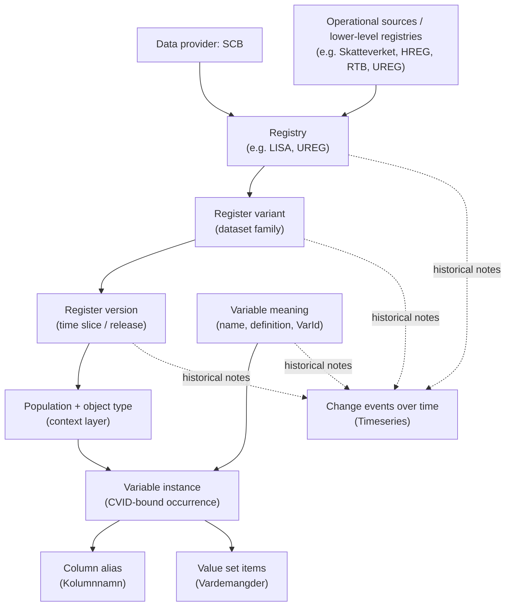

# SCB Metadata Structure

## Core Hierarchy

- `Data provider`: the organization that publishes the metadata. For now this is only `SCB`.
- `Data source / collector`: upstream operational systems or lower-level registries that feed a registry. These are real domain concepts, but they are only partially explicit in the delivery. They mostly appear in descriptive text such as `VariabelHämtadFrån` and `VariabelRegister_Källa`.
- `Registry`: a conceptual collection of data organized for a use case or domain. Examples: `Utbildningsregistret (UREG)` and `LISA`.
- `Table-like slice`: what users usually think of as a table or snapshot. In the SCB files this is not a first-class object with its own stable ID. It is usually derived from `Registry -> Registervariant -> Registerversion`, and sometimes further split by `Population` and `Objekttyp`.
- `Variable`: a column concept. A variable can persist over time, be renamed, be redefined without renaming, or split into old/new variants.
- `Variable instance` (source concept only): in the SCB delivery a variable occurs once per registry/variant/version/context, identified by `CVID` — not a perfect canonical column key. **reg_meta does not persist this.** At build time the CVID-grained rows are coalesced into the two-level `variable` + `variable_state` model (see "Working Interpretation"); `CVID` does not survive to the shipped DB.
- `Value set`: coded values attached to a variable's per-era state (`variable_state.value_set_id`), such as municipality codes or category labels.
- `Change event`: a note about structural or semantic change over time. This is what `Timeseries` contributes.

## What The Input Files Represent

| File | Role | Practical reading |
| --- | --- | --- |
| `Registerinformation.csv` | Backbone metadata fact table | The main source of truth. One row is roughly a variable occurrence inside a registry/variant/version/context. This file carries most IDs and is the basis for normalization. |
| `UnikaRegisterOchVariabler.csv` | Deduplicated registry/variable summary | Useful for lifecycle and flags (`VersionForsta`, `VersionSista`, sensitive/identity markers). Good summary layer, not the canonical source of record. |
| `Identifierare.csv` | Identifier semantics | A small dictionary of identifier-like variables keyed by `VarID`. Useful for linkage semantics, but `VarID` is not globally unique to one registry. |
| `Timeseries.csv` | Change log | Describes breaks, redefinitions, and other events over time for selected entities. Useful for historical interpretation, not enough on its own to define the schema. |
| `Vardemangder.csv` | Value-set members | Code/label rows keyed by `CVID`. This is where categorical values live. |
| `Tabelldefinitioner.sql` | SQL Server table shells | Authoritative SQL types and constraints for the export columns. Used during import for type validation. |
| `ID-kolumner.xlsx` | Join-key documentation | Documents which columns are ID/join columns between export files and what they reference (12 rows). |

## Working Interpretation For `reg_meta`

- `Registerinformation.csv` drives the core normalized model.
- A client-facing "table" is a derived concept, not something copied directly from one SCB ID.
- The domain is a hierarchy/graph, not a flat relational schema. The storage backend (SQLite) is an implementation detail — the entities and relationships are what matter.
- Core entities — the **two-level variable model** (normalized from `Registerinformation.csv`, then coalesced at build time):
  - `register` — a conceptual registry
  - `register_variant` — a dataset family within a registry. A **delivery / browse coordinate**, not an FQID segment (the two-level grammar dropped variant from the FQID — §5.0.1).
  - `variable` — a named measurement concept, scoped to one registry. Identified by a synthetic `variable_id` primary key plus a **register-unique `slug`** (the FQID leaf). Carries `provider_key` (the SCB `VarID`), which is **non-unique within a register** after §5.7 triage splits one source `VarID` into sibling variables. Holds the cross-era constants — `name`, `definition`, `description`, sensitivity/identifier flags.
  - `variable_state` — the **per-era unit** (replaces the old per-CVID `variable_instance`): uniquely keyed by `(variable_id, register_variant_id, valid_from, value_set_version_label)` — so a single validity window can hold more than one state when the `value_set_version_label` discriminator differs (same-window coding-scheme vintages a §5.7 fold keeps distinct, rather than splitting into siblings). Carries `valid_from`/`valid_to`, `data_type`, `data_length`, the era's `delivery_column_name`, `value_set_id` (→ the year-projected code list; NULL when code-less), `value_set_version_label`, and `classification_id`. All time-varying facts live here.
  - `variable_alias` — the **full delivery-column history** per variable, keyed `(variable_id, register_variant_id, delivery_column_name)`. `variable_state.delivery_column_name` keeps only the latest era's column; this table is the complete history `get datacolumns` reads.
  - *Build-time-only* (consumed then **dropped before ship** — see DESIGN.md / MIGRATION_PLAN.md): `register_version`, `population`, `object_type` (folded into `variable_state` validity windows + `variable`); `variable_instance` + `variable_alias_build` (the cvid-grained staging that `variable` / `variable_state` / `variable_alias` are coalesced from); `unika_summary` (lifecycle/sensitivity flags lifted onto `variable`).
- Lineage & relationship entities (variable-grain — §5.6/§5.7):
  - `variable_state_lineage` (+ `variable_state_lineage_warning`) — interval-overlap source→consumer edges across registers.
  - `variable_replaced_by` / `register_replaced_by` / `variant_replaced_by` — succession edges derived from `timeseries_event`.
  - `variable_related_to` — links the split siblings that share one `provider_key`.
  - `variable_same_as` / `classification_same_as` — curated slug-anchored identity edges, traversed by `Catalog.resolve()`.
- Value-set entities (from `Vardemangder.csv`):
  - `value_code` — deduplicated `(code, label)` pairs (source columns `vardekod` / `vardebenamning`); `UNIQUE(code, label)` enforced
  - `value_set` — content-addressed dedup of year-projected code lists. `member_hash` = sha256 over sorted `(code, label)` pairs; identical sets are shared across states.
  - `value_set_member` — junction mapping each `value_set` to its codes. SCB validity windows (`VardemangderValidDates.csv`) are applied at build time, not stored — see DESIGN.md § "Value sets are year-projected at build time".
  - `code_variable_map` — pre-aggregated code→variable mapping for value search, **`variable_id`-grained** (#152) so a code maps only to the split sibling(s) whose value set contains it, not every variable sharing a `provider_key`
- Classification entities (from `reg_meta_build/classifications.toml` seed at build time — see DESIGN.md § Classifications):
  - `classification` — normalized code systems (SUN2000, SSYK2012, SNI2007, LKF, …) with publisher, version, supersedes link. Addressed by the **2-seg FQID `class/<slug>`**.
  - `classification_code` — junction from classification to its value codes, with optional hierarchical `level`
  - `variable_state.classification_id` — FK populated when a state's `value_set_version_label` matches a seeded classification (per-era, so split siblings classify independently)
- Reference / enrichment entities:
  - `identifier_semantics` (from `Identifierare.csv`) — identifier variable definitions
  - `timeseries_event` (from `Timeseries.csv`) — structural/semantic change annotations; also the source for the `*_replaced_by` edges. Annotates the model, does not define it.
  - `source_column_type` (from `Tabelldefinitioner.sql` — SQL types and constraints per export column)
  - `source_join_key` (from `ID-kolumner.xlsx` — join-key semantics between export files, 12 rows)
  - `import_manifest` — build provenance (schema version + source checksums)
- `UnikaRegisterOchVariabler.csv` and `Identifierare.csv` enrich the model, do not override `Registerinformation.csv`.

## Why `Table` Needs Care

- A registry is not the same thing as a table.
- One registry can expose several table-like units.
- One table-like unit can recur across years, months, or event streams.
- The same variable meaning can appear in many versions and contexts.
- The same `CVID` can show alias and context anomalies, so it should not be treated as a guaranteed one-column-per-table key without verification.

## LISA As Example

- `LISA` is a high-level longitudinal integrated registry rather than a single flat table.
- Conceptually, it combines information about population, education, employment, income, unemployment, and sickness/parental insurance so transitions over time can be studied.
- It also shows that registries can be built from lower-level registries and administrative sources. In your examples, `LISA` can depend on registries such as `UREG` and `RTB`, and `UREG` can in turn use sources such as `HREG`.
- In the current delivery, `LISA` appears as `RegisterId = 34` and includes several table-like variants, including:
  - `Individer, 15 år och äldre`
  - `Individer, 16 år och äldre`
  - `Företag`
  - `Arbetsställen`
  - `Individer födelseland`
  - `Individer avlidna`

The diagram below is the **SCB source delivery** structure — how the CSVs encode the data, CVID-grained. reg_meta's *storage* collapses `register_version` / `population`+`object_type` context / the CVID-bound `instance` into the two-level `variable` + `variable_state` model described under "Working Interpretation" above; the diagram maps the upstream input, not the shipped schema.

