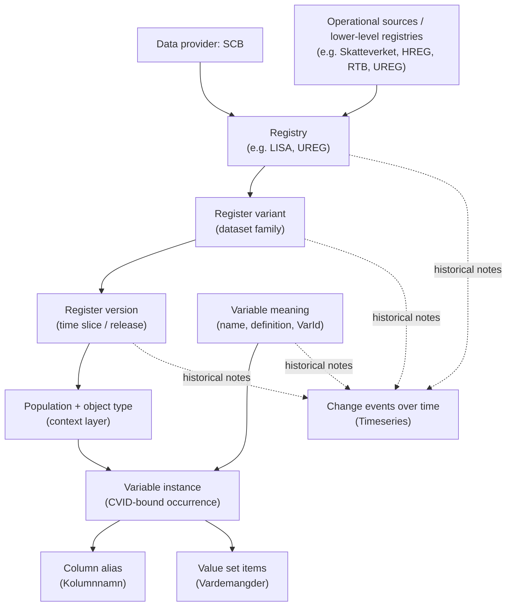

# Design: reg_meta_build

Design rationale and constraints for the build pipeline. For usage, see
`reg-meta-build --help`. For query-layer rationale (the data model end users see), see
[../reg_meta/DESIGN.md](../reg_meta/DESIGN.md).

## Scope

`reg_meta_build` owns the build pipeline that produces the SQLite databases `reg_meta`
queries against. Specifically:

- `reg_meta.db` — main metadata DB (\~320 MB uncompressed). Built from SCB source CSVs
  under `reg_meta_build/input_data/`, classifications seed at
  `reg_meta_build/classifications.toml`, and curated slug TOMLs under
  `reg_meta_build/fqid_slugs/`. Validated by `reg_meta_build/validate.py` before
  shipping.
- `reg_meta_docs.db` — FTS5 search index over the curated markdown under
  `reg_meta_build/docs/`.

Both DBs ship as `.zst`-compressed GitHub Release assets parallel to the `reg_meta` PyPI
package (release-skill orchestrates this).

## Why split from `reg_meta`

The query side (`reg_meta`) needs only the sqlite3 stdlib. The build side pulls
openpyxl, owns large maintainer-edited input data, and runs on a different cadence (most
users never run a build). Separating the two:

- Keeps the `reg_meta` wheel small and dep-light for end users.
- Lets the two release on independent tags (`reg_meta/v*`, `reg_meta_build/v*`).
- Mirrors the build/runtime separation needed for a future Go/Rust port of the query
  layer.

The cross-package dependency graph and the build/runtime boundary that governs it live
in ARCHITECTURE.md.

## Dependency direction

`reg_meta_build → reg_meta` only. The builder imports query helpers (`open_db`,
`default_db_dir`, `DB_FILENAME`, `SCHEMA_VERSION`, `derive_variable_slug`, etc.) but
`reg_meta` never imports `reg_meta_build`. The schema contract — the set of constants
and helpers both packages agree on — lives in `reg_meta`.

## What lives where

  | Module                                                                                           | Package          |
  | ------------------------------------------------------------------------------------------------ | ---------------- |
  | `db.py` (DDL, build_db, materializer, provenance DB)                                             | `reg_meta_build` |
  | `db.py` (open_db, schema constants)                                                              | `reg_meta`       |
  | `ir/` (provider-neutral IR contract)                                                             | `reg_meta_build` |
  | `id.py` (deterministic ID minting)                                                               | `reg_meta_build` |
  | `doc_db.py` (build_doc_db)                                                                       | `reg_meta_build` |
  | `doc_db.py` (open_doc_db, ensure)                                                                | `reg_meta`       |
  | `cli.py` (build / docs-build / slug commands)                                                    | `reg_meta_build` |
  | `cli.py` (query, update, info, docs)                                                             | `reg_meta`       |
  | `fqid_slugs.py`                                                                                  | `reg_meta_build` |
  | `classifications.py`                                                                             | `reg_meta_build` |
  | `validate.py`                                                                                    | `reg_meta_build` |
  | `dbdiff.py` (content diff harness)                                                               | `reg_meta_build` |
  | `extend_db.py` (steward-flavored DB overlay, extend-db)                                          | `reg_meta_build` |
  | `sources/` (per-provider IR adapters: scb, sos)                                                  | `reg_meta_build` |
  | `fqid.py`, `catalog.py`, `queries.py`, `doc_queries.py`, `errors.py`, `update.py`, `download.py` | `reg_meta`       |

## Curation surface taxonomy

The build assembles the catalog from two kinds of inputs: machine-delivered source data
(SCB CSVs, SOS workbooks, thin-provider TOMLs) and a set of maintainer-curated overlay
files that repair, extend, and annotate what the source delivers. The curated files fall
into seven families:

  | Family                   | Files                                                                                                                                                                                                                                                                        | Role                                                                                                                                                                                                                                                                                                                                                                                                                                         |
  | ------------------------ | ---------------------------------------------------------------------------------------------------------------------------------------------------------------------------------------------------------------------------------------------------------------------------- | -------------------------------------------------------------------------------------------------------------------------------------------------------------------------------------------------------------------------------------------------------------------------------------------------------------------------------------------------------------------------------------------------------------------------------------------- |
  | **identifier**           | `fqid_slugs/<provider>.toml`, `fqid_slugs/<provider>.auto.toml`, `fqid_slugs/freeze.toml`, `fqid_slugs/classifications.toml` (loaded by `load_classifications_toml` in `fqid_slugs.py`); steward shards in `fqid_slugs/<steward>/`                                           | Canonical register/variant/classification/variable slugs; panel-shape metadata on variants; per-provider freeze state. `fqid_slugs/classifications.toml` is the provider-independent classification slug surface (loaded separately from provider TOMLs). `[lineage_defaults]` / `[lineage.*]` blocks in the same TOMLs pin source-variant choices for `variable_state_lineage`.                                                             |
  | **relation**             | `curation/relations.toml` (loaded by `relations.py`)                                                                                                                                                                                                                         | All curated pairwise graph facts: `same_as` identity edges, `replaced_by` succession edges, `related_to` see-also edges. One typed `[[edge]]` array; `type` selects the DB target and validation rules.                                                                                                                                                                                                                                      |
  | **set**                  | `concept_groups.toml` (loaded by `concept_groups.py`), `tags.toml` (loaded by `tags.py`)                                                                                                                                                                                     | Presentation-only grouping and discovery layers. Concept groups fold structurally related variables for browse; tags supply thematic cross-register discovery. Both are regenerated fresh each build (no identity or immutability machinery).                                                                                                                                                                                                |
  | **source/gap-fill**      | `input_data/<Provider>/<provider>.toml` (thin curated providers), `delivery_enrichment.toml` (loaded by `delivery_enrichment.py`), `variable_grafts.toml` (loaded by `variable_grafts.py`), `input_data/scb_canonical/lisa_canonical.toml` (loaded by `canonical_attach.py`) | Source delivery (thin providers whose public docs are hand-transcribed) and gap-fill overlays on the global SCB/SOS catalog (descriptions backfilled from steward delivery lists; variables present in steward docs but absent from machine metadata; canonical-SCB columns attached onto an existing register — `canonical_attach.py`, the rich analog of grafts).                                                                          |
  | **value/coding**         | `classifications.toml` + CSV seeds in `input_data/classifications/` (loaded by `classifications.py`), `classification_links.toml` (loaded by `classification_links.py`), `codelivery.toml` (loaded by `codelivery.py`)                                                       | Canonical code systems and their codes; curated variable→classification assignment overrides for the residue the auto-detector leaves unlinked; curated co-delivery resolution pins for SCB columns that carry multiple codings in the same period.                                                                                                                                                                                          |
  | **SCB pre-state repair** | `curation/scb/source_column_repairs.toml` (loaded by `source_column_repairs.py`)                                                                                                                                                                                             | Pre-state SCB structural repair: `[[column_merge]]` unifies era-rename column pairs that never co-occur before union-find connectivity runs; `[[fold_override]]` forces disjoint-stem columns that are genuinely one concept into one fold cluster before states are final.                                                                                                                                                                  |
  | **period family merge**  | `curation/period_family_merges.toml` (loaded by `period_family_merges.py`)                                                                                                                                                                                                   | Identity-mutating post-triage pass: merges N period-named physical columns (today the 12 months, e.g. `lonfinkjan`…`lonfinkdec`) into ONE variable with per-period alias windows. Runs after triage (`variable_state` exists) but before slug population. 8 entries covering 8 bounded monthly families (4 LISA + 4 non-LISA). Retained per #523 under epic #518 R4; see the "Decision (#518/#523): retain the merge" section for rationale. |

**Boundary rules (anti-patterns):**

- **Source-column repair is not `same_as`.** `[[column_merge]]` and `[[fold_override]]`
  act BEFORE variables and states exist; `same_as` acts AFTER. Using `same_as` to fix an
  era-rename split would first build the wrong variables, slugs, aliases, and state
  history, then collapse them. These entries belong in
  `curation/scb/source_column_repairs.toml`, never in `input_data/SCB/` source data and
  never as a post-build relation.
- **Classification links are typed, not generic state overrides.**
  `classification_links.toml` targets the `classification_candidate` pipeline and then
  `variable_state.classification_id`. It is NOT a generic
  `variable_state_overrides.toml` that can mutate arbitrary state fields; a future
  simplification must keep the operation typed as a classification assignment with its
  own validation and precedence.
- **Coding overrides stay in the value/coding family, not in sets or tags.** Do not fold
  code-system assignment facts (`classification_links.toml`, `codelivery.toml`) into
  `concept_groups.toml` or `tags.toml`; they have different semantics, validation, and
  build-pass ordering.
- **`variable_replaced_by` has three provenance sources, each distinct.** The
  `timeseries_event`-derived path (`note = 'auto:timeseries_event'`) is a source fact
  with best-effort noise skips; curated edges in `curation/relations.toml`
  (`note = 'curated:slug_toml'`) are human-authored FQID-level succession; and the
  classification-vintage lift (`note = 'derived:classification_vintage_lift'`, #584)
  derives edges by lifting `classification_replaced_by` edition chains to the variable
  grain through value-set bindings (clean tier only — same-name families that map 1:1 to
  editions). The lift runs AFTER the other two passes and re-runs
  `reject_replaced_by_cycles` over the full combined graph, because a pre-existing
  reversed edge plus a newly inserted lift edge can close a cycle the earlier checks
  could not see. All three share traversal helpers; their authoring surfaces must not
  merge.
- **Graph semantics live in `curation/relations.toml`, not slug TOMLs.** A slug TOML
  that contains an inline `same_as` field or a top-level `[[replaced_by]]` array now
  fails as an unknown-key error. The only surviving per-entry edge field in a slug TOML
  is the within-file `replaced_by` key-string typo-correction pointer (not a succession
  edge).

## Generation provenance (auto vs curated)

Orthogonal to *what* a surface curates (the taxonomy above) is *how its content is
produced and reviewed*. Three patterns are in use, and the choice between them is not
stylistic — it is set by one discriminator: **load-bearingness × rule-precision ×
volume.** Place a new metadata kind by asking, in order:

1. **Does a wrong auto-generated entry corrupt correctness, or is it merely cosmetic?**
   A `same_as` edge is resolver-load-bearing — `Catalog.resolve` follows it
   transitively, so a wrong edge corrupts resolution. A concept-group fold is
   presentation-only — a wrong fold is cosmetic. The first must be human-gated
   entry-by-entry; the second can be machine-proposed and bulk-accepted.
2. **Is the inference rule high- or low-precision?** Overlapping-value-set `same_as`
   candidates are noisy; exact code-set containment is sharp. A noisy rule never
   auto-materializes into a load-bearing table.
3. **Is it deterministic, high-volume identity regenerable byte-for-byte from inputs?**
   Then *regenerate-not-migrate* applies and hand-entry is the wrong tool.

The three patterns, and the surfaces on each:

- **(a) Curation-only worklist** — the generator emits an *ephemeral* review worklist
  (stdout / a throwaway `-o` file); the build consumes **only** the hand-curated file,
  which ships empty and grows one reviewed entry at a time. For resolver-load-bearing
  facts produced by an imprecise rule. Surface: `curation/relations.toml` (`same_as` /
  `replaced_by` / `related_to`). Generator: `same-as-candidates`. **A low-precision rule
  must never auto-load into a resolver-load-bearing table** — that is the whole reason
  this surface ships empty.
- **(b) Committed-auto + opt-in overlay** — the generator writes a **tracked,
  machine-owned** `*.auto.toml`, regenerated by a *deliberate subcommand* (not inside
  `build-db`) and idempotent (it preserves already-accepted families); a curated overlay
  opts in by reference. For presentation-only, high-volume facts where a wrong candidate
  is cosmetic and a git-diff review signal is wanted. Surfaces:
  `concept_groups.auto.toml` + `concept_groups.toml` `[[accept]]`. Generator:
  `concept-group-candidates`. Regenerating inside `build-db` is the anti-pattern here —
  it would rewrite a tracked file every build (diff noise, perpetually dirty tree),
  which is exactly why this file is refreshed only on an explicit run.
- **(c) Regenerate-every-build, gitignored-until-seal** — the `*.auto.toml` is rewritten
  on every `build-db`, gitignored while `churning`, then committed-and-pinned when the
  provider advances to `curating`/`frozen`. For deterministic, high-volume identity
  (variable slugs) you do not review entry-by-entry until seal. The `.snapshot.json`
  test and the freeze states are the review/seal gate. The git-diff signal that (b) gets
  for free is here deferred to freeze-time on purpose: while churning, every build moves
  the file, so a committed copy would be pure noise; the gitignore trades the signal
  away until `curating`, when stability — and the diff — start to matter. See § "Slug
  immutability".

When in doubt, the safe direction is toward more human gating: a load-bearing kind that
*could* be presentation-only is cheap to gate and expensive to un-corrupt.

## CLI shape

Top-level commands (no `maintain` subgroup; that group is dissolved):

```text
reg-meta-build build-db [--no-validate] [--skip-slugs] ...
reg-meta-build extend-db --base-db DB --inventory JSON [--steward S] ...
reg-meta-build build-docs ...
reg-meta-build seed-slugs [--out-dir DIR] [--propose-panel] ...
reg-meta-build precheck-slugs ...
reg-meta-build parse-sos ...
reg-meta-build same-as-candidates [--max-signal-fanout N] ...
reg-meta-build entity-key-pins [-o TOML] [--slug-dir DIR] [--flavored]
reg-meta-build concept-group-candidates [-o TOML] ...
reg-meta-build classification-residue [-o TOML]
reg-meta-build doc-coverage [-o TOML]
```

The matching `reg-meta maintain *` forms are removed. `reg-meta maintain update` /
`info` are promoted to top-level `reg-meta update` / `reg-meta info` (query-side
concerns — fetching/inspecting prebuilt DBs).

## Content diff harness (`dbdiff`)

`dbdiff.py` compares two `reg_meta.db` files by **content**, not bytes. It is the
acceptance gate for the IR/adapter refactor (and any future "the rebuild should be
identical" change): rebuild the DB, then diff the new file against a preserved baseline.
Raw byte comparison is useless here — two SQLite files with identical rows differ
byte-wise (page layout, freelist, vacuum generation, FTS index segment order), so the
check has to be order-independent and storage-aware.

- **Schema compare**: same tables, and per table the same columns (name/type/order/NOT
  NULL/default/PK) and indexes (named + auto).
- **Content compare**: per user table, row count plus an order-independent *multiset*
  fingerprint — each row canonicalized to a type-tagged, length-prefixed byte string
  (NULL-aware, BLOB-as-bytes), hashed with BLAKE2b-128, the per-row hashes **summed**
  mod 2¹²⁸. Summation (not XOR) so duplicate/missing rows can't cancel. The pass is O(n)
  streaming / O(1) memory, so the 5.7M-row `value_set_member` table costs seconds, not a
  320 MB load.
- **Ignore set** — deliberately minimal. Only `import_manifest.import_date` (wall-clock)
  is dropped by default; `schema_version`, `source_checksums`, `row_counts`, and every
  content/ID column are compared. `input_dir` (a path) is *not* ignored — it is stable
  for a same-machine rebuild; a cross-machine diff can add it explicitly.
- **FTS5**: the `*_fts` virtual tables are external-content (a projection of base
  tables, which *are* compared) and their shadow tables hold an insert-order-dependent
  serialized index. Both are schema-compared but content-excluded, so an emit-order
  change that leaves content identical does not false-positive.
- **Mismatch output**: names the table + count delta and dumps the first N differing
  rows per direction, found via an ATTACH-based multiset-difference query
  (`SUM(+1/-1) GROUP BY all-columns`) that offloads its working set to SQLite's temp
  store.

Standalone and read-only (`mode=ro` URIs); does not import the build pipeline.
Importable as `reg_meta_build.dbdiff.diff_db_content(...)` and runnable as
`python -m reg_meta_build.dbdiff <db_a> <db_b>` (exit 0 identical / 1 differs / 2
error). The full rationale lives in the module docstring.

## Source delivery shapes

Each provider ships metadata in its own native structure; the adapters (next section)
normalize these into the provider-neutral IR. This section documents the **source**
shapes an adapter reads — not the shipped catalog. For the universal two-level
`variable` / `variable_state` model the catalog collapses these into, see
[../reg_meta/DESIGN.md](../reg_meta/DESIGN.md) § "Two-level variable model".

### SCB

SCB delivers pipe-delimited cp1252 CSVs plus a SQL DDL and an Excel join-key sheet. One
backbone row is roughly a *variable occurrence* inside a registry / variant / version /
context, identified by `CVID` — not a stable column key (see *Build-time triage*). The
build coalesces the CVID grain into `variable` + `variable_state`; `CVID` does not
survive to the shipped DB.

  | File                            | Role                                   | Practical reading                                                                                                                                          |
  | ------------------------------- | -------------------------------------- | ---------------------------------------------------------------------------------------------------------------------------------------------------------- |
  | `Registerinformation.csv`       | Backbone metadata fact table           | The main source of truth: one row ≈ a variable occurrence inside a registry/variant/version/context. Carries most IDs and drives normalization (~1M rows). |
  | `UnikaRegisterOchVariabler.csv` | Deduplicated registry/variable summary | Lifecycle and flags (`VersionForsta`, `VersionSista`, sensitive/identity markers). Enriches, never overrides `Registerinformation.csv`.                    |
  | `Identifierare.csv`             | Identifier semantics                   | A small dictionary of identifier-like variables keyed by `VarID` (not globally unique to one registry); also feeds the panel-key bootstrap.                |
  | `Timeseries.csv`                | Change log                             | Breaks, redefinitions, and other events over time. Annotates the model, does not define it; the source for `*_replaced_by` edges.                          |
  | `Vardemangder.csv`              | Value-set members                      | Code/label rows keyed by `CVID` — where categorical values live (~102M rows).                                                                              |
  | `VardemangderValidDates.csv`    | Value-item validity windows            | Applied at build time for the value-set year projection (see *Year projection*); not stored.                                                               |
  | `Tabelldefinitioner.sql`        | SQL Server table shells                | Authoritative SQL types/constraints per export column; used for type validation and the panel-key bootstrap.                                               |
  | `ID-kolumner.xlsx`              | Join-key documentation                 | Which columns are ID/join columns between export files and what they reference (12 rows).                                                                  |

The CVID-grained source hierarchy the SCB adapter reads — a registry splits into
variants, each into time-sliced versions, each into a population/object-type context,
under which a variable occurs once per `CVID` with its column alias and value set;
change events annotate every level:



**A registry is not a table.** One SCB registry exposes several table-like units
(`Registervariant`), each recurring across years, months, or event streams, and the same
variable meaning recurs across many versions and contexts. The shipped model captures
this as the variant *coordinate* on `variable_state`, not as an identity level — see
[../reg_meta/DESIGN.md](../reg_meta/DESIGN.md) § "Why two levels, not three".

**LISA as a worked example.** `LISA` (RegisterId 34) is a high-level longitudinal
integrated registry, not a single flat table: it combines population, education,
employment, income, unemployment, and sickness/parental-insurance information so
transitions over time can be studied, and is itself built from lower-level registries
and administrative sources (e.g. UREG and RTB; UREG in turn draws on HREG). It exposes
several table-like variants, including `Individer, 16 år och äldre`, `Företag`,
`Arbetsställen`, and `Individer födelseland`.

### SOS

Socialstyrelsen delivers one `.xlsx` workbook per register, parsed by `SOSAdapter`
(`sources/sos.py`) into `SosRegister` trees (see *IR + adapter architecture* for the
merge/split and `_default`-variant rules). A full structural catalog of the SOS delivery
— sheet layout, kodlista shape, the deldatamängd ↔ variant mapping, and the
classification/value path — is still to be written. The classification/value path itself
shipped with #210 (PRs #273/#274); the deldatamängd token → variant mapping
(`DELDATAMANGD_TOKEN_MAP`: LOVA `A_LOVA*`, LVM `lvm_*`, DORS `DORS-COV`, LMED's combined
token) shipped with #211 (also retained as the bridge for styrtabell exclusion — see
below); the remaining vehicle for the catalog write-up is #212 (materializer-owned value
tables).

### Curated thin providers (FOHM, Försäkringskassan, …)

Some providers ship no machine-readable microdata-metadata export at all — a public
agency whose register/variable documentation exists only as prose on a website or in
PDFs. These onboard as **thin curated providers** (#422): a maintainer transcribes the
agency's PUBLIC register/variable documentation into a hand-authored TOML, and that TOML
**is** the source delivery — the authoritative, citable artifact, committed under
`input_data/<Agency>/<provider>.toml` (unlike the untracked SCB/SOS seed). They ship in
the GLOBAL build (everyone gets them), distinct from the steward-flavor `extend-db`
track (#365): a thin provider is a global-catalog addition, not a steward overlay.

One shared `CuratedAdapter` (`sources/curated.py`) reads any such TOML rather than a
near-identical adapter per agency. Adding a thin provider is four steps:

1. append a `provider` seed row (`db._PROVIDER_SEED`; never renumber);
2. register the agency's input dir (`db._CURATED_PROVIDERS`: `(slug, subdir)`);
3. author `input_data/<Agency>/<provider>.toml` (registers → optional variants →
   variables; a register with no `[[register.variant]]` gets a synthesized `_default`
   variant, the single-table case — like SOS LSS/BU);
4. curate register/variant slugs in `fqid_slugs/<provider>.toml` (minted-id keys, same
   as `sos.toml`); variable slugs stay AUTO (derived from each variable's clean delivery
   column).

Ids are `mint("<provider>", …)`-ed into the high band `[2^62, 2^63)` (the provider name
is the first `mint` part, so a thin provider never collides with SOS or another minted
provider — see *Deterministic ID minting*). The adapter is **pure IR** (no
build-scratch, like SOS) and emits **no value-set code lists**: minting categorical
codes is a follow-up (#422). A variable may still **link** to an existing catalog
classification via a per-variable `classification = "<short_name>"` field (#446): it
names a shipped classification (SmiNet `diagnos` → `ICD-10-SE`, NVR `vaccin` → `ATC`),
reusing it rather than re-minting codes. The adapter contributes one
`classification_candidate` per such variable with `value_set_id = NULL` (no codes),
feeding the same provider-blind candidate path SOS uses (`external_classification`
resolver); the `_backfill_state_classifications` pass then tags the variable's states,
keying on `(variable_id, NULL)`. The `classification` short_name is validated at TOML
load against the seed manifest (`classifications.toml`): an **undeclared** short_name
fails the build fast (a typo guard — `"ICD-10"` for `"ICD-10-SE"`). Every **declared**
classification is seeded on every build (shared standards with git-tracked code CSVs;
see below), so a declared reference always resolves to a present classification. FOHM
(SmiNet + the national vaccination register) is the first thin provider;
Försäkringskassan is the second, modeled in two tiers (28 registers): 12
publicly-documented registers grounded in FK's published variabelförteckningar (each
with one variant per documented delivery table — fall/delfall,
mottagare/barn/beviljanden/avslag, the tandvård delivery tables — e.g. sjukpenning,
sjuk- och aktivitetsersättning, föräldrapenning, tandvardsstodet) plus 16 thin
SWECOV-core benefits with no public variable doc (barnbidrag, bostadsbidrag, … — a
single `_default` variant carrying the payment/period core). FK's diagnosis-CODE fields
are linked to the catalog `ICD-10-SE` classification (the SmiNet precedent): FK codes
diagnoses per the version current in the data year, so ICD-10-SE tags the modern bulk
while the pre-1997 ICD-9 tail is a known caveat. **Läkemedelsverket** (#443) is the
third thin provider — the suspected-adverse-drug-reaction register (`biverkningar`, two
variants `handlagda`/`arbetsflode` for the assessed vs in-workflow reports). Reaction
fields are MedDRA-coded (`Pt`/`Hlt`/`Hlgt`/`Soc`); MedDRA is not a declared catalog
classification (licensed), so they stay unlinked, while the vaccine `atc4pos` field is
linked to `ATC`. **Pliktverket** (#443) is the fourth — the enlistment/conscription
assessment data (1997–2010), three registers `insark` (mönstringsresultat: physical,
medical, psychological measures), `insiprov` (the inskrivningsprov/G-factor) and
`diagnos`; the diagnosis `sjnr` (sjukdomsnummer) links to `ICD-10-SE`. Its documented
"Mer info" code lists are embedded in each variable definition (value sets are a
follow-up — no codes minted). Pliktverket is a **closed** register (1997–2010,
conscription deactivated 2010): it sets a register-level `valid_to` — a primitive the
curated adapter materializes onto every variable state (a per-variable `valid_to` still
overrides it), so the catalog reports the data as ending 2010 rather than open-ended.
**Riksarkivet** (#443) is the fifth — the historical conscription/mönstring
`inskrivning` register held at Krigsarkivet that predates Pliktverket's digital era (one
register, 104 fields from Krigsarkivet's own codebook). It mirrors Pliktverket but
older: data types are undocumented in the source → all `text`; the six historical
`sjn1`–`sjn6` sjukdomsnummer predate ICD-10-SE so they stay **unlinked**; the coverage
window (`valid_from=1969`/`valid_to=1996`) is sourced from the variable content (the
standardized inskrivningsprov regime) and the Pliktverket 1997 takeover, flagged in the
TOML for maintainer confirmation. (Note Skatteverket's COVID-support delivery and
Tillväxtverket's korttidsarbete both went to the **swecov flavor**, not here — bespoke
steward extracts, not standing registers.) **Umeå universitet** (`umu`, #443) is the
sixth — the högskoleprovet (SweSAT) provresultat database (one register
`hogskoleprovet`, 21 fields sourced from UMU's public SweSAT variable documentation):
the subtest scores (verbal ORD/LÄS/MEK/ELF, quantitative XYZ/KVA/NOG/DTK), section and
total normed results, and provtillfälle/lärosäte. Coverage runs from the 1977 test start
(open-ended); a few variables carry a documented later introduction via per-variable
`valid_from` (KVA + the verbal/quantitative section scores from 2011, ELF from 1992) and
the discontinued `AO` subtest a per-variable `valid_to` of 1995.

The minted-id band invariant generalizes accordingly: the GLOBAL build's band check
(`validate.py`) enforces the high band for every **seeded** non-SCB provider (derived
from `_PROVIDER_SEED`, so a new curated provider is covered the moment it is seeded),
and the flavored (`extend-db`) check additionally covers dynamically minted steward
providers (see *Provenance / validation*).

### Curated canonical-SCB content (#444)

Some SCB registers SWECOV holds are **absent from SCB's machine export** — e.g.
*Utrikeshandel med tjänster* (the services sibling of the goods register reg_meta
already has), the AGI employer-declaration header. They are **canonical SCB content**
(not steward-flavor), so the catalog must attribute them to the `scb` provider, not a
separate provider and not the flavor. `CanonicalScbAdapter` (a `CuratedAdapter`
subclass) does this from a committed `input_data/scb_canonical/scb_canonical.toml`:

- **Low-band ids.** Curated ids normally mint into the high band `[2^62, 2^63)`, but an
  `scb`-provider id MUST be `< 2^62` (the band check forbids a high-band scb id).
  `mint_canonical_scb` (`id.py`) puts register/variant/variable/state ids in the
  reserved sub-band `[2^61, 2^62)`: still low-band (passes the check) yet far above
  every real source-derived SCB id (all `< 2^61`) and disjoint from the minted band.
- **Real value sets.** Unlike thin providers (which defer code lists), a categorical
  column carries `value_set = "<name>"` and the adapter interns `<name>.csv`
  (`code,label`) into `value_code`/`value_set`/`value_set_member` content-addressed (the
  same INSERT-OR-IGNORE pattern SCB/SOS use), then links the state's `value_set_id` — so
  the codes are searchable and join into `code_variable_map`. It needs a DB connection
  and runs **after** the SCB adapter (the `value_code` AUTOINCREMENT high-water mark).
  UHT ships `scbkoder.csv` (BPM6 service types) + `landkoder.csv` (countries). Value
  sets are optional: a register of pure amounts/ids carries none — the AGI
  employer-declaration header (`agi-huvud`) is value-set-free (monetary totals + their
  underlag).

Because it is a second `scb`-provider adapter, the materializer drains SCB-machine stats
(`coalesce_stats`/`projection_stats`) by attribute presence (`projection_stats`,
SCB-only) rather than `provider == "scb"`.

### Canonical-SCB attach post-pass (#400 PR2)

The `CanonicalScbAdapter` above mints canonical-SCB content as **whole new registers**.
The attach post-pass (`canonical_attach.py`) handles the other case: a canonical-SCB
column that belongs to a register the **machine build already materialized** (LISA
columns documented in reg_meta's own SCB docs but absent from the CSV export). It is the
**rich analog of `variable_grafts`** — both mint a `variable` + `variable_state` +
`variable_alias` onto an existing `(register, variant)` resolved BY SLUG, gap-fill only
(skip when the column already delivers a state), strict-load / lenient-resolve. Three
differences make it "rich":

- **Canonical-SCB ids, not MAX+1.** A graft mints a sequential id just above the SCB
  max; an attach uses `mint_canonical_scb("scb", register, variant, column)` — the same
  reserved sub-band `[2^61, 2^62)` the `#444` adapter uses, so the rows are
  deterministic and indistinguishable from full-adapter canonical rows except that they
  land on an existing register. `validate.py`'s `_check_canonical_attach_band` proves
  every `source_label='canonical-scb'` variable AND its state hold an id in that
  sub-band.
- **Closed validity windows.** A graft is open-ended (`0001-01-01`..`9999-12-31`); an
  attach carries the seed entry's `valid_from`/`valid_to` (a real era like 2010–2013).
  An omitted `valid_to` writes the `9999-12-31` sentinel.
- **Classification link.** An entry's optional `classification` (a declared catalog
  short_name, validated at load) is appended to the build's shared
  `classification_candidates` list (`value_set_id` None), so the existing provider-blind
  backfill (`_backfill_state_classifications`) tags `variable_state.classification_id`
  for free — the same side channel SOS and the thin providers feed.

No value sets (maintainer decision: classification-link-only; a `value_set` key is
rejected). Why a **post-pass** and not a `CanonicalScbAdapter` extension: the target
register/variant slugs only exist after `populate_slugs` (the machine build materialized
them), so the attach cannot resolve its target at adapter-emit time. It runs in the
slug-guarded block right after `materialize_grafts`, sharing that block's
`classification_candidates` list. The committed seed is
`input_data/scb_canonical/lisa_canonical.toml`. No `SCHEMA_VERSION` bump (rows on
existing tables).

## IR + adapter architecture

The build is structured around a provider-neutral **intermediate representation** (IR)
and per-provider **adapters** that emit it, fed to one **provider-blind materializer**.
Three layers:

```text
   per-provider adapter (sources/<provider>.py)
       ↓ emits a stream of IR objects (reg_meta_build.ir.*)
   universal materializer (db.py::materialize)
       ↓ writes
   universal SQLite catalog (English columns, provider-agnostic)
       + sibling provenance DB (maintainer-only debug data)
```

The point of the split: adding a provider is *write an adapter + a slug TOML*, nothing
else. The materializer never branches on `provider`, the universal schema carries no
provider-specific tables or columns, and `reg_meta`'s read side is untouched. The IR is
the contract.

**IR** (`reg_meta_build/ir/__init__.py`). Pydantic v2 models. The build-time IR never
reaches the webapp or the future MONA runner (those use `reg_meta`'s read surface or the
`reg_schema`-validated `project_data.json`); Pydantic earns its place here because
model-level validators catch *builder* bugs at construction (a state validity range that
crosses zero, a variable referencing a non-existent variant) rather than surfacing them
as corrupt catalog rows. `_IRBase` sets `extra="forbid"`: Pydantic's default silently
drops unknown keys, so a misspelled `is_sensitive=True` would vanish and the field would
quietly stay `False` — adapters speak a strict contract, unknown keys must raise.
Build-time only: never imported by `reg_meta` runtime or the webapp. Treat
`ir/__init__.py` as the source of truth for field shapes; a few that bite:

- `IRVariable` is **register-scoped** (the "define once" addressable variable); the
  variant coordinate lives down on `IRVariableState.register_variant_id`. `provider_key`
  (SCB `str(var_id)`, SOS the merged name) is a **required, non-unique** join hint — a
  triage split (below) shares one key across siblings — so `(register_id, slug)` is the
  unique natural key, not `provider_key`.
- `IRVariableState.delivery_column_name` carries only the state's *latest-era* column;
  the **full** historical column set rides on separate `IRVariableAlias` rows. That
  split is the carrier behind the structural `variable_alias ⊇ state delivery columns`
  invariant (validate.py).
- `IRVariableState.data_type` is nullable to mirror the nullable
  `variable_state.data_type` column — SCB never writes NULL, but a provider that does
  must be *representable*, not raise at emit. It is also **low-trust** (SCB's
  per-delivery `Datatyp`) and **non-splitting** for a value-set-bearing state — see the
  *State-identity rule (#526)* under *Build-time triage (SCB)*; the displayed value is
  the latest era's.
- `IRValueSet.member_hash` is raw 32 bytes (not hex) — wire and storage encodings stay
  identical, no encode/decode at the boundary. The materializer writes it verbatim into
  `value_set.member_hash` (a BLOB with `CHECK length = 32`).

**Adapter** (`sources/<provider>.py`, implementing the `IRAdapter` protocol in
`sources/__init__.py`). Reads the provider's native format and emits IR. Provider quirks
are normalized *here*, never leaked downstream:

- `SCBAdapter` (`sources/scb.py`) — pipe-delimited cp1252 CSV exports. Runs build-time
  triage for same-year collisions (fold vs split; see *Build-time triage* below), the
  value-set year-projection, and the state coalescer.
- `SOSAdapter` (`sources/sos.py`) — Socialstyrelsen `.xlsx` workbooks (one per
  register), parsed via `sources/sos.py`'s `SosRegister` trees. Isolates that format's
  quirks (sheet-name variance, "metadatat"-typo headings, phantom row counts,
  non-standard kodlistor). **Merges same-named variables across deldatamängder into one
  variable by default** (the structured kodlistor are register-level and shared),
  splitting only on a genuine meaning conflict — incompatible normalized `data_type` or
  disjoint code-list shapes for one name (BU `FOD_DATUMN` date-vs-int, PAR `ATC`
  text-vs-int, both in `KNOWN_SPLIT_ALLOWLIST`). Intentional type-lossless merges in
  `KNOWN_MERGE_ALLOWLIST` merge silently (no warn; `data_type` survives per
  `variable_state`). Any *other* same-name conflict warn-merges (fail-soft,
  `sos_unanticipated_same_name_conflict`). Upstream typos where two DISTINCT variables
  ship under one name (disambiguated only by etikett) are corrected before grouping via
  `VARIABLE_NAME_CORRECTIONS` — an exact `(register_abbrev, name, etikett)` key rewrites
  the mistyped name (and because for SOS the delivery column equals the variable name,
  the corrected name also flows to the alias/state `delivery_column_name`), de-merging
  it into its own variable. Synthesizes a `_default` variant for variant-less registers
  (LSS/BU/SOL). Variable rows whose deldatamängd token is a technical extraction/view
  name with no Deldatamängder-sheet row resolve through the curated
  `DELDATAMANGD_TOKEN_MAP` (exact tokens only; a token can name several variants —
  LMED's `FDDD`); an uncurated token warn-drops (`sos_deldatamangd_unresolved`).
  **Styrtabeller** (value-set decode tables, e.g. LOVA's 10 `A_LOVA_STYR_*`
  deldatamängder) are detected by a two-signal check —
  `Aggregeringsnivå == "Ej relevant"` on the Deldatamängder sheet AND a
  `Deldatamängdsetikett` prefix of "Styrtabell" — and excluded from variant and variable
  minting so decode-only columns (KLARTEXT/KLARTEXT_GRP/BESKRIVNING/…) don't surface as
  research variables. `DELDATAMANGD_TOKEN_MAP` is kept intact because the exclusion
  reuses it to resolve which deldatamängd a Variabelnivå row belongs to before deciding
  whether to drop it. A `sos_styrtabell_signal_mismatch` IRWarning fires when the two
  signals disagree. When a variable has **no `Kodlista_*` sheet**, its inline
  `Värdemängd` cell is promoted to a value set by `_classify_value_set_text` (#401,
  closing the #373 deferral). The classifier is conservative: only two forms are
  accepted — `kod=klartext` pairs (every segment has `=`) and bare code lists (no
  segment has `=`; e.g. LOVA's `1;2;3;4;5;9`), both split on `;` and newline. Cells with
  a single segment, mixed `=`/no-`=`, invalid code tokens (ranges, whitespace, comma,
  colon), or duplicate codes are rejected, leaving the variable code-less — exactly the
  prior behavior — so a wrong reject is a no-op. This applies to **all** kodlista-less
  variables, not only styrtabell-decoded ones (styrtabell is the motivating example).
  `Värdemängd` carries no `Tidsperiod`, so `value_set_version_label` is always `None`.
  All reconciliation below is **Värdemängd-only** (`kodlista is None`); the kodlista
  (windowed) and entity-registry paths keep the original pre-#401 behavior — always
  widen `valid_to`, keep `prior` — and are never subject to overlap-suppression. For the
  Värdemängd path, two merged members can collide on one `state_id` (same variant + same
  `valid_from`). `_collect` reconciles with **prefer-coded** (a codeless member never
  drops a sibling's value set, regardless of delivery order); when two members classify
  to **divergent** value sets, the first in delivery order wins and a
  `sos_value_set_text_conflict` IRWarning is emitted. `_collect` reconciles only
  same-`state_id` collisions. Two Värdemängd members with **different** `valid_from`
  mint different state_ids and are not compared by `_collect` — yet they can still
  produce overlapping windows on the same `(variable, variant, column)` with distinct
  value sets, violating the build invariant. Unlike the kodlista paths (which
  era-segment on `Tidsperiod`), Värdemängd has no segmentation anchor, so `_emit_states`
  runs an **overlap-suppression post-pass**: after the member loop it groups buffered
  states by `(register_variant_id, delivery_column_name)`, finds every pair with
  overlapping windows and distinct non-null value sets, and nulls every conflicting
  state's `value_set_id` back to code-less (the exact pre-#401 behavior — no
  regression), emitting one `sos_value_set_text_overlap` IRWarning per affected column.
  Disjoint-window multi-era variables (legitimate era changes) stay bound. The
  Värdemängd value-set **write is deferred** (#464): the member loop only records each
  state's pending `(member_hash, codes)` identity; `_ensure_value_set` is called once
  per *surviving* state **after** `_collect` + the overlap post-pass settle, so a set
  that reconciliation drops (a divergent collision, or a nulled overlap) is never
  written and leaves no orphaned `value_set` / `value_code` rows for value search to
  surface. Content-share is unchanged — the deferred write hashes the same pairs, so two
  surviving states with identical content still collapse onto one `value_set_id`. The
  kodlista + entity-registry paths write eagerly as before (they segment/collapse, so
  they can never orphan). **Kodlista-wins** (`has_kodlista_sheet`): a variable whose
  `Kodlista_*` sheet exists but was skipped as unparseable (`raw_rows`) arrives at
  `_emit_states` with `kodlista is None` but `has_kodlista_sheet=True`; the Värdemängd
  fallback does not fire, leaving the variable code-less — fabricating inline codes when
  a real code list exists is never acceptable.

`emit()` yields IR in FK-topological order (register → classification → variant →
value_set → variable → state/alias → edges → warning/provenance sinks) so the
materializer can insert in stream order with FK targets always present. The order
constrains only the types an adapter actually emits — an adapter MAY emit a subset
(`SCBAdapter` leaves classifications and lineage materializer-derived). Every `*_id` is
an explicit int the adapter bakes in; emit order is independent of ID assignment.

Thin curated providers (FOHM today, Försäkringskassan/Skatteverket/IAF to follow) share
the one `CuratedAdapter` instead of a per-agency module — see *Curated thin providers*
above.

## Materializer

`db.py::materialize` consumes each adapter's IR stream, runs the shared provider-blind
derivation passes once over the combined graph, and writes the universal catalog. It is
the **sole writer** of the shipped provider-shaped core graph — `register`,
`register_variant`, `variable`, `variable_state`, `variable_alias`.
`_reinsert_core_graph_from_ir` DELETEs the rows each adapter wrote to scratch during
`emit()` and re-INSERTs them from the collected IR with explicit PKs, so there is
exactly one final writer per table and no parallel old/new path. (The adapter writes
those rows during emit purely to *derive* SCB's exact legacy IDs — strategy reuse, not a
second source of truth — and the IR mirror reads the IDs back; the re-insert makes
byte-identity with the pre-refactor baseline hold.) Slugs insert NULL; `populate_slugs`
/ `populate_variable_slugs` UPDATE them in place afterwards.

**Provider-blindness is complete for the core graph but not the value tables.**
`value_set` / `value_code` / `value_set_member` stay adapter-written and are *not*
re-inserted, deliberately: they are content-addressed by `member_hash` and **shared
across providers by content** (an identical SOS code list collapses onto the same row as
SCB's), and the year-projection can leave orphan `value_code` rows belonging to no
`value_set_member`, which a member-derived IR stream cannot reproduce. They carry no
provider-specific shape, so the adapter staying their writer costs no
provider-blindness. Remaining: making the materializer own the value tables too — see
REFACTOR_SPEC.md / #212.

The shared post-passes (run once over both providers' rows): classifications, slugs,
`same_as` / `replaced_by` / lineage edges, `code_variable_map`, the
`classification_candidate` feeds (SCB/SOS/#446 + curated `classification_links.toml` +
the code-set-containment auto-detector — all three run in that order before
`_backfill_state_classifications`), the `variable_state.classification_id` backfill,
FTS. After `code_variable_map` is complete (base derivation + SCB cvid-scratch top-up),
`value_code.mapping_count` (#352) is set to each pair's variable count — a precomputed
rarity weight the code/value search downweights by (a generic enum shared by many
variables ranks below a rare one), never aggregated over the 4.1M-row map at query time.
The FTS pass also builds `value_code_fts` over value labels, EXCLUDING a curated
junk-label stoplist (`_VALUE_CODE_STOPLIST_EXACT` / `_VALUE_CODE_STOPLIST_PREFIXES`:
`Ja`/`Nej`, `Uppgift saknas`, the `Okänt*`/`Okänd*`/`Felaktig*` SCB sentinel-prefix
families, …) AND ownerless codes — those with `mapping_count = 0` AND not present in
`classification_code` (#478). Ownerless codes are the year-projection-dangling orphan
rows (cross-ref: "orphan `value_code` rows belonging to no `value_set_member`" above);
without an owning variable or classification there is nothing to annotate in search
results, so indexing them would surface context-less hits in unscoped value search. The
exclusion rule mirrors the query-side owner definition in `reg_meta/queries.py`
(`code_variable_map` ∪ `classification_code`): classification-owned codes (no variable
mapping but present in `classification_code`) stay indexed, since classification search
is name-only and `value_code_fts` is the only way to reach them. All exclusions are
hidden from SEARCH only; the leaf `value_code` rows are untouched. The prefix families
are matched as STEM prefixes (`LIKE 'Felaktig%'`), intentionally, so they catch the bare
sentinel (`Okänd`), the space-separated form (`Okänt värde`), AND the inflected form
(`Felaktigt värde`, which a word-boundary match would miss since `Felaktigt` ≠
`Felaktig`). The known coarseness — a legit label starting with one of these stems as a
longer single word (e.g. `Okäntköping`) would also be hidden — is accepted: no such
label occurs in the corpus, and broader stoplist curation is out of #352 scope (initial
dozen). The materializer enforces the build-time invariants the universal schema encodes
— chiefly that `(variable_id, register_variant_id, valid_from)` is unique across
`variable_state` unless explicitly marked multi-vintage via `value_set_version_label`
(the variant coordinate is part of the uniqueness scope), and that `variable.slug` is
register-unique. The non-overlap invariant is what *requires* the build-time triage
below.

## Provenance DB sibling

A second SQLite file, `reg_meta.provenance.db`, sits next to the universal DB. It is a
**maintainer-only debug artifact — never shipped to consumers** and structurally outside
the dbdiff gate (dbdiff only ever opens `reg_meta.db`, so populating this sibling is
dbdiff-neutral by construction). The provenance tables live *only* here and touch no
universal-schema DDL, so writing them does **not** bump `SCHEMA_VERSION` (that constant
gates the universal DB alone). It holds the data that must not pollute the published
catalog:

- `build_manifest(schema_version, universal_db_path, universal_db_sha256,   build_date)`
  — ties the provenance file to the exact universal DB it was built against.
- `delivery_approval` — per-`register_variant` Registerversion delivery/approval dates
  (the `IRDeliveryProvenance` sink). Keyed per variant, not per register: two variants
  delivering an edition under the same `registerversionnamn` token would otherwise
  collapse into one slot. `period_token` is the Registerversionnamn;
  `first_approved_date` / `last_approved_date` are SCB's första/senast godkännandedatum.
- Per-provider source-ID linkage (`scb_register_id_map`) and adapter parse warnings
  (`adapter_warning`, the `IRWarning` sink). (Source-file checksums and row counts are
  not duplicated here — they live in the shipped `import_manifest`.)

Both the universal and provenance DBs rotate one generation on rebuild
(`rotate_db_to_prev`): `reg_meta.db` → `reg_meta.db.prev`, evicting any prior `.prev`.
No auto-cleanup of older generations — a maintainer who wants to keep more than one
`mv`s the `.prev` aside. The provenance write is wrapped non-fatally: a provenance
failure must not flip the build exit code. Confinement is enforced cross-package — The
provenance DB is build-side only — the future MONA runner reads only `reg_schema`
validated `project_data.json`, not the catalog or provenance DBs (see ARCHITECTURE.md).

## Deterministic ID minting

SCB universal IDs **reuse the source integers verbatim** (`RegisterId`, `RegVarID`,
`VarId`, `CVID`), so an SCB rebuild produces byte-identical IDs from identical CSV
inputs. Providers without native int keys (SOS today) mint deterministically via
`id.py::mint`:

- **BLAKE2b**, 8-byte digest, personalized `regmeta-id`. Each input part is
  **length-prefixed** (4-byte big-endian length + UTF-8) before hashing, so the encoding
  is unambiguous — a plain `/` separator would collapse distinct key tuples whose parts
  contain the separator (`mint("a/b","c")` vs `mint("a","b/c")`).
- The low 62 bits become the ID body and **bit 62 is set**, landing every minted ID in
  `[2^62, 2^63)`. SCB's source-derived IDs are small integers far below `2^62`, so the
  two bands are **structurally disjoint** — arithmetic, not a runtime collision check.
  Query-time cross-provider disambiguation therefore needs no provider check. **Bit 63
  stays clear** so every value fits a signed 64-bit SQLite INTEGER. The `< 2^62`
  structural bound (not a loose 32-bit window) is what the namespace property test pins.
  Future providers get their own band bit.

## CSV import and encoding

SCB exports are pipe-delimited, cp1252 encoded. Several bytes in the exports are
actually DOS cp850 remnants undefined in cp1252:

  | Byte | cp850 | Mapped to |
  | ---- | ----- | --------- |
  | 0x81 | ü     | ü         |
  | 0x8D | ì     | ì         |
  | 0x8F | Å     | Å         |
  | 0x90 | É     | É         |
  | 0x9D | Ø     | Ø         |

These are mapped during import (`_decode_cp1252`). The build reads \~1M backbone rows
from `Registerinformation.csv` and \~102M value-item rows from `Vardemangder.csv`.

### Build performance

The \~102M-row `Vardemangder.csv` import is the build's hot loop (it dominated total
build time). Two properties keep it cheap without changing output:

- **Decode only what is kept.** The generic `_open_scb_csv` builds a decoded
  `{column: value}` dict per row; at 102M rows × 6 columns that per-row dict + per-field
  `_decode_cp1252` dominated everything. `_import_vardemangder` instead reads raw
  latin-1 field *lists* (`_open_scb_csv_raw`), indexes columns positionally, parses
  `CVID`/`ItemId` with `int()` straight off the raw ASCII-digit string, and **defers
  cp1252 decode to the first occurrence of each unique value code** (\~0.7M) rather than
  every row. The `value_code` dedup key is a `_CP850_CANON` translate of the raw
  `(kod, label)` — it canonicalizes exactly the five DOS-remnant bytes, which induces
  the *same* equivalence as comparing `_decode_cp1252` outputs (`_decode_cp1252` is
  injective on every byte except it folds each remnant byte onto its cp1252 twin). So
  `code_id` minting and every downstream table are byte-identical to a decode-every-row
  build — a property a unit test pins over all 256×256 byte pairs, and the real-corpus
  `dbdiff` gate enforces end-to-end. `_decode_cp1252` also short-circuits pure-ASCII
  strings, which speeds every CSV import.
- **Build PRAGMAs.** `build_db` runs the working DB with `journal_mode=OFF`,
  `synchronous=OFF`, and a large page cache (on both `main` and the attached `staging`
  schema — PRAGMAs are per-database and do not propagate to a database attached after
  they were set; `journal_mode` also requires autocommit, so a `commit()` precedes the
  staging PRAGMAs). This is safe **only** because the build writes to a temp file and
  atomically renames on success, unlinking it on any failure — there is nothing to
  crash-recover. Never reuse this connection config to open the published DB.

`--timing` (or `REG_META_BUILD_TIMING=1`) emits per-stage `[timing] <stage>: <s>` lines
to stderr — a profiler-free way to see where build time goes. Off by default.

### SCB free-text hygiene (read-boundary trim)

SCB exports carry stray surrounding whitespace on a subset of free-text fields. All of
it is normalized where the CSVs are read (`_import_registerinformation` /
`_import_unika`; SOS strips at parse via `_clean`).

**Kolumnnamn** (#364): a handful of values are padded (`'  Pris'`, `'Lan '` — \~112 rows
in Registerinformation, \~19 in UnikaRegisterOchVariabler), and \~28K rows ship a
*blank* `Kolumnnamn`.

- **Trim**: a padded spelling is the same delivery column under a dirty name. Left
  untrimmed, `'Bransle'` vs `'  Bransle'` never co-occur as identical strings, so rule-2
  connectivity sharded one source variable into bogus split siblings (corpus: 9 such
  pairs, e.g. `bransleforbrukning` + `bransleforbrukning-2`). Both import sites trim so
  the `unika_join`/`unika_summary` keys keep matching `variable_alias_build`.
- **Blank is not an alias**: a blank `Kolumnnamn` means the variable was registered with
  no delivery header in that variant. That is represented as a NULL
  `variable_state.delivery_column_name` and *row-absence* in `variable_alias` — never as
  an `''` alias row (pre-fix the build shipped \~3.3K of those; they carried no header
  information and polluted `get_datacolumns`/alias listings). No blank-Kolumnnamn unika
  row carries sensitivity flags, so skipping them loses nothing in
  `_populate_sensitivity_flags`.

**Name fields** (#366): `Variabelnamn` (\~1,503 padded rows / 644 distinct dirty
spellings), `Registernamn` (9), and `Registervariantnamn` (12) are trimmed the same way.
These are not display-only: they key the `unika_join`, the sensitivity-flag join
(`v.name = us.variabelnamn`), and the coalescer (`vi.variabelnamn`). The two CSVs
currently carry byte-identical dirty spellings so the joins match today, but trimming
both sides in lockstep makes that robust against a future export that cleans one file
only (a silent join-drop otherwise) and removes the display noise. The variable
first-non-empty fill runs on the trimmed values, so a clean later spelling wins over a
padded earlier one.

**Remaining free-text** (definitions, descriptions, register/variant/version names and
descriptions, population and object-type names/definitions, measurement unit, source-
register text): trimmed too — pure display hygiene, no join impact. Left untrimmed they
are cosmetic noise in `reg-meta` output and the webapp. Numeric / flag / date / id
columns are not touched (whitespace there is never legitimate and they are parsed, not
displayed).

`validate_built_db` enforces the trim invariant on the join/identity fields:
`[delivery-column hygiene]` (no surrounding whitespace on any shipped
`delivery_column_name`, no empty strings) and `[name-field hygiene]` (no surrounding
whitespace on `variable` / `register` / `register_variant` `name`). The remaining
display fields are trimmed but not validated.

## Source-register resolution

The `VariabelRegister_Källa` field is resolved using deterministic matching only — no
fuzzy logic:

1. Extract parenthesized abbreviation (e.g. "Befolkningsregistret (RTB)" → RTB)
2. Match text before `:` separator against register names
3. Match entire text against register names

Unresolved sources are stored as raw text in `source_label` for human review. The
resulting `source_register_id` / `source_label` pair on `variable` is what query
commands surface (see [../reg_meta/DESIGN.md](../reg_meta/DESIGN.md) § "Composite
registers and source tracking").

## Consumer-side lineage (`variable_state_lineage`)

Composite registers (LISA, RAMS, …) re-deliver variables sourced from base registers
(RTB, FTB, …). `link_variable_state_lineage` materializes that consumer→source link as
**state-pair interval-overlap edges**: for each consumer `variable_state` whose
`variable.source_register_id` points at a different register, it finds the matching
source state(s) and emits one edge per pair whose validity ranges intersect, with
`(valid_from, valid_to)` set to the intersection. A few non-obvious choices:

- **Interval-overlap, not slug equality.** v0.11 keyed lineage on slug-folded period and
  picked the source variant non-deterministically (`MIN(cvid)`). The interval join
  produces the same answer for the trivial year-equal case but also expresses real
  cross-state lineage (a consumer era sourcing from a pre-rename source state, then a
  post-rename one) at no runtime cost.
- **Source-side matching is a multi-seed `same_as` BFS.** The consumer's slug identifies
  the source variable by identity (LISA `kon` → RTB `kon`, no curated edge needed).
  `_variable_set_via_same_as` then BFS-expands from *two* seeds: the source-register
  identity node (picking up within-source renames like RTB `kon` ↔ `kon-v2`) and the
  consumer node (picking up any curated cross-register / cross-provider
  `variable_same_as` edge whose endpoints have *different* slugs, LISA `foo` ↔ RTB
  `bar`; see reg_meta/DESIGN.md → Composite registers and source tracking). The common
  no-rename case yields just the identity slug, so an edge is always additive. (An
  earlier single-seed form expanded only the source node and silently missed
  mismatched-slug cross-register edges — latent while `variable_same_as` was empty;
  since fixed.)
- **Variant pinning is TOML-only — no SQL table.** A `[lineage_defaults]` block picks
  one source variant per source register; a
  `[lineage."<consumer_register>.<variable_slug>"]` block overrides it per consumer
  variable. Uncurated consumers fall back to *all* source variants carrying a matching
  state plus an `ambiguous_source_variant` warning; a consumer with no source state at
  all gets `no_source_state`. A found-but- non-overlapping source state is neither — it
  is a legitimate empty result (zero edges, zero warnings). Warnings land in
  `variable_state_lineage_warning` and the build log for curator attention.
  `load_lineage_config` does shape validation only; existence of the named
  registers/variants is validated by the linker against the DB (fail-fast on a pin to a
  non-existent variant or a `source_register` that contradicts the variable's resolved
  source register).

`link_variable_state_lineage` is the sole lineage linker.

## Vardemängder sentinel filtering

`Vardemangder.csv` ships a row for every variable, including those with no enumerated
code list. SCB encodes "no codes" by stuffing a placeholder string into `Värdekod` so
that `Värdekod == Värdemängdsversion` (and typically `Värdemängdsnivå`). Two disjoint
cases occur with this shape, classified by two allowlists in `reg_meta_build/db.py`:

`_VARDEMANGDER_SENTINELS` — placeholder strings that mean "no enumerated code list." Not
real value codes; dropped silently.

  | Värdekod           | Meaning                 |
  | ------------------ | ----------------------- |
  | `Tal`              | Numeric variable        |
  | `Beskrivande text` | Free-form text variable |

Importing sentinels would pollute `value_code` with rows that are never valid lookups,
and write the placeholder into
`variable_instance.{value_set_version_label,vardemangdsniva}` where downstream consumers
would mistake it for a real classification label. The authoritative type signal is
`variable_instance.data_type` — the placeholder adds nothing and is sometimes misleading
(e.g. cvid 207 `DatInv` is `data_type='int'` but tagged `Beskrivande text`).

`_VARDEMANGDER_REAL_SHAPED` — kods that *happen* to equal their version label but are
real single-code value sets. Kept silently.

  | Värdekod | Label                                       |
  | -------- | ------------------------------------------- |
  | `1`      | Hade ingen anställning före YH-utbildningen |
  | `2`      | Övriga civilstånd                           |

Both classifications are required because the shape alone is ambiguous. An unguarded
skip on `kod == version` would silently drop the real codes; an unguarded keep would let
new SCB placeholders pollute the DB.

The skip rule is tight: `kod == version == niva` AND `kod` ∈ `_VARDEMANGDER_SENTINELS`.
Looser variants (e.g. `kod == version` but `niva` diverging) fall through to the drift
detector below and fail the build for human review, even when the kod is already a known
sentinel string. This guards against a future SCB change to the sentinel shape.

A cvid whose only Vardemängder rows were sentinels gets `NULL` for
`value_set_version_label` / `vardemangdsniva` on `variable_instance`. Fully-empty rows
(kod, label, item all empty) are dropped silently.

### Drift detection

A `kod == version` row where kod is in neither allowlist is treated as drift and fails
the build with `RegMetaError(code="vardemangder_drift", exit 10)`. The importer can't
tell whether such a row is a new sentinel or a new real single-code value set, so the
build refuses to ship and prompts the maintainer to add the kod to one of the two
allowlists.

The drift trigger only requires `kod == version`, not `kod == version == niva`, so a
placeholder where SCB drops the niva equality still surfaces. Currently observed
sentinels have all three fields equal, but no upstream guarantee.

This makes the maintainer's release workflow self-checking: any new SCB sentinel string
causes the rebuild to fail loudly with an actionable remediation, rather than silently
shipping pollution. There is no interactive escape hatch — drift always fails — because
the only correct response is to update the allowlists, which is a one-line code change.

## Year projection

`build-db` projects every `(cvid, code_id)` pair through validity at build time so each
cvid carries the codes that were actually valid in its regver year. The projection rule:

- For each pair, collect validity windows of all *tracked* ItemIds (those with at least
  one row in `VardemangderValidDates.csv`).
- If no tracked windows → include the code (always-valid fallback).
- Otherwise → include iff at least one window covers the cvid year.
- Yearless cvids (regver name has no plausible 4-digit year, e.g. `Person-År`) include
  all union pairs as a fallback.
- An untracked ItemId next to a tracked one does NOT relax the constraint: the tracked
  window is authoritative.

The result is the year-projected, content-addressed `value_set` / `value_set_member`
structure query users see (documented in [../reg_meta/DESIGN.md](../reg_meta/DESIGN.md)
§ "Value sets are year-projected").

## Classification seed

The `classification_id` FK is populated at build time from a maintainer-curated TOML
seed at `reg_meta_build/classifications.toml`. Each entry declares a normalized
classification and lists the raw `value_set_version_label` strings (the SCB-published
"Vardemangdsversion" labels) that map to it — exact match, no fuzzy inference. Match
strings are deterministic and auditable: any maintainer can enumerate them via
`SELECT DISTINCT value_set_version_label FROM variable_instance`. The build tags
`variable_instance.classification_id` first; the `_backfill_state_classifications` pass
then projects it onto the **shipped** `variable_state.classification_id` (per-era,
attributed to the owning split sibling) before `variable_instance` is dropped.

**Always seeded; `provider` is label-source only.** A seed entry may carry
`provider = "<name>"` (e.g. `"sos"`) to declare its **label-source** — which provider's
`variable_instance.value_set_version_label` strings carry that classification. Untagged
entries are implicitly SCB-sourced. Many classifications are shared standards (e.g.
`ICD-10-SE`/`ATC` are tagged `provider="sos"` but referenced via curated
`classification=` links by FOHM, FK, Läkemedelsverket, and Pliktverket). **Every**
classification is seeded on **every** build regardless of `--providers`: they are shared
standards and each carries a git-tracked `valid_codes_file` CSV, so a classification's
canonical codes are always available — provider-gating the seed is unnecessary. The
`provider` tag's **sole** remaining role is scoping the seed-drift demotion below. No
`provider` column exists in the shipped DB; the catalog remains provider-blind (#597).

**`vardemangdsversion`-free seeds.** A classification may omit `vardemangdsversion`
entirely. Without it, no variable instance is tagged and the classification row carries
only canonical codes from `valid_codes_file`. The SOS code systems (ATC, ICD-10-SE, KVÅ,
ICF, KSI, historic ICD, DRG/MDC) are seeded this way: the canonical codes are committed,
but the linkage from observed SOS variable instances to these classifications is wired
in PR2 via the `external_classification` resolver.

Build-time invariants (violations fail `reg-meta-build build-db` loudly, exit 10):

- Every seed `vardemangdsversion` string must match at least one instance (entries
  without `vardemangdsversion` are exempt). Drift checking is **per-classification on
  label-source**: an unmatched string is a hard error (exit 10) when the
  classification's label-source provider is built (`built_providers=None`, or the
  label-source — its `provider` tag, or `scb` if untagged — is in the build) **or** the
  classification is mixed (≥1 string matched, ≥1 unmatched). It is demoted to a progress
  note only when the label-source provider is not built **and** the whole classification
  is absent (zero strings matched). Concretely: `--providers scb` stays strict for
  untagged SCB classifications — a real label typo still fails. The full/default build
  is fully strict for all classifications (#597).
- Every classification with at least one tagged instance must resolve to at least one
  value code.
- A given `vardemangdsversion` string may belong to at most one classification.
- Every entry must declare a `valid_codes_file`, and it must resolve to a CSV under the
  classifications directory whose first two columns are the code and label (either
  `vardekod,vardebenamning` or the universal `code,label` header; further columns are
  ignored). Requiring it on every entry is what makes always-seed safe: a thin
  `--providers` build seeds every classification, and the CSV always supplies codes so
  the empty-classification guard never trips.

The seed declares **no succession**. Which classification edition supersedes which lives
in `classification_replaced_by` (auto year-tail chains + curated `relations.toml`
edges); `classification.supersedes_id` is a derived back-pointer projected from that
edge table at build time — see "Classification succession" below.

### Canonical code CSVs

Every seed entry's (required) `valid_codes_file` points at a CSV under
`reg_meta_build/input_data/classifications/`. Accepted headers: the SCB convention
`vardekod,vardebenamning` or the universal `code,label`; only the first two columns are
read — further columns are silently ignored. At build time:

- Every CSV code is ensured to exist in `value_code` (canonical-but- unobserved codes
  get a fresh row with no `value_set_member` linkage).
- Every `classification_code` row in that classification is marked `is_valid=1`
  (canonical) or `is_valid=0` (observed-only).
- `classification.valid_code_count` caches the canonical count.

The CLI surface (`get classification --codes --only-valid`, `is_valid` in JSON output)
is documented in [../reg_meta/DESIGN.md](../reg_meta/DESIGN.md) § "Canonical vs observed
codes". See also [CLASSIFICATIONS.md](CLASSIFICATIONS.md) for the per-classification
extraction recipes that produced the shipped CSVs.

The seed lives in the repo (alongside `DESIGN.md`) and is **not** bundled in any wheel —
same status as `reg_meta_build/docs/`. End users receive the already-populated
classification tables via the prebuilt DB asset.

### Code-set-containment auto-detector (#416)

Many value sets carry a classification's codes verbatim — e.g. an ULF health variable
listing 2000+ ICD-10-SE codes — but sit unlinked
(`variable_state.classification_id IS NULL`) because SCB declared no
`vardemangdsversion` for them. The name-map feed and the SOS / #446 adapter feeds cover
the declared cases; `link_value_set_classifications` (`classifications.py`) catches the
rest by their codes, without name patterns.

It runs AFTER all three named feeds and BEFORE `_backfill_state_classifications`, and
feeds its results into the same provider-blind `classification_candidate` table those
feeds write. An additive `NOT EXISTS` guard on the `(variable_id, value_set_id)` state
key means it NEVER overrides an existing candidate. Inline value codes are never deleted
or re-pointed — linkage is additive.

**Algorithm (SQL temp tables; no Python row loops over \~60k value sets):**

1. Build `_canon_codes` from `classification_code WHERE is_valid IS NOT 0` (covers both
   CSV-canonical rows (`is_valid=1`) and no-CSV classifications whose observed codes are
   their only code set (`is_valid NULL`)).
2. Build `_vs_stats` per value set: distinct-code count `n_codes` and `dom_level` — the
   single digit-length when EVERY code is an all-digit string of that length, else NULL.
3. `_vs_cls` — containment per `(value_set_id, cls_id)` under a grain filter: when
   `dom_level` is set, a value-set code matches a canonical row only at the same `level`
   (a 4-digit set matches the classification's 4-digit codes, not its 2-digit chapter
   codes). Kept when `n_codes >= 8` AND `matched/n_codes >= 0.90`.
4. `_vs_single` — value sets with EXACTLY one surviving candidate.
5. `_vs_confident` — single-family AND (`n_codes >= 15` OR label agreement `>= 0.90`).
   Label agreement: the fraction of distinct value-set codes that have an exact
   `(code, label)` match against the candidate classification's canonical pairs. This is
   a precision lever, not a recall one — relabeled SCB code lists share no labels, so
   label agreement distinguishes a short genuine match from ambiguity, never boosts an
   unrelated set.
6. Emit confident candidates into `classification_candidate` additively.
7. **Vintage-period reclaim** (#494): much of the multi-family residue from step 3 is
   one classification family across vintages (SNI2002↔SNI2007, SSYK96↔SSYK2012, SUN/LKF
   editions) — distinct `classification` rows linked by `supersedes_id` (the derived
   back-pointer onto `classification_replaced_by`; #579). For each remaining
   multi-family value set, compute every candidate classification's chain root via a
   recursive CTE over `supersedes_id`. If ALL candidates share one chain root (i.e.
   every candidate sits on the same supersedes chain), resolve by period: for each
   `(variable_id, value_set_id)` pair, pick the LATEST candidate vintage (max
   `valid_from`) whose `[valid_from, valid_to]` (INTEGER years, NULL = unbounded)
   overlaps AT LEAST ONE of the pair's REAL state windows, then emit it additively.
   Overlap is anchored to a real state window, NOT the pair's aggregate MIN/MAX span — a
   disjoint-states span (e.g. 2003–2006 + 2018–2020) would falsely overlap a gap vintage
   (a closed 2008–2015 edition) that no actual state touches. If even one candidate is
   off-chain (a genuine cross-family coincidence, e.g. SNI vs SSYK), the whole set stays
   in the residue for curation. The emit is additive (NOT EXISTS guard), and the reclaim
   count is measured off the emitted set — a one-chain pair the SCB/SOS feed already
   classified is skipped and NOT counted as reclaimed. Real-corpus result: 224 value
   sets / 235 variables newly reclaimed (most one-chain picks were already
   feed-classified). The precise post-linkage curation residue — multi-family value sets
   with a still-unclassified state — is 994 (of 2,215 multi-family-by-codes; the rest
   are fully classified by the feeds, confident tier, vintage reclaim, or curation).

Steps 1-3 (canonical codes → per-value-set `n_codes`/`dom_level` → grain-filtered
`_vs_cls` containment) live in a shared `_build_containment_temp_tables` helper so the
read-only **residue diagnostic** (below) recomputes `_vs_cls` byte-identically; the
detector owns steps 4+ (its write side).

**Residue diagnostic (`classification-residue`, #513).**
`reg-meta-build classification-residue` (`dump_classification_residue`) productizes the
multi-family curation residue as a reusable, read-only worklist — replacing the #494
throwaway recompute — so a maintainer can curate `classification_links.toml` from it. It
NEVER mutates the DB. It rebuilds `_vs_cls` via the shared helper and joins the
multi-family value sets (>1 candidate cls) to the SHIPPED
`variable_state.classification_id IS NULL` signal: a value set is residual iff it is
multi-family AND has ≥1 still-unclassified state. (The build scratch table
`classification_candidate` is dropped before ship, so on a built DB the final folded
NULL — not a scratch miss — is the "still unclassified" fact.) For each residual value
set it reports `n_codes`, the unclassified states (variable FQID + name), and the
candidate classifications with per-candidate containment, the exact-(code,label)
`label_agree` (step 5's metric), and a STANDALONE flag (no `supersedes_id` chain
neighbour). The SAFE subset — exactly one standalone candidate at `label_agree ≥ 0.90`
with all others below — is the curatable #494-part-2 tier and is emitted first as
copyable `[[link]]` blocks (one per distinct variable FQID, since
`classification_links.toml` rejects a duplicate `variable`; `-o`); the ambiguous residue
is comment-only evidence. By construction the safe subset is mostly already harvested:
the confident auto-curatable tier (a single label-unambiguous standalone class) is
exactly what the #494 reclaim/curation already copied into `classification_links.toml`,
so those value sets are no longer residual. What typically remains is vintage chains
(candidates that are NOT standalone) plus genuine cross-family coincidences — a human
must triage them.

**Design decisions:**

- **Grain is a level FILTER on one classification instance, not a separate instance.** A
  4-digit value set tests against only the classification's 4-digit `level` rows, so a
  code set of ICD-10 chapter codes (2 digits) does not auto-link as ICD-10-SE — the
  containment signal is genuine, but the grain is wrong. No schema bump:
  `variable_state.classification_id` already exists.
- **Confident floor = single-family AND (≥15 codes OR label≥0.90).** Measured on the
  real corpus (2026-06-15): at ≥8 codes, 930 of 1,532 classification-candidate value
  sets are family-ambiguous; at ≥15 codes, that collapses to 78. A shorter single-family
  set is rescued only if its labels also agree. The unconfident residue (single-family
  below threshold and multi-family ambiguous) feeds the vintage step; drift in the
  curated tail is visible without logging row-level content.
- **`is_valid IS NOT 0` includes `NULL`.** A no-CSV classification has `is_valid NULL`
  on all its codes; those observed codes are the only code set available and must
  participate in containment. `IS NOT 0` preserves that: it matches `1` and `NULL`,
  excludes `0` (observed-only codes of a CSV-backed classification that the canonical
  CSV does not list).
- **Vintage step uses aggregate span, not per-state period.**
  `_backfill_state_classifications` folds candidates to `min(classification_id)` per
  `(variable_id, value_set_id)` and applies ONE classification to ALL that pair's
  states. The vintage emit therefore resolves to one vintage per pair over its aggregate
  span — do not attempt per-state-period resolution; the backfill grain forbids it.
  County/LKF per-year vintages remain in the residue when an off-chain coincidence (SNI, MDC)
  is present among their candidates, because the conservative all-on-one-chain rule
  requires every candidate to share the chain root.

### Curated classification links (`classification_links.toml`, #416 tail)

`reg_meta_build/classification_links.toml` (package root, NOT under `fqid_slugs/`) lets
a maintainer override or supplement the auto-detector for the residue the detector
deliberately leaves unlinked: the family-ambiguous short numeric sets where SNI/SSYK/SUN
coincide below \~15 codes.

Each `[[link]]` entry maps a `variable` (3-segment `provider/register/variable` FQID) to
a `classification` (`short_name`). An optional `note` records provenance. Resolution
(variable and classification both exist in the built DB) happens at materialize time,
not at load — the same load/resolve split as `concept_groups` /
`curation/relations.toml`.

**Precedence mechanism.** `materialize_classification_links` runs BEFORE the
auto-detector. For each of the variable's `(variable_id, value_set_id)` state keys it
DELETE-then-INSERTs into `classification_candidate`, so the curated link wins over every
auto/feed candidate. The auto-detector's additive guard then skips those keys. A
code-less state (`value_set_id NULL`) is deliberately not targeted — a classification
link is about the inline code set, not an external reference (that is the #446
thin-provider path). The overall precedence order is: name-map/SCB/SOS/#446 + curated >
auto-containment.

**Guard:** entries share the `--skip-slugs` guard (FQIDs resolve off stored slugs, which
are NULL under `--skip-slugs`). The auto-detector needs only `value_set_id` /
`variable_id` and runs unconditionally. An entry whose provider is not in the current
build is SKIPPED (a partial `--providers=sos` build can't represent an SCB variable —
deferral, not drift). An entry whose FQID or `short_name` does resolve but to nothing
fails the build (`EXIT_CONFIG`).

The file carries the first 13 curated entries (#494 part 2): the SAFE subset of the
post-vintage residue whose labels uniquely identify one STANDALONE (single-edition, no
per-year vintage) seeded classification — 11 institutional-sector variables linking to
SEKTOR2000, `scb/ureg/isced2011niva` → ISCED2011, and `scb/ureg/isced-f-2013` →
ISCED-F2013. The bulk residue (county/LKF codes whose true family is a per-year vintage
with no single `short_name`; short numeric sets whose true family is not even a
candidate) is not single-`short_name`-curatable and stays for a deferred follow-up. The
loader handles zero entries cleanly.

## Build-time triage (SCB)

SCB lumps several distinct delivery columns under one `var_id`, so the coalescer can
produce multiple `variable_state` candidates for one `(variable, year)` within a variant
— empirically \~2.7% of buckets. That violates the materializer's state-uniqueness
invariant, so the SCB adapter triages every such collision (`sources/scb.py`,
`_triage_groups`) three ways:

- **Fold** — same concept in different *representations* (a classification vintage, a
  SUN/SSYK grain, a coding variant), even when shipped as parallel columns. Keep **one**
  variable; give each colliding state a distinct `value_set_version_label` token; the
  variable slug derives from the shared column stem. No edge — it's one variable.
- **Split** — genuinely different concepts under a generic `var_id` (disjoint column
  stems). Mint distinct sibling `variable` rows sharing the source `provider_key`,
  reassign each column's states to its sibling, and link the siblings with
  `variable_related_to` edges.
- **Collapse** — residual same-column metadata drift (`data_type` / `value_set_id`
  re-delivery churn). `_collapse_residual` runs in two passes: pass 1 dedupes groups
  sharing the same `valid_from`-year index key (keeps the latest-era state, drops pure
  drift); pass 2 reconciles SAME-column, SAME-value-set, SAME-emitted-label groups whose
  `[regver_min, regver_max]` spans *overlap across different lower-bound years* —
  dropping a fully-subsumed group and range-clamping a crossing container's `valid_to`
  to the year before the successor begins. Only fast-path
  `(variable_id, register_variant_id)` partitions are touched; distinct value sets and
  different-column overlaps (parallel co-deliveries) are left to the materializer.

**State-identity rule (#526).** The VALUE SET anchors a valued variable's temporal-state
identity; SCB's per-delivery `Datatyp` / `Datalängd` is low-trust passthrough (declared
per delivery, sometimes self-contradicting — `kommuntyp` ships `varchar` ×3 / `nvarchar`
/ `float` across its own editions), so it is a **non-splitting attribute** for a
value-set-bearing column. The coalescer's group key therefore blanks the type/length
slots when `value_set_id is not None`: every delivery of the same
`(value_set, label, grain, component)` folds into ONE `variable_state` regardless of
type/length wobble (\~29% of adjacent transitions differed only on the type string). The
displayed `data_type` / `data_length` is the **latest era's** (highest `regver_id`,
mirroring the `latest_alias` rule) — the surviving state shows the current delivery's
shape, not an arbitrary earlier one. **Valueless** columns have no categorical anchor,
so type+length stay the only shape signal and remain in the key — but `data_type` is run
through `_canon_data_type` (ASCII-fold + lowercase + collapse whitespace; the text
family `char`/`varchar`/`nchar`/`nvarchar` → one token) so a char↔varchar wobble folds
while a genuine class flip (date→int) still splits on a real width change. A class flip
under a stable value set (the SCB-error `float(53)`-on-categorical case) is **folded**
and counted: `coalesce_stats.n_type_folds` (anchored groups that swallowed >1 distinct
(type, length)) and `n_type_class_folds` (the subset spanning >1 `_data_type_class`),
with a capped class-flip exemplar list on the private `_type_class_fold_sample` key and
a `type-fold (#526)` build line. Downstream the SPA's `stateChangeHints` simply stops
firing on type-only transitions post-fold.

Fold vs split is decided **PER CLUSTER** (#223), not fold-all-or-split-all:
`_cluster_contested` partitions a container's contested columns into stem- families
(columns sharing a stem ≥ `_FOLD_MIN_STEM` whose differing suffixes are all
representation tokens — `Ssyk3`/`Ssyk5`, `FtgSni02`/`…`/`FtgSni92`, `BCIV`/`BCIVRED`),
folding each multi-column cluster and splitting the rest. So a `var_id` mixing a
foldable family with disjoint concepts (`{Ssyk3, Ssyk5, Hemkommun}`) folds the family
AND splits the disjoint column (2 variables), instead of over-splitting all three.
Implementation keeps the whole-set fold and whole-set split paths byte-identical and
only sub-clusters when the whole set splits but a foldable subset exists; the `triage:`
build line reports a `clustered` count for how often that fires.

`Variabelnamn` is **never** the fold/split signal: SCB ships generic family labels (one
`var_id` named `Imputerat` covering rooms, area, …; the name is identical across the
columns in 100% of split buckets), so the concept boundary rides on the **column stem**.
Stem-based triage folds only a *minority* of contested containers, but triage still
needs *both* outcomes: a fold-everything rule would merge rooms with area, and a
split-everything rule would over-shard SNI vintages that arrive as parallel columns. The
precise fold / split / collapsed / clamped / clustered counts are reported by the
`triage:` build line.

**Column identity is the case-folded header** (#196). The coalescer's rule-2
connectivity (`_coalesce_variable_states`) keys its union-find node-col on
`_ascii_fold_lower(column)` — NFKD-decomposed, ASCII-stripped, lowercased — so
case-/diacritic-only header twins delivered under *separate* cvids
(`PersonNr`/`Personnr`, `Kon`/`Kön`) are ONE node and never reach triage as distinct
columns. Without the fold, a split-container var sharded each casing into its own
sibling fragment (\~543 fragments across the corpus). Raw casing still surfaces where it
should: `delivery_column_name` is the latest-era alias verbatim, and the unika lookups
stay raw. Consequently every curated column key (`source_column_repairs.toml`
(`[[column_merge]]` + `[[fold_override]]`), `codelivery.toml`) is case-folded at load by
the shared `_curation.fold_column` — TOML casing is cosmetic, and the single shared
definition keeps loader keys and coalescer components from drifting.

**Co-delivery guard on the fold.** The fold targets era-rename twins that never
co-occur. When two distinct spellings of one folded header share an edition of a variant
(81 groups in the corpus), they are genuinely *parallel* columns — HRE ships `Niva` +
`Nivå` side by side for 25 years carrying a 3-group and a 2-group coding — and folding
them would put two codings on ONE column, forcing the co-delivery invariant to drop one.
Those groups keep their raw node-cols; the triage still folds them into one variable
(identical folded stems) with label-discriminated states, the pre-#196 handling. Because
a guarded component can be raw-cased, every consumer compares on the folded form: the
fold-override gate and `_cluster_contested`'s `forced_same` membership fold the
contested side, and the codelivery pin lookups fold `gkey[8]` (a folded pin key thereby
pins ALL spellings of the header, by design). A curated column-merge outranks the guard
— maintainer fiat can force a co-delivered pair onto one node.

**Curated column-merge** (#196; `[[column_merge]]` section of
`curation/scb/source_column_repairs.toml`, loaded by `source_column_repairs.py`) — the
curated counterpart of the auto case-fold, for era-RENAME twins (`PNR` ≡ `PersonNr`)
that share no case identity. The two headers never co-occur in one edition, so rule-2
sees two components; once the var_id is a split container (other columns DO co-deliver),
each component becomes its own sibling variable and one identity's history shards across
fragments. The triage fold-override below cannot express this — it acts on CONTESTED
(same-edition co-delivered) columns only, and the gate rejects a non-contested column by
design. The merge instead normalizes the named columns to ONE union-find node-col (the
lex-min folded member) *upstream* of triage. Keyed `(register_id, var_id)` like the
fold-override, with the same maintainer-artifact semantics (absent in wheel/synthetic
builds; empty ⇒ connectivity unchanged) and the same strictness: a named column never
observed as a delivery column of the var FAILS the build (`EXIT_CONFIG`,
`column_merge_unknown_column`), scoped to the registers present in the build (the
partial-/synthetic-build escape). A merge spanning multiple var_ids is unrepresentable
by construction — cross- var_id column *sharing* (#197) is a different shape and
intentionally not curatable here.

Two notes on the triage signals:

- **The classification family plays no role in the triage fold decision.** The column
  STEM is the sole fold/concept boundary. Activating the family signal was tried (run
  triage after `populate_classifications`) and measured **195 over-folds** — it merges
  distinct concepts that merely share a code system (`Hemkommun`/`Skolkommun`,
  SSYK-primary/SSYK-secondary), so it was dropped. When a register genuinely delivers
  ONE concept under DISJOINT-stem columns (näringsgren as
  `Ksjusni`/`NG1`/`bransch`/`sni2`), the stem rule can't see it; a **curated
  fold-override** (`[[fold_override]]` section of
  `curation/scb/source_column_repairs.toml`, loaded by `source_column_repairs.py`)
  forces those columns to one cluster via the `_cluster_contested(forced_same=…)` seam
  (#261). An entry is keyed `(register_id, var_id)` — the same SCB ids the triage
  carries, so a fold group spanning multiple variables is unrepresentable by
  construction. It is the curation twin of `codelivery.toml` (which resolves two codings
  on ONE column), and like it a maintainer artifact absent from wheel/synthetic builds
  (empty map ⇒ byte-identical to the stem-only partition). It is **not a silent no-op**:
  a named column that isn't contested for the var, or an override whose register is
  built but whose var is not a contested split container, FAILS the build
  (`EXIT_CONFIG`); an override for a register absent from the build is inert (the
  partial-/synthetic-build escape, like a codelivery pin for an absent register).

  **Format** — each `[[fold_override]]` entry is one fold group for one
  `(register_id, var_id)`; a var needing two independent groups gets two
  `[[fold_override]]` entries with the same key:

  ```toml
  [[fold_override]]
  register_id = 195
  var_id = 4027
  columns = ["bgr98", "bransch", "ksjusni"]
  ```

  Only `[[column_merge]]` and `[[fold_override]]` are legal top-level tables in
  `source_column_repairs.toml`; `register_id` / `var_id` must be canonical integers (no
  leading zeros); `columns` requires ≥ 2 non-empty strings with no repeats within or
  across groups for the same key, and no column may fold to `""`. All violations are
  `EXIT_CONFIG`. A listed column names a contested **component** — the case-folded
  lex-min member of its rule-2 connectivity component (#196), which is the form the
  triage carries; the `fold_override_unknown_column` error lists the var's current
  contested roots when an entry goes stale.

  **Pre-v1 churn** — the curation content in `source_column_repairs.toml` churns freely
  pre-v1; no freeze or immutability is in effect for this surface yet. Arming
  snapshot-style immutability (analogous to the `fqid_slugs/` per-provider freeze model,
  #470) is tracked as #209 and explicitly out of scope here.
  `curation/scb/source_column_repairs.toml` sits under the `curation/` directory — it is
  not under the `fqid_slugs/` snapshot machinery.

- **Split `relation_kind` is decided PER CO-DELIVERED PAIR** (`_apply_split`), from the
  pair's two delivery columns, most specific first: `code_vs_label_pair` (name-based — a
  `<stem>namn` label paired with its bare-stem or `<stem>kod`/`<stem>id` code, e.g.
  `Lid`/`LNamn`), then `import_bug_suspect` (a numeric-vs-text `data_type` mismatch on
  the columns' latest-era groups; failing a type read, a present-on-both `data_length`
  disagreement), else the generic `same_definition_different_column`. **Never** the
  fold-only `same_concept_different_grain`. Only a pair whose two columns actually
  shared an edition bucket is eligible for a specific kind; a pair that never
  co-occurred — a temporal/rename sibling, OR two `contested` columns that (since
  `contested` is a union across buckets) never shared one bucket — stays generic, the
  pairwise signals being meaningless across editions. `_split_off_non_contested` is
  generic for the same reason. Edges carry `note = "auto:triage"`. There is **no**
  `triage_unresolved_split` warning — an unmatched column just routes to a fresh
  auto-slugged sibling (additive under grow-only).

Slug collisions during triage (and in the *Slug curation* auto-derive below) are
resolved with a deterministic **numeric `-N` suffix** (`_uniquify` /
`_collapse_residual`), not `-a`/`-b` or a hash suffix.

Residual collapse now reconciles same-column cross-year overlaps (pass 2 above). The
remaining open item is cross-column identical-parallel-column dedup (two delivery
columns carrying exactly the same concept at the same period), which is a separate rule
outside this collapse path.

### Identity-patching surface audit (#825): order-bearing vs navigation

#805 reframed the build's key unit as the **representation**
(`column × register × (variant, if exists) × period`); orders/bindings resolve to it via
`reg_schema.Binding`, whose `representation` disambiguates the column. Variables and
concept_groups are a curated **navigation** surface — they never touch orders, bindings,
or stats. #825 audits the four build-time "identity-patching" surfaces against that line
and classifies each. **This is an audit + plan, not a removal: all four surfaces are
still live and load exactly as documented above.** Retiring a `retire-after-migration`
candidate is a follow-on once the named migration-target layer absorbs its intent; both
targets have now shipped — channel-1 = `replaced_by` succession edges (#814/#817),
channel-2 = multi-axis concept_group over representations (#819).

The keep/retire split follows one cross-cutting principle, with one nuance the early
framing got wrong: a **retire** candidate's effect stops at variable GROUPING, which is
just a *default* grouping of representations. For the **data/stats an order resolves
to** this is navigation-only — an order's values are column/representation-resolved per
period (a `Binding`'s `representation` picks the actual delivery column), so over-split
(the concept group re-unites the columns) and over-merge alike leave the resolved values
unchanged. BUT the **variable FQID is the order contract's addressable handle**:
`reg_schema.project_data.Binding.variable` (`project_data.py:136`, the binding FQID
`<provider>/<register>/<slug>`) is what a `project_data.json` binding addresses and what
the order export emits (`reg_webapp/backend/.../order_export.py`); concept_groups are
NOT FQID-addressable, so `representation` only disambiguates the column *within* a
variable — it does not make the variable set itself invisible to bindings. Any
retirement that changes the leaf variable set therefore carries a **binding /
default-selection migration precondition** — existing bindings to the affected FQIDs
must be remapped and the default-representation chooser updated — and this applies to
BOTH retire candidates, since splitting a merged or folded variable changes the leaf
set. A **keep** surface's effect instead reaches the representation's value-set / codes
or mints real representations, so it is order- or data-bearing and cannot be expressed
as a grouping nudge.

  | Surface            | Source                                           | Effect                                                            | Verdict                           |
  | ------------------ | ------------------------------------------------ | ----------------------------------------------------------------- | --------------------------------- |
  | `column_merge`     | `[[column_merge]]` / `source_column_repairs.py`  | unifies never-co-occurring era-rename twins into one variable     | **retire-after-migration (ch-1)** |
  | `fold_override`    | `[[fold_override]]` / `source_column_repairs.py` | folds disjoint-stem contested columns of one concept into one var | **retire-after-migration (ch-2)** |
  | `codelivery`       | `codelivery.toml` / `codelivery.py`              | pins which coding a column KEEPS when it carries two in a period  | **keep (confirm-only)**           |
  | `canonical_attach` | `lisa_canonical.toml` / `canonical_attach.py`    | mints canonical-SCB variable/state rows + classification links    | **keep (confirm-only)**           |

**`column_merge` (#196) — retire-after-migration (channel-1).** Navigation-only for the
data/stats an order resolves to: it writes NO `value_set`/`value_code` rows and NO
lineage/succession edges (the mechanics are in *Curated column-merge* above) — it only
changes which `variable` a `variable_state` hangs off. Two distinct join mechanisms,
neither of which routes through the unified variable: the per-period **data-value join**
is column-resolved (a `Binding`'s `representation` /
`variable_alias.delivery_column_name` picks the actual delivery column), but the **panel
entity-key default** is a variable-**slug** pointer
(`register_variant.panel_entity_key`, decoded as `str | tuple[str, ...]` in
`reg_meta/.../catalog.py:341`) and `PanelMember` panel keys join on delivered-data
**headers** (`reg_schema.project_data.PanelMember.display_name`, `project_data.py:138` —
bare strings are column refs against a source's binding `display_name` values), NOT via
`Binding.representation`. `is_identifier` is set pre-triage
(`_populate_sensitivity_flags`) independent of the merge. **Migration map:** the
twin-unification intent → a curated `replaced_by` succession between the two sharded
representations; the entity-key pin → resolve over that succession/concept, not one
variable slug. **Migration preconditions (this is the higher-risk candidate, ahead of
`fold_override`):** two, both column-merge-specific.

First, **representation-grain successor edges** are required: `replaced_by` endpoints
must reach down to a `(variable_fqid, delivery_column)` pair, not just a 3-part variable
FQID, so the build can record *which representation* was replaced without collapsing two
columns onto one variable. **This shipped as #843** (`representation_replaced_by` table,
`SCHEMA_VERSION` 5.9.0): a variable-grain `replaced_by` edge in
`curation/relations.toml` carrying `from_column` / `to_column` TOML fields is now a
representation-grain succession edge (see *Curated pairwise-relation surface* below).
Precondition #1 is **met**. Second — still open (#844) — the entity-key-pin surface must
be able to resolve over that succession chain rather than a single variable slug: the
curation TOML's own comment (`curation/scb/source_column_repairs.toml`, the RTB
`pnr`→`personnr` note) records that WITHOUT the merge the A4.4d panel keys /
`panel_entity_key` pins (#546/#554) pin to the sparse `pnr` fragment. Because the
default is a variable **slug**, re-sharding identifier twins into two sibling variables
pins it to the sparse fragment's slug — so the pins strand on the sparse fragment,
reproducing exactly the pre-#196 failure. Both preconditions — representation-grain
succession (#843, done) AND succession-aware entity-key resolution (#844, open) — must
land before pulling the merge. The actual retirement PR is #846.

**`fold_override` (#261) — retire-after-migration (channel-2).** Pure variable grouping
(mechanics in the *fold-override* note above): writes NO
`value_set`/`value_code`/lineage — it only routes which variable the contested
disjoint-stem columns land under, plus label tokens. **Migration map:** its intent lands
cleanly on channel-2 multi-axis concept_group OVER representations (#819) — the
co-delivered columns become parallel representations grouped by a concept-group facet
axis, with no variable merge, no identity surgery, and no entity-key entanglement. This
is the cleaner / lower-risk of the two retire candidates: unlike `column_merge` it
carries no *entity-key / representation-grain-succession* precondition (those are
`column_merge`-specific). It is NOT precondition-free, though — splitting a folded
variable into siblings changes the leaf variable set, so it still shares the binding /
default-selection remap precondition from the cross-cutting principle (existing bindings
to the folded FQID need remapping, the default-representation chooser updating).
Lower-risk, not zero-precondition.

**`codelivery` — keep (confirm-only).** Order-bearing: it pins which
`value_set_version_label` (coding) a single delivery column KEEPS when it carries two
codings in one period — it decides the codes the data actually carries. Representation-
level, not navigation; nothing to migrate.

**`canonical_attach` (#444/#400) — keep (confirm-only).** Catalog completeness over real
provider data: it mints CANONICAL-SCB `variable`/`variable_state` rows for columns SCB
documents but omits from the machine export (the LISA hand-documented SSYK/SNI columns,
…) plus their classification links. Real provider content, not a grouping nudge —
nothing to migrate.

### Sub-annual boundary clamp

A state's validity window is otherwise year-granular: `valid_from`/`valid_to` expand
each edition's `registerversionnamn` year to `YYYY-01-01`/`YYYY-12-31`. That
**over-claims** the boundary year when a `(variable, variant)` group's EARLIEST edition
is a partial autumn term (`Höstterminen`/`HT`, delivered Jul–Dec) or its LATEST is a
partial spring term (`Vårterminen`/`VT`, Jan–Jun): the year bound claims a half-year the
variable was never delivered in.

`_edition_bounds(versionname, year)` (#219) parses the Swedish term/quarter/half
phrasings to an inclusive ISO `(lo, hi)` window; since #271 the per-group envelope
(`from_iso` = min claim lo, `to_iso` = max claim hi) derives from the claim records
rather than parallel accumulator fields. The materializer applies the envelope **only at
a state's lifetime start/end** — `from_iso` for the first emitted run when it begins at
`regver_min`, `to_iso` for the last when it ends at `regver_max`. Interior timeline
handoffs between competing value sets stay year-aligned.

The clamp only ever NARROWS within the boundary year — it never crosses a year boundary,
**by construction**: `_edition_bounds` is passed the row's edition year
(`extract_year(registerversionnamn)`) and narrows only markers whose own year EQUALS it,
so every edition's window is a subset of `[year-01-01, year-12-31]` and the group
envelope is a subset of `[regver_min-01-01, regver_max-12-31]`. A cross-year school-year
range (`Höstterminen 2020 - Vårterminen 2021`, whose `extract_year` is the first year)
thus narrows its START to Jul 1 but drops the next-year spring term, keeping a
year-granular END. This year-tie also closes two corpus-constructible traps: a term
naming a different year than the edition (`Insamling 2019 avseende höstterminen 2020`)
can no longer produce an inverted `valid_from > valid_to`, and a stray out-of-1900-2099
term (`HT 1850, version 2024`) can no longer crash `period_token_to_bounds`. As a
backstop, the materializer fail-fast-raises (`coalesce_inverted_state_window`) if any
non-sentinel state would ship with `valid_from > valid_to`. Extending across the year
boundary is avoided regardless because it would manufacture a same-column overlap with a
distinct value set delivered the next year (legitimate year-over-year recoding) and trip
the one-value-set-per-period invariant; capturing a school-year range's spring tail is
deferred (it fixes an UNDER-claim beyond this PR's over-claim scope).

Only the academic-term, quarter (`kvartal`/`kv`, incl. ranges), and half-year
(`Första/Andra halvåret`) forms are narrowed; bare years, dated annuals, prelim/final,
month names, seasons (`Hösten`/`Våren`/`Sommar`), `Sommarterminen`, and `läsår` all stay
full-year, since their sub-year span is ambiguous and narrowing would risk dropping
coverage. Token→ISO expansion is reg_meta's `period_token_to_bounds`, so a `HT2024`
query and the emitted state bound agree byte-for-byte. Because the emitted `valid_from`
only ever becomes MORE specific (year → term), it can only split a previously-colliding
uniqueness-index key, never merge two distinct ones, so the year-keyed residual-collapse
scope and the fast path's never-collides assumption are unaffected.

### Interval-native co-delivery resolution (#271)

The co-delivery resolver is interval-native (shipped via #297 design / #313 claims
plumbing / #315 sweep / the engine-extraction PR; the predecessor was deliberately
year-bucketed, and its one known data loss — the recency tiebreak silently dropping a
term's coding when two sub-annual editions of one year carried different value sets — is
what this design removes).

**Design goal.** Resolution operates on the windows editions actually delivered
(`_edition_bounds`), not on calendar-year buckets, so that two same-year editions with
genuinely different value sets on disjoint windows (VT Jan–Jun vs HT Jul–Dec) BOTH ship
as non-overlapping states — term-split falls out of interval correctness, with no
special case. Everything the year bucket got right is preserved: cosmetic/drift
collapses still pick one winner, authority still lets a full-year edition supersede a
partial slice it overlaps, and the #270 boundary clamp is subsumed exactly, never
regressed (verified by the enumerated-population diff gate when the sweep landed).

**Module layout.** The engine — claims in, owned intervals out — is provider-blind and
lives in `resolution.py` (`Claim`, `SweepHooks`, `resolve_year_intervals`,
`assemble_runs`, the grammar successor tables); it contains no provider grammar and no
SCB types, and is parameterized over an opaque candidate key through the hooks. The SCB
adapter (`sources/scb.py`) supplies the provider conventions: claim extraction
(`_edition_bounds` on `registerversionnamn`), the identity verdict
(`_pool_single_coding`), the resolution cascade (`_resolve_column_year`, with its
SCB-specific label-freshness and historical-grain steps), the curation pins, and the
per-register cadence map — wired together in `_resolve_year_winners`. SCB stays the
engine's only caller until a second provider needs co-delivery resolution.

#### The model: claims → drift conflation → segment choice → runs

**Claims.** Each state group carries one *claim* per observed edition year:
`(lo, hi, authority, approval)` — the inclusive ISO hull of the group's edition windows
in that year (`_edition_bounds`, a full-year edition contributing
`YYYY-01-01..YYYY-12-31`), with the year's max `_edition_authority` and max approval
date. This single structure replaces `regyears`, `year_authority`, `year_approval` AND
the #270 envelope (`from_iso`/`to_iso`): the envelope was the min/max hull of exactly
these windows, so the boundary clamp becomes a *corollary* (below) rather than a bolted-
on field pair. Claims are **year-nested by construction** — `_edition_bounds` ties every
marker to its edition year — so segments never cross a year boundary, the sweep
decomposes per year, and cross-year logic stays at year grain. (Lifting year-nesting is
what a future cross-year edition form — läsår ranges — would change; the model
accommodates it, see scope boundaries.)

**Drift conflation — identity per compaction window, blind to claim windows.** The
cascade's *identity* steps — value-set fold (one value set in several groups),
same-label drift (`-N` collapse near-dups), cosmetic drift (symmetric diff ≤
`_COSMETIC_MAX_SYM`, no shared-code relabel) — decide "these are the SAME coding,
re-delivered with drift". That judgment is about the coding, not the claim window: a VT
and an HT delivery of one drifted coding must still collapse to ONE winner (the dominant
population in the #271 measurements — preserving it is a hard requirement), not fragment
into two near-identical term states merely because their windows are disjoint. So per
`(column, compaction window)` — a per-variant policy scope, **default: the calendar
year** (see *Cadence policy* below) — claims are first partitioned into same-coding
classes and each class resolves to one **carrier** via the existing cascade order
restricted to the class (authority → recency → … → largest-set). Class formation reuses
today's *pool-level* predicates verbatim — value-set-id equality,
one-source-label-across-the-pool, and the cosmetic test as the pool's max *pairwise*
symmetric diff (no pairwise transitive closure: an A\~B\~C chain whose A↔C diff exceeds
the threshold does NOT conflate, exactly as today's set-level check refuses it). The
carrier keeps **its own claim window** — not the class hull — and co-class losers'
claims are *dropped* (no carve, no run split), which is byte-for-byte today's drop
semantics including the #270 corner where a boundary-year winner claims only its own
term window.

**Segment choice — window-aware, per overlapped segment.** The surviving carriers'
windows partition the year into atomic segments. Per segment, the carriers covering it
run the existing *choice* cascade — authority → recency → historical-grain →
supersession → label freshness → curation pin → extends-later — and the winner owns the
segment. (The identity steps don't reappear here: distinct classes are by definition not
same-coding, so value-set fold / same-label / cosmetic can never fire among carriers.) A
sole-claimant segment is owned outright: **disjoint windows are not a conflict**, which
is the entire fix. A segment still holding >1 distinct value set after the cascade and
curation is GENUINE: the build fails before materializing, exactly as today, but the
failure names the contested *segment* (via the period-token formatter below), not just
the year.

**Run assembly and emission.** A group's owned segments form runs, generalizing
`_rle_runs`: a run breaks (a) on a year with no owned segment (today's rule —
`_rle_runs` runs over *owned* years, so a year that was lost or dropped still splits)
and (b) at any segment a *rival* owns on the same column (new — mid-year handoffs become
expressible). Each run emits `[first owned lo .. last owned hi]`: **interior unclaimed
space inside a run stays paved** (an interior VT-only year between owned years still
reads as covered — today's behavior, deliberately kept so the rewrite is output-stable
outside genuine conflicts), while **lost space never is** (a rival- owned segment
carves, at whatever grain the rival won). No date arithmetic is needed: all bounds are
grammar-generated ISO strings, ordering is lexical, and emission hulls per run rather
than concatenating adjacent segments. (If month-grain narrowing ever lands, the
synthesized `02-29` month-end bound from `period_token_to_bounds` must not round-trip
through `date.fromisoformat` — a footgun to remember, not a current constraint.)

**#270 subsumption (corollary).** A lifetime-boundary run's first/last owned claim IS
the sub-annual envelope edge: a group whose earliest edition is HT starts its first run
at `YYYY-07-01`, one ending on VT ends at `YYYY-06-30`, interior year-grain handoffs
stay year-aligned, and the school-year/läsår/season/month forms still expand full-year
(the narrowing subset of `_edition_bounds` is unchanged). The clamp's "only ever
narrows, never crosses a year" property is inherited from claim year-nesting; the
`coalesce_inverted_state_window` fail-fast stays as the backstop.

#### Cadence policy: the compaction window is per-variant

The principled scope for drift conflation is not the calendar year — it is the variant's
**delivery period** (design review, 2026-06-11): one delivery fills one physical column
with one value set, so *within* a delivery, union semantics are mandatory (a value a
LISA variable gains in March belongs to that LISA year's set even though it was invalid
in Jan–Feb — automatic, since the annual edition is a single claim), while *across*
deliveries a value-set difference is two periods, not a conflict (a monthly-cadence
variable whose March set differs from February is simply two months with different
sets). Cross-delivery cosmetic collapse is therefore a **compaction policy** —
fragmentation control, not correctness — and the engine takes the compaction window as
an explicit per-variant parameter rather than hard-coding the year.

- **Default: calendar year.** Every SCB edition is year-stamped, the term registers'
  cosmetic VT/HT drift (school/course rosters) must keep collapsing to one winner, and
  the default preserves the measured cosmetic baseline and the zero-diff gate.
- **AGI is declared `cadence = month` from the start.** Register 392
  (Arbetsgivardeklarationer på individnivå, variant *Individuppgifter (AGI)*) carries
  monthly-cadence data even though its catalog editions are annual-stamped and no
  value-set conflict exists at either grain today — the declaration is **output-inert
  now** (asserted by the dbdiff gate) and pins the semantics before data forces them:
  month-grain deliveries are never compacted across months as if they were one delivery.
  The same setting is the onboarding knob for the first genuinely sub-annual-coding
  provider (SOS half-year, FK/FHM/SKV events).
- **`cadence = month` does not extend `_edition_bounds` month parsing.** Month tokens in
  SCB edition names are overwhelmingly *measurement-date qualifiers of annual
  deliveries* — the school registers' `15 oktober YYYY` census snapshots, the
  `Mars 2006` survey waves — so globally narrowing month-named editions would drop
  eleven months of real coverage. Month-grain **claim windows** remain a separate
  per-variant opt-in that nothing in today's corpus needs; the cadence parameter alone
  only scopes conflation.

#### Authority and recency under segments

The ranking itself is untouched
(`_AUTH_FINAL > _AUTH_PLAIN > _AUTH_PRELIM > _AUTH_SUBANNUAL > _AUTH_OLD`), but its
*reach* becomes exact: a full-year edition outranks a sub-annual slice **on the segments
where they overlap** (all of the slice's window — so term-vs-full-year conflicts resolve
as today), while authority simply never compares claims that share no segment.
`_AUTH_SUBANNUAL`'s original job — "partial slices collide with the full year at year
granularity" — reduces to its true meaning, "partial loses to full *where they actually
compete*". Recency (`approval`) compares per segment among the claims covering it, same
data as today's per-year max-merge. The cross-year steps — supersession's "latest
introduction", extends-later's "reaches later", `_pick_state_rep`'s era key — **stay
year-grain, deliberately** (an implementation-discovered correction to this design's
first draft, which moved them to ISO claim bounds): inside a drift-conflation class an
ISO key reads a same-year VT-vs-HT drift pair as a vintage *sequence* and silently flips
the cosmetic population's winners (supersession would fire before the
freshness/largest-set steps that pick today's winner, breaking the zero-diff gate); and
for genuinely different codings, interval claims make true sub-annual vintage
transitions *disjoint* — resolved by their windows, never by supersession — so an ISO
key would only ever arbitrate exotic window-overlapping same-year-introduction shapes
that today's corpus doesn't contain. If a sub-annual-cadence provider ever presents
those, the key becomes cadence-aware then. Pins can still go inert when their conflict
dissolves into disjoint windows (harmless by the file's contract), so the measurement
plan keeps the **pin re-validation diff**: per pinned column, before/after resolved
winners must match or the pin is updated/retired in the same PR.

#### The one-value-set-per-period invariant under intervals

Unchanged in statement — `(variable, variant, period, column)` resolves to exactly one
value set — and the enforcement was *already* interval-native end-to-end: the validator
predicate is closed-interval ISO intersection
(`a.valid_from <= b.valid_to AND b.valid_from <= a.valid_to`, validate.py), the
uniqueness index keys the full-date `valid_from` (db.py DDL), and reg_meta's
`_states_in_bounds` intersects intervals. Two disjoint term states in one year pass all
three *today*; the year-bucketed resolver is the only layer that refuses to produce
them. The sweep carries one **failure-mode guard of its own**: the year-bucket
materializer could not emit same-column same-value-set overlapping states by
construction, but an interval sweep has double-emission bug modes (segment vs hull), and
the validator's conflict check requires *distinct* value sets — so the coalescer runs a
post-emission assert (`coalesce_same_column_overlap`) that the timeline path's emitted
windows on one column are pairwise non-overlapping regardless of value set. The guard is
build-time only — no validate.py mirror, deliberately: the shipped DB legitimately
contains same-column same-value-set overlaps outside the timeline path (a yearless
coding's open span beside its column's year-bearing states), which a DB-level check
cannot tell apart from a sweep bug. Genuine-conflict diagnostics
(`coalesce_unresolved_codelivery`) switch from bare years to period descriptors.

**Period-token formatter.** Diagnostics and display need the inverse of
`period_token_to_bounds`: `bounds → coarsest period token` (`2009-01-01..2009-06-30` →
`VT2009`; `2009-07-01..2009-09-30` → `2009-Q3`; non-grammar windows render as an
explicit ISO range). It lives in `reg_meta.fqid` beside its inverse so the two stay
byte-agreed, and display must **never round a genuinely sub-annual window down to a bare
year** — two term siblings both rendering "2009" would re-create exactly the ambiguity
this work removes. Catalog display stays year-by-default otherwise (storage and display
are orthogonal; `valid_from[:4]` remains the display-year source).

#### State emission, identity, and lineage

- **Identity.** States are slugless — identity is the compound key
  `(variable_id, register_variant_id, valid_from, value_set_version_label)` — and the
  rewrite is **deliberately identity-non-preserving**: re-deriving all \~116K states
  with different `valid_from` values for the affected populations is accepted (pre-v1,
  regenerate-not-migrate). Second-order churn: a changed `valid_from` changes which
  states collide on the uniqueness key and hence which receive the cross-column
  disambiguation label suffix; accepted as pre-v1 output diff, and curation pins are
  unaffected (matched against triage/raw labels *before* disambiguation).
- **Open-ended sentinel.** The "latest era" gate moves from year equality
  (`regver_max == var_max_regver`) to interval grain: a group qualifies when its max
  **surviving**-claim `hi` equals the variable's max surviving-claim `hi`. "Surviving"
  (post-conflation, post-choice) keeps today's outcome when a VT carrier beat an HT
  drift twin — the dropped HT claim must not disqualify the winner from staying open —
  while a kept substantive VT/HT sibling pair hands the open top to the interval-latest
  state only (two open tops on one column would overlap at the sentinel).
- **Lineage.** `link_variable_state_lineage` already joins on interval overlap and emits
  intersection windows — sub-annual consumer or source states produce finer
  intersections with zero changes.
- **Determinism.** Segments derive from sorted claim boundaries, owned intervals and
  emission order from sorted structures; no wall-clock, no set-iteration order leaks.
  Same guarantee as today, now stated as a requirement on the sweep.
- **No DDL change.** Storage, indexes, and `SCHEMA_VERSION` are untouched — the schema
  was already interval-native.

#### What stays year-grain, by design

- **`unika_summary`** parses to plain years and keeps exactly its current three narrow
  roles — open-top signal, yearless fallback bounds, `_group_from_year` fallback.
  Edition claims always win where present; a year-grain unika bound never narrows or
  extends a sub-annual claim.
- **Triage.** The contested-column gate already buckets by *edition id*, not year (Codex
  #139) — no conversion. `_collapse_residual` passes 1–2 stay year-keyed: they reconcile
  same-coding re-delivery drift, where year bucketing is a safe coarsening
  (`_group_from_year`'s docstring argument), not coding conflicts.
- **`_spans_overlap`** (the fast-path/timeline router) moves its span test from year
  ints to claim-hull ISO bounds, so a partition whose only "overlap" was two disjoint
  same-year terms keeps the fast path. Ripple: `_collapse_residual` pass 2 scopes on
  this gate, so a few partitions shift between pass-2 clamping and timeline handling —
  measured, not reasoned away.
- **Display.** Year-by-default rendering is unchanged; only genuinely sub-annual windows
  surface period tokens (formatter above).

#### Consumers: monthly column families (#319 LISA families; #383 non-LISA families)

The catalog carries 8 monthly families ≈ 96 columns across
lisa/ekonomiskt-bistand/rams/bas — 12 month-named delivery columns per concept (LISA
`lonfink{jan..dec}`, `agi{1,2,3}lonfink{jan..dec}`, …). These ship inside **annual**
editions, so the interval resolver does *not* by itself give them monthly windows
(`_edition_bounds` reads the edition name, not column names — and the curated narrowing
subset deliberately excludes month-named editions). #319 adds the **adapter-level
curated family merge** (`period_family_merges.py`, driven by
`curation/period_family_merges.toml`): 12 columns → ONE variable, each column carrying a
per-month alias window (`variable_alias_window`) derived from its name's month suffix ×
delivered years (`YYYY-MM`). The `[[column_merge]]` section of
`source_column_repairs.toml` is **not** the vehicle — it asserts era-renames that never
co-occur, the opposite of 12 deliberately-parallel columns. The AGI variant's
`cadence = month` (*Cadence policy* above) is orthogonal: cadence scopes *edition*
conflation on the AGI register, while these monthly *columns* ride annual LISA editions
and get their windows from the merge.

**Mechanics.** `materialize_period_family_merges` runs POST-triage (so `variable_state`
/ `variable_alias` exist) but BEFORE `populate_variable_slugs`. Members are identified
by `delivery_column_name` (slugs don't exist yet) — a column whose
`derive_variable_slug` ends in a month token with stem == the curated `family_stem`. The
merge: picks the lex-min member `variable_id` as the SURVIVOR; sets its name to the
family label and registers `fold_slug_hints[survivor] = family_stem` so it slugs as the
stem; emits one `variable_alias_window` row per (column, delivered year) — **ongoing
states** (`valid_to = 9999`) are clamped to the opening year only, so an ongoing monthly
family gets windows for its first year but not beyond (a known limitation; all 8 shipped
families are bounded and are unaffected); re-points the members' `variable_alias` (so
`get_datacolumns` still returns all 12) AND the SCB cvid-scratch
`variable_instance.variable_id` (the `code_variable_map` top-up reads it — leaving the
sibling id dangles the FK); then deletes the N-1 sibling `variable_state` / `variable` /
leftover-alias rows. The stored `variable_state` stays ONE annual single-claim row per
year — **the merged variable is NOT sub-annual** (the per-month dimension is a
representation/alias concern, not a coding boundary; DESIGN's *Cadence policy*). A stem
that resolves to no coherent monthly family (< 3 distinct months) or a non-parallel
member (a column delivering a year the annual claim doesn't) FAILS the build
(`period_family_merges_unresolved`, EXIT_CONFIG). Scope shipped (#319): 4 LISA stems
(`lonfink`, `agi{1,2,3}lonfink`). Extended (#383): 4 non-LISA bounded families —
`scb/bas` / `jobbink` (2020–2024), `scb/ekonomiskt-bistand` / `ibel` + `sbel` (2006),
`scb/rams` / `lonfink` (2019–2021). HSL was checked against the real corpus and carries
no column family with ≥3 distinct months, so it is intentionally absent.

**Read side** (`reg_meta.catalog`): `resolve_at` / `states()` expand a merged variable's
annual state READ-TIME into one `VariableState` per overlapping `variable_alias_window`
(`resolve_at("2024-03")` → the mar column, `resolve_at("2024")` → 12). Non-merged
variables have no window rows → 1:1 passthrough (byte-identical). Per-window display is
`period_token_for_bounds` (the existing inverse formatter). The curated `agilonfink`
concept group (#303) now references these merged variables as plain `variable =` members
(the per-rank month-token groups no longer derive once merged). The `variable_state`
non-overlap invariant and `_check_variable_alias_covers_state_columns` both still hold
for the survivor (its annual state's single column is one of the 12 retained aliases).

##### Decision (#518/#523): retain the merge

Under epic #518 (R4), issue #523 evaluated the monthly `period_family_merges` mechanism
as the strongest deletion/reversal candidate before the epic's completion gate. The
decision is to **retain it** (the gate explicitly permits retention with a documented
reason).

**Why retain.**

- **FQIDs carry no time dimension.** The merge keeps the month *out* of variable
  identity: one FQID per family, month is read-time via `variable_alias_window` /
  `resolve_at`. The reversal model makes the month columns leaf variables with
  month-suffixed FQIDs (`lonfinkjan`…`lonfinkdec`) — time leaks back into identity, the
  model we deliberately avoid. Keeping a single time-free FQID while still resolving a
  given month needs exactly the read-time window expansion the merge already provides.
- **Bounded, closed set.** #319 + #383 enumerated every monthly family against the real
  corpus (8 families, all 12-month, all bounded-delivery-year, HSL confirmed absent) — a
  closed special case, not a growing pattern that would justify a generic framework or
  create ongoing maintenance burden.
- **Small, isolated, well-tested footprint.** One build pass
  (`period_family_merges.py`), one stable DDL table (`variable_alias_window`, no
  schema-version churn since introduction), one read-side method
  (`_expand_state_windows`, 1:1 byte-identical passthrough for non-merged variables).
- **Reversal moves complexity, doesn't remove it.** The main practical argument for
  reversal — that export tooling would get explicit leaf bindings instead of hidden
  `resolve_at` expansion — is already true today: order-export forces
  one-binding→one-column via `check_single_delivery_column`; downstream consumers get
  static resolved columns with zero runtime `resolve_at`. Reversal would re-create month
  expansion for the programmatic `resolve_at("YYYY-MM")` path or accept that regression.

**#523 ↔ #496 boundary (concept-group fold layer).** The merge and #496 are
complementary layers:

- **Merge = data/identity layer** (12 columns → 1 variable, pre-slug): the FQID has no
  month; `resolve_at` gets month windows from `variable_alias_window`. Runs before
  `populate_variable_slugs`.
- **#496 = presentation layer** (variables → browse groups, post-slug): cannot re-fold a
  merged family because the survivor slug no longer ends in a month token, so
  `_derive_month_groups` deliberately skips it. A monthly family needs no concept group
  to fold its months — the merge already did.
- The **only** monthly family in a concept group is AGI (`agilonfink`, `axis = "rank"`):
  the month dimension lives inside each merged variable; the group folds the rank axis
  only. #496's systematic rank-axis folding is the same presentation layer and owns
  that. #496 must never re-fold merged monthly families — only a rank axis where one
  exists.

**Relocation/rename (DONE).** The surface was physically relocated and renamed to
`reg_meta_build/curation/period_family_merges.toml` (loader `period_family_merges.py`,
`[[period_family]]` sections, `PeriodFamily` / `load_period_family_merges` /
`materialize_period_family_merges`) — a behavior-preserving organizational move
(real-seed build dbdiff-identical), framing the surface as period-general (today the
data is monthly). The earlier deferral to #496 is closed.

#### Measurement and verification plan

The instrument is `scripts/measure_subannual_codings.py` (reuses `_edition_bounds` /
`extract_year` / the cosmetic threshold, and mirrors the build importer's Vardemangder
row filtering exactly, so the measured classification cannot drift from build behavior).
Baseline (real corpus, 2026-06-11, after the PR-#297 review fixes): of 488,972
`(variant, var, col, year)` groups, 6,540 carry ≥2 distinct edition windows; **VT-vs-HT:
290 divergent** (145 cosmetic at `_COSMETIC_MAX_SYM`, 145 substantive across 51 distinct
`(variant, var, col)` coding events); **term-vs-full-year: 355 divergent** (200
cosmetic, 155 substantive across 43 events — recorded as the *max* symdiff over
diverging terms, so a substantive HT divergence is never masked by a cosmetic VT one);
**other sub-annual windows (quarters/halves vs any counterpart): 82 divergent** (20
cosmetic, 62 substantive across 62 events). The term populations sit in the niche
registers the 2026-06-09 investigation named (Komvux, sfi, SSV/CFL school- and
course-code enumerations) — same shape as its \~257/\~282/\~194 counts, the deltas
tracing to the script comparing raw delivered code keys where the retired spike read
built-DB value sets. The quarter/half population is dominated by RTB
`forsamling`/`kommun` 2009–2010 (the LKF re-issue family): the instrument counts
divergent *inputs*, not dropped codings — several of these already resolve correctly via
the historical-grain and authority steps, which is why the per-PR gate diffs *resolver
output*, with the instrument scoping which inputs to inspect. Internal consistency is
the gate: before/after comparisons run this script on both sides.

Every implementation PR gates on:

1. **Real-corpus build** — `build-db` with default validation against the maintainer
   seed, green.
2. **dbdiff against the pre-change DB** with a *stated expected diff*: the plumbing and
   extraction PRs are byte-identical; the semantic PR's diff must be confined to the
   enumerated populations — substantive disjoint same-year pairs (now two states),
   mid-year handoffs, dissolved genuine conflicts/inert pins — and **zero diff** on the
   cosmetic population.
3. **Pin re-validation** — before/after resolved winner per `codelivery.toml`-pinned
   column.
4. **Regression corpus** — the known substantive cases (`Orsak` 2009 VT-15 vs HT-4
   codes, `Lan` LKF vintages, Betyg/Gymnasieprogram/national-test grades, PSU waves)
   asserted before/after: post-B both terms ship as non-overlapping states and
   `resolve_at(VT…)`/`resolve_at(HT…)` return their own term's coding.
5. **Synthetic suite** — full structural validator (`validate_built_db(corpus=False)`);
   new fixtures: same-year disjoint substantive editions (both kept), same-year cosmetic
   pair (one winner, unchanged), overlapping sub-annual windows (mid-year handoff),
   VT/HT open-top selection, school-year/season/month editions (still full-year),
   quarter claims.

## Co-delivery resolution curation (`codelivery.toml`)

`codelivery.toml` (package root, like `concept_groups.toml` — NOT under `fqid_slugs/`)
is an **SCB-only** curated overlay that tells the co-delivery resolver how to handle
delivery columns that carry **multiple distinct codings in the same period**: 19 rules
today. It is the `value/coding` family counterpart to `source_column_repairs.toml` — but
where `[[column_merge]]` / `[[fold_override]]` act on column IDENTITY before states
exist, `codelivery.toml` acts on VALUE-SET SELECTION for a column that is already a
single identity with competing codings.

Each entry is a **source-id-keyed pin** — `(register_id, var_id, column)` — resolved one
of two ways: `keep = "<emitted label>"` pins one value-set version label (matched
against the emitted label in `variable_state`, not the raw source label — a
fold/collapse can relabel); `keep_rule = "latest_year"` picks, per contested year, the
coding whose label embeds the latest 4-digit year (for recurring per-year vintage
columns like SFI `Skolkod` where a single `keep` label can't span every year). The
column key is stored case-folded via `_curation.fold_column` so that a curated column
name and the coalescer component key agree even if SCB changes the header casing in a
later export.

Curation is **step 8 of 11** in the within-column cascade (`_resolve_column_year`) — a
manual tie-breaker reached only after the seven deterministic steps fail to produce a
single winner: authority → recency → current/historical-grain → value-set fold →
supersession (latest-introduced wins the transition year) → same-label drift (keep
largest) → label freshness (final > preliminary, calendar > academic, latest dated
snapshot, HT > VT). Steps 9–11 (extends-later, cosmetic, genuine) run if curation also
leaves a tie. Curation is deliberately low in the cascade: the deterministic steps
handle all the recurring families (preliminär/final, sub-annual HT/VT, dated snapshots,
SNI vintage transitions), and only genuinely one-off re-codings the deterministic steps
cannot distinguish reach step 8.

**Scope.** SCB-only: loaded only on the SCB adapter path, silently a no-op for an absent
register (partial- and synthetic-build escape). It is NOT a generic variable-state-field
override and NOT a cross-provider relation surface.

**Cardinality and validation.** The file is a maintainer artifact — absent from wheel
installs and synthetic builds (empty ⇒ no pins). A pin for a register present in the
build but whose column is **never contested** (the conflict is resolved by an earlier
deterministic step, or the column simply never has competing codings) lingers
**undetected** — the shipped DB is still valid, since the cascade already resolved the
column correctly; there is no stale-pin build failure for this case. The build only
fails (`EXIT_CONFIG`, `coalesce_unresolved_codelivery`) when a column **still resolves
to >1 value set after the entire cascade** — a genuinely ambiguous same-column
co-delivery the pin failed to resolve. A pin for a register absent from the build is
inert (the partial-build escape). This differs from `source_column_repairs.toml`: its
`fold_override_unused` check DOES fail the build on a stale present-register entry (an
unconsumed fold-override for a live register fails `EXIT_CONFIG`), so the two files in
the twin pair do not share the same stale-pin behavior.

**Relationship to `source_column_repairs.toml`.** These two files are the curation twin
pair for SCB column-level repair:

- `[[column_merge]]` — era-rename identity unification (upstream of triage; one column
  from two)
- `[[fold_override]]` — contested-column fold forcing (inside triage; one variable from
  co-delivering columns)
- `codelivery.toml` — same-column multi-coding resolution (inside co-delivery
  resolution; one winner from competing value sets)

No entry belongs in more than one of these three files; their repair phases are
disjoint.

## Slug curation

Slugs are **anchored to the provider's source IDs, never derived from human-readable
Swedish names** (those drift). They live in per-provider TOMLs under
`reg_meta_build/fqid_slugs/` (`scb.toml`, `sos.toml`, `classifications.toml`), are read
at build time, compiled into `slug` columns on `register` / `register_variant` /
`variable` / `classification`, and reach `reg_meta` only through the DB asset. TOML keys
are **always quoted strings** for one canonical form regardless of whether the ID looks
integer-shaped (SCB's dotted `<reg>.<var>` keys *must* be quoted anyway). The grammar
lives in `reg_schema` / `reg_meta.fqid`; this module (`fqid_slugs.py`) is the loader,
validator, populator, and snapshot machine. (There is no `register_version` slug surface
— version left the FQID grammar.)

**Registers, variants, and classifications are curated; variables auto-slug.** A
first-sight variable's slug comes from a fallback chain (`populate_variable_slugs`),
every candidate run through a per-register `_uniquify`, so the build **always** yields a
register-unique slug with no "curate every collision" gate — real SCB data has generic
delivery columns (`Kolumn1`×148, `RadNr`×137, `OBS_VALUE`×121) and \~2k variables with a
numeric/absent kolumnnamn, so neither the kolumnnamn alone nor strict manual curation
scales. The chain, first match wins:

1. **Curated** `[variable."<reg>.<var>"]` slug in `<provider>.toml` — the curator's hook
   to prettify any auto pick.
2. **Existing auto** slug in `<provider>.auto.toml` — kept verbatim, so a
   kolumnnamn/name change can't rot a published slug.
3. **Drift-stable basis** — when the delivery column's **slug** is not constant across
   the variable's states (i.e. `COUNT(DISTINCT variable_slug(delivery_column_name)) > 1`
   over the variable's non-NULL states), the latest column is a misleading
   version-coupled basis (`sun2020inr1` for a var that was SUN96→SUN2000→SUN2020). Pure
   case/diacritic/punctuation column noise — `PersonNr`/`personnr`, `Kön`/`Kon` — does
   NOT trigger drift because `derive_variable_slug` collapses it to the same slug
   regardless of which column is picked. Slug from the **name** when register-unique
   among drifters, else the **earliest** delivery column (also the split-sibling
   discriminator basis — siblings share a name, so the name collides and routes here).
4. **kolumnnamn-derived** — register-unique latest **sluggable** column (the short,
   common case: `kon`). Columns that reject to NULL (reserved tokens / period-shaped /
   empty) are skipped (#547), so a non-drift variable doesn't lose a real earlier column
   to a junk latest one. "Latest" = highest `valid_to`, lexically smallest on ties.
5. **name-derived**, length-capped to 60 chars on a hyphen boundary (`_name_slug`) —
   when the kolumnnamn slug collides, is generic, or is absent.
6. **`v<provider_key>`** last resort (`v881`), prefixed to satisfy the leading-letter
   grammar.

Each auto slug records *which* arm produced it as a `# source:` comment in the auto file
(a TOML comment, never a field — `tomllib` ignores it, so it never reaches `SlugEntry`
or the snapshot and never perturbs slug values). The name-derived / last-resort classes
form the curation worklist the precheck surfaces.

**Name-arm generator rules (#732, mined from the #471 curation).** The name arm
(`_name_slug`, steps 3a/5) is the dominant source of poor slugs — long human names get a
lossy head-cut. The #471 SCB curation pass (a two-round agent fleet that turned the
\~11.8k name-derived worklist into authoritative final slugs) was mined for
**deterministic rules the auto-slugger can absorb**, each gated so it touches **only
worklist slugs** (`_name_slug` feeds only name-derived / drift-name derivations; a
fresh-build `scb.auto.toml` diff confirms no `fold` / `kolumnnamn` /
`drift-earliest-column` clean slug moves):

- **Lever A — measurement-unit parenthetical de-noise (IMPLEMENTED).**
  `_strip_unit_parentheticals` drops a parenthetical whose *entire* content is a pure
  measurement/unit annotation (`(areal i hektar)`, `(i procent)`, `(kr)`, …) before
  folding, so `Sockerbetor (areal i hektar)` → `sockerbetor`. The unit vocabulary is a
  **closed set** scoped to pure units, so a *distinguishing* parenthetical
  (`(3   positioner)`, `(landsting)`, `(SRU)`) is never dropped. Mined coverage:
  reproduces the agricultural-area families (\~16 SCB slugs) exactly; 0 clean-slug
  movement. A strip that empties the name, or leaves a reserved/period-shaped remainder,
  falls back to the raw name — the de-noise never *loses* a slug. In principle stripping
  could collapse two drift siblings that differ only by their unit parenthetical onto
  one `name_freq` base and re-route a *clean* drift slug; the rule is therefore gated by
  the real-seed `dbdiff` proving 0 non-worklist slug moved (a per-corpus safety
  certificate, not an in-code invariant).
- **Deferred (mined, evidence-backed — kept as curation judgement, NOT generator
  rules):**
  - *General Swedish stopword strip* reproduces \~645 renames but **regresses \~1,587
    conservative human keeps** (curators keep `inkomst-av-tjanst` rather than
    `inkomst-tjanst`) — net *more* overrides. The curation is dominantly semantic.
  - *General parenthetical strip* regresses \~307 keeps (distinguishing parentheticals).
  - *Tail-preserving truncation / lower cap* shortens future name slugs but reproduces
    \~0 existing finals (the agents compress semantically, not by mechanical
    token-drop), so it saves no override — a default-quality lever, not a reconcile
    lever.
  - *Lever C — exact-single-column-match > fold-stem* (numeric `_1..N` batteries) would
    move **non-worklist `fold` slugs**, failing the clean-slug guard; it stays a
    separate #496/fold-cluster concern.

Because the reconcile step pins every authoritative final slug where the improved
generator still differs, **no generator rule can change a shipped outcome** — a rule
only shrinks the committed-override surface and improves the default for future
deliveries.

**Split-sibling cache key.** A triage split puts several siblings under one
`provider_key`, so `(register_id, provider_key)` is *not* a unique auto-slug cache key.
The auto-file source-ID for a split sibling takes a third segment — its earliest-column
discriminator slug — so the build replays the right slug onto each sibling across
rebuilds instead of the last one overwriting the shared entry. Unsplit keys (\~96%) stay
2-part.

**Leaf-slug curation conventions (the canonical-form rules).** When a curator overrides
an auto pick (the chain's arm 1), the chosen leaf must read as the *concept* in
canonical Swedish prose, **derived from the variable NAME, not the cryptic
delivery-column code** the machine slug was built from (`glsh` "Glas höger öga" →
`glas-hoger-oga`, not `glsh`). The form rules, applied uniformly across SCB (#471/#747)
and the non-SCB providers (#760):

- **Grammar.** ASCII-folded (å/ä→a, ö→o, é→e), `^[a-z](?:-?[a-z0-9])*$`, target ≤24
  chars / **hard cap ≤40**, not a reserved token, not period-shaped. Reach the length
  target by dropping whole filler words, never by coining an opaque contraction of a
  Swedish word.
- **One concept → one slug.** The same concept gets an identical leaf across every
  register and provider it appears in; converge divergent instances on the clearest
  prose already in use rather than minting a new form. Cross-register base-sharing where
  the name merely bakes in the register's unit of observation (`Fastighetens postnummer`
  → `postnr`) is this consistency goal, **not** an over-merge.
- **Same name ≠ same concept; default to distinct.** A generic name reused for genuinely
  different roles (distinguished by delivery column / definition) is **split**, each
  role its own slug. When unsure two instances are the same role, keep them distinct —
  **over-merge** (a genuinely different concept silently sharing a slug, e.g. a
  deprecated code space or a different measurement basis) is the dangerous failure,
  since it conflates join keys.
- **Batteries.** A numbered series takes a meaningful suffix from the NAME (ordinal /
  Swedish month / age), on **one consistent stem with the digit trailing**
  (`morsak1..48` → `dodsorsak-1..48`; `fstodbelopp07` "…juli" → `forsorjningsstod-juli`)
  — never a raw column code, and never a bare `-N` where a real role discriminator
  exists. Trailing-digit + single stem is also what lets the concept-group auto-grouper
  (which keys on the maximal trailing digit run) re-detect the family.
- **Minimize churn.** Keep a slug that is already clean canonical prose; never demote
  it. Rename only on a clear improvement — a cryptic/column-code slug → the prose of the
  same role, or an alignment to a locked identifier family (below). Don't invent a
  `<prose>-<columncode>` discriminator; if a sibling can't be given a clean prose role
  slug, keep it as-is.

**Identifier-family canonical slugs (cross-provider locked forms).** Person- and
organisation-number columns recur across every provider, so they are curated to ONE
canonical leaf slug per identifier family — independent of each provider's delivery
column name — so a researcher querying `personnr` finds the person key in SCB, SOS, FK,
and the agencies alike. The locked forms (SCB #471/#747, extended to the non-SCB global
providers in #760):

  | concept                                                      | slug                                          |
  | ------------------------------------------------------------ | --------------------------------------------- |
  | subject person number (`personnummer` / `samordningsnummer`) | `personnr`                                    |
  | person-or-organisation number                                | `person-orgnr`                                |
  | organisation number                                          | `orgnr` (company-specific: `orgnr-foretaget`) |

Role variants take a prose suffix off the base: `personnr-barn` (barnet), `personnr-mor`
(the pregnant/delivered person), `personnr-far`, `personnr-aldsta-sokande`,
`personnr-yngsta-sokande`, … — matching the role the column's *name* documents, not its
code.

*Pseudonymization.* When — and only when — a provider's **metadata spec explicitly
documents the column as pseudonymized / de-identified** (the name or definition contains
`pseudonymiser*` / `avidentifier*`), the identity slug takes a `lopnr-` **prefix**:
`lopnr-personnr`, `lopnr-orgnr`, `lopnr-personnr-barn`. SCB's metadata describes the
conceptual delivered column and never marks pseudonymization, so SCB stays plain
`personnr`/`orgnr`; FK/Läkemedelsverket/UMU say "levereras pseudonymiserat" /
"avidentifieras till löpnummer", so their person keys are `lopnr-personnr`. A column
that is *named* a löpnummer or pseudonummer (rather than an identity number) is **not**
forced into this family — it keeps its own descriptive slug (`lopnr`, `lopnr-barn`,
`lopnr-arende-id`, …); default-to-distinct governs the ambiguous cases.

**Edge field on `[variable]` rows.** The one surviving curatable edge field is
`replaced_by` — a **single in-file key string** (a typo-correction pointer to another
row's TOML key in the same file), validated for shape and cycle-freedom — *not* a
cross-provider tuple. Graph semantics (`same_as`, succession `replaced_by`,
`related_to`) are **not** a slug surface: they live in `curation/relations.toml` (#522).
A slug TOML that contains an inline `same_as` field or a top-level `[[replaced_by]]`
array now fails as an unknown-key error at load.

**Curated pairwise-relation surface (`curation/relations.toml`, #522).** All curated
pairwise graph facts — same-identity links, succession edges, and weak see-also
discovery links — live in ONE file as a single typed `[[edge]]` array loaded and
materialized by `relations.py`. This consolidates what used to be four separate surfaces
(`variable_same_as.toml`, `variable_related_to.toml`, inline slug-TOML `same_as` fields,
top-level slug-TOML `[[replaced_by]]`). The `type` discriminator selects the relation
kind; each type accepts ONLY its own fields (a foreign field fails the build with
`EXIT_CONFIG` — type-dispatch catches misspellings that would otherwise silently no-op):

```toml
[[edge]]
type = "same_as"        # symmetric; a/b same grain (3-seg variable OR 2-seg classification)
a = "scb/lisa/csfvi"
b = "scb/rams/arbink"

[[edge]]
type = "replaced_by"    # directional; from/to same grain (register, variable, classification, OR representation)
from = "scb/lisa/anninkf"
to   = "scb/lisa/anninkf04"
effective_year = 2004

[[edge]]
type = "related_to"     # weak; a/b 3-seg variables; curated kind that cannot fold
a = "scb/ekonomiskt-bistand/belopp"
b = "sos/ekb/ekbbelopp"
relation_kind = "similar_concept"
```

Like every other curation TOML the file is a maintainer artifact — absent in wheel
installs and synthetic test builds; missing ⇒ zero edges. Each type is provider-gated
(an edge whose provider isn't in the current build is skipped, not failed) and
load/resolve-split (shape validation at load, endpoint resolution against the built DB
at materialize time).

The three relation kinds remain genuinely distinct; only the authoring surface
consolidated:

- **`same_as`** — symmetric, transitive identity ("one concept, two FQIDs").
  **Resolver-load-bearing**: `Catalog.resolve` follows it transitively; the build
  cycle-checks the full graph; a wrong edge corrupts resolution. Variable grain (3-seg)
  OR classification grain (2-seg `class/<slug>`), never mixed across grains. Lands in
  `variable_same_as` / `classification_same_as` (both directions). A **component-size
  guard** (`_SAME_AS_MAX_COMPONENT = 32`) rejects any edge whose merged identity
  component would exceed 32 distinct FQIDs — a cluster that large almost certainly
  indicates a curation error, not a real concept. Manifest counts
  (`variable_same_as_curated` / `classification_same_as_curated`) are emitted when
  non-zero.

- **`replaced_by`** — directional succession (predecessor superseded by successor). NOT
  identity. Four grains, each with its own endpoint shape and resolution rule:

  - **Register** (2-seg `<provider>/<register>`): entity-grain; predecessor MAY be dead.
  - **Variable** (3-seg `<provider>/<register>/<variable>`): entity-grain; predecessor
    MAY be dead. Curated edges dedup against event-derived ones via the shared `seen_*`
    PK sets, so a curated row duplicating an event edge collapses (counted as a curated
    skip).
  - **Classification** (`class/<slug>`): global (no provider gate); **both** endpoints
    must be live (classification succession is all-live — the reg_meta read side
    `classification_chain` depends on it). A dead predecessor fails the build.
  - **Representation** (#843): a variable-grain edge in `curation/relations.toml` that
    also carries `from_column` and `to_column` TOML fields is a representation-grain
    edge — the `(variable_fqid, delivery_column)` pair the variable grain alone cannot
    express (two representations of one variable both collapsing to the same 3-seg
    FQID). Lands in `representation_replaced_by` (SCHEMA\_VERSION 5.9.0). Rules:
    curated-only (no auto/event source); **both** endpoints must be live (a within-build
    column rename observes both columns — stricter than the register/variable "dead
    predecessor allowed" rule); intra-register (both endpoints must share `provider` AND
    `register`; a cross-register column rename is handled by the variable grain);
    columns are matched **case-insensitively** (SCB delivery headers drift in case —
    `LOWER()` throughout the build) but **stored verbatim** (the curator's spelling is
    preserved; downstream reads compare with `LOWER()`); the 8-part PK dedup covers the
    full
    `(pred\_provider, pred\_register, pred\_variable, pred\_column, succ\_provider,     succ\_register, succ\_variable, succ\_column)`
    tuple. No successor index yet — added when a consumer exists (#846/#838). No auto
    representation grain (SCB's `timeseries_event` succession is entity-grained), so
    every row carries `note = 'curated:slug_toml'`.

  TOML shape for the representation grain:

  ```toml
  [[edge]]
  type = "replaced_by"          # still "replaced_by" — the column fields mark the grain
  from = "scb/lisa/dispink"     # variable-grain FQID (must be variable-grain on both ends)
  to   = "scb/lisa/dispink"     # MAY be the same FQID — same variable, column renamed
  from_column = "DispInk04"     # predecessor delivery-column header (verbatim; matched lower)
  to_column   = "DispInk"       # successor delivery-column header
  effective_year = 2004
  ```

  Both endpoints are required; a one-sided `from_column`-only or `to_column`-only edge
  fails the build. Both ends must share `provider` and `register`.

  For all grains: the **successor MUST resolve** to a live, slugged DB entity
  (`EXIT_CONFIG` on failure). Combined acyclicity is checked over event + curated edges
  before any INSERT. Provenance is `note = 'curated:slug_toml'` (distinct from
  `'auto:timeseries_event'`). This is a **DIFFERENT relation** from the per-entry
  `replaced_by` key-string field in slug TOMLs — that field is a *within-file slug-typo
  rename pointer* (one TOML key → another in the same file, validated for
  cycle-freedom); a `replaced_by` edge is a *succession edge* between two full FQIDs (or
  `(FQID, column)` pairs). It is also distinct from `variable_state_lineage`
  (consumer↔source binding overlap; see below).

- **`related_to`** — weak "see also" discovery link between distinct variable concepts.
  Variables only (3-seg FQIDs). The curated relation-kind vocabulary
  (`CURATED_RELATION_KINDS`, currently `similar_concept`) is **disjoint** from the
  auto:triage kind `same_definition_different_column` — the foldable triage kind is
  rejected here, so a curated cross-register "see also" can never trigger browse-level
  folding. `variable_related_to` carries the non-foldable auto kinds
  (`code_vs_label_pair`, `import_bug_suspect`) and curated kinds only; the bulk
  mechanical `same_definition_different_column` split siblings are NOT persisted here
  (#591) — they feed the concept-group edge fold directly from the in-build sibling sets
  (`edge_siblings`).

Curated variable → classification overrides live in the parallel standalone
`reg_meta_build/classification_links.toml` (#416), loaded by `classification_links.py`.
See *Classification seed → Curated classification links* above for the full contract.

*Candidate generator.* `reg-meta-build same-as-candidates` (`infer_same_as_candidates`
in `variable_same_as.py`) reads a BUILT DB and emits a tiered review worklist as
`[[edge]] type = "same_as"` TOML text — the exact shape this loader accepts, so a
confirmed candidate copies across verbatim into `curation/relations.toml` (drop or
replace the `note = "candidate:tierN"` marker). The generator is **read-only**; it never
writes the curated file. Candidates are ranked by tier (1 = strongest):

- **Tier 1** — shared classification + shared value set + name agreement.
- **Tier 2** — shared classification + name agreement (value sets may differ).
- **Tier 3** — shared classification + shared value set (names differ).
- **Tier 4** — shared value set that is `classification_id NULL` on BOTH sides —
  value-set-only identity the classification-linkage auto-detector (#416) hasn't
  reached.

A shared value set corroborates at any tier only when its code count ≥
`--min-value-set-codes` (default 15); a 2-code hub like Ja/Nej is not evidence. Pairs
already in `variable_same_as` are excluded. Only cross-register pairs are emitted.

**Hub suppression.** A signal (classification or value set) spanning more than
`--max-signal-fanout` distinct registers (default 12) is a hub; its O(N²) cross-register
pairs are suppressed UNLESS the two variables' names agree. The exemption keeps
name-corroborated tier-1/2 pairs (measured: a bare cap would drop \~17,720 of them —
kommun/län/näringsgren/utbildningsnivå). The suppressed count is always reported in the
output header — no silent truncation. Pass `--max-signal-fanout 0` to disable the cap
and include all hub-clique pairs.

**Panel-shape bootstrap.** `register_variant` rows also carry `panel_entity_key` /
`panel_time_key` / `panel_time_grain`. Both keys may be a single variable-slug reference
OR a **composite** (a TOML list of slugs, persisted as a JSON array) — e.g.
`utrikeshandel-tjanster` (UHT) is a quarterly company panel whose time coordinate is
`["ar", "kvartal"]`. `panel_time_key` additionally accepts the `"period"`
delivery-aligned sentinel, which is **single-only** (it may not appear inside a
composite list). The key and grain must agree, enforced at load: `"period"` ⟺
`panel_time_grain = "delivery"`, a slug/composite key ⟺ `panel_time_grain = "row"`.
`panel_time_grain` is optional, but **when set requires a `panel_time_key`** (a lone
grain qualifies a time key that does not exist) and must agree with it. `seed-slugs`
proposes defaults from SCB `Tabelldefinitioner.sql` PK declarations and
`Identifierare.csv` (SOS: `is_join_variable` annotations); a curator confirms. These are
grammar-checked at load so a typo fails loudly at build, not as a runtime JSON-decode
crash when the webapp serves the variant. The structural validator fails the build if a
panel key does not resolve to a real `variable.slug` in the variant's own register
(`validate.py::_check_panel_refs_resolve`) or resolves but has no `variable_state` rows
in the variant itself (`_check_panel_refs_have_states`, #287 — a key pointing at a
sibling fragment passes resolution yet renders an empty panel axis in the webapp; the
`panel_time_key = "period"` sentinel is exempt from both).

**Entity-key slug freeze (#546, #554, #559).** A `panel_entity_key` ref binds to
`variable.slug`, but variable slugs CHURN every build (the default "churning" freeze
zone re-derives each slug from the latest delivery column). A reslug — such as the #143
slug-space drift that moved 31 SCB entity-key variable slugs (#539) — silently dangles
the `panel_entity_key` ref; `_check_panel_refs_resolve` catches it, but only after a
full \~20-min real build. The fix is a **mandatory curated `[variable]` pin** for every
panel entity-key variable (`fqid_slugs/<provider>.toml`): a pin at precedence 1 in
`populate_variable_slugs` freezes the slug absolutely so it can't drift under the ref.

**Global build scope** (#554). Although the #539 incident was SCB-specific, any
provider's entity-key slug can churn and dangle a panel ref, so every provider present
in a `build-db` DB (scb, sos, fk, fohm, umu, pliktverket, riksarkivet, lakemedelsverket)
is under mandatory curation — there is no provider allow-list.

**Flavored (extend-db) scope** (#559). `extend-db` now also enforces the gate, scoped to
the steward REGISTERS the steward slug dir curates. The CLI resolves the steward
`slug_dir` once (via `resolve_steward_slug_dir`) and threads it into both `extend_db`
and the flavored validate hook, so the overlay and its gate read the same dir. The gate
derives the steward register-id set from the dir's `[register]` entries and calls
`iter_entity_key_variables(conn, register_ids=<steward register ids>)` — the global
base's registers are excluded. Scoping by register (not provider) is deliberate:
`extend_db` lets a steward overlay reuse an existing provider slug that ALSO has global
base registers, so a provider-slug scope would re-pull that provider's global registers
too. The register filter is applied at the TOP of the row loop, before
`_variable_source_ids` runs for a register. This ordering is required for correctness,
not just to avoid false failures: `_variable_source_ids` is unsafe on a flavored DB for
global registers (split-sibling discriminators can diverge from the incremental slug
path), so a global register's row must never reach it; steward-overlay registers are
all-new variables, so the helper is safe on them. Steward-scoping skips the global rows
before that helper can be called.

This is a forward-looking guard: no committed `fqid_slugs/swecov/` TOML declares a
`panel_entity_key` yet, so the gate passes immediately with zero steward pins today and
the extend-db output is unchanged.

`reg-meta-build entity-key-pins` generates the TOML from a built DB. Default (global
build) reads the curated slug dir, enumerates every provider's entity-key variables (no
provider filter), and emits nothing when all are already pinned. `--flavored` generates
steward pins instead: it REQUIRES an explicit `--slug-dir` pointing at
`fqid_slugs/<steward>/` (without it the resolver falls back to the global `fqid_slugs/`
and emits no steward pins — a usage error); the generator scopes to the steward
registers that dir curates and excludes the global base's already-pinned variables.
`--out-dir DIR` writes one `DIR/<provider>.toml` block per provider (the curation shape
— fold each into `fqid_slugs/<provider>.toml`); `--output-toml FILE` writes all
providers' pins to a single inspection file; the two are mutually exclusive. The emitted
pins are dbdiff-identical (each reproduces the slug the variable already carries).

The build-side gate (`validate._check_entity_key_vars_curated`) makes the pin MANDATORY
on the real build (`corpus=True`, i.e. a maintainer's `build-db` without
`--no-validate`): any entity-key variable (any global provider) without a curated
`[variable]` pin is a hard build failure. The gate and generator share
`iter_entity_key_variables` (and derive both the curated slug map and the optional
steward register-id scope via `_entity_key_curation_basis`), so they enforce the
identical set. Synthetic CI (`corpus=False`, `slug_dir=None`) skips the gate — the
fixtures carry no curated slug dir.

**Chicken-and-egg:** when a new register variant with a `panel_entity_key` is onboarded,
the first gated `build-db` will fail the entity-key gate because the pin doesn't exist
yet. Workflow:

1. `reg-meta-build --db ... build-db --no-validate` to produce the DB without the gate.
2. `reg-meta-build --db <built-db> entity-key-pins --out-dir /tmp/new_pins/`
3. Fold the non-duplicate entries from each `/tmp/new_pins/<provider>.toml` into
   `fqid_slugs/<provider>.toml`.
4. Commit the pins, then rebuild with validation (`build-db` without `--no-validate`).

## Concept-group derivation (#303)

`concept_groups.py` materializes the presentation-only concept-group layer (see
`reg_meta/DESIGN.md` → Concept groups) as the last slug-gated post-pass — after
`populate_variable_slugs` + the `relations.py` edge pass (which resolves slug-anchored
`variable_related_to` and `variable_same_as` edges from `curation/relations.toml`) and
`populate_classifications` + `populate_slugs` (classification rows + slugs). Skipped
under `--skip-slugs` like the other slug-keyed linkers. Three dimension sources, in
priority order; a member belongs to at most one group, and a later pass never claims an
already-grouped member:

0. **`edge`** — connected components of within-register
   `same_definition_different_column` split-sibling pairs. Zero inference: the A2.2
   split machinery minted these between the delivery columns of ONE SCB variable
   definition, so folding them back into one browse row cannot over-fold. Measured
   2026-06-11: 2,193 components / 8,151 variables (16% of the catalog), 2,191 sharing a
   single name (the group label; key = min member slug). The pairs are read from the
   IN-BUILD sibling sets (`edge_siblings`, `(variable_id, variable_id)` pairs the triage
   minted) — NOT from a `variable_related_to` round-trip; the foldable edges are not
   persisted to that table (#591). **Curated precedence** (#591): any FQID claimed by a
   curated `[[variable_group]]` or `[[accept]]` is subtracted from the edge components
   before they mint groups; a component reduced below 2 survivors mints no group (the
   curated entry claims those FQIDs instead). Other auto:triage `relation_kind`s
   (`code_vs_label_pair`, `import_bug_suspect`) do NOT group; neither do curated kinds
   from `curation/relations.toml` (`similar_concept`) — the curated vocabulary is
   disjoint from the foldable auto kind by construction. The former exact-parity check
   (`_check_edge_group_parity`, which recomputed components from persisted rows) is
   replaced by a corpus-only volume floor `_CG_MIN_EDGE_GROUPS` (#591): there are no
   persisted rows to recompute against, so a volume floor catches a derivation collapse
   (slug drift, empty `edge_siblings`) without recomputation. The floor is additionally
   gated on SCB being in the build (#595): a `--providers sos` real build skips it
   (info-level) rather than false-failing, since the edge groups are entirely
   SCB-sourced.

1. **`token`** — exact curated vocabularies only (NO regex name-patterns, the standing
   curation rule). Variables: the Swedish month slug tails, both short and full forms
   (SCB mixes them within one family); guard = ≥3 distinct months on one stem AND a
   ≥5-char shared label prefix, so a slug coincidentally ending in `maj` never folds
   (zero false folds measured). The month facet value is the zero-padded number.

   Classification VINTAGE families are detected by the same 4-digit year slug-tail rule
   (`lkf1980`…, `sni2007`; guard = ≥2 vintages AND year-stripped-name agreement) but are
   NOT folded into concept groups (#571): editions of one classification are a temporal
   succession, not a parallel browse facet. They materialize as adjacent-edition edges
   in `classification_replaced_by` via `derive_classification_succession`.
   `classification_replaced_by` is the **single canonical succession surface** (#579):
   the auto year-tail edges above plus curated cross-stem edges from `relations.toml`
   (`type = "replaced_by"`, `class/<slug>` — e.g. the `sun1996` → `sun2000-niva` /
   `sun2000-inriktning` / `sun2000-grupp` 1→many split the same-stem rule can't
   produce). `classification.supersedes_id` is a DERIVED back-pointer projected from
   that edge table by `derive_supersedes_from_edges` (runs after the auto + curated
   edges land, before `link_value_set_classifications` reads it); the
   `classifications.toml` seed no longer declares succession. The
   `concept_group_classification` table and `kind='classification'` machinery hold the
   curated umbrella groups — `group:sun` being the first, added by #516 (see below). The
   variable-grain counterpart is derived by `derive_variable_vintage_succession` (#584):
   it lifts those `classification_replaced_by` edition edges through value-set bindings
   to mint `variable_replaced_by` edges (clean tier — families where the chained
   editions map 1:1 to same-name variables in the same register).

2. **`curated`** — `reg_meta_build/concept_groups.toml` (package root, like
   `codelivery.toml` — NOT under `fqid_slugs/`, which is glob-loaded as provider TOMLs).
   Two entry kinds, both **opt-in** (a family folds only when explicitly present):
   - `[[variable_group]]` — a hand-authored family with an exact member list. The
     **single-axis shape** (legacy, what the candidate generator emits) declares one
     `axis` and attaches whole variables under it, each carrying `value`/`label` (e.g.
     the LISA `agi{1,2,3}` rank facet). The **multi-axis shape** (#819) declares ordered
     named `axes = [{ axis, label }, …]` and attaches `(variable, delivery_column)`
     REPRESENTATIONS, each carrying one `coords` coordinate per declared axis (e.g. the
     iot disposable-income group over `enhet × hushållsbegrepp × kapitalvinst`, where
     one variable holds two coordinates via two delivery columns). The group's axes land
     in `concept_group_axis`; per-member-per-axis coordinates in
     `concept_group_variable_facet`.
   - `[[accept]]` (#496) — fold a candidate family from the committed, **generated**
     `reg_meta_build/concept_groups.auto.toml` BY REFERENCE (`register` + `key`,
     optional `label`/`axis` overrides and an `exclude` member-slug list).
     `concept_groups.auto.toml` is the **machine-owned** ranked catalog the
     `concept-group-candidates` generator (#496 PR1) emits over a built DB — committed
     but never hand-edited; an auto family folds ONLY when an accept names it (an
     unaccepted candidate stays unfolded). Auto families are always single-axis (the
     generator emits the legacy shape); accepted families resolve through the same
     `[[variable_group]]` apply path (their members are whole-variable `variable=`
     attachments the generator guaranteed non-colliding). Dangling references — a
     missing register/variable, an accept of a family absent from
     `concept_groups.auto.toml`, or a stale `exclude` — FAIL the build (EXIT_CONFIG);
     curation drift is fixed, not silently dropped. Both kinds are provider-gated (a
     `--providers=sos` build skips scb families instead of failing).
   - `[[classification_group]]` (#516) — a curated classification umbrella: a `key`,
     `label`, optional `axis`, and a list of `[[classification_group.members]]` entries,
     each with `classification` (a classification slug), `value` (the picker label key,
     e.g. `"niva"`), and `label` (the picker display label). This is the
     `kind='classification'` dual of `_apply_curated_groups` — it populates
     `concept_group_classification` rather than `concept_group_variable`. The umbrella
     `axis` is **optional**: the shipped umbrellas (SUN `group:sun`, ISCED
     `isced2011`+`isced-f2013`, NordDRG `drg`+`mdc`) are **axis-less** — their members
     are distinct classifications, not points on a shared scale, so zero
     `concept_group_axis` rows are written for them (#819). Each member still carries
     its curated short `value`/`label` (the picker label) INLINE on
     `concept_group_classification`, regardless of the absent group axis. A provided
     `axis` is still accepted and becomes one `concept_group_axis` row. The webapp
     renders the member-noun as "members". The SUN group has members `sun2020-niva`
     (Utbildningsnivå), `sun2020-inriktning` (Utbildningsinriktning), `sun2020-grupp`
     (Utbildningsgrupper), `niva-oldv1` (Nivå – aggregat, 7 nivåer), and `niva-grovv1`
     (Nivå – aggregat, 5 nivåer); the proper granularity surface is deferred to the
     value-set viewer (#609). Prior editions (`sun1996`, 2000 editions) are
     intentionally excluded — they are temporal predecessors and belong in
     `classification_replaced_by` (#571), not in the umbrella group.

Every `group_key` — whether derived (edge: min member slug; token: stem) or curated — is
validated URL-path-safe at the single `_insert_group` seam that writes all
`concept_group` rows (#640). The check is a path-safe **character** grammar
(`_is_path_safe_key`: the RFC 3986 unreserved set `[a-z0-9._~-]+` minus the `.`/`..`
dot-segments), **not** `is_slug` — keys are intentionally not slug-validated, and the
candidate generator emits valid trailing-hyphen keys (e.g. `artal-person-`) that
`is_slug` would over-reject. Those are path-safe, so they are accepted, preserving the
`[[accept]]` by-reference workflow (an accepted auto key can't be hand-replaced). The
grammar governs the `/catalog/group/<provider>/<register>/<key>` route's `<key>` path
slot (Starlette decodes `%2F` before matching, and the SPA splits on `/`, so a key with
`/`, `:`, spaces, or uppercase would be unreachable). A key that fails the check aborts
the build immediately (`curation_error("concept_group_key_not_path_safe", …)`), so the
by-key addressing contract holds by construction.

Unlike the slug TOMLs there is **no immutability/snapshot machinery**: groups are
derived fresh every build (regenerate-not-migrate) and carry no identity. The structural
validator (`validate.py::_check_concept_groups`) checks member-kind/register wiring, the
multi-axis facet invariants (every member facet names a declared axis; every member
carries exactly one facet per declared axis; the one-group-per-variable invariant that
the old single-column PK enforced and the surrogate PK no longer can; and classification
groups carry at most one axis), and the ≥2-member floor always, plus per-source volume
floors (edge/month/curated) on `corpus=True` builds so a derivation pass that silently
stops matching fails the maintainer gate. The former `lkf` classification volume floor
is gone — vintage families are now succession edges, not groups, so their volume is
checked separately by `_check_classification_replaced_by`. The SCB-sourced corpus volume
floors — the edge-group floor here, the succession floor in
`_check_classification_replaced_by`, the vintage-lift floor in
`_check_variable_replaced_by_vintage_lift`, and the merged-monthly-families floor in
`_check_variable_alias_window` (whose `period_family_merges.toml` is entirely `scb/...`)
— are additionally gated on SCB being in the build (#595), mirroring the #563 precedent:
a non-SCB `--providers` real build skips rather than false-fails them. The curated
`n_curated >= 1` floor is gated on scb-OR-sos register presence
(`_curated_source_in_build`, #600) — not on `_scb_in_build` alone, because curated
groups span scb and sos: a thin-provider-only build (e.g. `--providers fk`) including
neither legitimately has no curated groups and skips the floor, while any scb or sos
build still floors it.

## Delivery-list enrichment (#365)

`delivery_enrichment.py` applies a maintainer-curated overlay of catalog facts extracted
from steward delivery / variable lists that describe the **shared** SCB/SOS world — not
steward-private content — so they belong in the normal *global* build, not a steward
flavor (scope follows what a fact is *about*, not where it was learned; see #365). The
curated input is a package-root `reg_meta_build/delivery_enrichment.toml` (like
`concept_groups.toml`, NOT under `fqid_slugs/`), a **generated** extract: the untracked
`input_data/swecov/build_catalog.py globals` pass emits `global_enrichment.json`, which
is projected into the committed TOML against a fresh `reg_meta.db` under three grounding
guards, so the committed rows are column-verified rather than fuzzily matched:

1. **Exact column grounding** — the delivery column (pseudonymization `P1105_LopNr_`
   prefix stripped) must equal one of the variable's real `delivery_column_name`s; a row
   that does not ground exactly is dropped, never fuzzy-matched.
2. **Generic survey/helper codes excluded** (`^F\d+` / `^FR\d+` / `^help\d*`) — one such
   code is reused across unrelated surveys and so column-matches the wrong variable (the
   SOS-styrtabell generic-column hazard #373 in SCB survey form, e.g.
   `utbildningsanalyser`'s `F11`).
3. **Version-axis SUN slugs deferred** (`^sun\d{4}`) — their descriptions are
   vintage-specific and belong to the version-axis fold (#375).

Plus whitespace collapsed, trailing footnote `*` stripped, and `(register, variable)`
pairs with conflicting cross-vintage descriptions dropped.

Two entry kinds ship today, both in `delivery_enrichment.toml`:

- **`[[description]]`** (PR1a) — fill an empty `variable.description` from the
  delivery-list prose.
- **`[[alias]]`** (PR1c) — record `delivery_column` as an additional `variable_alias`
  row for an existing variable (SWECOV delivers it under a name that differs from the
  SCB metadata header, e.g. FEK `BidragForVerksamheten` ↔ `bidrag-for-verksamheten`).
  The alias joins the variable's delivery-column history that `get_datacolumns` /
  `resolve` read (and future MONA-side tooling matches columns against); it is attached
  to every `register_variant` in which the variable has a state. Adding *extra* alias
  rows is safe because the validator invariant is one-directional — every
  `variable_state` column must be in `variable_alias`, but not the reverse
  (`_check_variable_alias_covers_state_columns`). No `variable_alias_window` (those are
  #319's monthly per-month *expansion*, a different shape). Gap-fill variable grafts
  remain deferred (the candidate set needs type curation; see #365).

The apply pass runs in the same slug-gated post-pass block as concept groups (after
`populate_variable_slugs`, so `(register, variable)` resolves off stored slugs) and is
provider-gated (entries for an unbuilt provider are skipped, not failed).

Two guards, both deliberate:

- **Gap-fill only.** A backfill never overwrites a non-empty description (the `UPDATE`'s
  `WHERE description IS NULL OR TRIM(description) = ''` clause), so an official SCB/SOS
  description always outranks the delivery list; an alias uses `INSERT OR IGNORE`, so a
  column the variant already carries is a no-op. Both passes are idempotent.
- **Strict load, lenient resolve.** A *structural* TOML defect (duplicate keys,
  malformed FQID, multi-segment variable) FAILS the build (EXIT_CONFIG) like the other
  curation surfaces. But a row whose slug no longer *resolves* (or, for an alias, whose
  variable has no state) is skipped + counted (`unresolved`), NOT a build failure —
  unlike `concept_groups`' fail-fast. Rationale: pre-v1 variable slugs regenerate each
  build while their provider zone is `churning` (#470), and an enrichment row is
  non-structural, so one stale row must not make the whole global build fragile.
  Regenerate the TOML when the count drifts. No snapshot / immutability machinery and no
  `SCHEMA_VERSION` bump — descriptions write text and aliases add rows on existing
  variables.

## Variable grafts (#365 PR1d)

`variable_grafts.py` mints catalog **variables that reg_meta's machine metadata lacks**
but a steward delivery documents, onto an **existing** `(register, variant)`. Unlike the
description/alias overlays — which only touch existing rows — a graft **creates
identity**: one `variable` + one `variable_state` + one `variable_alias` + a slug. The
curated input is a package-root `reg_meta_build/variable_grafts.toml` (`[[graft]]`:
`register` / `variant` / `column` / `description` / optional `data_type`), generated by
the untracked `input_data/swecov/build_catalog.py grafts` pass.

What that generator excludes upstream, so it never reaches a graft (each is a
*different* disposition, learned the hard way): **flavor / SWECOV-constructed** columns
(kept in the steward flavor); **pseudonymized aggregations** (GDB's 250m grids — a
spatial LopNr); **recoded representations** (`_omkodad` columns — masked value sets of
an existing variable → `variable_alias`, not a new variable); and columns **documented
in reg_meta's own SCB docs** but missing from the machine metadata (a reg_meta
completeness gap, #400 — fixed canonically, not grafted from a steward). The variant is
**data-derived** (the holding's table grounds to a reg_meta variant by column overlap),
never guessed.

The materialize pass runs in the slug-gated block **after `populate_slugs`** (so the
target register/variant slugs resolve) and **before `populate_variable_slugs`** (so each
minted variable's NULL slug auto-derives from its delivery column, like any other).
Discipline:

- **Gap-fill only** — a graft whose column already exists as a `variable_state` column
  in that variant is skipped (case/diacritic-folded); we never duplicate an existing
  variable.
- **Strict load, lenient resolve** — a structural TOML defect (malformed FQID, duplicate
  `(register, variant, column)`) fails the build; a `(register, variant)` that doesn't
  resolve is counted `unresolved`, not fatal (slug churn, like the other overlays).
- **Banded ids** — the minted-id-band invariant (`validate._check_minted_id_bands`)
  requires SCB ids `< 2^62` and SOS ids in `[2^62, 2^63)`. `variable_id`/`state_id` are
  AUTOINCREMENT and SOS rows hold high ids, so a graft mints **explicit** ids just above
  the SCB maximum (staying in-band). SOS grafts are out of scope for now (would need an
  in-band SOS id).
- **Provenance** — every grafted `variable.source_label = "swecov-graft"`, so the SPA
  can badge inventory-sourced variables; `data_type` absent ⇒ NULL state type
  (catalog-only, untyped). No `SCHEMA_VERSION` bump — rows on existing tables.

## Steward-flavored DB — extend-db (#365 PR2)

`extend_db.py` builds a **steward-flavored** `reg_meta.db` by overlaying steward-only
content onto a *released global* DB. This is the build-side architecture piece for the
steward track; steward catalogs (`stewards/swecov/`) and deploy are later (#365 PR3/PR4,
see REFACTOR_SPEC.md §11).

### Scope model

The global catalog covers SCB/SOS plus any new *global* providers curated into
`input_data`. A steward with additional information about a global provider enriches the
*global* build via the shipped PR1 mechanisms (`delivery_enrichment.py` for descriptions
and aliases, `variable_grafts.py` for shared-column grafts) — "scope follows what a fact
is about." `extend-db` carries ONLY content that is steward-private and has no global
home: a new provider (e.g. a bank like Swedbank) and the registers/variants/variables
they deliver. Enrichment of existing global entities is explicitly NOT its job.

The untracked generator (`input_data/swecov/build_catalog.py`) produces the inventory
JSON. The PR ships zero real steward content — the synthetic fixture proof only; real
content is generated outside the repo.

### Mechanics

`extend_db` copies the released global DB with `shutil.copy2` (the base is a read-only
input, never mutated), then runs an insert-only overlay on the copy:

1. **INSERT** steward providers (idempotent — slug/name mismatch fails like
   `seed_providers`).
2. **INSERT** the steward core graph (registers → variants → variables → states + the
   per-state alias row). All ids are deterministically minted via `id.mint()` in the
   high band `[2^62, 2^63)`. `variable.source_label` is set from the inventory's
   `source_label` field for provenance. Each state's delivery column also inserts a
   `variable_alias` row, preserving the `variable_alias ⊇ state delivery columns`
   invariant.
3. **Slug** the new rows using `populate_slugs(strict=False)` for registers/variants
   (the steward TOML covers only the inserted rows; global rows keep their published
   slugs untouched) and `populate_variable_slugs(incremental=True)` for variables
   (derives only NULL-slug variables, uniquifying against the already-published global
   slugs). `_assert_steward_rows_slugged` then guards that no steward register or
   variant shipped without a slug (an unaddressable FQID).
4. **FTS rebuild** — `register_fts` and `variable_fts` are cleared with
   `INSERT INTO <fts>(<fts>) VALUES('delete-all')` and repopulated. `value_code_fts` is
   deliberately skipped (`_populate_fts(include_value_code=False)`) — the overlay
   inserts no `value_code` rows, so the index copied from the base DB is already in
   sync; rebuilding \~4M rows would be pure waste.
5. **Flavored validate** via `validate_built_db(flavored=True, slug_dir=<steward dir>)`
   as the `pre_rename_hook`: the full structural suite runs (corpus floors stay off —
   the flavor has a steward tail, not SCB/SOS bulk); `_check_minted_id_bands` is
   tightened to require every non-SCB provider's ids in `[2^62, 2^63)`; and (#559) the
   entity-key curation gate runs against the steward slug dir, scoped to the steward
   providers it covers. The CLI resolves the steward slug dir once and passes the same
   value to both `extend_db` and the hook.
6. **Atomic rotate + rename** into `<db_dir>/reg_meta.db` (same `rotate_db_to_prev`
   discipline as `build-db`). No VACUUM — the overlay is insert-only; nothing is freed.

No `SCHEMA_VERSION` bump — rows on existing tables only.

### Inventory JSON contract

`extend_db` reads a single JSON file the generator produces:

```json
{
  "steward": "swecov",
  "source_label": "swecov-inventory-2025-12-11",
  "providers": [
    {"slug": "swedbank", "name": "Swedbank AB"}
  ],
  "registers": [
    {
      "provider": "swedbank", "key": "transaktioner",
      "name": "Transaktioner", "purpose": null, "description": null,
      "variants": [
        {
          "key": "_default", "name": "Transaktioner", "description": null,
          "variables": [
            {
              "key": "belopp", "name": "Belopp", "definition": null,
              "description": "Transaktionsbelopp i SEK.",
              "column": "BELOPP", "data_type": "float",
              "is_identifier": false, "is_sensitive": false,
              "valid_from": null, "valid_to": null
            }
          ]
        }
      ]
    }
  ]
}
```

Top-level keys: `steward` and `source_label` (both required strings); `providers` and
`registers` (both optional arrays). Any other top-level key is a structural defect.
Per-level key sets are closed (`_reject_unknown_keys`); a variable `key` must not
contain `.` (it becomes `variable.provider_key`, whose slug source-ID grammar uses `.`
as a segment separator). An undeclared provider on a register, an inverted validity
window, or `base == output` are all `EXIT_CONFIG` structural errors — the overlay's
content is steward-only, so there is no lenient `unresolved` count.

### Per-steward slug snapshot

The steward slug dir lives at `fqid_slugs/<steward>/` (e.g. `fqid_slugs/swecov/`),
parallel to the global `fqid_slugs/` but consumed by `extend-db` rather than `build-db`.
It uses the same grow-only snapshot machinery as the global dir (`diff_snapshot` /
`precheck-slugs --update-snapshot`) and the same per-provider freeze model (#470): the
steward dir carries its own `freeze.toml`, and its zones default to `churning`. Only the
steward-inserted rows are slugged here; global register/variant slugs come from the
global build and are never touched. As with the global dir, only the hand-curated
`<provider>.toml` (register + register_variant slugs) is committed — the build-generated
`<provider>.auto.toml` (variable slugs) regenerates each run while the zone is
`churning` and stays out of the tree.

The populated `fqid_slugs/swecov/` snapshot (#421) is emitted by the untracked,
maintainer-local generator `input_data/swecov/build_catalog.py flavor`, which projects
the steward-only SWECOV holdings (commercial, regional/municipal, national quality
registers, and Källa-empty SWECOV-constructed columns — public-agency and canonical-SCB
content is routed to the global track instead) into the inventory JSON `extend-db`
consumes and the per-provider slug TOMLs.

### Supporting seams

- **`populate_variable_slugs(incremental=True)`** — restricts the per-provider
  `variables` query to `WHERE v.slug IS NULL` (published global slugs are never
  re-derived) and seeds each register's `used` set with its existing non-NULL slugs (a
  new auto slug gets a `-N` suffix rather than colliding with a published global FQID).
  The default `incremental=False` leaves the global build path byte-identical.
- **`validate_built_db(flavored=True)`** — runs the full structural suite plus the
  tightened minted-id band check (every non-SCB provider must be high-band). As of #559
  the entity-key curation gate also runs on the flavored path: the CLI threads the
  resolved steward `slug_dir` into this call so `_check_entity_key_vars_curated`
  enforces the steward registers that dir curates (scoped by register id via
  `_entity_key_curation_basis`). Independent of `corpus`; a flavor build never sets
  `corpus=True`.
- **`_populate_fts(include_value_code=False)`** — skips the `value_code_fts` INSERT. The
  full build keeps `include_value_code=True` (the default), so its call is unchanged.

## Thematic tags (#311)

`tags.py` materializes a maintainer-curated cross-register THEMATIC tag layer — a
discovery overlay so a researcher finds candidates ("a measure of income") without
already knowing the register. Orthogonal to `concept_groups` (structural fold within ONE
register); same overlay family, a sibling package-root `reg_meta_build/tags.toml` (NOT
under `fqid_slugs/`).

Schema: ONE global vocabulary `tag` (slug globally unique) + ONE polymorphic
`tag_member` (EXACTLY ONE grain per row via a CHECK — a `register_id` for coarse browse
OR a `variable_id` for the starred/golden recommendation; `rank`/`starred`/`note`).
Per-grain uniqueness is two PARTIAL unique indexes (a plain composite key can't, since
SQLite treats the unused-grain NULL as distinct).

`tags.toml` shape: `[[tag]]` (slug/label/optional description) with nested
`[[tag.member]]` tables, each referencing EXACTLY ONE of `variable` (3-seg FQID) /
`register` (2-seg FQID), plus optional `rank`/`starred`/`note`. `load_tags` does strict
shape validation (EXIT_CONFIG, via the shared `_curation.load_curation_entries`
scaffold; empty on missing file for wheel installs + synthetic builds).
`materialize_tags` runs in the same slug-gated post-pass block as concept groups /
delivery enrichment, provider-gated; it resolves member FQIDs → ids and, UNLIKE delivery
enrichment's lenient resolve, fails the build LOUD (`tags_unresolved`, EXIT_CONFIG) on a
dangling reference — a tag is a curated structural overlay, so drift must be fixed, not
dropped. Tables ship EMPTY until curation content lands (machinery first);
`validate_built_db` runs a corpus-independent closure check
(`tag_id`/`register_id`/`variable_id` resolve, exactly-one-grain holds) with NO volume
floor.

## Slug immutability

Both TOML files — hand-curated `<provider>.toml` and build-generated
`<provider>.auto.toml` — are **grow-only**: a published slug can never change (a
committed `project_data.json` references slugs; a rename rots every project that pins
one). Removed source IDs are flagged `deprecated = true` but retain their slug forever;
a typo is fixed by adding a new entry and a `replaced_by` pointer, never by editing in
place. CI enforces this with a snapshot test: `snapshot_payload` distills the curated
`{key: slug}` set into `.snapshot.json`, and `diff_snapshot` allows adds but flags
removes and renames.

**Per-provider freeze model (#470) — `churning` → `curating` → `frozen`.** A slug dir's
immutability is set **per zone**, not globally. A **zone** is a provider slug (the
`<provider>.toml` filename stem) plus the reserved zone name `classifications` (the
provider-independent `classifications.toml`, whose entries key on bare `source_id`).
State lives in `<slug_dir>/freeze.toml`, a flat TOML map `<zone> = "<state>"`. An
**absent file or an unlisted zone defaults to `churning`** (so an empty dir is
all-churning), and an unknown zone key or an invalid state value fails fast
(`EXIT_CONFIG`). Each slug dir has its own `freeze.toml` — the global `fqid_slugs/` and
each steward subdir (`fqid_slugs/swecov/`).

The three states advance deliberately; **`frozen` is a one-way seal**:

- **`churning`** (default) — auto slugs regenerate every build (the committed
  `<provider>.auto.toml`, if any, is ignored on load and rewritten from scratch), and
  renames/removals flow freely. This is the right pre-v1 posture: curators fix typos,
  normalize conventions, and reshape sibling groups before any external artifact pins
  these FQIDs. Consequently a churning provider has no committed `<provider>.auto.toml`
  and contributes **0 variable entries** to `.snapshot.json` (the snapshot covers only
  register / variant / classification slugs, which live in the curated
  `<provider>.toml`). `load_slug_dir` enforces this at load time (#775): it skips a
  churning zone's `<provider>.auto.toml` entirely, so a leftover untracked file from a
  prior build cannot inflate the snapshot — mirroring the `populate_variable_slugs`
  freeze gate. The test-layer `test_pinned_providers_auto_toml_git_tracked` guard
  remains the commit-time backstop for pinned zones.
- **`curating`** — the committed `<provider>.auto.toml` is **pinned**: its slugs are
  read back and never recomputed (a kolumnnamn/name change can't rot a published slug),
  and new variables append. Renames/removals on the curated surface are still
  **allowed** (written through by `precheck-slugs --update-snapshot`). This is the
  curation window — pin the auto slugs, then iterate the curated names before sealing.
- **`frozen`** — pinned **and** grow-only: `precheck-slugs --update-snapshot`
  **refuses** any rename or removal in a frozen zone (`diff_snapshot`'s `blocked` list),
  and the snapshot CI test fails on it. New variables with a stable kolumnnamn/column
  basis are still accepted (auto-appended), but a new variable whose slug falls back to
  a fragile basis — name-fallback, `v<key>` last-resort, or `+disambiguated` suffix
  (i.e. `_is_name_fallback_derivation`) — **fails the build** with
  `slug_freeze_new_fallback` (#786): locking an unstable derivation in as immutable is a
  curation hazard. The remedy is to pin a `[variable."<reg>.<var>"]` slug in the
  provider TOML; `populate_variable_slugs` then uses the curated override instead. A
  typo in an existing slug is fixed by adding a new entry plus a `replaced_by` pointer,
  never by editing in place.

The two gates are **decoupled**: `freeze_state(states, zone)` drives the
auto-regeneration gate in `populate_variable_slugs` (churning re-derives;
curating/frozen pin), while `frozen_zones(states)` (only the `frozen` zones) drives the
rename/removal refusal in `diff_snapshot` / `precheck-slugs`. So a `curating` zone pins
its auto slugs *without* yet arming the rename refusal. Renames are always *reported* in
the CLI envelope regardless of state — freeze gates the *refusal*, not the *visibility*.

All 8 global providers (scb, sos, fk, fohm, lakemedelsverket, pliktverket, riksarkivet,
umu) are now at **`curating`** (#759): `freeze.toml` is committed and each provider's
`<provider>.auto.toml` is committed, so slugs are pinned and auto-regeneration is
suppressed. Renames are still allowed — the `frozen` seal (#472) is the remaining
per-provider advance that will arm the rename-refusal gate. Steward dirs (e.g.
`fqid_slugs/swecov/`) have no `freeze.toml` entry and remain `churning`. The reserved
`classifications` zone likewise has no `freeze.toml` entry and remains `churning` — its
79 hand-curated slugs in `.snapshot.json` are not yet rename-guarded. See
REFACTOR_SPEC.md / #209 (machinery #470 / curation #471 / seal #472).

Note: `*.auto.toml` is gitignored by default, so advancing a provider to `curating` or
`frozen` requires force-adding its generated file
(`git add -f reg_meta_build/fqid_slugs/<provider>.auto.toml`). The pin-failure safeguard
(#471) now ships: a `curating`/`frozen` provider that has variables but lacks a
committed `<provider>.auto.toml` fails fast with `slug_freeze_auto_missing` rather than
silently re-deriving its slugs (which would defeat the pin). The per-provider
`.gitignore` negation (or `git add -f`) is applied when a provider is actually pinned —
the 8 global providers are pinned (#759), so their `<provider>.auto.toml` files and
per-provider `.gitignore` negations are already committed; only steward/churning
providers' `auto.toml` files remain gitignored. A complementary test-layer guard
(`test_pinned_providers_auto_toml_git_tracked`) closes the window between commit and
clean checkout: it asserts a present-on-disk `<provider>.auto.toml` is in the
**committed tree** (it reads HEAD via `git ls-tree`, not the staging index, so a
`git add -f`'d-but-uncommitted file is still caught — which matters because this guard
runs as a pre-push hook, where a staged-but-unpushed file would otherwise read as fine).
It flags a present-but-uncommitted file (a leftover from a prior `churning` build, or a
staged-but-uncommitted `git add -f`, which `is_file()` reports as present locally yet
vanishes on a fresh checkout), catching it at commit/CI time. The absent-auto case stays
the build-time `slug_freeze_auto_missing` guard's responsibility — it tolerates a
variable-less pinned provider (no variable slugs to pin ⇒ no auto file written) via
`_provider_has_variables`, so the test deliberately does not flag a missing auto file.

## Doc-DB build

`reg-meta-build build-docs` is the maintainer-only command that rebuilds the doc DB from
a repo checkout of `reg_meta_build/docs/` before upload. The build:

1. Walks the curated markdown tree.
2. Parses Obsidian frontmatter (`parse_frontmatter`).
3. Cleans inline markdown noise for FTS indexing (`_clean_body_for_search`).
4. Resolves each doc's `source` frontmatter slug against the curated
   `reg_meta_build/doc_sources.toml` map (stripped of any trailing `.md` before lookup)
   to populate `source_url` + `source_title` on the `doc` row. An unmapped source is a
   build WARNING, not a failure — the doc still indexes, just without a resolved link.
   Coverage is LISA-only today; the map grows as new registers' docs land.
5. Writes rows into the `DOC_DDL` schema (schema 1.1.0: `doc` carries `source_url` and
   `source_title` columns in addition to the 1.0.0 fields) with `DOC_SCHEMA_VERSION` in
   `doc_meta`.
6. Builds the FTS5 indexes and seals the file.

The doc-DB schema constants (`DOC_*`, `open_doc_db`, `ensure_doc_db`) stay in `reg_meta`
so the wheel can read the doc DB at runtime without pulling the builder.
`repo_docs_dir()` is part of `reg_meta_build.doc_db` and is only reachable from the
builder package.
