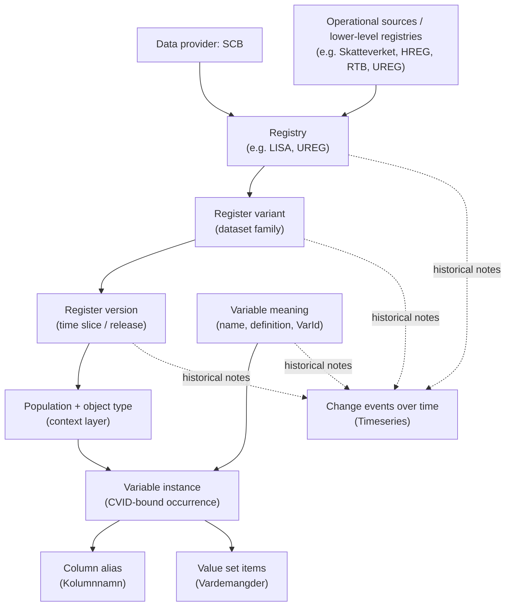

# Design: reg_meta_build

Design rationale and constraints for the build pipeline. For usage, see
`reg-meta-build --help`. For query-layer rationale (the data model end users see), see
[../reg_meta/DESIGN.md](../reg_meta/DESIGN.md).

## Scope

`reg_meta_build` owns the build pipeline that produces the SQLite databases `reg_meta`
queries against. Specifically:

- `reg_meta.db` — main metadata DB (\~320 MB uncompressed). Built from SCB source CSVs
  under `reg_meta_build/input_data/`, classifications seed at
  `reg_meta_build/classifications.toml`, and curated slug TOMLs under
  `reg_meta_build/fqid_slugs/`. Validated by `reg_meta_build/validate.py` before
  shipping.
- `reg_meta_docs.db` — FTS5 search index over the curated markdown under
  `reg_meta_build/docs/`.

Both DBs ship as `.zst`-compressed GitHub Release assets parallel to the `reg_meta` PyPI
package (release-skill orchestrates this).

## Why split from `reg_meta`

The query side (`reg_meta`) needs only the sqlite3 stdlib. The build side pulls
openpyxl, owns large maintainer-edited input data, and runs on a different cadence (most
users never run a build). Separating the two:

- Keeps the `reg_meta` wheel small and dep-light for end users.
- Lets the two release on independent tags (`reg_meta/v*`, `reg_meta_build/v*`).
- Mirrors the build/runtime separation needed for a future Go/Rust port of the query
  layer.

The cross-package dependency graph and the build/runtime boundary that governs it live
in ARCHITECTURE.md.

## Dependency direction

`reg_meta_build → reg_meta` only. The builder imports query helpers (`open_db`,
`default_db_dir`, `DB_FILENAME`, `SCHEMA_VERSION`, `derive_variable_slug`, etc.) but
`reg_meta` never imports `reg_meta_build`. The schema contract — the set of constants
and helpers both packages agree on — lives in `reg_meta`.

## What lives where

  | Module                                                                                           | Package          |
  | ------------------------------------------------------------------------------------------------ | ---------------- |
  | `db.py` (DDL, build_db, materializer, provenance DB)                                             | `reg_meta_build` |
  | `db.py` (open_db, schema constants)                                                              | `reg_meta`       |
  | `ir/` (provider-neutral IR contract)                                                             | `reg_meta_build` |
  | `id.py` (deterministic ID minting)                                                               | `reg_meta_build` |
  | `doc_db.py` (build_doc_db)                                                                       | `reg_meta_build` |
  | `doc_db.py` (open_doc_db, ensure)                                                                | `reg_meta`       |
  | `cli.py` (build / docs-build / slug commands)                                                    | `reg_meta_build` |
  | `cli.py` (query, update, info, docs)                                                             | `reg_meta`       |
  | `fqid_slugs.py`                                                                                  | `reg_meta_build` |
  | `classifications.py`                                                                             | `reg_meta_build` |
  | `validate.py`                                                                                    | `reg_meta_build` |
  | `dbdiff.py` (content diff harness)                                                               | `reg_meta_build` |
  | `sources/` (per-provider IR adapters: scb, sos)                                                  | `reg_meta_build` |
  | `fqid.py`, `catalog.py`, `queries.py`, `doc_queries.py`, `errors.py`, `update.py`, `download.py` | `reg_meta`       |

## CLI shape

Top-level commands (no `maintain` subgroup; that group is dissolved):

```text
reg-meta-build build-db [--no-validate] [--skip-slugs] ...
reg-meta-build build-docs ...
reg-meta-build seed-slugs [--out-dir DIR] [--propose-panel] ...
reg-meta-build precheck-slugs ...
reg-meta-build parse-sos ...
```

The matching `reg-meta maintain *` forms are removed. `reg-meta maintain update` /
`info` are promoted to top-level `reg-meta update` / `reg-meta info` (query-side
concerns — fetching/inspecting prebuilt DBs).

## Content diff harness (`dbdiff`)

`dbdiff.py` compares two `reg_meta.db` files by **content**, not bytes. It is the
acceptance gate for the IR/adapter refactor (and any future "the rebuild should be
identical" change): rebuild the DB, then diff the new file against a preserved baseline.
Raw byte comparison is useless here — two SQLite files with identical rows differ
byte-wise (page layout, freelist, vacuum generation, FTS index segment order), so the
check has to be order-independent and storage-aware.

- **Schema compare**: same tables, and per table the same columns (name/type/order/NOT
  NULL/default/PK) and indexes (named + auto).
- **Content compare**: per user table, row count plus an order-independent *multiset*
  fingerprint — each row canonicalized to a type-tagged, length-prefixed byte string
  (NULL-aware, BLOB-as-bytes), hashed with BLAKE2b-128, the per-row hashes **summed**
  mod 2¹²⁸. Summation (not XOR) so duplicate/missing rows can't cancel. The pass is O(n)
  streaming / O(1) memory, so the 5.7M-row `value_set_member` table costs seconds, not a
  320 MB load.
- **Ignore set** — deliberately minimal. Only `import_manifest.import_date` (wall-clock)
  is dropped by default; `schema_version`, `source_checksums`, `row_counts`, and every
  content/ID column are compared. `input_dir` (a path) is *not* ignored — it is stable
  for a same-machine rebuild; a cross-machine diff can add it explicitly.
- **FTS5**: the `*_fts` virtual tables are external-content (a projection of base
  tables, which *are* compared) and their shadow tables hold an insert-order-dependent
  serialized index. Both are schema-compared but content-excluded, so an emit-order
  change that leaves content identical does not false-positive.
- **Mismatch output**: names the table + count delta and dumps the first N differing
  rows per direction, found via an ATTACH-based multiset-difference query
  (`SUM(+1/-1) GROUP BY all-columns`) that offloads its working set to SQLite's temp
  store.

Standalone and read-only (`mode=ro` URIs); does not import the build pipeline.
Importable as `reg_meta_build.dbdiff.diff_db_content(...)` and runnable as
`python -m reg_meta_build.dbdiff <db_a> <db_b>` (exit 0 identical / 1 differs / 2
error). The full rationale lives in the module docstring.

## Source delivery shapes

Each provider ships metadata in its own native structure; the adapters (next section)
normalize these into the provider-neutral IR. This section documents the **source**
shapes an adapter reads — not the shipped catalog. For the universal two-level
`variable` / `variable_state` model the catalog collapses these into, see
[../reg_meta/DESIGN.md](../reg_meta/DESIGN.md) § "Two-level variable model".

### SCB

SCB delivers pipe-delimited cp1252 CSVs plus a SQL DDL and an Excel join-key sheet. One
backbone row is roughly a *variable occurrence* inside a registry / variant / version /
context, identified by `CVID` — not a stable column key (see *Build-time triage*). The
build coalesces the CVID grain into `variable` + `variable_state`; `CVID` does not
survive to the shipped DB.

  | File                            | Role                                   | Practical reading                                                                                                                                          |
  | ------------------------------- | -------------------------------------- | ---------------------------------------------------------------------------------------------------------------------------------------------------------- |
  | `Registerinformation.csv`       | Backbone metadata fact table           | The main source of truth: one row ≈ a variable occurrence inside a registry/variant/version/context. Carries most IDs and drives normalization (~1M rows). |
  | `UnikaRegisterOchVariabler.csv` | Deduplicated registry/variable summary | Lifecycle and flags (`VersionForsta`, `VersionSista`, sensitive/identity markers). Enriches, never overrides `Registerinformation.csv`.                    |
  | `Identifierare.csv`             | Identifier semantics                   | A small dictionary of identifier-like variables keyed by `VarID` (not globally unique to one registry); also feeds the panel-key bootstrap.                |
  | `Timeseries.csv`                | Change log                             | Breaks, redefinitions, and other events over time. Annotates the model, does not define it; the source for `*_replaced_by` edges.                          |
  | `Vardemangder.csv`              | Value-set members                      | Code/label rows keyed by `CVID` — where categorical values live (~102M rows).                                                                              |
  | `VardemangderValidDates.csv`    | Value-item validity windows            | Applied at build time for the value-set year projection (see *Year projection*); not stored.                                                               |
  | `Tabelldefinitioner.sql`        | SQL Server table shells                | Authoritative SQL types/constraints per export column; used for type validation and the panel-key bootstrap.                                               |
  | `ID-kolumner.xlsx`              | Join-key documentation                 | Which columns are ID/join columns between export files and what they reference (12 rows).                                                                  |

The CVID-grained source hierarchy the SCB adapter reads — a registry splits into
variants, each into time-sliced versions, each into a population/object-type context,
under which a variable occurs once per `CVID` with its column alias and value set;
change events annotate every level:



**A registry is not a table.** One SCB registry exposes several table-like units
(`Registervariant`), each recurring across years, months, or event streams, and the same
variable meaning recurs across many versions and contexts. The shipped model captures
this as the variant *coordinate* on `variable_state`, not as an identity level — see
[../reg_meta/DESIGN.md](../reg_meta/DESIGN.md) § "Why two levels, not three".

**LISA as a worked example.** `LISA` (RegisterId 34) is a high-level longitudinal
integrated registry, not a single flat table: it combines population, education,
employment, income, unemployment, and sickness/parental-insurance information so
transitions over time can be studied, and is itself built from lower-level registries
and administrative sources (e.g. UREG and RTB; UREG in turn draws on HREG). It exposes
several table-like variants, including `Individer, 16 år och äldre`, `Företag`,
`Arbetsställen`, and `Individer födelseland`.

### SOS

Socialstyrelsen delivers one `.xlsx` workbook per register, parsed by `SOSAdapter`
(`sources/sos.py`) into `SosRegister` trees (see *IR + adapter architecture* for the
merge/split and `_default`-variant rules). A full structural catalog of the SOS delivery
— sheet layout, kodlista shape, the deldatamängd ↔ variant mapping, and the
classification/value path — is still to be written. The classification/value path itself
shipped with #210 (PRs #273/#274); the deldatamängd token → variant mapping
(`DELDATAMANGD_TOKEN_MAP`: LOVA `A_LOVA*`, LVM `lvm_*`, DORS `DORS-COV`, LMED's combined
token) shipped with #211 (also retained as the bridge for styrtabell exclusion — see
below); the remaining vehicle for the catalog write-up is #212 (materializer-owned value
tables).

## IR + adapter architecture

The build is structured around a provider-neutral **intermediate representation** (IR)
and per-provider **adapters** that emit it, fed to one **provider-blind materializer**.
Three layers:

```text
   per-provider adapter (sources/<provider>.py)
       ↓ emits a stream of IR objects (reg_meta_build.ir.*)
   universal materializer (db.py::materialize)
       ↓ writes
   universal SQLite catalog (English columns, provider-agnostic)
       + sibling provenance DB (maintainer-only debug data)
```

The point of the split: adding a provider is *write an adapter + a slug TOML*, nothing
else. The materializer never branches on `provider`, the universal schema carries no
provider-specific tables or columns, and `reg_meta`'s read side is untouched. The IR is
the contract.

**IR** (`reg_meta_build/ir/__init__.py`). Pydantic v2 models — the one build-side
exception to the no-Pydantic-on-library-surfaces rule (see ARCHITECTURE.md), because
model-level validators catch *builder* bugs at construction (a state validity range that
crosses zero, a variable referencing a non-existent variant) rather than surfacing them
as corrupt catalog rows. `_IRBase` sets `extra="forbid"`: Pydantic's default silently
drops unknown keys, so a misspelled `is_sensitive=True` would vanish and the field would
quietly stay `False` — adapters speak a strict contract, unknown keys must raise.
Build-time only: never imported by `reg_meta` runtime, `reg_monabundle.runtime`, the
MONA bundle, or the webapp (those stick to stdlib dataclasses). Treat `ir/__init__.py`
as the source of truth for field shapes; a few that bite:

- `IRVariable` is **register-scoped** (the "define once" addressable variable); the
  variant coordinate lives down on `IRVariableState.register_variant_id`. `provider_key`
  (SCB `str(var_id)`, SOS the merged name) is a **required, non-unique** join hint — a
  triage split (below) shares one key across siblings — so `(register_id, slug)` is the
  unique natural key, not `provider_key`.
- `IRVariableState.delivery_column_name` carries only the state's *latest-era* column;
  the **full** historical column set rides on separate `IRVariableAlias` rows. That
  split is the carrier behind the structural `variable_alias ⊇ state delivery columns`
  invariant (validate.py).
- `IRVariableState.data_type` is nullable to mirror the nullable
  `variable_state.data_type` column — SCB never writes NULL, but a provider that does
  must be *representable*, not raise at emit.
- `IRValueSet.member_hash` is raw 32 bytes (not hex) — wire and storage encodings stay
  identical, no encode/decode at the boundary. The materializer writes it verbatim into
  `value_set.member_hash` (a BLOB with `CHECK length = 32`).

**Adapter** (`sources/<provider>.py`, implementing the `IRAdapter` protocol in
`sources/__init__.py`). Reads the provider's native format and emits IR. Provider quirks
are normalized *here*, never leaked downstream:

- `SCBAdapter` (`sources/scb.py`) — pipe-delimited cp1252 CSV exports. Runs build-time
  triage for same-year collisions (fold vs split; see *Build-time triage* below), the
  value-set year-projection, and the state coalescer.
- `SOSAdapter` (`sources/sos.py`) — Socialstyrelsen `.xlsx` workbooks (one per
  register), parsed via `sources/sos.py`'s `SosRegister` trees. Isolates that format's
  quirks (sheet-name variance, "metadatat"-typo headings, phantom row counts,
  non-standard kodlistor). **Merges same-named variables across deldatamängder into one
  variable by default** (the structured kodlistor are register-level and shared),
  splitting only on a genuine meaning conflict — incompatible normalized `data_type` or
  disjoint code-list shapes for one name (BU `FOD_DATUMN` date-vs-int, PAR `ATC`
  text-vs-int, both in `KNOWN_SPLIT_ALLOWLIST`). Any *other* same-name conflict
  warn-merges (fail-soft). Synthesizes a `_default` variant for variant-less registers
  (LSS/BU/SOL). Variable rows whose deldatamängd token is a technical extraction/view
  name with no Deldatamängder-sheet row resolve through the curated
  `DELDATAMANGD_TOKEN_MAP` (exact tokens only; a token can name several variants —
  LMED's `FDDD`); an uncurated token warn-drops (`sos_deldatamangd_unresolved`).
  **Styrtabeller** (value-set decode tables, e.g. LOVA's 10 `A_LOVA_STYR_*`
  deldatamängder) are detected by a two-signal check —
  `Aggregeringsnivå == "Ej relevant"` on the Deldatamängder sheet AND a
  `Deldatamängdsetikett` prefix of "Styrtabell" — and excluded from variant and variable
  minting so decode-only columns (KLARTEXT/KLARTEXT_GRP/BESKRIVNING/…) don't surface as
  research variables. `DELDATAMANGD_TOKEN_MAP` is kept intact because the exclusion
  reuses it to resolve which deldatamängd a Variabelnivå row belongs to before deciding
  whether to drop it. A `sos_styrtabell_signal_mismatch` IRWarning fires when the two
  signals disagree. Binding styrtabell Värdemängd rows to the coded variables they
  decode (e.g. AGARKAT, SYSSSTAT) is deferred to a follow-up (#401).

`emit()` yields IR in FK-topological order (register → classification → variant →
value_set → variable → state/alias → edges → warning/provenance sinks) so the
materializer can insert in stream order with FK targets always present. The order
constrains only the types an adapter actually emits — an adapter MAY emit a subset
(`SCBAdapter` leaves classifications and lineage materializer-derived). Every `*_id` is
an explicit int the adapter bakes in; emit order is independent of ID assignment.

Remaining: future-provider adapters (FK, Skatteverket) — see REFACTOR_SPEC.md.

## Materializer

`db.py::materialize` consumes each adapter's IR stream, runs the shared provider-blind
derivation passes once over the combined graph, and writes the universal catalog. It is
the **sole writer** of the shipped provider-shaped core graph — `register`,
`register_variant`, `variable`, `variable_state`, `variable_alias`.
`_reinsert_core_graph_from_ir` DELETEs the rows each adapter wrote to scratch during
`emit()` and re-INSERTs them from the collected IR with explicit PKs, so there is
exactly one final writer per table and no parallel old/new path. (The adapter writes
those rows during emit purely to *derive* SCB's exact legacy IDs — strategy reuse, not a
second source of truth — and the IR mirror reads the IDs back; the re-insert makes
byte-identity with the pre-refactor baseline hold.) Slugs insert NULL; `populate_slugs`
/ `populate_variable_slugs` UPDATE them in place afterwards.

**Provider-blindness is complete for the core graph but not the value tables.**
`value_set` / `value_code` / `value_set_member` stay adapter-written and are *not*
re-inserted, deliberately: they are content-addressed by `member_hash` and **shared
across providers by content** (an identical SOS code list collapses onto the same row as
SCB's), and the year-projection can leave orphan `value_code` rows belonging to no
`value_set_member`, which a member-derived IR stream cannot reproduce. They carry no
provider-specific shape, so the adapter staying their writer costs no
provider-blindness. Remaining: making the materializer own the value tables too — see
REFACTOR_SPEC.md / #212.

The shared post-passes (run once over both providers' rows): classifications, slugs,
`same_as` / `replaced_by` / lineage edges, `code_variable_map`, the
`variable_state.classification_id` backfill, FTS. After `code_variable_map` is complete
(base derivation + SCB cvid-scratch top-up), `value_code.mapping_count` (#352) is set to
each pair's variable count — a precomputed rarity weight the code/value search
downweights by (a generic enum shared by many variables ranks below a rare one), never
aggregated over the 4.1M-row map at query time. The FTS pass also builds
`value_code_fts` over value labels, EXCLUDING a curated junk-label stoplist
(`_VALUE_CODE_STOPLIST_EXACT` / `_VALUE_CODE_STOPLIST_PREFIXES`: `Ja`/`Nej`,
`Uppgift saknas`, the `Okänt*`/`Okänd*`/`Felaktig*` SCB sentinel-prefix families, …) —
hidden from SEARCH only; the leaf `value_code` rows are untouched. The prefix families
are matched as STEM prefixes (`LIKE 'Felaktig%'`), intentionally, so they catch the bare
sentinel (`Okänd`), the space-separated form (`Okänt värde`), AND the inflected form
(`Felaktigt värde`, which a word-boundary match would miss since `Felaktigt` ≠
`Felaktig`). The known coarseness — a legit label starting with one of these stems as a
longer single word (e.g. `Okäntköping`) would also be hidden — is accepted: no such
label occurs in the corpus, and broader stoplist curation is out of #352 scope (initial
dozen). The materializer enforces the build-time invariants the universal schema encodes
— chiefly that `(variable_id, register_variant_id, valid_from)` is unique across
`variable_state` unless explicitly marked multi-vintage via `value_set_version_label`
(the variant coordinate is part of the uniqueness scope), and that `variable.slug` is
register-unique. The non-overlap invariant is what *requires* the build-time triage
below.

## Provenance DB sibling

A second SQLite file, `reg_meta.provenance.db`, sits next to the universal DB. It is a
**maintainer-only debug artifact — never shipped to consumers** and structurally outside
the dbdiff gate (dbdiff only ever opens `reg_meta.db`, so populating this sibling is
dbdiff-neutral by construction). The provenance tables live *only* here and touch no
universal-schema DDL, so writing them does **not** bump `SCHEMA_VERSION` (that constant
gates the universal DB alone). It holds the data that must not pollute the published
catalog:

- `build_manifest(schema_version, universal_db_path, universal_db_sha256,   build_date)`
  — ties the provenance file to the exact universal DB it was built against.
- `delivery_approval` — per-`register_variant` Registerversion delivery/approval dates
  (the `IRDeliveryProvenance` sink). Keyed per variant, not per register: two variants
  delivering an edition under the same `registerversionnamn` token would otherwise
  collapse into one slot. `period_token` is the Registerversionnamn;
  `first_approved_date` / `last_approved_date` are SCB's första/senast godkännandedatum.
- Per-provider source-ID linkage (`scb_register_id_map`) and adapter parse warnings
  (`adapter_warning`, the `IRWarning` sink). (Source-file checksums and row counts are
  not duplicated here — they live in the shipped `import_manifest`.)

Both the universal and provenance DBs rotate one generation on rebuild
(`rotate_db_to_prev`): `reg_meta.db` → `reg_meta.db.prev`, evicting any prior `.prev`.
No auto-cleanup of older generations — a maintainer who wants to keep more than one
`mv`s the `.prev` aside. The provenance write is wrapped non-fatally: a provenance
failure must not flip the build exit code. Confinement is enforced cross-package —
`reg_monabundle`'s bundle amalgamator carries an import allow-list that rejects any
module opening this DB, so it can never reach MONA (see ARCHITECTURE.md).

## Deterministic ID minting

SCB universal IDs **reuse the source integers verbatim** (`RegisterId`, `RegVarID`,
`VarId`, `CVID`), so an SCB rebuild produces byte-identical IDs from identical CSV
inputs. Providers without native int keys (SOS today) mint deterministically via
`id.py::mint`:

- **BLAKE2b**, 8-byte digest, personalized `regmeta-id`. Each input part is
  **length-prefixed** (4-byte big-endian length + UTF-8) before hashing, so the encoding
  is unambiguous — a plain `/` separator would collapse distinct key tuples whose parts
  contain the separator (`mint("a/b","c")` vs `mint("a","b/c")`).
- The low 62 bits become the ID body and **bit 62 is set**, landing every minted ID in
  `[2^62, 2^63)`. SCB's source-derived IDs are small integers far below `2^62`, so the
  two bands are **structurally disjoint** — arithmetic, not a runtime collision check.
  Query-time cross-provider disambiguation therefore needs no provider check. **Bit 63
  stays clear** so every value fits a signed 64-bit SQLite INTEGER. The `< 2^62`
  structural bound (not a loose 32-bit window) is what the namespace property test pins.
  Future providers get their own band bit.

## CSV import and encoding

SCB exports are pipe-delimited, cp1252 encoded. Several bytes in the exports are
actually DOS cp850 remnants undefined in cp1252:

  | Byte | cp850 | Mapped to |
  | ---- | ----- | --------- |
  | 0x81 | ü     | ü         |
  | 0x8D | ì     | ì         |
  | 0x8F | Å     | Å         |
  | 0x90 | É     | É         |
  | 0x9D | Ø     | Ø         |

These are mapped during import. The build reads \~1M backbone rows from
`Registerinformation.csv` and \~102M value-item rows from `Vardemangder.csv`.

### SCB free-text hygiene (read-boundary trim)

SCB exports carry stray surrounding whitespace on a subset of free-text fields. All of
it is normalized where the CSVs are read (`_import_registerinformation` /
`_import_unika`; SOS strips at parse via `_clean`).

**Kolumnnamn** (#364): a handful of values are padded (`'  Pris'`, `'Lan '` — \~112 rows
in Registerinformation, \~19 in UnikaRegisterOchVariabler), and \~28K rows ship a
*blank* `Kolumnnamn`.

- **Trim**: a padded spelling is the same delivery column under a dirty name. Left
  untrimmed, `'Bransle'` vs `'  Bransle'` never co-occur as identical strings, so rule-2
  connectivity sharded one source variable into bogus split siblings (corpus: 9 such
  pairs, e.g. `bransleforbrukning` + `bransleforbrukning-2`). Both import sites trim so
  the `unika_join`/`unika_summary` keys keep matching `variable_alias_build`.
- **Blank is not an alias**: a blank `Kolumnnamn` means the variable was registered with
  no delivery header in that variant. That is represented as a NULL
  `variable_state.delivery_column_name` and *row-absence* in `variable_alias` — never as
  an `''` alias row (pre-fix the build shipped \~3.3K of those; they carried no header
  information and polluted `get_datacolumns`/alias listings). No blank-Kolumnnamn unika
  row carries sensitivity flags, so skipping them loses nothing in
  `_populate_sensitivity_flags`.

**Name fields** (#366): `Variabelnamn` (\~1,503 padded rows / 644 distinct dirty
spellings), `Registernamn` (9), and `Registervariantnamn` (12) are trimmed the same way.
These are not display-only: they key the `unika_join`, the sensitivity-flag join
(`v.name = us.variabelnamn`), and the coalescer (`vi.variabelnamn`). The two CSVs
currently carry byte-identical dirty spellings so the joins match today, but trimming
both sides in lockstep makes that robust against a future export that cleans one file
only (a silent join-drop otherwise) and removes the display noise. The variable
first-non-empty fill runs on the trimmed values, so a clean later spelling wins over a
padded earlier one.

**Remaining free-text** (definitions, descriptions, register/variant/version names and
descriptions, population and object-type names/definitions, measurement unit, source-
register text): trimmed too — pure display hygiene, no join impact. Left untrimmed they
are cosmetic noise in `reg-meta` output and the webapp. Numeric / flag / date / id
columns are not touched (whitespace there is never legitimate and they are parsed, not
displayed).

`validate_built_db` enforces the trim invariant on the join/identity fields:
`[delivery-column hygiene]` (no surrounding whitespace on any shipped
`delivery_column_name`, no empty strings) and `[name-field hygiene]` (no surrounding
whitespace on `variable` / `register` / `register_variant` `name`). The remaining
display fields are trimmed but not validated.

## Source-register resolution

The `VariabelRegister_Källa` field is resolved using deterministic matching only — no
fuzzy logic:

1. Extract parenthesized abbreviation (e.g. "Befolkningsregistret (RTB)" → RTB)
2. Match text before `:` separator against register names
3. Match entire text against register names

Unresolved sources are stored as raw text in `source_label` for human review. The
resulting `source_register_id` / `source_label` pair on `variable` is what query
commands surface (see [../reg_meta/DESIGN.md](../reg_meta/DESIGN.md) § "Composite
registers and source tracking").

## Consumer-side lineage (`variable_state_lineage`)

Composite registers (LISA, RAMS, …) re-deliver variables sourced from base registers
(RTB, FTB, …). `link_variable_state_lineage` materializes that consumer→source link as
**state-pair interval-overlap edges**: for each consumer `variable_state` whose
`variable.source_register_id` points at a different register, it finds the matching
source state(s) and emits one edge per pair whose validity ranges intersect, with
`(valid_from, valid_to)` set to the intersection. A few non-obvious choices:

- **Interval-overlap, not slug equality.** v0.11 keyed lineage on slug-folded period and
  picked the source variant non-deterministically (`MIN(cvid)`). The interval join
  produces the same answer for the trivial year-equal case but also expresses real
  cross-state lineage (a consumer era sourcing from a pre-rename source state, then a
  post-rename one) at no runtime cost.
- **Source-side matching is a multi-seed `same_as` BFS.** The consumer's slug identifies
  the source variable by identity (LISA `kon` → RTB `kon`, no curated edge needed).
  `_variable_set_via_same_as` then BFS-expands from *two* seeds: the source-register
  identity node (picking up within-source renames like RTB `kon` ↔ `kon-v2`) and the
  consumer node (picking up any curated cross-register / cross-provider
  `variable_same_as` edge whose endpoints have *different* slugs, LISA `foo` ↔ RTB
  `bar`; see reg_meta/DESIGN.md → Composite registers and source tracking). The common
  no-rename case yields just the identity slug, so an edge is always additive. (An
  earlier single-seed form expanded only the source node and silently missed
  mismatched-slug cross-register edges — latent while `variable_same_as` is empty; since
  fixed.)
- **Variant pinning is TOML-only — no SQL table.** A `[lineage_defaults]` block picks
  one source variant per source register; a
  `[lineage."<consumer_register>.<variable_slug>"]` block overrides it per consumer
  variable. Uncurated consumers fall back to *all* source variants carrying a matching
  state plus an `ambiguous_source_variant` warning; a consumer with no source state at
  all gets `no_source_state`. A found-but- non-overlapping source state is neither — it
  is a legitimate empty result (zero edges, zero warnings). Warnings land in
  `variable_state_lineage_warning` and the build log for curator attention.
  `load_lineage_config` does shape validation only; existence of the named
  registers/variants is validated by the linker against the DB (fail-fast on a pin to a
  non-existent variant or a `source_register` that contradicts the variable's resolved
  source register).

`link_variable_state_lineage` is the sole lineage linker.

## Vardemängder sentinel filtering

`Vardemangder.csv` ships a row for every variable, including those with no enumerated
code list. SCB encodes "no codes" by stuffing a placeholder string into `Värdekod` so
that `Värdekod == Värdemängdsversion` (and typically `Värdemängdsnivå`). Two disjoint
cases occur with this shape, classified by two allowlists in `reg_meta_build/db.py`:

`_VARDEMANGDER_SENTINELS` — placeholder strings that mean "no enumerated code list." Not
real value codes; dropped silently.

  | Värdekod           | Meaning                 |
  | ------------------ | ----------------------- |
  | `Tal`              | Numeric variable        |
  | `Beskrivande text` | Free-form text variable |

Importing sentinels would pollute `value_code` with rows that are never valid lookups,
and write the placeholder into
`variable_instance.{value_set_version_label,vardemangdsniva}` where downstream consumers
would mistake it for a real classification label. The authoritative type signal is
`variable_instance.data_type` — the placeholder adds nothing and is sometimes misleading
(e.g. cvid 207 `DatInv` is `data_type='int'` but tagged `Beskrivande text`).

`_VARDEMANGDER_REAL_SHAPED` — kods that *happen* to equal their version label but are
real single-code value sets. Kept silently.

  | Värdekod | Label                                       |
  | -------- | ------------------------------------------- |
  | `1`      | Hade ingen anställning före YH-utbildningen |
  | `2`      | Övriga civilstånd                           |

Both classifications are required because the shape alone is ambiguous. An unguarded
skip on `kod == version` would silently drop the real codes; an unguarded keep would let
new SCB placeholders pollute the DB.

The skip rule is tight: `kod == version == niva` AND `kod` ∈ `_VARDEMANGDER_SENTINELS`.
Looser variants (e.g. `kod == version` but `niva` diverging) fall through to the drift
detector below and fail the build for human review, even when the kod is already a known
sentinel string. This guards against a future SCB change to the sentinel shape.

A cvid whose only Vardemängder rows were sentinels gets `NULL` for
`value_set_version_label` / `vardemangdsniva` on `variable_instance`. Fully-empty rows
(kod, label, item all empty) are dropped silently.

### Drift detection

A `kod == version` row where kod is in neither allowlist is treated as drift and fails
the build with `RegMetaError(code="vardemangder_drift", exit 10)`. The importer can't
tell whether such a row is a new sentinel or a new real single-code value set, so the
build refuses to ship and prompts the maintainer to add the kod to one of the two
allowlists.

The drift trigger only requires `kod == version`, not `kod == version == niva`, so a
placeholder where SCB drops the niva equality still surfaces. Currently observed
sentinels have all three fields equal, but no upstream guarantee.

This makes the maintainer's release workflow self-checking: any new SCB sentinel string
causes the rebuild to fail loudly with an actionable remediation, rather than silently
shipping pollution. There is no interactive escape hatch — drift always fails — because
the only correct response is to update the allowlists, which is a one-line code change.

## Year projection

`build-db` projects every `(cvid, code_id)` pair through validity at build time so each
cvid carries the codes that were actually valid in its regver year. The projection rule:

- For each pair, collect validity windows of all *tracked* ItemIds (those with at least
  one row in `VardemangderValidDates.csv`).
- If no tracked windows → include the code (always-valid fallback).
- Otherwise → include iff at least one window covers the cvid year.
- Yearless cvids (regver name has no plausible 4-digit year, e.g. `Person-År`) include
  all union pairs as a fallback.
- An untracked ItemId next to a tracked one does NOT relax the constraint: the tracked
  window is authoritative.

The result is the year-projected, content-addressed `value_set` / `value_set_member`
structure query users see (documented in [../reg_meta/DESIGN.md](../reg_meta/DESIGN.md)
§ "Value sets are year-projected").

## Classification seed

The `classification_id` FK is populated at build time from a maintainer-curated TOML
seed at `reg_meta_build/classifications.toml`. Each entry declares a normalized
classification and lists the raw `value_set_version_label` strings (the SCB-published
"Vardemangdsversion" labels) that map to it — exact match, no fuzzy inference. Match
strings are deterministic and auditable: any maintainer can enumerate them via
`SELECT DISTINCT value_set_version_label FROM variable_instance`. The build tags
`variable_instance.classification_id` first; the `_backfill_state_classifications` pass
then projects it onto the **shipped** `variable_state.classification_id` (per-era,
attributed to the owning split sibling) before `variable_instance` is dropped.

**Provider gate.** A seed entry may carry `provider = "<name>"` (e.g. `"sos"`). When the
build runs with a restricted provider set (e.g. `--providers=scb`), every entry whose
`provider` is not in that set is skipped entirely — no codes seeded, no `classification`
row inserted. This is a build-time filter only: no `provider` column exists in the
shipped DB; the catalog remains provider-blind. An entry without a `provider` field is
always processed.

**`vardemangdsversion`-free seeds.** A classification may omit `vardemangdsversion`
entirely. Without it, no variable instance is tagged and the classification row carries
only canonical codes from `valid_codes_file`. The SOS code systems (ATC, ICD-10-SE, KVÅ,
ICF, KSI, historic ICD, DRG/MDC) are seeded this way: the canonical codes are committed,
but the linkage from observed SOS variable instances to these classifications is wired
in PR2 via the `external_classification` resolver.

Build-time invariants (violations fail `reg-meta-build build-db` loudly, exit 10):

- Every seed `vardemangdsversion` string must match at least one instance (entries
  without `vardemangdsversion` are exempt from this check).
- Every classification with at least one tagged instance must resolve to at least one
  value code.
- A given `vardemangdsversion` string may belong to at most one classification.
- Every `supersedes` reference must resolve to a declared `short_name`.
- Every `valid_codes_file`, when present, must resolve to a CSV under the
  classifications directory whose first two columns are the code and label (either
  `vardekod,vardebenamning` or the universal `code,label` header; further columns are
  ignored).

### Canonical code CSVs

A seed entry's optional `valid_codes_file` points at a CSV under
`reg_meta_build/input_data/classifications/`. Accepted headers: the SCB convention
`vardekod,vardebenamning` or the universal `code,label`; only the first two columns are
read — further columns are silently ignored. At build time:

- Every CSV code is ensured to exist in `value_code` (canonical-but- unobserved codes
  get a fresh row with no `value_set_member` linkage).
- Every `classification_code` row in that classification is marked `is_valid=1`
  (canonical) or `is_valid=0` (observed-only).
- `classification.valid_code_count` caches the canonical count; it is `NULL` for
  classifications without a CSV.

The CLI surface (`get classification --codes --only-valid`, `is_valid` in JSON output)
is documented in [../reg_meta/DESIGN.md](../reg_meta/DESIGN.md) § "Canonical vs observed
codes". See also [CLASSIFICATIONS.md](CLASSIFICATIONS.md) for the per-classification
extraction recipes that produced the shipped CSVs.

The seed lives in the repo (alongside `DESIGN.md`) and is **not** bundled in any wheel —
same status as `reg_meta_build/docs/`. End users receive the already-populated
classification tables via the prebuilt DB asset.

## Build-time triage (SCB)

SCB lumps several distinct delivery columns under one `var_id`, so the coalescer can
produce multiple `variable_state` candidates for one `(variable, year)` within a variant
— empirically \~2.7% of buckets. That violates the materializer's state-uniqueness
invariant, so the SCB adapter triages every such collision (`sources/scb.py`,
`_triage_groups`) three ways:

- **Fold** — same concept in different *representations* (a classification vintage, a
  SUN/SSYK grain, a coding variant), even when shipped as parallel columns. Keep **one**
  variable; give each colliding state a distinct `value_set_version_label` token; the
  variable slug derives from the shared column stem. No edge — it's one variable.
- **Split** — genuinely different concepts under a generic `var_id` (disjoint column
  stems). Mint distinct sibling `variable` rows sharing the source `provider_key`,
  reassign each column's states to its sibling, and link the siblings with
  `variable_related_to` edges.
- **Collapse** — residual same-column metadata drift (`data_type` / `value_set_id`
  re-delivery churn). `_collapse_residual` runs in two passes: pass 1 dedupes groups
  sharing the same `valid_from`-year index key (keeps the latest-era state, drops pure
  drift); pass 2 reconciles SAME-column, SAME-value-set, SAME-emitted-label groups whose
  `[regver_min, regver_max]` spans *overlap across different lower-bound years* —
  dropping a fully-subsumed group and range-clamping a crossing container's `valid_to`
  to the year before the successor begins. Only fast-path
  `(variable_id, register_variant_id)` partitions are touched; distinct value sets and
  different-column overlaps (parallel co-deliveries) are left to the materializer.

Fold vs split is decided **PER CLUSTER** (#223), not fold-all-or-split-all:
`_cluster_contested` partitions a container's contested columns into stem- families
(columns sharing a stem ≥ `_FOLD_MIN_STEM` whose differing suffixes are all
representation tokens — `Ssyk3`/`Ssyk5`, `FtgSni02`/`…`/`FtgSni92`, `BCIV`/`BCIVRED`),
folding each multi-column cluster and splitting the rest. So a `var_id` mixing a
foldable family with disjoint concepts (`{Ssyk3, Ssyk5, Hemkommun}`) folds the family
AND splits the disjoint column (2 variables), instead of over-splitting all three.
Implementation keeps the whole-set fold and whole-set split paths byte-identical and
only sub-clusters when the whole set splits but a foldable subset exists; the `triage:`
build line reports a `clustered` count for how often that fires.

`Variabelnamn` is **never** the fold/split signal: SCB ships generic family labels (one
`var_id` named `Imputerat` covering rooms, area, …; the name is identical across the
columns in 100% of split buckets), so the concept boundary rides on the **column stem**.
Stem-based triage folds only a *minority* of contested containers, but triage still
needs *both* outcomes: a fold-everything rule would merge rooms with area, and a
split-everything rule would over-shard SNI vintages that arrive as parallel columns. The
precise fold / split / collapsed / clamped / clustered counts are reported by the
`triage:` build line.

**Column identity is the case-folded header** (#196). The coalescer's rule-2
connectivity (`_coalesce_variable_states`) keys its union-find node-col on
`_ascii_fold_lower(column)` — NFKD-decomposed, ASCII-stripped, lowercased — so
case-/diacritic-only header twins delivered under *separate* cvids
(`PersonNr`/`Personnr`, `Kon`/`Kön`) are ONE node and never reach triage as distinct
columns. Without the fold, a split-container var sharded each casing into its own
sibling fragment (\~543 fragments across the corpus). Raw casing still surfaces where it
should: `delivery_column_name` is the latest-era alias verbatim, and the unika lookups
stay raw. Consequently every curated column key (`fold_overrides.toml`,
`codelivery.toml`, `column_merges.toml`) is case-folded at load by the shared
`_curation.fold_column` — TOML casing is cosmetic, and the single shared definition
keeps loader keys and coalescer components from drifting.

**Co-delivery guard on the fold.** The fold targets era-rename twins that never
co-occur. When two distinct spellings of one folded header share an edition of a variant
(81 groups in the corpus), they are genuinely *parallel* columns — HRE ships `Niva` +
`Nivå` side by side for 25 years carrying a 3-group and a 2-group coding — and folding
them would put two codings on ONE column, forcing the co-delivery invariant to drop one.
Those groups keep their raw node-cols; the triage still folds them into one variable
(identical folded stems) with label-discriminated states, the pre-#196 handling. Because
a guarded component can be raw-cased, every consumer compares on the folded form: the
fold-override gate and `_cluster_contested`'s `forced_same` membership fold the
contested side, and the codelivery pin lookups fold `gkey[8]` (a folded pin key thereby
pins ALL spellings of the header, by design). A curated column-merge outranks the guard
— maintainer fiat can force a co-delivered pair onto one node.

**Curated column-merge** (#196; `column_merges.toml`, loaded by `column_merges.py`) —
the curated counterpart of the auto case-fold, for era-RENAME twins (`PNR` ≡ `PersonNr`)
that share no case identity. The two headers never co-occur in one edition, so rule-2
sees two components; once the var_id is a split container (other columns DO co-deliver),
each component becomes its own sibling variable and one identity's history shards across
fragments. The triage fold-override below cannot express this — it acts on CONTESTED
(same-edition co-delivered) columns only, and the gate rejects a non-contested column by
design. The merge instead normalizes the named columns to ONE union-find node-col (the
lex-min folded member) *upstream* of triage. Keyed `(register_id, var_id)` like the
fold-override, with the same maintainer-artifact semantics (absent in wheel/synthetic
builds; empty ⇒ connectivity unchanged) and the same strictness: a named column never
observed as a delivery column of the var FAILS the build (`EXIT_CONFIG`,
`column_merge_unknown_column`), scoped to the registers present in the build (the
partial-/synthetic-build escape). A merge spanning multiple var_ids is unrepresentable
by construction — cross- var_id column *sharing* (#197) is a different shape and
intentionally not curatable here.

Two notes on the triage signals:

- **The classification family plays no role in the triage fold decision.** The column
  STEM is the sole fold/concept boundary. Activating the family signal was tried (run
  triage after `populate_classifications`) and measured **195 over-folds** — it merges
  distinct concepts that merely share a code system (`Hemkommun`/`Skolkommun`,
  SSYK-primary/SSYK-secondary), so it was dropped. When a register genuinely delivers
  ONE concept under DISJOINT-stem columns (näringsgren as
  `Ksjusni`/`NG1`/`bransch`/`sni2`), the stem rule can't see it; a **curated
  fold-override** (`fold_overrides.toml`, loaded by `fold_overrides.py`) forces those
  columns to one cluster via the `_cluster_contested(forced_same=…)` seam (#261). An
  entry is keyed `(register_id, var_id)` — the same SCB ids the triage carries, so a
  fold group spanning multiple variables is unrepresentable by construction. It is the
  curation twin of `codelivery.toml` (which resolves two codings on ONE column), and
  like it a maintainer artifact absent from wheel/synthetic builds (empty map ⇒
  byte-identical to the stem-only partition). It is **not a silent no-op**: a named
  column that isn't contested for the var, or an override whose register is built but
  whose var is not a contested split container, FAILS the build (`EXIT_CONFIG`); an
  override for a register absent from the build is inert (the partial-/synthetic-build
  escape, like a codelivery pin for an absent register).

  **Format** — each `[[fold]]` entry is one fold group for one
  `(register_id,   var_id)`; a var needing two independent groups gets two `[[fold]]`
  entries with the same key:

  ```toml
  [[fold]]
  register_id = 195
  var_id = 4027
  columns = ["bgr98", "bransch", "ksjusni"]
  ```

  Only `[[fold]]` is a legal top-level table; `register_id` / `var_id` must be canonical
  integers (no leading zeros); `columns` requires ≥ 2 non-empty strings with no repeats
  within or across groups for the same key. All violations are `EXIT_CONFIG`. A listed
  column names a contested **component** — the case-folded lex-min member of its rule-2
  connectivity component (#196), which is the form the triage carries; the
  `fold_override_unknown_column` error lists the var's current contested roots when an
  entry goes stale.

  **Pre-v1 churn** — the curation content in `fold_overrides.toml` churns freely pre-v1;
  no freeze or immutability is in effect for this surface yet. Arming snapshot-style
  immutability (analogous to the `fqid_slugs/UNFROZEN` sentinel for register-version
  slugs) is tracked as #209 and explicitly out of scope here. `fold_overrides.toml` is a
  separate package-root file like `codelivery.toml` — it is not under the `fqid_slugs/`
  snapshot machinery.

- **Split `relation_kind` is decided PER CO-DELIVERED PAIR** (`_apply_split`), from the
  pair's two delivery columns, most specific first: `code_vs_label_pair` (name-based — a
  `<stem>namn` label paired with its bare-stem or `<stem>kod`/`<stem>id` code, e.g.
  `Lid`/`LNamn`), then `import_bug_suspect` (a numeric-vs-text `data_type` mismatch on
  the columns' latest-era groups; failing a type read, a present-on-both `data_length`
  disagreement), else the generic `same_definition_different_column`. **Never** the
  fold-only `same_concept_different_grain`. Only a pair whose two columns actually
  shared an edition bucket is eligible for a specific kind; a pair that never
  co-occurred — a temporal/rename sibling, OR two `contested` columns that (since
  `contested` is a union across buckets) never shared one bucket — stays generic, the
  pairwise signals being meaningless across editions. `_split_off_non_contested` is
  generic for the same reason. Edges carry `note = "auto:triage"`. There is **no**
  `triage_unresolved_split` warning — an unmatched column just routes to a fresh
  auto-slugged sibling (additive under grow-only).

Slug collisions during triage (and in the *Slug curation* auto-derive below) are
resolved with a deterministic **numeric `-N` suffix** (`_uniquify` /
`_collapse_residual`), not `-a`/`-b` or a hash suffix.

Residual collapse now reconciles same-column cross-year overlaps (pass 2 above). The
remaining open item is cross-column identical-parallel-column dedup (two delivery
columns carrying exactly the same concept at the same period), which is a separate rule
outside this collapse path.

### Sub-annual boundary clamp

A state's validity window is otherwise year-granular: `valid_from`/`valid_to` expand
each edition's `registerversionnamn` year to `YYYY-01-01`/`YYYY-12-31`. That
**over-claims** the boundary year when a `(variable, variant)` group's EARLIEST edition
is a partial autumn term (`Höstterminen`/`HT`, delivered Jul–Dec) or its LATEST is a
partial spring term (`Vårterminen`/`VT`, Jan–Jun): the year bound claims a half-year the
variable was never delivered in.

`_edition_bounds(versionname, year)` (#219) parses the Swedish term/quarter/half
phrasings to an inclusive ISO `(lo, hi)` window; since #271 the per-group envelope
(`from_iso` = min claim lo, `to_iso` = max claim hi) derives from the claim records
rather than parallel accumulator fields. The materializer applies the envelope **only at
a state's lifetime start/end** — `from_iso` for the first emitted run when it begins at
`regver_min`, `to_iso` for the last when it ends at `regver_max`. Interior timeline
handoffs between competing value sets stay year-aligned.

The clamp only ever NARROWS within the boundary year — it never crosses a year boundary,
**by construction**: `_edition_bounds` is passed the row's edition year
(`extract_year(registerversionnamn)`) and narrows only markers whose own year EQUALS it,
so every edition's window is a subset of `[year-01-01, year-12-31]` and the group
envelope is a subset of `[regver_min-01-01, regver_max-12-31]`. A cross-year school-year
range (`Höstterminen 2020 - Vårterminen 2021`, whose `extract_year` is the first year)
thus narrows its START to Jul 1 but drops the next-year spring term, keeping a
year-granular END. This year-tie also closes two corpus-constructible traps: a term
naming a different year than the edition (`Insamling 2019 avseende höstterminen 2020`)
can no longer produce an inverted `valid_from > valid_to`, and a stray out-of-1900-2099
term (`HT 1850, version 2024`) can no longer crash `period_token_to_bounds`. As a
backstop, the materializer fail-fast-raises (`coalesce_inverted_state_window`) if any
non-sentinel state would ship with `valid_from > valid_to`. Extending across the year
boundary is avoided regardless because it would manufacture a same-column overlap with a
distinct value set delivered the next year (legitimate year-over-year recoding) and trip
the one-value-set-per-period invariant; capturing a school-year range's spring tail is
deferred (it fixes an UNDER-claim beyond this PR's over-claim scope).

Only the academic-term, quarter (`kvartal`/`kv`, incl. ranges), and half-year
(`Första/Andra halvåret`) forms are narrowed; bare years, dated annuals, prelim/final,
month names, seasons (`Hösten`/`Våren`/`Sommar`), `Sommarterminen`, and `läsår` all stay
full-year, since their sub-year span is ambiguous and narrowing would risk dropping
coverage. Token→ISO expansion is reg_meta's `period_token_to_bounds`, so a `HT2024`
query and the emitted state bound agree byte-for-byte. Because the emitted `valid_from`
only ever becomes MORE specific (year → term), it can only split a previously-colliding
uniqueness-index key, never merge two distinct ones, so the year-keyed residual-collapse
scope and the fast path's never-collides assumption are unaffected.

### Interval-native co-delivery resolution (#271)

The co-delivery resolver is interval-native (shipped via #297 design / #313 claims
plumbing / #315 sweep / the engine-extraction PR; the predecessor was deliberately
year-bucketed, and its one known data loss — the recency tiebreak silently dropping a
term's coding when two sub-annual editions of one year carried different value sets — is
what this design removes).

**Design goal.** Resolution operates on the windows editions actually delivered
(`_edition_bounds`), not on calendar-year buckets, so that two same-year editions with
genuinely different value sets on disjoint windows (VT Jan–Jun vs HT Jul–Dec) BOTH ship
as non-overlapping states — term-split falls out of interval correctness, with no
special case. Everything the year bucket got right is preserved: cosmetic/drift
collapses still pick one winner, authority still lets a full-year edition supersede a
partial slice it overlaps, and the #270 boundary clamp is subsumed exactly, never
regressed (verified by the enumerated-population diff gate when the sweep landed).

**Module layout.** The engine — claims in, owned intervals out — is provider-blind and
lives in `resolution.py` (`Claim`, `SweepHooks`, `resolve_year_intervals`,
`assemble_runs`, the grammar successor tables); it contains no provider grammar and no
SCB types, and is parameterized over an opaque candidate key through the hooks. The SCB
adapter (`sources/scb.py`) supplies the provider conventions: claim extraction
(`_edition_bounds` on `registerversionnamn`), the identity verdict
(`_pool_single_coding`), the resolution cascade (`_resolve_column_year`, with its
SCB-specific label-freshness and historical-grain steps), the curation pins, and the
per-register cadence map — wired together in `_resolve_year_winners`. SCB stays the
engine's only caller until a second provider needs co-delivery resolution.

#### The model: claims → drift conflation → segment choice → runs

**Claims.** Each state group carries one *claim* per observed edition year:
`(lo, hi, authority, approval)` — the inclusive ISO hull of the group's edition windows
in that year (`_edition_bounds`, a full-year edition contributing
`YYYY-01-01..YYYY-12-31`), with the year's max `_edition_authority` and max approval
date. This single structure replaces `regyears`, `year_authority`, `year_approval` AND
the #270 envelope (`from_iso`/`to_iso`): the envelope was the min/max hull of exactly
these windows, so the boundary clamp becomes a *corollary* (below) rather than a bolted-
on field pair. Claims are **year-nested by construction** — `_edition_bounds` ties every
marker to its edition year — so segments never cross a year boundary, the sweep
decomposes per year, and cross-year logic stays at year grain. (Lifting year-nesting is
what a future cross-year edition form — läsår ranges — would change; the model
accommodates it, see scope boundaries.)

**Drift conflation — identity per compaction window, blind to claim windows.** The
cascade's *identity* steps — value-set fold (one value set in several groups),
same-label drift (`-N` collapse near-dups), cosmetic drift (symmetric diff ≤
`_COSMETIC_MAX_SYM`, no shared-code relabel) — decide "these are the SAME coding,
re-delivered with drift". That judgment is about the coding, not the claim window: a VT
and an HT delivery of one drifted coding must still collapse to ONE winner (the dominant
population in the #271 measurements — preserving it is a hard requirement), not fragment
into two near-identical term states merely because their windows are disjoint. So per
`(column, compaction window)` — a per-variant policy scope, **default: the calendar
year** (see *Cadence policy* below) — claims are first partitioned into same-coding
classes and each class resolves to one **carrier** via the existing cascade order
restricted to the class (authority → recency → … → largest-set). Class formation reuses
today's *pool-level* predicates verbatim — value-set-id equality,
one-source-label-across-the-pool, and the cosmetic test as the pool's max *pairwise*
symmetric diff (no pairwise transitive closure: an A\~B\~C chain whose A↔C diff exceeds
the threshold does NOT conflate, exactly as today's set-level check refuses it). The
carrier keeps **its own claim window** — not the class hull — and co-class losers'
claims are *dropped* (no carve, no run split), which is byte-for-byte today's drop
semantics including the #270 corner where a boundary-year winner claims only its own
term window.

**Segment choice — window-aware, per overlapped segment.** The surviving carriers'
windows partition the year into atomic segments. Per segment, the carriers covering it
run the existing *choice* cascade — authority → recency → historical-grain →
supersession → label freshness → curation pin → extends-later — and the winner owns the
segment. (The identity steps don't reappear here: distinct classes are by definition not
same-coding, so value-set fold / same-label / cosmetic can never fire among carriers.) A
sole-claimant segment is owned outright: **disjoint windows are not a conflict**, which
is the entire fix. A segment still holding >1 distinct value set after the cascade and
curation is GENUINE: the build fails before materializing, exactly as today, but the
failure names the contested *segment* (via the period-token formatter below), not just
the year.

**Run assembly and emission.** A group's owned segments form runs, generalizing
`_rle_runs`: a run breaks (a) on a year with no owned segment (today's rule —
`_rle_runs` runs over *owned* years, so a year that was lost or dropped still splits)
and (b) at any segment a *rival* owns on the same column (new — mid-year handoffs become
expressible). Each run emits `[first owned lo .. last owned hi]`: **interior unclaimed
space inside a run stays paved** (an interior VT-only year between owned years still
reads as covered — today's behavior, deliberately kept so the rewrite is output-stable
outside genuine conflicts), while **lost space never is** (a rival- owned segment
carves, at whatever grain the rival won). No date arithmetic is needed: all bounds are
grammar-generated ISO strings, ordering is lexical, and emission hulls per run rather
than concatenating adjacent segments. (If month-grain narrowing ever lands, the
synthesized `02-29` month-end bound from `period_token_to_bounds` must not round-trip
through `date.fromisoformat` — a footgun to remember, not a current constraint.)

**#270 subsumption (corollary).** A lifetime-boundary run's first/last owned claim IS
the sub-annual envelope edge: a group whose earliest edition is HT starts its first run
at `YYYY-07-01`, one ending on VT ends at `YYYY-06-30`, interior year-grain handoffs
stay year-aligned, and the school-year/läsår/season/month forms still expand full-year
(the narrowing subset of `_edition_bounds` is unchanged). The clamp's "only ever
narrows, never crosses a year" property is inherited from claim year-nesting; the
`coalesce_inverted_state_window` fail-fast stays as the backstop.

#### Cadence policy: the compaction window is per-variant

The principled scope for drift conflation is not the calendar year — it is the variant's
**delivery period** (design review, 2026-06-11): one delivery fills one physical column
with one value set, so *within* a delivery, union semantics are mandatory (a value a
LISA variable gains in March belongs to that LISA year's set even though it was invalid
in Jan–Feb — automatic, since the annual edition is a single claim), while *across*
deliveries a value-set difference is two periods, not a conflict (a monthly-cadence
variable whose March set differs from February is simply two months with different
sets). Cross-delivery cosmetic collapse is therefore a **compaction policy** —
fragmentation control, not correctness — and the engine takes the compaction window as
an explicit per-variant parameter rather than hard-coding the year.

- **Default: calendar year.** Every SCB edition is year-stamped, the term registers'
  cosmetic VT/HT drift (school/course rosters) must keep collapsing to one winner, and
  the default preserves the measured cosmetic baseline and the zero-diff gate.
- **AGI is declared `cadence = month` from the start.** Register 392
  (Arbetsgivardeklarationer på individnivå, variant *Individuppgifter (AGI)*) carries
  monthly-cadence data even though its catalog editions are annual-stamped and no
  value-set conflict exists at either grain today — the declaration is **output-inert
  now** (asserted by the dbdiff gate) and pins the semantics before data forces them:
  month-grain deliveries are never compacted across months as if they were one delivery.
  The same setting is the onboarding knob for the first genuinely sub-annual-coding
  provider (SOS half-year, FK/FHM/SKV events).
- **`cadence = month` does not extend `_edition_bounds` month parsing.** Month tokens in
  SCB edition names are overwhelmingly *measurement-date qualifiers of annual
  deliveries* — the school registers' `15 oktober YYYY` census snapshots, the
  `Mars 2006` survey waves — so globally narrowing month-named editions would drop
  eleven months of real coverage. Month-grain **claim windows** remain a separate
  per-variant opt-in that nothing in today's corpus needs; the cadence parameter alone
  only scopes conflation.

#### Authority and recency under segments

The ranking itself is untouched
(`_AUTH_FINAL > _AUTH_PLAIN > _AUTH_PRELIM > _AUTH_SUBANNUAL > _AUTH_OLD`), but its
*reach* becomes exact: a full-year edition outranks a sub-annual slice **on the segments
where they overlap** (all of the slice's window — so term-vs-full-year conflicts resolve
as today), while authority simply never compares claims that share no segment.
`_AUTH_SUBANNUAL`'s original job — "partial slices collide with the full year at year
granularity" — reduces to its true meaning, "partial loses to full *where they actually
compete*". Recency (`approval`) compares per segment among the claims covering it, same
data as today's per-year max-merge. The cross-year steps — supersession's "latest
introduction", extends-later's "reaches later", `_pick_state_rep`'s era key — **stay
year-grain, deliberately** (an implementation-discovered correction to this design's
first draft, which moved them to ISO claim bounds): inside a drift-conflation class an
ISO key reads a same-year VT-vs-HT drift pair as a vintage *sequence* and silently flips
the cosmetic population's winners (supersession would fire before the
freshness/largest-set steps that pick today's winner, breaking the zero-diff gate); and
for genuinely different codings, interval claims make true sub-annual vintage
transitions *disjoint* — resolved by their windows, never by supersession — so an ISO
key would only ever arbitrate exotic window-overlapping same-year-introduction shapes
that today's corpus doesn't contain. If a sub-annual-cadence provider ever presents
those, the key becomes cadence-aware then. Pins can still go inert when their conflict
dissolves into disjoint windows (harmless by the file's contract), so the measurement
plan keeps the **pin re-validation diff**: per pinned column, before/after resolved
winners must match or the pin is updated/retired in the same PR.

#### The one-value-set-per-period invariant under intervals

Unchanged in statement — `(variable, variant, period, column)` resolves to exactly one
value set — and the enforcement was *already* interval-native end-to-end: the validator
predicate is closed-interval ISO intersection
(`a.valid_from <= b.valid_to AND b.valid_from <= a.valid_to`, validate.py), the
uniqueness index keys the full-date `valid_from` (db.py DDL), and reg_meta's
`_states_in_bounds` intersects intervals. Two disjoint term states in one year pass all
three *today*; the year-bucketed resolver is the only layer that refuses to produce
them. The sweep carries one **failure-mode guard of its own**: the year-bucket
materializer could not emit same-column same-value-set overlapping states by
construction, but an interval sweep has double-emission bug modes (segment vs hull), and
the validator's conflict check requires *distinct* value sets — so the coalescer runs a
post-emission assert (`coalesce_same_column_overlap`) that the timeline path's emitted
windows on one column are pairwise non-overlapping regardless of value set. The guard is
build-time only — no validate.py mirror, deliberately: the shipped DB legitimately
contains same-column same-value-set overlaps outside the timeline path (a yearless
coding's open span beside its column's year-bearing states), which a DB-level check
cannot tell apart from a sweep bug. Genuine-conflict diagnostics
(`coalesce_unresolved_codelivery`) switch from bare years to period descriptors.

**Period-token formatter.** Diagnostics and display need the inverse of
`period_token_to_bounds`: `bounds → coarsest period token` (`2009-01-01..2009-06-30` →
`VT2009`; `2009-07-01..2009-09-30` → `2009-Q3`; non-grammar windows render as an
explicit ISO range). It lives in `reg_meta.fqid` beside its inverse so the two stay
byte-agreed, and display must **never round a genuinely sub-annual window down to a bare
year** — two term siblings both rendering "2009" would re-create exactly the ambiguity
this work removes. Catalog display stays year-by-default otherwise (storage and display
are orthogonal; `valid_from[:4]` remains the display-year source).

#### State emission, identity, and lineage

- **Identity.** States are slugless — identity is the compound key
  `(variable_id, register_variant_id, valid_from, value_set_version_label)` — and the
  rewrite is **deliberately identity-non-preserving**: re-deriving all \~116K states
  with different `valid_from` values for the affected populations is accepted (pre-v1,
  regenerate-not-migrate). Second-order churn: a changed `valid_from` changes which
  states collide on the uniqueness key and hence which receive the cross-column
  disambiguation label suffix; accepted as pre-v1 output diff, and curation pins are
  unaffected (matched against triage/raw labels *before* disambiguation).
- **Open-ended sentinel.** The "latest era" gate moves from year equality
  (`regver_max == var_max_regver`) to interval grain: a group qualifies when its max
  **surviving**-claim `hi` equals the variable's max surviving-claim `hi`. "Surviving"
  (post-conflation, post-choice) keeps today's outcome when a VT carrier beat an HT
  drift twin — the dropped HT claim must not disqualify the winner from staying open —
  while a kept substantive VT/HT sibling pair hands the open top to the interval-latest
  state only (two open tops on one column would overlap at the sentinel).
- **Lineage.** `link_variable_state_lineage` already joins on interval overlap and emits
  intersection windows — sub-annual consumer or source states produce finer
  intersections with zero changes.
- **Determinism.** Segments derive from sorted claim boundaries, owned intervals and
  emission order from sorted structures; no wall-clock, no set-iteration order leaks.
  Same guarantee as today, now stated as a requirement on the sweep.
- **No DDL change.** Storage, indexes, and `SCHEMA_VERSION` are untouched — the schema
  was already interval-native.

#### What stays year-grain, by design

- **`unika_summary`** parses to plain years and keeps exactly its current three narrow
  roles — open-top signal, yearless fallback bounds, `_group_from_year` fallback.
  Edition claims always win where present; a year-grain unika bound never narrows or
  extends a sub-annual claim.
- **Triage.** The contested-column gate already buckets by *edition id*, not year (Codex
  #139) — no conversion. `_collapse_residual` passes 1–2 stay year-keyed: they reconcile
  same-coding re-delivery drift, where year bucketing is a safe coarsening
  (`_group_from_year`'s docstring argument), not coding conflicts.
- **`_spans_overlap`** (the fast-path/timeline router) moves its span test from year
  ints to claim-hull ISO bounds, so a partition whose only "overlap" was two disjoint
  same-year terms keeps the fast path. Ripple: `_collapse_residual` pass 2 scopes on
  this gate, so a few partitions shift between pass-2 clamping and timeline handling —
  measured, not reasoned away.
- **Display.** Year-by-default rendering is unchanged; only genuinely sub-annual windows
  surface period tokens (formatter above).

#### Consumers: monthly column families (#319, SHIPPED for the 4 LISA families)

The catalog carries \~9 monthly families ≈ 94 variables across
lisa/ekonomiskt-bistand/rams/bas/hsl — 12 month-named delivery columns per concept (LISA
`lonfink{jan..dec}`, `agi{1,2,3}lonfink{jan..dec}`, …). These ship inside **annual**
editions, so the interval resolver does *not* by itself give them monthly windows
(`_edition_bounds` reads the edition name, not column names — and the curated narrowing
subset deliberately excludes month-named editions). #319 adds the **adapter-level
curated family merge** (`family_merges.py`, driven by package-root
`family_merges.toml`): 12 columns → ONE variable, each column carrying a per-month alias
window (`variable_alias_window`) derived from its name's month suffix × delivered years
(`YYYY-MM`). `column_merges.toml` is **not** the vehicle — it asserts era-renames that
never co-occur, the opposite of 12 deliberately-parallel columns. The AGI variant's
`cadence = month` (*Cadence policy* above) is orthogonal: cadence scopes *edition*
conflation on the AGI register, while these monthly *columns* ride annual LISA editions
and get their windows from the merge.

**Mechanics.** `materialize_family_merges` runs POST-triage (so `variable_state` /
`variable_alias` exist) but BEFORE `populate_variable_slugs`. Members are identified by
`delivery_column_name` (slugs don't exist yet) — a column whose `derive_variable_slug`
ends in a month token with stem == the curated `family_stem`. The merge: picks the
lex-min member `variable_id` as the SURVIVOR; sets its name to the family label and
registers `fold_slug_hints[survivor] = family_stem` so it slugs as the stem; emits one
`variable_alias_window` row per (column, delivered year) — **ongoing states**
(`valid_to = 9999`) are clamped to the opening year only, so an ongoing monthly family
gets windows for its first year but not beyond (a known limitation; the 4 shipped LISA
families are all bounded 2019–2023 and are unaffected); re-points the members'
`variable_alias` (so `get_datacolumns` still returns all 12) AND the SCB cvid-scratch
`variable_instance.variable_id` (the `code_variable_map` top-up reads it — leaving the
sibling id dangles the FK); then deletes the N-1 sibling `variable_state` / `variable` /
leftover-alias rows. The stored `variable_state` stays ONE annual single-claim row per
year — **the merged variable is NOT sub-annual** (the per-month dimension is a
representation/alias concern, not a coding boundary; DESIGN's *Cadence policy*). A stem
that resolves to no coherent monthly family (< 3 distinct months) or a non-parallel
member (a column delivering a year the annual claim doesn't) FAILS the build
(`family_merges_unresolved`, EXIT_CONFIG). Scope shipped: the 4 LISA stems (`lonfink`,
`agi{1,2,3}lonfink`); the non-LISA families are a `family_merges.toml` content
follow-up.

**Read side** (`reg_meta.catalog`): `resolve_at` / `states()` expand a merged variable's
annual state READ-TIME into one `VariableState` per overlapping `variable_alias_window`
(`resolve_at("2024-03")` → the mar column, `resolve_at("2024")` → 12). Non-merged
variables have no window rows → 1:1 passthrough (byte-identical). Per-window display is
`period_token_for_bounds` (the existing inverse formatter). The curated `agilonfink`
concept group (#303) now references these merged variables as plain `variable =` members
(the per-rank month-token groups no longer derive once merged). The `variable_state`
non-overlap invariant and `_check_variable_alias_covers_state_columns` both still hold
for the survivor (its annual state's single column is one of the 12 retained aliases).

#### Measurement and verification plan

The instrument is `scripts/measure_subannual_codings.py` (reuses `_edition_bounds` /
`extract_year` / the cosmetic threshold, and mirrors the build importer's Vardemangder
row filtering exactly, so the measured classification cannot drift from build behavior).
Baseline (real corpus, 2026-06-11, after the PR-#297 review fixes): of 488,972
`(variant, var, col, year)` groups, 6,540 carry ≥2 distinct edition windows; **VT-vs-HT:
290 divergent** (145 cosmetic at `_COSMETIC_MAX_SYM`, 145 substantive across 51 distinct
`(variant, var, col)` coding events); **term-vs-full-year: 355 divergent** (200
cosmetic, 155 substantive across 43 events — recorded as the *max* symdiff over
diverging terms, so a substantive HT divergence is never masked by a cosmetic VT one);
**other sub-annual windows (quarters/halves vs any counterpart): 82 divergent** (20
cosmetic, 62 substantive across 62 events). The term populations sit in the niche
registers the 2026-06-09 investigation named (Komvux, sfi, SSV/CFL school- and
course-code enumerations) — same shape as its \~257/\~282/\~194 counts, the deltas
tracing to the script comparing raw delivered code keys where the retired spike read
built-DB value sets. The quarter/half population is dominated by RTB
`forsamling`/`kommun` 2009–2010 (the LKF re-issue family): the instrument counts
divergent *inputs*, not dropped codings — several of these already resolve correctly via
the historical-grain and authority steps, which is why the per-PR gate diffs *resolver
output*, with the instrument scoping which inputs to inspect. Internal consistency is
the gate: before/after comparisons run this script on both sides.

Every implementation PR gates on:

1. **Real-corpus build** — `build-db` with default validation against the maintainer
   seed, green.
2. **dbdiff against the pre-change DB** with a *stated expected diff*: the plumbing and
   extraction PRs are byte-identical; the semantic PR's diff must be confined to the
   enumerated populations — substantive disjoint same-year pairs (now two states),
   mid-year handoffs, dissolved genuine conflicts/inert pins — and **zero diff** on the
   cosmetic population.
3. **Pin re-validation** — before/after resolved winner per `codelivery.toml`-pinned
   column.
4. **Regression corpus** — the known substantive cases (`Orsak` 2009 VT-15 vs HT-4
   codes, `Lan` LKF vintages, Betyg/Gymnasieprogram/national-test grades, PSU waves)
   asserted before/after: post-B both terms ship as non-overlapping states and
   `resolve_at(VT…)`/`resolve_at(HT…)` return their own term's coding.
5. **Synthetic suite** — full structural validator (`validate_built_db(corpus=False)`);
   new fixtures: same-year disjoint substantive editions (both kept), same-year cosmetic
   pair (one winner, unchanged), overlapping sub-annual windows (mid-year handoff),
   VT/HT open-top selection, school-year/season/month editions (still full-year),
   quarter claims.

## Slug curation

Slugs are **anchored to the provider's source IDs, never derived from human-readable
Swedish names** (those drift). They live in per-provider TOMLs under
`reg_meta_build/fqid_slugs/` (`scb.toml`, `sos.toml`, `classifications.toml`), are read
at build time, compiled into `slug` columns on `register` / `register_variant` /
`variable` / `classification`, and reach `reg_meta` only through the DB asset. TOML keys
are **always quoted strings** for one canonical form regardless of whether the ID looks
integer-shaped (SCB's dotted `<reg>.<var>` keys *must* be quoted anyway). The grammar
lives in `reg_schema` / `reg_meta.fqid`; this module (`fqid_slugs.py`) is the loader,
validator, populator, and snapshot machine. (There is no `register_version` slug surface
— version left the FQID grammar.)

**Registers, variants, and classifications are curated; variables auto-slug.** A
first-sight variable's slug comes from a fallback chain (`populate_variable_slugs`),
every candidate run through a per-register `_uniquify`, so the build **always** yields a
register-unique slug with no "curate every collision" gate — real SCB data has generic
delivery columns (`Kolumn1`×148, `RadNr`×137, `OBS_VALUE`×121) and \~2k variables with a
numeric/absent kolumnnamn, so neither the kolumnnamn alone nor strict manual curation
scales. The chain, first match wins:

1. **Curated** `[variable."<reg>.<var>"]` slug in `<provider>.toml` — the curator's hook
   to prettify any auto pick.
2. **Existing auto** slug in `<provider>.auto.toml` — kept verbatim, so a
   kolumnnamn/name change can't rot a published slug.
3. **Drift-stable basis** — when `delivery_column_name` is *not* constant across the
   variable's states (the column was renamed across editions), the latest column is a
   misleading version-coupled basis (`sun2020inr1` for a var that was
   SUN96→SUN2000→SUN2020). Slug from the **name** when register-unique among drifters,
   else the **earliest** delivery column (also the split-sibling discriminator basis —
   siblings share a name, so the name collides and routes here).
4. **kolumnnamn-derived** — register-unique latest column (the short, common case:
   `kon`). "Latest" = highest `valid_to`, lexically smallest on ties.
5. **name-derived**, length-capped to 60 chars on a hyphen boundary (`_name_slug`) —
   when the kolumnnamn slug collides, is generic, or is absent.
6. **`v<provider_key>`** last resort (`v881`), prefixed to satisfy the leading-letter
   grammar.

Each auto slug records *which* arm produced it as a `# source:` comment in the auto file
(a TOML comment, never a field — `tomllib` ignores it, so it never reaches `SlugEntry`
or the snapshot and never perturbs slug values). The name-derived / last-resort classes
form the curation worklist the precheck surfaces.

**Split-sibling cache key.** A triage split puts several siblings under one
`provider_key`, so `(register_id, provider_key)` is *not* a unique auto-slug cache key.
The auto-file source-ID for a split sibling takes a third segment — its earliest-column
discriminator slug — so the build replays the right slug onto each sibling across
rebuilds instead of the last one overwriting the shared entry. Unsplit keys (\~96%) stay
2-part.

**Edge fields (slug-anchored inline tables on `[variable]` rows).** The curatable edge
field is `same_as` — symmetric cross-register / cross-provider variable equivalence,
keyed `{ provider, register, variable_slug }` (note: `variable_slug`, not `variable`),
materialized into `variable_same_as` edges that `Catalog.resolve` follows transitively
(build rejects cycles). `replaced_by` is a **single in-file key string** (a
typo-correction pointer to another row's TOML key in the same file), validated for shape
and cycle-freedom — *not* a cross-provider tuple. `related_to` is **not a curatable
inline field** in provider TOMLs — inline-declared edges are identity relationships the
resolver BFS-follows and that lineage materializes from, the wrong vehicle for a weak
"see also." Cross-register "see also" edges instead live in a standalone
`reg_meta_build/variable_related_to.toml` (`#353`), loaded by `variable_related_to.py`
and materialized right after the auto:triage pass into the same `variable_related_to`
table on a **disjoint** curated relation-kind vocabulary (`CURATED_RELATION_KINDS` —
currently `similar_concept`). The auto:triage kind `same_definition_different_column` is
foldable (the concept-group edge pass uses it for browse grouping); the curated kinds
deliberately are not, so a cross-register "see also" can never trigger browse-level
folding. Like the other curation TOMLs it is a maintainer artifact — absent in wheel
installs and synthetic test builds (empty file → zero rows written); an edge whose
`a_provider` or `b_provider` isn't in the current build is skipped rather than failed.
The first curated edges landed in #403 — three cross-register see-also pairs
(auto-emitted split edges are unaffected and flow as before).

**Panel-shape bootstrap.** `register_variant` rows also carry `panel_entity_key` /
`panel_time_key` / `panel_time_grain` (a variable-slug reference or the `"period"`
sentinel). `seed-slugs` proposes defaults from SCB `Tabelldefinitioner.sql` PK
declarations and `Identifierare.csv` (SOS: `is_join_variable` annotations); a curator
confirms. These are grammar-checked at load so a typo fails loudly at build, not as a
runtime JSON-decode crash when the webapp serves the variant. The structural validator
fails the build if a panel key does not resolve to a real `variable.slug` in the
variant's own register (`validate.py::_check_panel_refs_resolve`) or resolves but has no
`variable_state` rows in the variant itself (`_check_panel_refs_have_states`, #287 — a
key pointing at a sibling fragment passes resolution yet renders an empty panel axis in
the webapp; the `panel_time_key = "period"` sentinel is exempt from both).

## Concept-group derivation (#303)

`concept_groups.py` materializes the presentation-only concept-group layer (see
`reg_meta/DESIGN.md` → Concept groups) as the last slug-gated post-pass — after
`populate_variable_slugs` + `_materialize_variable_related_to` (the edge pass resolves
slug-anchored edges) and `populate_classifications` + `populate_slugs` (classification
rows + slugs). Skipped under `--skip-slugs` like the other slug-keyed linkers. Three
dimension sources, in priority order; a member belongs to at most one group, and a later
pass never claims an already-grouped member:

0. **`edge`** — connected components of within-register
   `same_definition_different_column` sibling edges. Zero inference: the A2.2 split
   machinery minted these edges between the delivery columns of ONE SCB variable
   definition, so folding them back into one browse row cannot over-fold. Measured
   2026-06-11: 2,193 components / 8,151 variables (16% of the catalog), 2,191 sharing a
   single name (the group label; key = min member slug). Other auto:triage
   `relation_kind`s (`code_vs_label_pair`, `import_bug_suspect`) do NOT group; neither
   do curated kinds from `variable_related_to.toml` (`similar_concept`) — the curated
   vocabulary is disjoint from the foldable auto kind by construction.
1. **`token`** — exact curated vocabularies only (NO regex name-patterns, the standing
   curation rule). Variables: the Swedish month slug tails, both short and full forms
   (SCB mixes them within one family); guard = ≥3 distinct months on one stem AND a
   ≥5-char shared label prefix, so a slug coincidentally ending in `maj` never folds
   (zero false folds measured). Classifications: 4-digit vintage-year slug tails
   (`lkf1980`…, `sni2007`); guard = ≥2 vintages AND year-stripped-name agreement (the
   agreed name is the label). The month facet value is the zero-padded number; the
   vintage facet is the year.
2. **`curated`** — `reg_meta_build/concept_groups.toml` (package root, like
   `codelivery.toml` — NOT under `fqid_slugs/`, which is glob-loaded as provider TOMLs).
   `[[variable_group]]` families with exact member lists: a `group = "<stem>"` member
   absorbs a derived token group (its variables keep their month facets and gain the
   family's facet — the LISA `agi{1,2,3}` rank axis yields one month × rank matrix); a
   `variable = "<slug>"` member attaches one ungrouped variable. Dangling references
   FAIL the build (EXIT_CONFIG) — curation drift is fixed, not silently dropped.
   Families are provider-gated like the classification seed, so a `--providers=sos`
   build skips scb families instead of failing.

Unlike the slug TOMLs there is **no immutability/snapshot machinery**: groups are
derived fresh every build (regenerate-not-migrate) and carry no identity. The structural
validator (`validate.py::_check_concept_groups`) checks member-kind/register wiring and
the ≥2-member floor always, plus per-source volume floors (edge/month/curated/lkf) on
`corpus=True` builds so a derivation pass that silently stops matching fails the
maintainer gate.

## Delivery-list enrichment (#365)

`delivery_enrichment.py` applies a maintainer-curated overlay of catalog facts extracted
from steward delivery / variable lists that describe the **shared** SCB/SOS world — not
steward-private content — so they belong in the normal *global* build, not a steward
flavor (scope follows what a fact is *about*, not where it was learned; see #365). The
curated input is a package-root `reg_meta_build/delivery_enrichment.toml` (like
`concept_groups.toml`, NOT under `fqid_slugs/`), a **generated** extract: the untracked
`input_data/swecov/build_catalog.py globals` pass emits `global_enrichment.json`, which
is projected into the committed TOML against a fresh `reg_meta.db` under three grounding
guards, so the committed rows are column-verified rather than fuzzily matched:

1. **Exact column grounding** — the delivery column (pseudonymization `P1105_LopNr_`
   prefix stripped) must equal one of the variable's real `delivery_column_name`s; a row
   that does not ground exactly is dropped, never fuzzy-matched.
2. **Generic survey/helper codes excluded** (`^F\d+` / `^FR\d+` / `^help\d*`) — one such
   code is reused across unrelated surveys and so column-matches the wrong variable (the
   SOS-styrtabell generic-column hazard #373 in SCB survey form, e.g.
   `utbildningsanalyser`'s `F11`).
3. **Version-axis SUN slugs deferred** (`^sun\d{4}`) — their descriptions are
   vintage-specific and belong to the version-axis fold (#375).

Plus whitespace collapsed, trailing footnote `*` stripped, and `(register, variable)`
pairs with conflicting cross-vintage descriptions dropped.

Two entry kinds ship today, both in `delivery_enrichment.toml`:

- **`[[description]]`** (PR1a) — fill an empty `variable.description` from the
  delivery-list prose.
- **`[[alias]]`** (PR1c) — record `delivery_column` as an additional `variable_alias`
  row for an existing variable (SWECOV delivers it under a name that differs from the
  SCB metadata header, e.g. FEK `BidragForVerksamheten` ↔ `bidrag-for-verksamheten`).
  The alias joins the variable's delivery-column history that `get_datacolumns` /
  `resolve` read and the MONA bundle matches columns against; it is attached to every
  `register_variant` in which the variable has a state. Adding *extra* alias rows is
  safe because the validator invariant is one-directional — every `variable_state`
  column must be in `variable_alias`, but not the reverse
  (`_check_variable_alias_covers_state_columns`). No `variable_alias_window` (those are
  #319's monthly per-month *expansion*, a different shape). Gap-fill variable grafts
  remain deferred (the candidate set needs type curation; see #365).

The apply pass runs in the same slug-gated post-pass block as concept groups (after
`populate_variable_slugs`, so `(register, variable)` resolves off stored slugs) and is
provider-gated like the classification seed.

Two guards, both deliberate:

- **Gap-fill only.** A backfill never overwrites a non-empty description (the `UPDATE`'s
  `WHERE description IS NULL OR TRIM(description) = ''` clause), so an official SCB/SOS
  description always outranks the delivery list; an alias uses `INSERT OR IGNORE`, so a
  column the variant already carries is a no-op. Both passes are idempotent.
- **Strict load, lenient resolve.** A *structural* TOML defect (duplicate keys,
  malformed FQID, multi-segment variable) FAILS the build (EXIT_CONFIG) like the other
  curation surfaces. But a row whose slug no longer *resolves* (or, for an alias, whose
  variable has no state) is skipped + counted (`unresolved`), NOT a build failure —
  unlike `concept_groups`' fail-fast. Rationale: pre-v1 variable slugs regenerate each
  build under `UNFROZEN` (#209), and an enrichment row is non-structural, so one stale
  row must not make the whole global build fragile. Regenerate the TOML when the count
  drifts. No snapshot / immutability machinery and no `SCHEMA_VERSION` bump —
  descriptions write text and aliases add rows on existing variables.

## Variable grafts (#365 PR1d)

`variable_grafts.py` mints catalog **variables that reg_meta's machine metadata lacks**
but a steward delivery documents, onto an **existing** `(register, variant)`. Unlike the
description/alias overlays — which only touch existing rows — a graft **creates
identity**: one `variable` + one `variable_state` + one `variable_alias` + a slug. The
curated input is a package-root `reg_meta_build/variable_grafts.toml` (`[[graft]]`:
`register` / `variant` / `column` / `description` / optional `data_type`), generated by
the untracked `input_data/swecov/build_catalog.py grafts` pass.

What that generator excludes upstream, so it never reaches a graft (each is a
*different* disposition, learned the hard way): **flavor / SWECOV-constructed** columns
(kept in the steward flavor); **pseudonymized aggregations** (GDB's 250m grids — a
spatial LopNr); **recoded representations** (`_omkodad` columns — masked value sets of
an existing variable → `variable_alias`, not a new variable); and columns **documented
in reg_meta's own SCB docs** but missing from the machine metadata (a reg_meta
completeness gap, #400 — fixed canonically, not grafted from a steward). The variant is
**data-derived** (the holding's table grounds to a reg_meta variant by column overlap),
never guessed.

The materialize pass runs in the slug-gated block **after `populate_slugs`** (so the
target register/variant slugs resolve) and **before `populate_variable_slugs`** (so each
minted variable's NULL slug auto-derives from its delivery column, like any other).
Discipline:

- **Gap-fill only** — a graft whose column already exists as a `variable_state` column
  in that variant is skipped (case/diacritic-folded); we never duplicate an existing
  variable.
- **Strict load, lenient resolve** — a structural TOML defect (malformed FQID, duplicate
  `(register, variant, column)`) fails the build; a `(register, variant)` that doesn't
  resolve is counted `unresolved`, not fatal (slug churn, like the other overlays).
- **Banded ids** — the minted-id-band invariant (`validate._check_minted_id_bands`)
  requires SCB ids `< 2^62` and SOS ids in `[2^62, 2^63)`. `variable_id`/`state_id` are
  AUTOINCREMENT and SOS rows hold high ids, so a graft mints **explicit** ids just above
  the SCB maximum (staying in-band). SOS grafts are out of scope for now (would need an
  in-band SOS id).
- **Provenance** — every grafted `variable.source_label = "swecov-graft"`, so the SPA
  can badge inventory-sourced variables; `data_type` absent ⇒ NULL state type
  (catalog-only, untyped). No `SCHEMA_VERSION` bump — rows on existing tables.

## Thematic tags (#311)

`tags.py` materializes a maintainer-curated cross-register THEMATIC tag layer — a
discovery overlay so a researcher finds candidates ("a measure of income") without
already knowing the register. Orthogonal to `concept_groups` (structural fold within ONE
register); same overlay family, a sibling package-root `reg_meta_build/tags.toml` (NOT
under `fqid_slugs/`).

Schema: ONE global vocabulary `tag` (slug globally unique) + ONE polymorphic
`tag_member` (EXACTLY ONE grain per row via a CHECK — a `register_id` for coarse browse
OR a `variable_id` for the starred/golden recommendation; `rank`/`starred`/`note`).
Per-grain uniqueness is two PARTIAL unique indexes (a plain composite key can't, since
SQLite treats the unused-grain NULL as distinct).

`tags.toml` shape: `[[tag]]` (slug/label/optional description) with nested
`[[tag.member]]` tables, each referencing EXACTLY ONE of `variable` (3-seg FQID) /
`register` (2-seg FQID), plus optional `rank`/`starred`/`note`. `load_tags` does strict
shape validation (EXIT_CONFIG, via the shared `_curation.load_curation_entries`
scaffold; empty on missing file for wheel installs + synthetic builds).
`materialize_tags` runs in the same slug-gated post-pass block as concept groups /
delivery enrichment, provider-gated; it resolves member FQIDs → ids and, UNLIKE delivery
enrichment's lenient resolve, fails the build LOUD (`tags_unresolved`, EXIT_CONFIG) on a
dangling reference — a tag is a curated structural overlay, so drift must be fixed, not
dropped. Tables ship EMPTY until curation content lands (machinery first);
`validate_built_db` runs a corpus-independent closure check
(`tag_id`/`register_id`/`variable_id` resolve, exactly-one-grain holds) with NO volume
floor.

## Slug immutability

Both TOML files — hand-curated `<provider>.toml` and build-generated
`<provider>.auto.toml` — are **grow-only**: a published slug can never change (a
committed `project_data.json` references slugs; a rename rots every project that pins
one). Removed source IDs are flagged `deprecated = true` but retain their slug forever;
a typo is fixed by adding a new entry and a `replaced_by` pointer, never by editing in
place. CI enforces this with a snapshot test: `snapshot_payload` distills the curated
`{key: slug}` set into `.snapshot.json`, and `diff_snapshot` allows adds but flags
removes and renames.

**Pre-v1 escape hatch — the `UNFROZEN` sentinel.** While
`reg_meta_build/fqid_slugs/UNFROZEN` exists, `is_unfrozen` lifts the grow-only *refusal*
(not the *visibility* — renames are still reported): `precheck-slugs --update-snapshot`
writes rename/removal diffs through to the snapshot, and the immutability CI test skips
its rename guard. This is deliberate friction-removal — pre-v1, the right move is to let
curators fix typos, normalize conventions, and reshape sibling groups freely before any
external artifact pins these FQIDs. Consequently, pre-v1 reality: no committed
`<provider>.auto.toml` exists on disk (auto slugs regenerate from scratch each build
while UNFROZEN holds), and `.snapshot.json` carries **0 variable entries** —
auto-derived variables aren't part of the hand-frozen curated set. The committed
snapshot covers only register / variant / classification.

Remaining: arming immutability at v1 (delete UNFROZEN in the release commit; that
snapshot becomes the immutable baseline) — see REFACTOR_SPEC.md / #209.

## Doc-DB build

`reg-meta-build build-docs` is the maintainer-only command that rebuilds the doc DB from
a repo checkout of `reg_meta_build/docs/` before upload. The build:

1. Walks the curated markdown tree.
2. Parses Obsidian frontmatter (`parse_frontmatter`).
3. Cleans inline markdown noise for FTS indexing (`_clean_body_for_search`).
4. Writes rows into the `DOC_DDL` schema with `DOC_SCHEMA_VERSION` in `doc_meta`.
5. Builds the FTS5 indexes and seals the file.

The doc-DB schema constants (`DOC_*`, `open_doc_db`, `ensure_doc_db`) stay in `reg_meta`
so the wheel can read the doc DB at runtime without pulling the builder.
`repo_docs_dir()` is part of `reg_meta_build.doc_db` and is only reachable from the
builder package.
