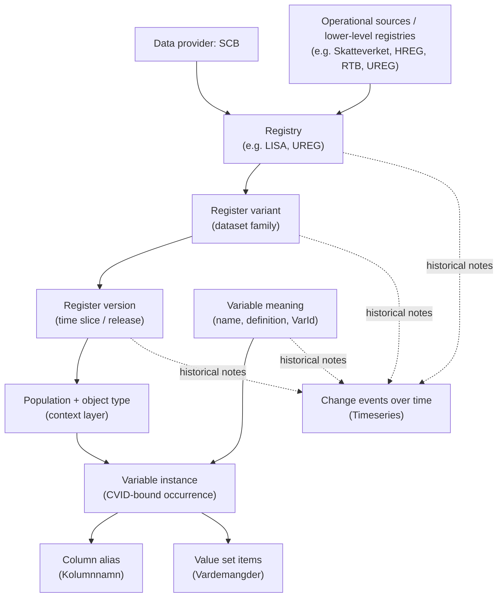

# Design: reg_meta_build

Design rationale and constraints for the build pipeline. For usage, see
`reg-meta-build --help`. For query-layer rationale (the data model end users see), see
[../reg_meta/DESIGN.md](../reg_meta/DESIGN.md).

## Scope

`reg_meta_build` owns the build pipeline that produces the SQLite databases `reg_meta`
queries against. Specifically:

- `reg_meta.db` — main metadata DB (\~320 MB uncompressed). Routine builds select one
  exact revision of the host-local catalog-input repository; explicit raw builds remain
  for source preparation and synthetic tests. The result is validated by
  `reg_meta_build/validate.py` before shipping.
- `reg_meta_docs.db` — FTS5 search index over the curated markdown under
  `reg_meta_build/docs/`, plus rehostable register-version related-document binaries and
  provenance.

Both DBs ship as `.zst`-compressed GitHub Release assets parallel to the `reg_meta` PyPI
package (release-skill orchestrates this).

## Why split from `reg_meta`

The query side (`reg_meta`) needs only the sqlite3 stdlib. The build side pulls
openpyxl, owns large maintainer-edited input data, and runs on a different cadence (most
users never run a build). Separating the two:

- Keeps the `reg_meta` wheel small and dep-light for end users.
- Lets the two release on independent tags (`reg_meta/v*`, `reg_meta_build/v*`).
- Mirrors the build/runtime separation needed for a future Go/Rust port of the query
  layer.

The cross-package dependency graph and the build/runtime boundary that governs it live
in ARCHITECTURE.md.

## Dependency direction

`reg_meta_build → reg_meta` only. The builder imports query helpers (`open_db`,
`default_db_dir`, `DB_FILENAME`, `SCHEMA_VERSION`, `derive_variable_slug`, etc.) but
`reg_meta` never imports `reg_meta_build`. The schema contract — the set of constants
and helpers both packages agree on — lives in `reg_meta`.

## What lives where

  | Module                                                                                           | Package          |
  | ------------------------------------------------------------------------------------------------ | ---------------- |
  | `db.py` (DDL, build_db, materializer, provenance DB)                                             | `reg_meta_build` |
  | `db.py` (open_db, schema constants)                                                              | `reg_meta`       |
  | `ir/` (provider-neutral IR contract)                                                             | `reg_meta_build` |
  | `id.py` (deterministic ID minting)                                                               | `reg_meta_build` |
  | `doc_db.py` (build_doc_db)                                                                       | `reg_meta_build` |
  | `doc_db.py` (open_doc_db, ensure)                                                                | `reg_meta`       |
  | `cli.py` (build / docs-build / slug commands)                                                    | `reg_meta_build` |
  | `cli.py` (query, update, info, docs)                                                             | `reg_meta`       |
  | `fqid_slugs.py`                                                                                  | `reg_meta_build` |
  | `classifications.py`                                                                             | `reg_meta_build` |
  | `validate.py`                                                                                    | `reg_meta_build` |
  | `dbdiff.py` (content diff harness)                                                               | `reg_meta_build` |
  | `extend_db.py` (steward-flavored DB overlay, extend-db)                                          | `reg_meta_build` |
  | `sources/` (per-provider IR adapters: scb, sos)                                                  | `reg_meta_build` |
  | `fqid.py`, `catalog.py`, `queries.py`, `doc_queries.py`, `errors.py`, `update.py`, `download.py` | `reg_meta`       |

## Source reconciliation and correction architecture

> **Status: target architecture, not shipped behavior.** The current implementation is
> traced below because it is the evidence for this decision. It still applies
> corrections in several independent passes and does not yet implement the common
> assertion, reconciliation, decision-status, or candidate-acceptance contracts in this
> section. A documentation build or this design decision is not evidence that the target
> works on the real corpus.

The consumer is the maintainer who receives successive official metadata deliveries and
uses agents to investigate discrepancies before publishing a catalog. The required
outcome is not merely a valid database: it is a reviewable explanation of what every
accepted source asserts, why a correction applies, and which changed evidence prevents
the old decision from being reused.

### Decision and rejected alternatives

The target pipeline is:

```text
capture immutable machine-readable candidate revisions
  → interpret source assertions
  → reconcile assertions and reviewed decisions
  → form catalog entities and states
  → materialize distinct enrichment
  → validate and publish one pinned catalog generation
```

The common boundary is a small, strict assertion-and-decision model immediately before
catalog entity formation. Provider readers remain provider-specific, and typed
operations retain case-specific validation. This is not a framework wrapped around every
existing post-pass. The runtime transition replaces the old correction routes and then
deletes them.

The strongest minimal retrofit would add finite-edition guards, semantic dependency
checks, and one discrepancy report to `scb_errata.py`, `codelivery.py`,
`alias_windows.py`, `period_family_merges.py`, `classification_links.py`,
`relations.py`, and generated delivery enrichment. It would repair important individual
failure modes cheaply. It would still leave authority, identity, evidence selection,
partial-build behavior, and update invalidation implemented repeatedly at incompatible
execution grains. Adding the LISA workbook would add yet another rule about which pass
may override which other pass.

The replacement is therefore preferred. One reconciliation result feeds entity
formation; no old pass may mutate the same fact later. A finite typed operation
vocabulary is preferred to a general JSON Patch, field-path, SQL, or ordered mutation
language. The actual cases need operation-specific invariants—an identity binding proves
one variable, a matrix partition proves complete membership, and a coding selection
proves one winner. A general patch would hide those invariants in patch order and let a
decision target builder storage rather than a domain fact.

### Shipped execution and data flow

This is the current implementation until the target replaces it:

1. `input_snapshot.py::prepare_snapshot` creates the lossless normalized SCB snapshot.
   `prepare_input_bundle` captures a complete catalog bundle, including the accepted
   snapshot, other provider inputs, `curation/`, and `fqid_slugs/`. `open_input_bundle`
   selects an exact clean input-Git commit and manifest. Routine builds use quick
   identity checks, prepared readers, and the value-prestage cache; exhaustive
   verification remains an explicit preparation/acceptance operation.
2. `SCBAdapter.emit` imports and projects provider values, applies `scb_errata.py`,
   lifts sensitivity, applies the exact CIS 2014/2016 partitions, triages source
   identities, and coalesces states through the interval resolver. SOS corrects a few
   exact names and token mappings inside its reader. Thin-provider TOMLs are source
   deliveries rather than corrections.
3. `db.py::materialize` reinserts the combined IR core graph, removes fully covered
   code-less shadows, seeds classifications, populates slugs, merges period families,
   creates source and curated alias windows, resolves residual code-less overlaps,
   materializes concept groups, applies generated delivery enrichment and tags, then
   builds relations, classifications, lineage, code mappings, and search indexes.
4. `build_db` validates the staged database and `publish_db` atomically replaces the
   live catalog. The optional provenance sibling is written afterward and is non-fatal.

`resolution.Claim` is an internal interval carrier—window, authority rank, and approval
date—not a source assertion. `_curation.py` usefully shares parsing, normalization,
error, and FQID-resolution leaves, but the TOML loaders it serves have no common
evidence or decision lifecycle. The source checksum/evidence strings currently recorded
by several routes are provenance or documentary prose; they are not checked semantic
dependencies.

The current homes divide into different concerns that must not all be relabelled
"corrections":

  | Concern                               | Shipped examples                                                                                        | Target treatment                                                                                |
  | ------------------------------------- | ------------------------------------------------------------------------------------------------------- | ----------------------------------------------------------------------------------------------- |
  | Source acquisition and interpretation | snapshots, SCB/SOS/thin-provider readers, edition parsing                                               | Retain; readers emit assertions before corrections.                                             |
  | Reviewed source reconciliation        | SCB errata, curated alias windows, codelivery and code-less overlap pins, selected classification links | Replace with the common decision contract.                                                      |
  | Identity/representation review        | `same_as`, period-family merges, CIS partitions                                                         | Move the evidence-bearing decision into the common contract; retain typed validators.           |
  | Canonical standards                   | classification seeds and canonical code CSVs                                                            | Retain as versioned catalog inputs, separate from source-error correction.                      |
  | Deterministic interpretation policy   | edition grammar, interval sweep, supported cadence and recurring provider rules                         | Retain as named, tested policy with explicit applicability.                                     |
  | Derived/presentation enrichment       | concept groups, tags, auto classification detection, succession lifts, FTS                              | Retain downstream; it cannot repair source facts or establish identity.                         |
  | Stable public naming                  | `fqid_slugs/` and freeze state                                                                          | Retain after entity formation; naming is not evidence.                                          |
  | Consumer-specific routing             | lineage defaults and steward inventory/holdings                                                         | Retain separately; move only assertions of identity or source fact that are hiding inside them. |
  | Document search                       | `build-docs`, `doc_sources.toml`, `related_documents.toml`                                              | Retain as a separate consumer; an indexed document is not automatically catalog evidence.       |

### Target stages and ownership

Each stage has exactly one responsibility:

1. **Capture revisions.** Losslessly preserve candidate machine-readable source bytes
   and identify every logical dataset by publisher, purpose, revision, bundle manifest,
   and artifact hashes. Accepted candidates later advance `.local/catalog-inputs`, the
   separate local Git repository on its sole named branch `main`, with no remote. Builds
   select a commit and manifest, never a branch. Raw compressed archives stay outside
   Git. No measured storage choice changes for this architecture.
2. **Interpret assertions.** A purpose-specific reader validates one source format and
   emits source-coordinate assertions without choosing catalog winners. Format repair,
   edition grammar, and native ID interpretation live here. SCB, SOS, the LISA workbook,
   and curated thin-provider files may use different readers; they meet only at the
   assertion model.
3. **Reconcile.** One run compares all assertions applicable to a subject/fact/scope,
   checks every reviewed decision and its dependencies, and emits a complete report plus
   resolved facts. It discovers new competing evidence as well as rechecking selected
   evidence. It evaluates all independent decisions—including ones an old conditional
   pass or conflict cascade would no longer reach—before returning blockers rather than
   failing on the first resolvable conflict.
4. **Form entities and states.** Provider-specific typed operations may bind identities,
   partition a source subject, or map representations. Only resolved facts reach the
   existing Pydantic IR. A correction is never a later `variable_state` patch.
5. **Materialize and enrich.** `db.py` writes the universal graph, then runs naming,
   canonical-standard, deterministic derivation, presentation, relation, lineage, and
   search passes that do not choose between source claims. A downstream pass cannot
   widen evidence scope or repair availability.
6. **Validate and publish.** Structural validation and required
   reconciliation/provenance validation run on the staged catalog. Publication
   atomically activates one catalog artifact carrying the exact input, code, and
   decision pins. The optional provenance DB remains diagnostic and cannot own a
   mandatory gate because it is written non-fatally after the catalog swap.

The code checkout is the sole authoring home for reviewed decisions and explicit policy.
`prepare_input_bundle` copies those bytes into the candidate bundle and records the
source blob/commit identity. The bundle copy is immutable evidence for a build, not a
second place to edit. Reports show both the authoring path and captured hash. A changed
authoring file requires a newly prepared candidate; an accepted build never falls back
to the checkout and therefore cannot silently build different curation from the file an
agent edited.

### Assertion contract

Use strict frozen Pydantic models beside the existing IR (`extra="forbid"`) for source
revisions, locators, assertions, decisions, and report records. SQLite remains
appropriate as bounded scratch for joins and reconciliation. Do not Pydantic-materialize
the 100-million-row value stream: code sets remain content-addressed in the existing
SQLite/value pipeline, and an assertion refers to a code-set content identity plus its
source locator.

A source assertion contains:

- `source_revision`: logical dataset ID, publisher, declared purpose, upstream revision,
  the selected bundle/manifest identity, artifact hashes, and any publisher-declared
  supersession limited to explicit facts/scopes;
- `record_locator`: a stable native record key plus current physical coordinates. SCB
  uses register/variant/edition/VarId/CVID and field; a workbook uses sheet/table,
  semantic row key, header key, and cell/range. Physical coordinates support inspection
  but are not authority;
- `subject`: the source subject before any canonical binding, with register, source
  variable key or column, and population/variant as separate coordinates;
- `fact_kind`: a closed vocabulary including availability, name, definition, operational
  definition, source identity, data type/length, delivery representation, code set,
  classification assignment, partition membership, and project/steward possession;
- `edition_scope` and `reference_period_scope` separately. A scope is explicitly
  `not_applicable`, `unknown`, a finite set, or a disjoint interval list. A pooled
  `2018–2019` reference period is one pooled scope and is not expanded into annual
  availability. `LA` is parsed as `lasar`/läsår, never calendar year;
- an assertion state: `value`, `unknown`, or `negative`. `negative` is allowed only for
  a fact whose schema defines a negative assertion, such as "not available". A missing
  row emits no assertion. A source-defined blank emits `unknown` only when that format's
  contract gives the blank that meaning; and
- a deterministic assertion ID and semantic projection hash. The projection excludes
  irrelevant layout fields but includes the subject, fact, scope, assertion state, and
  value.

For example, this is the shape a future LISA availability reader could emit. It is
illustrative, not an assertion that the preserved workbook has been accepted or that its
audit was correct:

```json
{
  "assertion_id": "lisa-workbook:availability:ampoltyp:2018-2019",
  "source_revision": {
    "dataset": "scb-lisa-variable-availability",
    "publisher": "SCB",
    "purpose": "LISA variable availability by documented population and edition",
    "upstream_revision": "<publisher revision from the accepted manifest>",
    "artifact_sha256": "<captured SHA-256>"
  },
  "record_locator": {
    "table": "<reader-recognized table>",
    "record_key": ["AmPolTyp", "individer-15plus"],
    "field": "availability",
    "physical_cells": ["<cells recorded by the reader>"]
  },
  "subject": {
    "provider": "scb",
    "register": "lisa",
    "source_variable": "AmPolTyp",
    "variant": "individer-15plus",
    "population": "<workbook population label>"
  },
  "fact_kind": "availability",
  "edition_scope": ["2018", "2019"],
  "reference_period_scope": {"kind": "not_applicable"},
  "assertion": {"status": "value", "value": true}
}
```

If a recognized workbook cell explicitly says the variable is unavailable, the last
member is `{"status":"negative"}`. If it is a source-defined unknown marker, it is
`{"status":"unknown"}`. If the row or year is absent, there is no assertion object at
all. The SCB machine export's lack of a row is likewise absence, not a negative claim.

The reader also preserves disjoint scopes without taking their hull. A variable
documented for `1998..2003` and `2007..2010` produces two intervals; it is not available
in 2004–2006. A multi-year table can assert one pooled reference period without
asserting that the column is delivered in every constituent year.

### Reviewed decision contract

Reviewed artifacts live under one target authoring tree,
`reg_meta_build/curation/source_decisions/`, and are captured under the corresponding
bundle path. JSON is used because the strict Pydantic discriminated unions and nested
evidence records are clearer than increasingly elaborate TOML tables. This is a clean
replacement: there are no compatibility readers, migrations, shims, or dual writes for
displaced formats.

Every decision records:

- a stable `decision_id` and exactly one typed operation;
- a canonical or source subject, population/variant, fact kind, and finite target
  edition/reference-period scope;
- selected assertion IDs and every competing assertion considered;
- checked assumptions and their reviewed semantic projections: same identity/meaning,
  definition and operational definition, relevant type/length, code/code-label facts,
  source representation, target cardinality, and any copied-record or support-set
  assumption;
- the expected number of source targets and outputs;
- a rationale and review provenance (reviewer, date, authoring commit/blob); and
- the compact correction note to project into existing collapsed catalog metadata when
  the result is user-visible. The catalog does not gain a second detailed decision
  schema.

The finite operation vocabulary is tied to current cases:

  | Operation               | Use and operation-specific proof                                                                                                           |
  | ----------------------- | ------------------------------------------------------------------------------------------------------------------------------------------ |
  | `select_fact`           | Select or correct one fact over finite scope; proves all applicable witnesses and the chosen authority.                                    |
  | `correct_omission`      | Supply a missing provider occurrence; proves exact target cardinality and every meaning/coding fact copied from named source records.      |
  | `bind_identity`         | Establish aliases or `same_as`; proves the subjects are the same variable, not merely related.                                             |
  | `partition_subject`     | Split one source subject into members; proves an exact selector and complete, non-overlapping partition.                                   |
  | `map_representation`    | Map period families or alias windows; proves the canonical subject, variant, columns, and exact disjoint periods.                          |
  | `select_coding`         | Resolve co-delivered or code-less/code-bearing choices; proves one coding for every contested interval and records the rejected witnesses. |
  | `assign_classification` | Bind a state/code set to a canonical standard; proves the code-set identity and finite applicability.                                      |

These operations share evidence, scope, update, and status semantics, while their
validators remain ordinary functions. There is no arbitrary operation ordering. A
decision consumes only source assertions and declared policies; another correction's
output cannot masquerade as source evidence.

The existing `DispInkKE` omission shows the required shape. Its current declaration
targets the finite LISA editions 2010, 2011, and 2012. The replacement
`correct_omission` decision would select the scoped SCB-documentation availability
assertion, record the SWECOV holdings only as project-possession corroboration, require
three absent machine targets, and name exact source records for any copied definition,
type, representation, or code-set facts. The reviewed semantic projections of those
records are dependencies. It cannot dynamically call `_nearest_rows`, cannot expand to
2013, and cannot infer meaning or coding from availability.

A reviewable artifact has this concrete shape (placeholder evidence IDs/hashes are
filled from the accepted candidate; this example does not ratify new content):

```json
{
  "decision_id": "scb-lisa-dispinkke-2010-2012",
  "operation": {
    "kind": "correct_omission",
    "target": {
      "subject": {
        "provider": "scb",
        "register": "lisa",
        "source_variable": "DispInkKE"
      },
      "variant": "individer-15plus",
      "edition_scope": ["2010", "2011", "2012"],
      "fact_kind": "availability",
      "assertion": {"status": "value", "value": true}
    },
    "expected_absent_targets": 3
  },
  "selected_evidence": [
    {
      "assertion_id": "<SCB-documentation availability assertion>",
      "reviewed_projection_sha256": "<semantic projection SHA-256>"
    }
  ],
  "considered_evidence": [
    {
      "assertion_id": "<SWECOV possession assertion>",
      "role": "corroborating project possession only"
    }
  ],
  "checked_assumptions": [
    {
      "kind": "copied_facts",
      "source_records": ["<exact reviewed SCB record locator(s)>"],
      "facts": ["identity", "definition", "data_type", "code_set"],
      "reviewed_projection_sha256": "<combined semantic projection SHA-256>"
    },
    {"kind": "target_cardinality", "expected": 3}
  ],
  "rationale": "SCB documentation supports only these missing occurrences.",
  "review": {
    "reviewer": "maintainer",
    "reviewed_on": "<YYYY-MM-DD>",
    "authoring_blob": "<Git blob identity>"
  }
}
```

The CIS declarations are the other end of the typed spectrum. A `partition_subject`
decision retains the exact CIS 2016 selector
`(register_id=257, register_variant_id=553, edition="2014 - 2016", regver_id=11529, var_id=15662, cvid=469456)`,
the quality-declaration revision and page locators, every source column, and the
partner/response coordinates. Operation-specific validation still requires each observed
answer column exactly once, every declared output exactly once, and the selected source
instance exactly once. `CO11` is one answer member, not an alias for the full question.
CIS answers remain distinct variables in one variable group.

### Authority, agreement, and ambiguity

Authority is a relation among source purpose, fact kind, and supported scope. It is
never deduced from `.xlsx` versus `.csv`, filename, acquisition date, or a scalar
"newest source" rank.

  | Source purpose                          | Facts it can establish                                                                      | Limits                                                                                                               |
  | --------------------------------------- | ------------------------------------------------------------------------------------------- | -------------------------------------------------------------------------------------------------------------------- |
  | Provider machine metadata               | Native occurrence, identifiers, representation, type and coding for the records it contains | A missing row is not an explicit negative; known provider defects may be corrected by scoped official documentation. |
  | Official availability schedule/workbook | Availability for its declared register, population/variant, and edition scope               | Does not supply an unchanged definition, code set, type, or identity unless it explicitly documents that fact.       |
  | Official handbook/quality declaration   | Definitions, question/answer meanings, or availability within the document's stated scope   | A historical handbook does not silently cover later editions. PDF extraction/review is upstream of this build.       |
  | Canonical classification source         | Standard identity and canonical codes for its stated vintage                                | Does not prove that an arbitrary variable uses the standard.                                                         |
  | Steward holdings                        | Possession of a column in one steward/project delivery                                      | Never establishes universal provider availability or catalog meaning.                                                |
  | Generated heuristic/worklist            | A candidate for review                                                                      | Has no authority until grounded in source assertions and accepted through a typed decision.                          |

Agreement retains all independent witnesses and records that their semantic projections
agree. An explicit source supersession resolves only the named fact and scope; its
declaration and the superseded witness both remain in provenance. A missing assertion
neither agrees nor conflicts. An explicit negative conflicts with a positive assertion
over the same applicable scope. Competing official claims remain `ambiguous` unless
purpose/scope supplies a documented precedence or a reviewed `select_fact` decision
explains the selection. Unknown historical scope is `missing_evidence`, not an
invitation to freeze the current catalog output and call it accepted.

Aliases require evidence that two representations are the same variable. Related
versions such as `_J16` and `_04` remain distinct variables and may be grouped for
discovery. Succession is directional continuity, not identity. Concept groups and tags
cannot establish either.

### Decision evaluation across updates

For each candidate bundle, reconciliation resolves a decision's evidence selectors
against the candidate assertions and compares the candidate semantic projections with
the reviewed ones. A whole-file checksum identifies which source revision was used; it
does not invalidate every decision after an unrelated byte edit. A stable semantic
record key can survive a supported workbook rename or layout change while the current
physical locator changes and is reported.

The evaluator also searches for newly applicable evidence for the same subject, fact,
and scope. Checking only the old selected records would miss exactly the updates this
architecture exists to catch. Results are:

- `applicable`: selected and competing facts and every checked assumption still hold;
- `upstream_fixed`: a corrected omission is now supplied by the provider;
- `needs_review`: a relevant fact, target count, copied-record projection, support set,
  or applicable witness changed;
- `missing_evidence`: a required witness or historical scope cannot be resolved;
- `ambiguous`: competing applicable assertions have no justified resolution; or
- `excluded_by_scope`: the decision is intentionally irrelevant to this explicit
  diagnostic provider/source selection.

`upstream_fixed`, `needs_review`, `missing_evidence`, and unresolved `ambiguous` are
blocking for an accepted full catalog until the decision is retired or reviewed.
Harmless unknown metadata may remain unknown; an unknown needed to justify an emitted
fact blocks that fact. Corrections never acquire a newly added edition implicitly.

A copied-source decision names exact records and facts. If its reviewed assumption was
"the nearest compatible edition in this support set", a newly inserted nearer edition
changes that support set and produces `needs_review`; it never silently becomes the new
clone. Prefer an exact source record when the evidence justifies one, but still report a
new applicable witness whose meaning or coding bears on the correction.

Enduring interpretation policy is versioned separately from reviewed exceptions.
Supported edition grammar, `LA = lasar`/läsår, cadence, projection vintage, and a
justified recurring coding rule are policies with explicit applicability and tests. A
policy does not contain an undated omission or an `all_versions` correction. The
interval algorithms in `edition_bounds.py` and `resolution.py` remain useful;
`resolution.Claim` should be renamed or kept clearly internal so it is not confused with
`SourceAssertion`.

### LISA workbook integration

The first supplemental authoritative input is the preserved machine-readable LISA
workbook, but preservation is not acceptance. The bundle declares it as a logical
dataset with publisher, purpose, upstream revision, hash, and required/optional status.
A purpose-specific reader (target home `sources/lisa.py`, using the installed
`openpyxl`) validates supported workbook structures and emits availability assertions
with semantic row/header keys plus physical cell provenance.

The reader preserves population and variant applicability, disjoint year ranges, pooled
periods, explicit negatives, source-defined unknown/blanks, and absence as different
states. A renamed file is irrelevant when the manifest still identifies the logical
dataset. A reordered or supported restructured table may change physical locators while
preserving semantic keys; an unknown layout or ambiguous key mapping blocks the input as
unsupported.

The September 14 `AmPolTyp` 2018–2019 disagreement motivates the route but is not an
acceptance oracle. Once the workbook reader emits checked assertions, reconciliation
compares them with mikrometadata and the handbook by fact and scope. Availability
evidence can correct availability only. It cannot authorize carrying forward an old
definition, operational definition, type, or codebook. Investigation of non-missing data
values by year remains a separate empirical pipeline and cannot be inferred from pooled
tables.

PDF acquisition, extraction, OCR, and human review remain upstream. A later PDF pipeline
may produce the same machine-readable assertion contract with document/page provenance;
`build-db` never parses PDFs or treats the document-search index as evidence.
`build-docs` and steward holdings remain separate consumers.

### Operator and agent workflow

This remains a local CLI/report workflow; the use case does not justify a service or UI.

1. Starting from accepted input `main`, prepare every candidate source revision and the
   current code-repository decision files into a new immutable bundle. Candidate work
   may use a detached commit/worktree parented to `main`; `main` and the active catalog
   remain unchanged.
2. Run inspection once. The source readers and reconciliation implementation produce one
   deterministic report containing all independently assessable conflicts and decisions:
   old and new semantic facts, source locators, decision IDs, affected scopes, statuses,
   blockers, and remediation. A source parse failure marks which analysis is incomplete;
   it does not falsely report the rest as clean.
3. The agent edits typed artifacts only in the code checkout's
   `curation/source_decisions/`. Validate their strict JSON contract and
   operation-specific invariants, then prepare a new candidate so the captured bundle
   copy and authoring identity match. Repeat inspection and review until the
   full-catalog report has no blocking decision outcomes.
4. Build and validate a scratch catalog from the exact candidate commit/manifest,
   inspect the same reconciliation report, and compare the database with the accepted
   catalog/latest release. Any content change after this point invalidates the review
   and build evidence.
5. Explicitly fast-forward the local input repository's sole named branch `main` to the
   exact tested candidate commit. No build writes, repairs, hydrates, commits, or
   accepts inputs.
6. Publish only the previously validated artifact carrying those exact
   input/code/decision pins. Activation is the existing atomic catalog replacement;
   correction detail exposed to users is collapsed into the existing metadata/provenance
   fields.

Input acceptance and catalog activation are two deliberate states, not one distributed
transaction. Failure before input acceptance leaves input `main` and the active catalog
unchanged. If input acceptance succeeds but publication fails, `main` may contain the
new approved bundle while the active catalog and its embedded prior input pins remain
unchanged. The operator report says so, and the exact verified artifact may be retried.
Readers never combine current input `main` with an older active DB. Required decision
evidence is embedded in or durably bound by the catalog artifact before activation; the
optional provenance sibling cannot provide it after the fact.

Partial provider builds are diagnostics. A manifest records every selected revision and
every explicit exclusion. Loose inputs cannot mix with a bundle, and a required
supplemental source cannot disappear through a partial selection that is then published
as complete. Different source revision dates can be coherent; completeness and explicit
selection, not matching dates, are the gate.

### Existing surfaces and their destinations

The target is a replacement with deletion gates, not a second layer over these paths:

  | Shipped module/path                                                                                          | Target disposition and reason                                                                                                                                                                   |
  | ------------------------------------------------------------------------------------------------------------ | ----------------------------------------------------------------------------------------------------------------------------------------------------------------------------------------------- |
  | `input_snapshot.py::{prepare_snapshot,prepare_input_bundle,open_input_bundle}` and prepared/cache readers    | Retain lossless capture, complete inventory, exact commit/manifest selection, and fast routine reads. Extend the bundle inventory only for declared supplemental assertions and decision files. |
  | `scb_errata.py`, `curation/scb_errata.toml`, and SCB adapter mutations                                       | Replace with source assertions plus `correct_omission`/`select_fact`; delete dynamic `_nearest_rows`, `_mint_columns`, `all_versions`, and the old loader/apply route at cutover.               |
  | Curated part of `alias_windows.py` and `curation/alias_windows.toml`                                         | Replace with evidence-bound `bind_identity`/`map_representation`. Retain source-derived multi-alias window logic as interpretation until entity formation owns the equivalent projection.       |
  | `period_family_merges.py` and `curation/period_family_merges.toml`                                           | Replace the independent authoring/apply route with `map_representation`; retain its month-family, parallelism, completeness, and interval validators as operation-specific logic.               |
  | `cis2016_matrix.py` and both `cis*-matrix-meaning-evidence.json` files                                       | Re-home as `partition_subject` decisions. Retain exact selector, named/blank source-mode, coordinate, and complete-partition validation.                                                        |
  | `codelivery.py`, `curation/codelivery.toml`, SCB resolution pins, `codeless_overlap.py`, and its TOML        | Replace reviewed exceptions with `select_coding`; keep genuinely recurring SCB interpretation as named policy and keep the provider-blind interval sweep.                                       |
  | `resolution.py` and `edition_bounds.py`                                                                      | Retain interval ownership and edition grammar as interpretation mechanisms; they do not decide evidentiary authority.                                                                           |
  | `delivery_enrichment.py` and `delivery_enrichment.generated.toml`                                            | Replace automatic global description/alias application with source assertions and reviewed grounding. A generated row remains a worklist until accepted.                                        |
  | Source-dependent `[[link]]` entries in `curation/classifications.toml` and `classification_links.py`         | Move assignments to `assign_classification`; retain `classifications.py`, canonical seeds/CSVs, conformance, and deterministic detection.                                                       |
  | Identity-affecting `same_as` entries in `curation/relations.toml`                                            | Move to evidence-bound `bind_identity`. The resolved graph may remain a downstream reader projection. Retain component/cycle guards.                                                            |
  | Non-identity `replaced_by`/`derived_from`, timeseries-derived edges, classification succession/lifts         | Retain as distinct directional relation/derivation concerns; when a declaration depends on source facts, give that declaration checked assertions rather than exempting the whole file by name. |
  | `concept_groups*.toml`, `concept_groups.py`, and `tags.toml`/`tags.py`                                       | Retain as presentation/discovery. Related-but-different variables remain separate and may be grouped. These routes cannot establish availability or identity.                                   |
  | `lineage.toml` and lineage derivation                                                                        | Retain routing and downstream interval projection. Move any hidden source-identity assertion to the decision contract; warnings do not authorize a guessed link.                                |
  | `fqid_slugs/`                                                                                                | Retain stable public naming/freeze behavior, downstream of resolved identities. Slugs are targets, not evidence.                                                                                |
  | Thin-provider and canonical-SCB seeds                                                                        | Retain as machine-readable source deliveries, interpreted into assertions. Their curated origin does not make them correction patches.                                                          |
  | `_curation.py`                                                                                               | Retain useful normalization, strict-error, and resolution leaves; delete loaders made dead by cutover.                                                                                          |
  | `db.py`                                                                                                      | Retain IR materialization, enrichment, validation, and staged publication; delete scattered fact-selection calls once reconciliation is the sole input to entity formation.                     |
  | `doc_db.py`, `doc_sources.toml`, `related_documents.toml`, steward inventories and `extend-db` holdings gate | Retain for their separate consumers. Presence/possession cannot silently become universal catalog evidence.                                                                                     |

`same_as` remains symmetric/transitive identity used by `Catalog.resolve`; it is not
harmless navigation metadata merely because it is projected into a graph. Aliases
likewise require same-variable evidence. `replaced_by` is directional and may connect
related versions without making them identical. CIS answer members stay distinct.
Classification assignment, coding selection, and presentation grouping remain separate
operations even when the current files call all three curation.

### Transition sequence and completion gates

This is a dependency order for later bounded implementation work, not a permanent
tracker or an automatically filed backlog:

1. **Assertions and inspection.** Add the strict source/assertion/report contracts and
   LISA reader, with no publication path. The usable result is an aggregate discrepancy
   report over the exact candidate bundle. Complete when supported inputs,
   blanks/absence, disjoint scopes, and conflicts are inspectable; unsupported input
   blocks without changing accepted state.
2. **Decision cutover.** Add typed decisions and make resolved facts the sole input to
   affected entity/state formation. The mandatory reconciliation/evidence gate blocks
   normal catalog publication from the first cutover. Complete only when every old entry
   is represented, explicitly retired, or blocking, and the displaced TOML/JSON loaders,
   adapter mutations, and post-slug correction calls are deleted. An incomplete earlier
   slice remains diagnostic-only.
3. **Candidate promotion.** Finish exact-candidate build/diff/accept/retry reporting and
   bind mandatory decision provenance into the catalog generation. Complete when a
   tested detached candidate alone can fast-forward input `main`, publication failure
   preserves the active generation, and no build can mix checkout authoring with
   captured decisions. Remove this transition subsection when the target is shipped;
   durable rationale stays above.

### Required update scenarios and proof boundaries

These are target behaviors and future evidence, not tests or real-data results produced
by this documentation change:

  | Scenario                                   | Recorded and applied/blocking result                                                                                                                                                                                                                  | Operator report                                                                   | Proof boundary                                                                   |
  | ------------------------------------------ | ----------------------------------------------------------------------------------------------------------------------------------------------------------------------------------------------------------------------------------------------------- | --------------------------------------------------------------------------------- | -------------------------------------------------------------------------------- |
  | Unchanged sources                          | Same revisions/assertion projections and decision dependencies; decisions are `applicable`; catalog content is deterministic.                                                                                                                         | Unchanged dispositions and pins.                                                  | Contract replay plus build/dbdiff.                                               |
  | Unrelated source edit                      | New revision/hash and unrelated changed assertions; relevant projections are unchanged, so decisions still apply.                                                                                                                                     | Revision change separated from unaffected decisions.                              | Synthetic source-update regression.                                              |
  | Same-year definition or codes change       | Old/new meaning or code-set projections on the bound subject; dependent decisions become `needs_review` and block.                                                                                                                                    | Exact changed facts, locators, decisions, and scope.                              | Decision regression plus materialization/publication gate.                       |
  | New nearer cloning edition                 | New witness changes the reviewed support set/nearest-compatible assumption; no dynamic reselection; `needs_review` blocks.                                                                                                                            | Old exact copy source, new candidate, and affected copied facts.                  | Synthetic insertion regression.                                                  |
  | SCB fixes an omission                      | Provider assertion now occupies a corrected target; status `upstream_fixed` blocks until the finite correction is retired or re-resolved.                                                                                                             | Old correction and new provider record side by side.                              | Errata-replacement update regression.                                            |
  | Newly added year                           | New claims get their own scope; old corrections do not expand. Non-conflicting decisions stay applicable, while a new unresolved required fact blocks full publication.                                                                               | New edition and whether it is resolved independently.                             | Edition, decision, and build regressions.                                        |
  | Ambiguous identity or alias                | Competing subjects/target count are retained; no guessed binding is applied; `ambiguous` blocks dependent output.                                                                                                                                     | Candidates and missing same-variable evidence.                                    | Identity/alias and matrix partition tests.                                       |
  | Renamed or restructured supported workbook | Logical revision and new physical locators are recorded; stable unique semantic keys preserve assertions. Unsupported/ambiguous structure blocks as an input error.                                                                                   | Locator-only change or exact schema/key failure.                                  | Supplemental-reader fixtures plus bundle validation.                             |
  | Contradictory official availability        | Both scoped claims remain. Explicit purpose/supersession or reviewed selection resolves them; otherwise `ambiguous` blocks.                                                                                                                           | Both witnesses, overlap, authority rationale, and old/new outcome.                | Reconciliation authority regressions.                                            |
  | Missing evidence                           | Missing witness/no assertion or `unknown` historical scope is recorded; a dependent correction is `missing_evidence` and blocks.                                                                                                                      | Missing selector and affected fact/scope; frozen output is not accepted evidence. | Contract/dependency regressions.                                                 |
  | Partial or mixed source selection          | Manifest records every revision/exclusion; loose/bundle mixing or omitted required evidence is rejected. Explicit differing revision dates may be coherent; diagnostic partial builds are not publishable as complete.                                | Selected/excluded datasets and completeness state.                                | Input-selection and publication integration tests.                               |
  | Failed build or publication                | Failure before acceptance leaves input `main` and active catalog unchanged. Failure after input acceptance leaves active catalog and embedded old pins unchanged, reports accepted-input/catalog divergence, and permits retry of the exact artifact. | Candidate pins, failure phase, preserved generation, and retry identity.          | Staged-publication failures extended across input acceptance/catalog activation. |

Synthetic update exercises prove decision behavior for controlled changes; they do not
prove that the current corpus is identical or that a real provider evolves that way. At
the runtime cutover, an exact-candidate real-seed build with structural validation and
dbdiff against the accepted catalog/latest release proves current-corpus identity or
explains intended deltas; it does not prove update behavior. Actual
successive-provider-update evidence requires at least two independently retained real
deliveries run through the completed workflow. Later behavior changes therefore need
focused update regressions, structural gates, and the operator's exact-candidate
real-seed build. This documentation candidate claims none of those results.

Later tests should extend the existing input, SCB adapter/errata, alias-window,
period-family, codelivery, build/publication, validation, and dbdiff test homes. Add
focused reconciliation and LISA-reader tests only when those runtime boundaries exist;
this decision does not create empty scaffolding.

## Shipped generation provenance (auto vs curated)

Generation provenance remains relevant to downstream candidates, presentation, and
naming, but it is not an evidence lifecycle. The shipped implementation has three useful
patterns:

1. **Curation-only worklist.** A low-precision generator emits an ephemeral candidate
   list; only a reviewed artifact is consumed. `same-as-candidates` currently feeds
   `relations.toml`, but identity acceptance moves to evidence-bound `bind_identity` at
   the decision cutover. Generated succession or other retained relation candidates
   remain worklists.
2. **Committed auto catalog plus opt-in.** A deterministic high-volume,
   presentation-only candidate catalog is tracked and refreshed deliberately; a curated
   reference opts in. `concept_groups.auto.toml` plus `[[accept]]` remains the example.
   A build never treats every generated candidate as accepted.
3. **Regenerate each build until seal.** High-volume deterministic naming is generated
   while a provider is `churning`, then committed and pinned in `curating`/ `frozen`.
   The `fqid_slugs/*.auto.toml` and snapshot/freeze gates retain this behavior.

No generation mode can accept a source correction, fact conflict, or identity decision
automatically. Those require applicable source assertions and the typed reviewed
decision contract above. This distinction replaces the earlier claim that a wrong
`same_as` edge is merely cosmetic: `Catalog.resolve` follows it transitively, so it is
an identity result even if one present consumer uses it only for discovery.

## CLI shape

Top-level commands (no `maintain` subgroup; that group is dissolved):

```text
reg-meta-build build-db [--no-validate] [--skip-slugs] ...
reg-meta-build extend-db --base-db DB [--providers-dir DIR] [--steward S] ...
reg-meta-build build-docs ...
reg-meta-build seed-slugs [--out-dir DIR] [--propose-panel] ...
reg-meta-build precheck-slugs ...
reg-meta-build parse-sos ...
reg-meta-build same-as-candidates [--max-signal-fanout N] ...
reg-meta-build entity-key-pins [-o TOML] [--slug-dir DIR] [--flavored]
reg-meta-build concept-group-candidates [-o TOML] ...
reg-meta-build classification-residue [-o TOML]
reg-meta-build doc-coverage [-o TOML]
```

The matching `reg-meta maintain *` forms are removed. `reg-meta maintain update` /
`info` are promoted to top-level `reg-meta update` / `reg-meta info` (query-side
concerns — fetching/inspecting prebuilt DBs).

## Content diff harness (`dbdiff`)

`dbdiff.py` compares two `reg_meta.db` files by **content**, not bytes. It is the
acceptance gate for the IR/adapter refactor (and any future "the rebuild should be
identical" change): rebuild the DB, then diff the new file against a preserved baseline.
Raw byte comparison is useless here — two SQLite files with identical rows differ
byte-wise (page layout, freelist, vacuum generation, FTS index segment order), so the
check has to be order-independent and storage-aware.

- **Schema compare**: same tables, and per table the same columns (name/type/order/NOT
  NULL/default/PK) and indexes (named + auto).
- **Content compare**: per user table, row count plus an order-independent *multiset*
  fingerprint — each row canonicalized to a type-tagged, length-prefixed byte string
  (NULL-aware, BLOB-as-bytes), hashed with BLAKE2b-128, the per-row hashes **summed**
  mod 2¹²⁸. Summation (not XOR) so duplicate/missing rows can't cancel. The pass is O(n)
  streaming / O(1) memory, so the 5.7M-row `value_set_member` table costs seconds, not a
  320 MB load.
- **Ignore set** — deliberately minimal. Only `import_manifest.import_date` (wall-clock)
  is dropped by default; `schema_version`, `source_checksums`, `row_counts`, and every
  content/ID column are compared. `input_dir` (a path) is *not* ignored — it is stable
  for a same-machine rebuild; a cross-machine diff can add it explicitly.
- **FTS5**: the `*_fts` virtual tables are external-content (a projection of base
  tables, which *are* compared) and their shadow tables hold an insert-order-dependent
  serialized index. Both are schema-compared but content-excluded, so an emit-order
  change that leaves content identical does not false-positive.
- **Mismatch output**: names the table + count delta and dumps the first N differing
  rows per direction, found via an ATTACH-based multiset-difference query
  (`SUM(+1/-1) GROUP BY all-columns`) that offloads its working set to SQLite's temp
  store.

Standalone and read-only (`mode=ro` URIs); does not import the build pipeline.
Importable as `reg_meta_build.dbdiff.diff_db_content(...)` and runnable as
`python -m reg_meta_build.dbdiff <db_a> <db_b>` (exit 0 identical / 1 differs / 2
error). The full rationale lives in the module docstring.

## Source delivery shapes

Each provider ships metadata in its own native structure; the adapters (next section)
normalize these into the provider-neutral IR. This section documents the **source**
shapes an adapter reads — not the shipped catalog. For the universal two-level
`variable` / `variable_state` model the catalog collapses these into, see
[../reg_meta/DESIGN.md](../reg_meta/DESIGN.md) § "Two-level variable model".

### SCB

SCB delivers pipe-delimited cp1252 CSVs plus a SQL DDL and an Excel join-key sheet. One
backbone row is roughly a *variable occurrence* inside a registry / variant / version /
context, identified by `CVID` — not a stable column key (see *Build-time triage*). The
build coalesces the CVID grain into `variable` + `variable_state`; `CVID` does not
survive to the shipped DB.

  | File                            | Role                                   | Practical reading                                                                                                                                          |
  | ------------------------------- | -------------------------------------- | ---------------------------------------------------------------------------------------------------------------------------------------------------------- |
  | `Registerinformation.csv`       | Backbone metadata fact table           | The main source of truth: one row ≈ a variable occurrence inside a registry/variant/version/context. Carries most IDs and drives normalization (~1M rows). |
  | `UnikaRegisterOchVariabler.csv` | Deduplicated registry/variable summary | Lifecycle and flags (`VersionForsta`, `VersionSista`, sensitive/identity markers). Enriches, never overrides `Registerinformation.csv`.                    |
  | `Identifierare.csv`             | Identifier semantics                   | A small dictionary of identifier-like variables keyed by `VarID` (not globally unique to one registry); also feeds the panel-key bootstrap.                |
  | `Timeseries.csv`                | Change log                             | Breaks, redefinitions, and other events over time. Annotates the model, does not define it; the source for `*_replaced_by` edges.                          |
  | `Vardemangder.csv`              | Value-set members                      | Code/label rows keyed by `CVID` — where categorical values live (~102M rows).                                                                              |
  | `VardemangderValidDates.csv`    | Value-item validity windows            | Applied at build time for the value-set year projection (see *Year projection*); not stored.                                                               |
  | `Tabelldefinitioner.sql`        | SQL Server table shells                | Authoritative SQL types/constraints per export column; used for type validation and the panel-key bootstrap.                                               |
  | `ID-kolumner.xlsx`              | Join-key documentation                 | Which columns are ID/join columns between export files and what they reference (12 rows).                                                                  |

The CVID-grained source hierarchy the SCB adapter reads — a registry splits into
variants, each into time-sliced versions, each into a population/object-type context,
under which a variable occurs once per `CVID` with its column alias and value set;
change events annotate every level:



**A registry is not a table.** One SCB registry exposes several table-like units
(`Registervariant`), each recurring across years, months, or event streams, and the same
variable meaning recurs across many versions and contexts. The shipped model captures
this as the variant *coordinate* on `variable_state`, not as an identity level — see
[../reg_meta/DESIGN.md](../reg_meta/DESIGN.md) § "Why two levels, not three".

**LISA as a worked example.** `LISA` (RegisterId 34) is a high-level longitudinal
integrated registry, not a single flat table: it combines population, education,
employment, income, unemployment, and sickness/parental-insurance information so
transitions over time can be studied, and is itself built from lower-level registries
and administrative sources (e.g. UREG and RTB; UREG in turn draws on HREG). It exposes
several table-like variants, including `Individer, 16 år och äldre`, `Företag`,
`Arbetsställen`, and `Individer födelseland`.

### SOS

Socialstyrelsen delivers one `.xlsx` workbook per register, parsed by `SOSAdapter`
(`sources/sos.py`) into `SosRegister` trees (see *IR + adapter architecture* for the
merge/split and `_default`-variant rules). A full structural catalog of the SOS delivery
— sheet layout, kodlista shape, the deldatamängd ↔ variant mapping, and the
classification/value path — is still to be written. The classification/value path itself
shipped with #210 (PRs #273/#274); the deldatamängd token → variant mapping
(`DELDATAMANGD_TOKEN_MAP`: LOVA `A_LOVA*`, LVM `lvm_*`, DORS `DORS-COV`, LMED's combined
token) shipped with #211 (also retained as the bridge for styrtabell exclusion — see
below); the remaining vehicle for the catalog write-up is #212 (materializer-owned value
tables).

### Curated thin providers (FOHM, Försäkringskassan, …)

Some providers ship no machine-readable microdata-metadata export at all — a public
agency whose register/variable documentation exists only as prose on a website or in
PDFs. These onboard as **thin curated providers** (#422): a maintainer transcribes the
agency's PUBLIC register/variable documentation into a hand-authored TOML, and that TOML
**is** the source delivery — the authoritative, citable artifact, committed under
`input_data/<Agency>/<provider>.toml` (unlike the untracked SCB/SOS seed). They ship in
the GLOBAL build (everyone gets them), distinct from the steward-flavor `extend-db`
track (#365): a thin provider is a global-catalog addition, not a steward overlay.

One shared `CuratedAdapter` (`sources/curated.py`) reads any such TOML rather than a
near-identical adapter per agency. Adding a thin provider is four steps:

1. append a `provider` seed row (`db._PROVIDER_SEED`; never renumber);
2. register the agency's input dir (`db._CURATED_PROVIDERS`: `(slug, subdir)`);
3. author `input_data/<Agency>/<provider>.toml` (registers → optional variants →
   variables; register/variant/variable validity windows materialize as
   `variable_state.valid_from` and `valid_to`; a register with no `[[register.variant]]`
   gets a synthesized `_default` variant, the single-table case — like SOS LSS/BU);
4. curate register/variant slugs in `fqid_slugs/<provider>.toml` (minted-id keys, same
   as `sos.toml`); variable slugs stay AUTO (derived from each variable's clean delivery
   column).

Ids are `mint("<provider>", …)`-ed into the high band `[2^62, 2^63)` (the provider name
is the first `mint` part, so a thin provider never collides with SOS or another minted
provider — see *Deterministic ID minting*). The adapter is **pure IR** (no
build-scratch, like SOS) and emits **no value-set code lists**: minting categorical
codes is a follow-up (#422). A variable may still **link** to an existing catalog
classification via a per-variable `classification = "<short_name>"` field (#446): it
names a shipped classification (SmiNet `diagnos` → `ICD-10-SE`, NVR `vaccin` → `ATC`),
reusing it rather than re-minting codes. The adapter contributes one
`classification_candidate` per such variable with `value_set_id = NULL` (no codes),
feeding the same provider-blind candidate path SOS uses (`external_classification`
resolver); the `_backfill_state_classifications` pass then tags the variable's states,
keying on `(variable_id, NULL)`. The `classification` short_name is validated at TOML
load against the seed manifest (`curation/classifications.toml`): an **undeclared**
short_name fails the build fast (a typo guard — `"ICD-10"` for `"ICD-10-SE"`). Every
**declared** classification is seeded on every build (shared standards with git-tracked
code CSVs; see below), so a declared reference always resolves to a present
classification. FOHM (SmiNet + the national vaccination register) is the first thin
provider; Försäkringskassan is the second, modeled in two tiers (28 registers): 12
publicly-documented registers grounded in FK's published variabelförteckningar (each
with one variant per documented delivery table — fall/delfall,
mottagare/barn/beviljanden/avslag, the tandvård delivery tables — e.g. sjukpenning,
sjuk- och aktivitetsersättning, föräldrapenning, tandvardsstodet) plus 16 thin
SWECOV-core benefits with no public variable doc (barnbidrag, bostadsbidrag, … — a
single `_default` variant carrying the payment/period core). FK's diagnosis-CODE fields
are linked to the catalog `ICD-10-SE` classification (the SmiNet precedent): FK codes
diagnoses per the version current in the data year, so ICD-10-SE tags the modern bulk
while the pre-1997 ICD-9 tail is a known caveat. **Läkemedelsverket** (#443) is the
third thin provider — the suspected-adverse-drug-reaction register (`biverkningar`, two
variants `handlagda`/`arbetsflode` for the assessed vs in-workflow reports). Reaction
fields are MedDRA-coded (`Pt`/`Hlt`/`Hlgt`/`Soc`); MedDRA is not a declared catalog
classification (licensed), so they stay unlinked, while the vaccine `atc4pos` field is
linked to `ATC`. **Pliktverket** (#443) is the fourth — the enlistment/conscription
assessment data (1997–2010), three registers `insark` (mönstringsresultat: physical,
medical, psychological measures), `insiprov` (the inskrivningsprov/G-factor) and
`diagnos`; the diagnosis `sjnr` (sjukdomsnummer) links to `ICD-10-SE`. Its documented
"Mer info" code lists are embedded in each variable definition (value sets are a
follow-up — no codes minted). Pliktverket is a **closed** register (1997–2010,
conscription deactivated 2010): it sets a register-level `valid_to` — a primitive the
curated adapter materializes onto every variable state (a per-variable `valid_to` still
overrides it), so the catalog reports the data as ending 2010 rather than open-ended.
**Riksarkivet** (#443) is the fifth — the historical conscription/mönstring
`inskrivning` register held at Krigsarkivet that predates Pliktverket's digital era (one
register, 104 fields from Krigsarkivet's own codebook). It mirrors Pliktverket but
older: data types are undocumented in the source → all `text`; the six historical
`sjn1`–`sjn6` sjukdomsnummer predate ICD-10-SE so they stay **unlinked**; the coverage
window (`valid_from=1969`/`valid_to=1996`) is sourced from the variable content (the
standardized inskrivningsprov regime) and the Pliktverket 1997 takeover, flagged in the
TOML for maintainer confirmation. (Note Skatteverket's COVID-support delivery and
Tillväxtverket's korttidsarbete both went to the **swecov flavor**, not here — bespoke
steward extracts, not standing registers.) **Umeå universitet** (`umu`, #443) is the
sixth — the högskoleprovet (SweSAT) provresultat database (one register
`hogskoleprovet`, 21 fields sourced from UMU's public SweSAT variable documentation):
the subtest scores (verbal ORD/LÄS/MEK/ELF, quantitative XYZ/KVA/NOG/DTK), section and
total normed results, and provtillfälle/lärosäte. Coverage runs from the 1977 test start
(open-ended); a few variables carry a documented later introduction via per-variable
`valid_from` (KVA + the verbal/quantitative section scores from 2011, ELF from 1992) and
the discontinued `AO` subtest a per-variable `valid_to` of 1995.

The minted-id band invariant generalizes accordingly: the GLOBAL build's band check
(`validate.py`) enforces the high band for every **seeded** non-SCB provider (derived
from `_PROVIDER_SEED`, so a new curated provider is covered the moment it is seeded),
and the flavored (`extend-db`) check additionally covers dynamically minted steward
providers (see *Provenance / validation*).

### Curated canonical-SCB content (#444)

Some SCB registers SWECOV holds are **absent from SCB's machine export** — e.g.
*Utrikeshandel med tjänster* (the services sibling of the goods register reg_meta
already has), the AGI employer-declaration header. They are **canonical SCB content**
(not steward-flavor), so the catalog must attribute them to the `scb` provider, not a
separate provider and not the flavor. `CanonicalScbAdapter` (a `CuratedAdapter`
subclass) does this from a committed `input_data/scb_canonical/scb_canonical.toml`:

- **Low-band ids.** Curated ids normally mint into the high band `[2^62, 2^63)`, but an
  `scb`-provider id MUST be `< 2^62` (the band check forbids a high-band scb id).
  `mint_canonical_scb` (`id.py`) puts register/variant/variable/state ids in the
  reserved sub-band `[2^61, 2^62)`: still low-band (passes the check) yet far above
  every real source-derived SCB id (all `< 2^61`) and disjoint from the minted band.
- **Real value sets.** Unlike thin providers (which defer code lists), a categorical
  column carries `value_set = "<name>"` and the adapter interns `<name>.csv`
  (`code,label`) into `value_code`/`value_set`/`value_set_member` content-addressed (the
  same INSERT-OR-IGNORE pattern SCB/SOS use), then links the state's `value_set_id` — so
  the codes are searchable and join into `code_variable_map`. It needs a DB connection
  and runs **after** the SCB adapter (the `value_code` AUTOINCREMENT high-water mark).
  UHT ships `scbkoder.csv` (BPM6 service types) + `landkoder.csv` (countries). Value
  sets are optional: a register of pure amounts/ids carries none — the AGI
  employer-declaration header (`agi-huvud`) is value-set-free (monetary totals + their
  underlag).

Because it is a second `scb`-provider adapter, the materializer drains SCB-machine stats
(`coalesce_stats`/`projection_stats`) by attribute presence (`projection_stats`,
SCB-only) rather than `provider == "scb"`.

### Columns the export documents nowhere — shipped transition path

The shipped `curation/scb_errata.toml` has `[[version]]`, `[[delivered]]`, and
`[[column]]` entries. The first two inject missing SCB occurrences; `[[column]]` mints a
variable when no source occurrence exists anywhere on the variant. They run in the SCB
adapter before coalescing and use the ordinary slug, alias, state, classification, and
validation paths. Exact-target and now-present guards are valuable shipped behavior.

The path is nevertheless superseded by the reconciliation decision above. Its
`_nearest_rows` source choice is dynamic, copied definitions/types/codes are not checked
semantic dependencies, and `all_versions` silently acquires new editions. Documentary
`evidence` strings do not resolve competing claims, and a steward holding cannot by
itself establish global availability. The runtime cutover replaces all three entry kinds
with source assertions plus finite `correct_omission`/`select_fact` decisions and
deletes `scb_errata.py` and its TOML.

Until that cutover, a reviewed, edition-specific SCB document may supply the missing
column name or occurrence only over its stated scope. The original source instance keeps
its own definition, type, and coding before coalescing. The current low-band ID,
provider-key, and `variable_state.provenance` behavior remains shipped implementation
detail, not a target decision contract. A generated holdings worklist is a candidate for
review, not authority.

## IR + adapter architecture

The build is structured around a provider-neutral **intermediate representation** (IR)
and per-provider **adapters** that emit it, fed to one **provider-blind materializer**.
Three layers:

```text
   per-provider adapter (sources/<provider>.py)
       ↓ emits a stream of IR objects (reg_meta_build.ir.*)
   universal materializer (db.py::materialize)
       ↓ writes
   universal SQLite catalog (English columns, provider-agnostic)
       + sibling provenance DB (maintainer-only debug data)
```

The point of the split: adding a provider is *write an adapter + a slug TOML*, nothing
else. The materializer never branches on `provider`, the universal schema carries no
provider-specific tables or columns, and `reg_meta`'s read side is untouched. The IR is
the contract.

**IR** (`reg_meta_build/ir/__init__.py`). Pydantic v2 models. The build-time IR never
reaches the webapp or the future MONA runner (those use `reg_meta`'s read surface or the
`reg_schema`-validated `project_data.json`); Pydantic earns its place here because
model-level validators catch *builder* bugs at construction (a state validity range that
crosses zero, a variable referencing a non-existent variant) rather than surfacing them
as corrupt catalog rows. `_IRBase` sets `extra="forbid"`: Pydantic's default silently
drops unknown keys, so a misspelled `is_sensitive=True` would vanish and the field would
quietly stay `False` — adapters speak a strict contract, unknown keys must raise.
Build-time only: never imported by `reg_meta` runtime or the webapp. Treat
`ir/__init__.py` as the source of truth for field shapes; a few that bite:

- `IRVariable` is **register-scoped** (the "define once" addressable variable); the
  variant coordinate lives down on `IRVariableState.register_variant_id`. `provider_key`
  (SCB `str(var_id)`, SOS the merged name) is a **required, non-unique** join hint — a
  triage split (below) shares one key across siblings — so `(register_id, slug)` is the
  unique natural key, not `provider_key`.
- `IRVariableState.delivery_column_name` carries only the state's *latest-era* column;
  the **full** historical column set rides on separate `IRVariableAlias` rows. That
  split is the carrier behind the structural `variable_alias ⊇ state delivery columns`
  invariant (validate.py).
- `IRVariableState.data_type` is nullable to mirror the nullable
  `variable_state.data_type` column — SCB never writes NULL, but a provider that does
  must be *representable*, not raise at emit. It is also **low-trust** (SCB's
  per-delivery `Datatyp`) and **non-splitting** for a value-set-bearing state — see the
  *State-identity rule (#526)* under *Build-time triage (SCB)*; the displayed value is
  the latest era's.
- **No adapter emits a value-set object**: `value_set` / `value_code` /
  `value_set_member` are adapter-written (see *Materializer* below), so a state's
  `value_set_id` points at rows the adapter already wrote. `IRValueCode` survives only
  as the SOS adapter's in-memory carrier for a state's pending code list, with
  placeholder ids that `_ensure_value_set` assigns at write-back.

**Adapter** (`sources/<provider>.py`, implementing the `IRAdapter` protocol in
`sources/__init__.py`). Reads the provider's native format and emits IR. Provider quirks
are normalized *here*, never leaked downstream:

- `SCBAdapter` (`sources/scb.py`) — pipe-delimited cp1252 CSV exports. Runs build-time
  triage for same-year collisions (fold vs split; see *Build-time triage* below), the
  value-set year-projection, and the state coalescer.
- `SOSAdapter` (`sources/sos.py`) — Socialstyrelsen `.xlsx` workbooks (one per
  register), parsed via `sources/sos.py`'s `SosRegister` trees. Isolates that format's
  quirks (sheet-name variance, "metadatat"-typo headings, phantom row counts,
  non-standard kodlistor). **Merges same-named variables across deldatamängder into one
  variable by default** (the structured kodlistor are register-level and shared),
  splitting only on a genuine meaning conflict — incompatible normalized `data_type` or
  disjoint code-list shapes for one name (BU `FOD_DATUMN` date-vs-int, PAR `ATC`
  text-vs-int, both in `KNOWN_SPLIT_ALLOWLIST`). Intentional type-lossless merges in
  `KNOWN_MERGE_ALLOWLIST` merge silently (no warn; `data_type` survives per
  `variable_state`). Any *other* same-name conflict warn-merges (fail-soft,
  `sos_unanticipated_same_name_conflict`). Upstream typos where two DISTINCT variables
  ship under one name (disambiguated only by etikett) are corrected before grouping via
  `VARIABLE_NAME_CORRECTIONS` — an exact `(register_abbrev, name, etikett)` key rewrites
  the mistyped name (and because for SOS the delivery column equals the variable name,
  the corrected name also flows to the alias/state `delivery_column_name`), de-merging
  it into its own variable. Synthesizes a `_default` variant for variant-less registers
  (LSS/BU/SOL). Variable rows whose deldatamängd token is a technical extraction/view
  name with no Deldatamängder-sheet row resolve through the curated
  `DELDATAMANGD_TOKEN_MAP` (exact tokens only; a token can name several variants —
  LMED's `FDDD`); an uncurated token warn-drops (`sos_deldatamangd_unresolved`).
  **Styrtabeller** (value-set decode tables, e.g. LOVA's 10 `A_LOVA_STYR_*`
  deldatamängder) are detected by a two-signal check —
  `Aggregeringsnivå == "Ej relevant"` on the Deldatamängder sheet AND a
  `Deldatamängdsetikett` prefix of "Styrtabell" — and excluded from variant and variable
  minting so decode-only columns (KLARTEXT/KLARTEXT_GRP/BESKRIVNING/…) don't surface as
  research variables. `DELDATAMANGD_TOKEN_MAP` is kept intact because the exclusion
  reuses it to resolve which deldatamängd a Variabelnivå row belongs to before deciding
  whether to drop it. A `sos_styrtabell_signal_mismatch` IRWarning fires when the two
  signals disagree. When a variable has **no `Kodlista_*` sheet**, its inline
  `Värdemängd` cell is promoted to a value set by `_classify_value_set_text` (#401,
  closing the #373 deferral). The classifier is conservative: only two forms are
  accepted — `kod=klartext` pairs (every segment has `=`) and bare code lists (no
  segment has `=`; e.g. LOVA's `1;2;3;4;5;9`), both split on `;` and newline. Cells with
  a single segment, mixed `=`/no-`=`, invalid code tokens (ranges, whitespace, comma,
  colon), or duplicate codes are rejected, leaving the variable code-less — exactly the
  prior behavior — so a wrong reject is a no-op. This applies to **all** kodlista-less
  variables, not only styrtabell-decoded ones (styrtabell is the motivating example).
  `Värdemängd` carries no `Tidsperiod`, so `value_set_version_label` is always `None`.
  All reconciliation below is **Värdemängd-only** (`kodlista is None`); the kodlista
  (windowed) and entity-registry paths keep the original pre-#401 behavior — always
  widen `valid_to`, keep `prior` — and are never subject to overlap-suppression. For the
  Värdemängd path, two merged members can collide on one `state_id` (same variant + same
  `valid_from`). `_collect` reconciles with **prefer-coded** (a codeless member never
  drops a sibling's value set, regardless of delivery order); when two members classify
  to **divergent** value sets, the first in delivery order wins and a
  `sos_value_set_text_conflict` IRWarning is emitted. `_collect` reconciles only
  same-`state_id` collisions. Two Värdemängd members with **different** `valid_from`
  mint different state_ids and are not compared by `_collect` — yet they can still
  produce overlapping windows on the same `(variable, variant, column)` with distinct
  value sets, violating the build invariant. Unlike the kodlista paths (which
  era-segment on `Tidsperiod`), Värdemängd has no segmentation anchor, so `_emit_states`
  runs an **overlap-suppression post-pass**: after the member loop it groups buffered
  states by `(register_variant_id, delivery_column_name)`, finds every pair with
  overlapping windows and distinct non-null value sets, and nulls every conflicting
  state's `value_set_id` back to code-less (the exact pre-#401 behavior — no
  regression), emitting one `sos_value_set_text_overlap` IRWarning per affected column.
  Disjoint-window multi-era variables (legitimate era changes) stay bound. The
  Värdemängd value-set **write is deferred** (#464): the member loop only records each
  state's pending `(member_hash, codes)` identity; `_ensure_value_set` is called once
  per *surviving* state **after** `_collect` + the overlap post-pass settle, so a set
  that reconciliation drops (a divergent collision, or a nulled overlap) is never
  written and leaves no orphaned `value_set` / `value_code` rows for value search to
  surface. Content-share is unchanged — the deferred write hashes the same pairs, so two
  surviving states with identical content still collapse onto one `value_set_id`. The
  kodlista + entity-registry paths write eagerly as before (they segment/collapse, so
  they can never orphan). **Kodlista-wins** (`has_kodlista_sheet`): a variable whose
  `Kodlista_*` sheet exists but was skipped as unparseable (`raw_rows`) arrives at
  `_emit_states` with `kodlista is None` but `has_kodlista_sheet=True`; the Värdemängd
  fallback does not fire, leaving the variable code-less — fabricating inline codes when
  a real code list exists is never acceptable.

`emit()` yields IR in FK-topological order (register → classification → variant →
variable → state/alias → edges → warning/provenance sinks) so the materializer can
insert in stream order with FK targets always present. The order constrains only the
types an adapter actually emits — an adapter MAY emit a subset (`SCBAdapter` leaves
classifications and lineage materializer-derived). Every `*_id` is an explicit int the
adapter bakes in; emit order is independent of ID assignment.

Thin curated providers (FOHM today, Försäkringskassan/Skatteverket/IAF to follow) share
the one `CuratedAdapter` instead of a per-agency module — see *Curated thin providers*
above.

## Materializer

`db.py::materialize` consumes each adapter's IR stream, runs the shared provider-blind
derivation passes once over the combined graph, and writes the universal catalog. It is
the **sole writer** of the shipped provider-shaped core graph — `register`,
`register_variant`, `variable`, `variable_state`, `variable_alias`.
`_reinsert_core_graph_from_ir` DELETEs the rows each adapter wrote to scratch during
`emit()` and re-INSERTs them from the collected IR with explicit PKs, so there is
exactly one final writer per table and no parallel old/new path. (The adapter writes
those rows during emit purely to *derive* SCB's exact legacy IDs — strategy reuse, not a
second source of truth — and the IR mirror reads the IDs back; the re-insert makes
byte-identity with the pre-refactor baseline hold.) Slugs insert NULL; `populate_slugs`
/ `populate_variable_slugs` UPDATE them in place afterwards.

**Provider-blindness is complete for the core graph but not the value tables.**
`value_set` / `value_code` / `value_set_member` stay adapter-written and are *not*
re-inserted, deliberately: they are content-addressed by `member_hash` and **shared
across providers by content** (an identical SOS code list collapses onto the same row as
SCB's), and the year-projection can leave orphan `value_code` rows belonging to no
`value_set_member`, which a member-derived IR stream cannot reproduce. They carry no
provider-specific shape, so the adapter staying their writer costs no
provider-blindness. Remaining: making the materializer own the value tables too — see
REFACTOR_SPEC.md / #212.

The shared post-passes (run once over both providers' rows): classifications, slugs,
`same_as` / `replaced_by` / lineage edges, `code_variable_map`, the
`classification_candidate` feeds (SCB/SOS/#446 + curated `curation/classifications.toml` +
the code-set-containment auto-detector — all three run in that order before
`_backfill_state_classifications`), the `variable_state.classification_id` backfill,
FTS. After `code_variable_map` is complete (base derivation + SCB cvid-scratch top-up),
`value_code.mapping_count` (#352) is set to each pair's variable count — a precomputed
rarity weight the code/value search downweights by (a generic enum shared by many
variables ranks below a rare one), never aggregated over the 4.1M-row map at query time.
The FTS pass also builds `value_code_fts` over value labels, EXCLUDING a curated
junk-label stoplist (`_VALUE_CODE_STOPLIST_EXACT` / `_VALUE_CODE_STOPLIST_PREFIXES`:
`Ja`/`Nej`, `Uppgift saknas`, the `Okänt*`/`Okänd*`/`Felaktig*` SCB sentinel-prefix
families, …) AND ownerless codes — those with `mapping_count = 0` AND not present in
`classification_code` (#478). Ownerless codes are the year-projection-dangling orphan
rows (cross-ref: "orphan `value_code` rows belonging to no `value_set_member`" above);
without an owning variable or classification there is nothing to annotate in search
results, so indexing them would surface context-less hits in unscoped value search. The
exclusion rule mirrors the query-side owner definition in `reg_meta/queries.py`
(`code_variable_map` ∪ `classification_code`): classification-owned codes (no variable
mapping but present in `classification_code`) stay indexed, since classification search
is name-only and `value_code_fts` is the only way to reach them. All exclusions are
hidden from SEARCH only; the leaf `value_code` rows are untouched. The prefix families
are matched as STEM prefixes (`LIKE 'Felaktig%'`), intentionally, so they catch the bare
sentinel (`Okänd`), the space-separated form (`Okänt värde`), AND the inflected form
(`Felaktigt värde`, which a word-boundary match would miss since `Felaktigt` ≠
`Felaktig`). The known coarseness — a legit label starting with one of these stems as a
longer single word (e.g. `Okäntköping`) would also be hidden — is accepted: no such
label occurs in the corpus, and broader stoplist curation is out of #352 scope (initial
dozen). The materializer enforces the build-time invariants the universal schema encodes
— chiefly that `(variable_id, register_variant_id, valid_from)` is unique across
`variable_state` unless explicitly marked multi-vintage via `value_set_version_label`
(the variant coordinate is part of the uniqueness scope), and that `variable.slug` is
register-unique. The non-overlap invariant is what *requires* the build-time triage
below.

## Provenance DB sibling

A second SQLite file, `reg_meta.provenance.db`, sits next to the universal DB. It is a
**maintainer-only debug artifact — never shipped to consumers** and structurally outside
the dbdiff gate (dbdiff only ever opens `reg_meta.db`, so populating this sibling is
dbdiff-neutral by construction). The provenance tables live *only* here and touch no
universal-schema DDL, so writing them does **not** bump `SCHEMA_VERSION` (that constant
gates the universal DB alone). It holds the data that must not pollute the published
catalog:

- `build_manifest(schema_version, universal_db_path, universal_db_sha256,   build_date)`
  — ties the provenance file to the exact universal DB it was built against.
- `delivery_approval` — per-`register_variant` Registerversion delivery/approval dates
  (the `IRDeliveryProvenance` sink). Keyed per variant, not per register: two variants
  delivering an edition under the same `registerversionnamn` token would otherwise
  collapse into one slot. `period_token` is the Registerversionnamn;
  `first_approved_date` / `last_approved_date` are SCB's första/senast godkännandedatum.
- Per-provider source-ID linkage (`scb_register_id_map`) and adapter parse warnings
  (`adapter_warning`, the `IRWarning` sink). (Source-file checksums and row counts are
  not duplicated here — they live in the shipped `import_manifest`.)

Both the universal and provenance DBs are published by the same `publish_db`: the live
generation is hard-linked aside to `<db>.prev` (evicting any prior `.prev`) and the
staged build is then installed by ONE atomic `Path.replace`. The live name never
disappears — a backup or replacement failure leaves the previous generation in place
under its own name, which a rotate-then-rename could not (its window left the live name
absent with only `.prev` and the staging file on disk). No auto-cleanup of older
generations — a maintainer who wants to keep more than one `mv`s the `.prev` aside. The
provenance write is wrapped non-fatally: a provenance failure must not flip the build
exit code. Confinement is enforced cross-package — The provenance DB is build-side only
— the future MONA runner reads only `reg_schema` validated `project_data.json`, not the
catalog or provenance DBs (see ARCHITECTURE.md).

## Deterministic ID minting

SCB universal IDs **reuse the source integers verbatim** (`RegisterId`, `RegVarID`,
`VarId`, `CVID`), so an SCB rebuild produces byte-identical IDs from identical CSV
inputs. Providers without native int keys (SOS today) mint deterministically via
`id.py::mint`:

- **BLAKE2b**, 8-byte digest, personalized `regmeta-id`. Each input part is
  **length-prefixed** (4-byte big-endian length + UTF-8) before hashing, so the encoding
  is unambiguous — a plain `/` separator would collapse distinct key tuples whose parts
  contain the separator (`mint("a/b","c")` vs `mint("a","b/c")`).
- The low 62 bits become the ID body and **bit 62 is set**, landing every minted ID in
  `[2^62, 2^63)`. SCB's source-derived IDs are small integers far below `2^62`, so the
  two bands are **structurally disjoint** — arithmetic, not a runtime collision check.
  Query-time cross-provider disambiguation therefore needs no provider check. **Bit 63
  stays clear** so every value fits a signed 64-bit SQLite INTEGER. The `< 2^62`
  structural bound (not a loose 32-bit window) is what the namespace property test pins.
  Future providers get their own band bit.

## CSV import and encoding

SCB exports are pipe-delimited, cp1252 encoded. Several bytes in the exports are
actually DOS cp850 remnants undefined in cp1252:

  | Byte | cp850 | Mapped to |
  | ---- | ----- | --------- |
  | 0x81 | ü     | ü         |
  | 0x8D | ì     | ì         |
  | 0x8F | Å     | Å         |
  | 0x90 | É     | É         |
  | 0x9D | Ø     | Ø         |

These are mapped during import (`_decode_cp1252`). The build reads \~1M backbone rows
from `Registerinformation.csv` and \~102M value-item rows from `Vardemangder.csv`.

### Lossless SCB input snapshots (Y-151/Y-153)

`input_snapshot.py` owns the lossless normalized representation used by the maintainer
who receives successive SCB exports. `scripts/prototype_scb_inputs.py` prepares,
verifies and can restore that representation; normal `build-db` can explicitly select an
accepted snapshot. Non-value files stream through the same `_open_scb_csv_raw`,
`_open_scb_csv` and `SCBAdapter` interpretation path as raw CSV. A cold value import
instead consumes the prepared dictionaries plus ordered CVID/ItemId occurrence
references directly; it never reconstructs complete `Vardemangder.csv` rows. This does
not replace the IR or value-prestage cache, and raw builds remain the original-source
verification path.

The current readers are intentionally unsuitable as the preparation boundary:
`_open_scb_csv_raw` repairs the header and validates it against today's known shape;
`_open_scb_csv` also repairs every value. The adapter then trims/selects fields,
integer-parses source IDs, first-wins some repeated facts, filters sentinel/empty value
rows, rejects unknown CVIDs, projects full dates to years and deduplicates value
triples. The prestage cache contains those interpreted projected tables. In particular,
`Registerinformation.csv` has 36 fields while the adapter does not retain
`Registerrubrik`, `Registervariantrubrik`, `RegistervariantSekretess`,
`VariabelReferenstid`, `VariabelHämtadFrån`, or `VariabelExtern_kommentar`. None of
these paths is relabelled as source truth by this prototype.

The snapshot instead uses this record contract:

- CSV is read positionally as latin-1 byte passthrough with Python 3.14's
  `csv.QUOTE_NOTNULL`. Unquoted empty is a distinct null token; quoted empty is an empty
  byte string. No source-level string such as `NULL` is assigned null semantics.
- A field whose bytes decode strictly as cp1252 is stored as readable Unicode and must
  encode back to the same bytes. A field containing an undefined cp1252 byte is tagged
  base64 as a whole. There is no `_decode_cp1252` repair, trimming, Unicode
  normalization, numeric conversion or type inference.
- Header positions, every row occurrence and row order are retained. Unknown and
  duplicated headings fall back to inline positional fields. A malformed row or
  incomplete conversion fails before the candidate directory is atomically published.
- `Vardemangder.csv` dictionaries only the exact `(Värdemängdsversion, Värdemängdsnivå)`
  and `(Värdekod, Värdebenämning)` byte tuples; lexical `CVID`, lexical `ItemId` and
  extra fields remain on every association. `Registerinformation.csv` similarly
  dictionaries exact register, variant, version, population/object, variable and
  delivery payload tuples while all five lexical IDs and unknown fields remain on each
  occurrence. No ItemId/CVID dependency or whole-row uniqueness is assumed.
- Dictionary keys are BLAKE2b-128 over tagged bytes, group name and positions, encoded
  as base64url. Full payloads are independently retained during interning and a key
  associated with two payloads aborts conversion. Dictionaries sort by content key;
  association records stay in 100,000-row source-order chunks. The manifest proves that
  group plus inline positions partition every column exactly once.

The selected serialization is UTF-8 escaped TSV, one logical record per physical line.
Tabs, CR/LF and backslashes in readable text are escaped; undefined bytes remain tagged
base64. Preparation uses SQLite only as a disposable, bounded-memory interning/sort
workspace, not as the committed representation. The separate `measure-codecs` control
loads every field from the complete normalized sample dictionaries and association
tables into a fresh disposable SQLite DB, adding an occurrence ordinal to retain each
logical table's order; it reports that DB's bytes and logical table/row/field counts
before deleting it. This is not a measurement of the interner and is not an alternate
snapshot format or reader. Parquet was not added: it would add a dependency and its
binary changes would not satisfy ordinary Git review. A tiny synthetic fixture screen
(77 normalized lines) measured 5,784 bytes for escaped TSV versus 8,405 bytes for
canonical JSONL arrays, a 31% codec reduction. That fixture's complete snapshot was
19,406 bytes for 5,040 bytes of raw CSV because manifests and small dictionaries
dominate at tiny scale; it is explicitly not evidence that the 14 GB corpus condenses. A
one-row controlled update changed four files and added 1,024 bytes to 9,216 bytes of
packed Git objects (Git 2.47.3, `git gc --prune=now`; sizes reported by
`git count-objects -v`), also not evidence about real history or the separate fixed-seed
1% gate. `prepare` reports the same bounded codec counters on host inputs so the
selection can be rejected when real data disagrees. `measure-git` sets local packing
defaults: compression level 9, window 10, depth 50, one pack thread, unlimited window
memory, sparse delta search and offset deltas, with bitmap writing disabled. It reports
the effective values read by Git under the same environment used for packing, so a
higher-precedence command-scope override remains visible. Git version and the exact
`git gc --prune=now` command remain in the result; pack sizes from runs with different
reported inputs are not comparable evidence.

#### Candidate, selection and replay contract

Use a separate, host-local Git repository with no required remote. One inventory JSON
names a bundle/edition, a source directory, all six known CSVs (each explicitly required
or optional), any additional CSVs, and one or more independently retained archive paths,
stable locators and member lists. Preparation verifies archive hashes, refuses an
unlisted CSV, requires `Vardemangder.csv` and `VardemangderValidDates.csv` as a pair,
and captures every declared CSV's presence and file identity before converting any file.
After conversion and candidate verification, it revalidates the complete inventory and
every captured identity before publication; the existing per-file checks remain in
place. Archive paths and source paths never enter the deterministic manifest; stable
archive locators, hashes and sizes do. Accepting a candidate is an ordinary explicit Git
commit/branch decision by the maintainer.

```json
{
  "bundle_id": "scb-mikrometadata",
  "edition": "2026-09-delivery",
  "source_dir": "/expanded/read-only/SCB",
  "files": [
    { "name": "Registerinformation.csv", "required": true },
    { "name": "UnikaRegisterOchVariabler.csv", "required": true },
    { "name": "Identifierare.csv", "required": true },
    { "name": "Timeseries.csv", "required": true },
    { "name": "Vardemangder.csv", "required": true },
    { "name": "VardemangderValidDates.csv", "required": true }
  ],
  "archives": [
    {
      "path": "/retained/read-only/scb-2026-09.zip",
      "locator": "offline/scb-2026-09.zip",
      "sha256": "<independently recorded 64-character lowercase SHA256>",
      "members": [
        "Registerinformation.csv",
        "UnikaRegisterOchVariabler.csv",
        "Identifierare.csv",
        "Timeseries.csv",
        "Vardemangder.csv",
        "VardemangderValidDates.csv"
      ]
    }
  ]
}
```

The archive may be any opaque compressed file; the prototype hashes it but does not
extract or modify it. The operator independently proves its member bytes during host
acceptance. Optional absences use `"required": false` while retaining the file entry.

```console
uv run python scripts/prototype_scb_inputs.py measure-codecs inventory.json
uv run python scripts/prototype_scb_inputs.py prepare inventory.json snapshots/candidate
uv run python scripts/prototype_scb_inputs.py verify snapshots/candidate
uv run python scripts/prototype_scb_inputs.py restore snapshots/candidate /tmp/input/SCB
```

The SCB snapshot is one component of the complete catalog-input bundle described next;
it is no longer independently selectable by a routine build. Its reader still performs
the same quick identity checks when the enclosing bundle is opened.

#### Complete catalog-input bundles and sparse prepared values (Y-154/Y-155)

The stable host location is `<maintainer-main-checkout>/.local/catalog-inputs/`, an
ignored, separate Git repository with no remote. It must not live under disposable
report or scratch directories. One `catalog-bundle.json` names the repository-relative
accepted SCB snapshot and inventories every other file an ordinary catalog build may
read, including explicit absences for fixed optional inputs. The manifest identity is
its SHA-256 plus the repository's full commit; branch names and workstation absolute
paths are never identity.

The bundle contains byte-for-byte copies under three roots:

- `catalog/`: SCB SQL/XLSX auxiliaries, all selected Socialstyrelsen XLSX workbooks,
  thin-provider and canonical-SCB TOMLs, referenced canonical-SCB code lists, and every
  classification CSV referenced by the classification seed;
- `curation/`: the complete catalog overlay set, including CIS matrix evidence; and
- `fqid_slugs/`: all global slug TOMLs plus freeze and snapshot state.

It does not claim blanket input coverage for `build-docs`, `extend-db`, steward
holdings, or extraction/evidence work. **In the shipped implementation**, LISA Markdown
remains a `build-docs` artifact; the LISA workbook and other unused evidence may be
preserved separately without being treated as integrated or authoritative. The target
above adds the workbook only through a declared supplemental-source reader and assertion
contract. Raw archives and preparation inventories stay outside Git. The existing SCB
snapshot remains unchanged and continues to carry its original source checksums; the
accepted SCB source commit is `d10e9f2ffa1f1bd992e0c633211489dc693e3a95` and its
manifest SHA-256 is `5b540b8e401d289b78fd748564f11b04dcca695325142dd8ff06f1b82196c0bf`.

Preparation reads loose provider inputs plus the code checkout's curation and slug
authoring files, copies small formats byte-for-byte (XLSX stays XLSX), hashes and parses
them, and quick-checks the referenced accepted SCB snapshot's manifest, Git identity and
inventory without traversing its logical stream. It refuses an existing target and never
stages or commits. Acceptance is an explicit maintainer Git decision; there is no
reverse synchronization to the code checkout and no remote creation. The explicit
`verify-input-bundle` command performs the exhaustive SCB proof. Referenced paths must
resolve inside their selected source roots before staging starts, and preparation
re-enumerates complete membership, absences and source identities before publication:

```console
reg-meta-build prepare-input-bundle \
  --input-dir reg_meta_build/input_data \
  --scb-snapshot .local/catalog-inputs/snapshot \
  --scb-input-commit d10e9f2ffa1f1bd992e0c633211489dc693e3a95 \
  --scb-manifest-sha256 5b540b8e401d289b78fd748564f11b04dcca695325142dd8ff06f1b82196c0bf \
  --output-dir .local/catalog-inputs/bundles/candidate
git -C .local/catalog-inputs add bundles/candidate
git -C .local/catalog-inputs commit -m "Accept catalog input bundle"
reg-meta-build verify-input-bundle \
  --input-bundle .local/catalog-inputs/bundles/candidate \
  --input-commit <accepted-full-commit> \
  --input-manifest-sha256 <catalog-bundle-json-sha256>
```

After acceptance, the normal builder selects exactly that bundle:

```console
reg-meta-build --db /scratch/catalog-build build-db \
  --input-bundle .local/catalog-inputs/bundles/candidate \
  --input-commit <accepted-full-commit> \
  --input-manifest-sha256 <catalog-bundle-json-sha256> \
  --scb-value-prestage-cache /scratch/scb-value-prestage.sqlite --timing
```

Selection requires a clean checkout at the exact full commit. The committed and worktree
bundle and snapshot manifests must match their explicit SHA-256 pins and supported
schemas. Ordinary use compares the complete declared inventories and byte sizes with the
pinned Git tree. The worktree may omit exactly the complete prepared
`snapshot/files/Vardemangder.csv` role under a cone-mode sparse checkout configured with
`index.sparse=false` by `--no-sparse-index`; source presence, counts, checksums and
provenance still come from the manifest and pinned commit. Every other committed path
must remain selected. Index inspection rejects assume-unchanged flags, ad-hoc or partial
skip-worktree flags, unmerged or uninspectable logical entries, staged differences and
loose cold replacements; the active sparse rules are checked against every path in the
pinned tree so a newly accepted hot sibling cannot disappear behind clean status. The
stored flags are probed with sparse handling disabled only for that read and optional
Git locks disabled, before status; actual checkout configuration still governs the
subsequent rule check. This is a semantic/configuration contract, not a physical index
encoding check: selection accepts preserved condensed storage when Git exposes the same
complete logical entries and every other guard passes, and never rewrites the accepted
index. Present metadata and bundle files retain their quick size/inventory checks.
Ordinary selection does not hash the small payloads, read the complete SCB stream,
decompress archives, recompute lossless digests, or require a historical replay lock.
Changing either commit or manifest requires new explicit pins after preparation and
acceptance; sparse transitions do not change either identity, and the builder never
accepts, repairs or hydrates input implicitly.

Consumed non-value streams still validate escaped-TSV syntax, field/line/record counts,
dictionary ordering/closure and SCB headers, but omit artifact and logical-stream
hashing. On a cold value-cache miss, the adapter loads the prepared value and value-set
dictionaries, canonicalizes each distinct payload once, and follows the source-ordered
CVID/ItemId references into `staging._build_cvid_pair`. Decoding remains lazy until a
known CVID uses a payload, preserving the raw importer's known-CVID boundary;
first-occurrence order still assigns `code_id` and first-per-CVID metadata. The shared
sentinel/drift, null/empty, encoding, staging, projection and prestage materialization
rules remain the interpretation boundary. A valid warm prestage hit reads neither value
dictionaries nor occurrences. Timing output separates bundle quick checks, prepared
dictionary work, occurrence import, prestage application/write and projection.

A warm value-prestage hit therefore works with the value role absent. A missing, stale,
unusable, disabled or forcibly refreshed cache reaches the cold reader and stops with
the pinned repository/commit and exact Git hydration action; it never falls back to raw
CSV. A matching cache whose tables cannot be applied additionally requires a new build
with `--refresh-scb-value-prestage-cache` after hydration. These failures leave the
existing cache and published catalog untouched. Automatic cache regeneration remains
unchanged when the prepared role is present.

The operator keeps the accepted warm cone-directory list outside the input repository.
Before accepting it, feed every path from `git ls-tree -r --name-only <pinned-commit>`
to `git sparse-checkout check-rules --cone --rules-file <warm-directories>` and confirm
that the only excluded paths are below the selected `snapshot/files/Vardemangder.csv`
directory. The list must explicitly retain every hot snapshot directory and every other
accepted branch, including bundles and support, and must be refreshed when a new hot
branch is accepted. Apply it with
`sparse-checkout set --cone --no-sparse-index --stdin`; a routine build's quick bundle
check independently enforces the same exact selection and hidden-index guards.

With no input edits or obstructions, hydrate only the cold role by providing its
repository-relative directory to Git:

```console
printf '%s\n' snapshot/files/Vardemangder.csv | \
  git -C .local/catalog-inputs sparse-checkout add --stdin
```

After the explicit cold rebuild or exhaustive proof, restore the saved warm layout
without changing other selections:

```console
git -C .local/catalog-inputs sparse-checkout set \
  --cone --no-sparse-index --stdin < /outside-inputs/warm-directories.txt
```

Both transitions must start from the exact clean accepted commit and stop rather than
overwrite edits. `reapply` does not remove a directory added for hydration. Do not use a
hard reset, expand the whole repository as generic recovery, hide changes with index
flags, or store the saved specification/output/cache inside accepted inputs.

`--no-validate` still controls only post-build catalog invariant validation; this trust
boundary is not permission to skip those invariants by default. Quick-use failures and
consumed structural failures remove the staging DB and leave the published catalog
unchanged. Exhaustive corruption detection belongs to preparation/acceptance and the
explicit verification/replay commands below, not each ordinary build.

Snapshot null tokens remain distinct in the prepared representation and reader; the SCB
interpretation boundary collapses unquoted-null and quoted-empty cells to the empty
string expected from the historical raw reader. The manifest's original raw CSV hashes
remain `source_checksums`, so equivalent raw and snapshot representations share the same
value-prestage identity. The `import_manifest.scb_input_snapshot` object records
input-repository commit, repository-relative snapshot path and manifest hash; it is
provenance, not a cache key or a replacement source identity. The adjacent
`import_manifest.catalog_input_bundle` records the complete input-repository commit,
bundle-manifest path and manifest SHA-256.

Pinned selection is exclusive: `--input-dir` and `--slug-dir` cannot be mixed with it,
and no missing or unlisted file falls back to loose inputs or the builder checkout.
Build output and prestage caches must remain outside the accepted repository. The build
copies only mutable slug TOMLs to a per-run workspace, passes that same path to import
and final validation, reports generated differences, and leaves the workspace for review
without changing or accepting the input repository. The workspace is a sibling of the
database output, so watcher cleanup cannot discard it; the watcher summary records its
path and changes. The repository is checked again after validation immediately before
atomic publication. `--input-dir` remains an explicit raw source-preparation/testing
path, not a compatibility selection mode.

`prepare` derives `converter_commit` from the checkout containing both the executing CLI
file and the imported `input_snapshot.py`; they must be tracked blobs matching HEAD in
the same clean repository. There is no caller-supplied converter checkout, so an
unrelated clean repository cannot lend its commit identity to executed code.

`measure-codecs` is read-only and publishes nothing. It defaults to 100,000 backbone
records, 1,000,000 value records and at most 100,000 records from every other declared
CSV; `--limit FILE.csv=N` changes an explicit cap. It first validates and counts the
entire record stream, then makes a second full pass selecting deterministic, evenly
spaced source ordinals (including both endpoints when the cap is greater than one). The
retained sample is bounded, but input I/O is therefore two complete scans. This avoids
calling a prefix representative; it is still a systematic format-comparison sample, not
a statistically representative corpus claim. The full-corpus fidelity, storage,
Git-history and catalog-parity gates below remain required. The command builds the same
temporary dictionary/association shapes as `prepare`, reports both codecs for the
sampled logical lines, and deletes the workspace on return.

`verify` hashes every normalized file, checks sorted content keys and dictionary
closure, expands every occurrence, and recomputes separate ordered-record and
header-plus-record digests. `restore` rejects a target equal to or below the snapshot
root, then writes to a sibling staging directory, reopens the result through an
independent CSV traversal, checks the same digests, and only then renames the complete
directory into place. Loaded manifest source names pass the same plain-`.csv` filename
boundary as inventory names before restoration writes any file, so absolute and
traversal paths fail closed. Restored CSV quoting is canonical rather than
byte-identical to the original; field bytes/order and quoted-empty/null semantics are
identical. Exact original CSV bytes remain recoverable only from the independently
retained, checksum-pinned archive. `verify`, `restore`, and build-lock creation or
verification refuse a sparse value role with the hydration action before streaming cold
Git blobs or writing restored output; partial proof is never reported as complete.

A complete replay receipt needs more than the input selection above. `pin-build` refuses
dirty repositories and records the full input-repository commit, snapshot-relative path
and manifest hash; snapshot schema/converter versions; clean builder commit; `uv.lock`
hash and Python runtime; provider order and build options; exact hashes or explicit
absence for every auxiliary input; and the recorded DB hash. This captures inputs the
current `import_manifest.source_checksums` does not, including `Tabelldefinitioner.sql`
and `ID-kolumner.xlsx`. The builder repository is not caller-selectable: it is derived
from the imported package checkout, and `input_snapshot.py`, the package CLI, the
snapshot CLI, `build_db_watch.py`, and `uv.lock` must all be tracked blobs matching HEAD
in that same clean checkout.

At lock creation and verification, the committed manifest and every dictionary/record
artifact it declares are streamed from the exact pinned Git commit; each blob must exist
and match the manifest's byte size and SHA256. The worktree is verified separately, so
an ignored normalized tree cannot masquerade as a reproducible commit. `verify-lock`
also compares its recorded snapshot schema and converter versions to that validated
manifest. The operator must list every selected classification, curation, slug, and
non-SCB provider input as an auxiliary pin. A missing or mismatching input fails; it
never substitutes a newer file.

The lock's `result_db_sha256` authenticates the exact retained DB supplied to
`pin-build`; it is not a replay-content fingerprint. `verify-lock` with no database is
the explicit pre-build pin check. `--recorded-db` authenticates that retained artifact,
and adding `--replay-db` compares a newly built database against the authenticated one
with `dbdiff.diff_db_content`. Only the `import_manifest` rows keyed `import_date` and
`input_dir` are excluded for two builds from the same normalized snapshot;
`source_checksums`, schema and every catalog fact remain compared. Raw-original versus
canonical-restored quoting differences are audited separately in the host acceptance
comparison below. A `BuildLock` pins the old builder commit, runtime, options, manually
enumerated auxiliary inventory and recorded result as well as the SCB inputs; it is
therefore optional replay evidence, never mandatory input selection for a newer builder.
Its auxiliary inventory remains manual. A bundle replay uses the normal build command
above, then the optional historical lock verifier:

```console
uv run python scripts/prototype_scb_inputs.py pin-build snapshots/accepted \
  /retained/recorded-snapshot-build.db /tmp/replay-lock.json --providers scb,... \
  --option validate=true --aux Tabelldefinitioner.sql=/retained/Tabelldefinitioner.sql
uv run python scripts/prototype_scb_inputs.py verify-lock /tmp/replay-lock.json \
  snapshots/accepted --aux Tabelldefinitioner.sql=/retained/Tabelldefinitioner.sql
reg-meta-build --db /tmp/replay-db build-db \
  --input-bundle bundles/accepted --input-commit <commit> \
  --input-manifest-sha256 <bundle-sha256>
uv run python scripts/prototype_scb_inputs.py verify-lock /tmp/replay-lock.json \
  snapshots/accepted --recorded-db /retained/recorded-snapshot-build.db \
  --replay-db /tmp/replay-db/reg_meta.db \
  --aux Tabelldefinitioner.sql=/retained/Tabelldefinitioner.sql
```

#### Host acceptance measurement

The operator performs the corpus decision; synthetic coverage cannot claim it. Before
the run, record workstation disk/RAM/time ceilings. Keep the originals and compressed
archives unchanged outside both Git repositories and verify each archive expands to the
recorded original byte sizes/SHA256 values. On a full coherent bundle:

1. Record raw expanded and compressed bytes, normalized working-tree bytes, loose and
   packed initial Git bytes, and peak temporary disk including the interning database,
   candidate, reconstruction, Git packing, build staging and optional prestage cache.
   Record conversion, verification, restoration and cold/warm build wall time plus peak
   memory. Totals must expose duplicated storage rather than net it away.
2. Independently traverse original and reconstructed headers/records in order and
   compare every tagged field, not only counts or unordered hashes. Re-run conversion
   and require byte-identical normalized output. Use retained successive exports when
   available. Otherwise label append, middle insertion/deletion, reorder, one label
   edit, a repeated-description edit and fixed-seed 1% edit as controlled simulations.
   `measure-git INITIAL UPDATE` reports changed lines/files and initial/incremental
   packed growth for each pair.
3. Run same-code full-provider raw baseline and complete bundle builds through the
   `build-db` skill with default corpus validation, SQLite integrity/FK checks, the cold
   value path and a separate disposable prestage run. Compare the baseline to the latest
   release, then bundle output to the same-code baseline. Keep an unfiltered dbdiff
   report first; a second comparison may exclude only the audited import date, input
   path and bundle-selection provenance. Original `source_checksums`, `row_counts`,
   every schema row, ID, projection/coalescing statistic and catalog fact must match.

Hard failure is any distorted/lost/reordered occurrence, non-deterministic normalized
bytes, incomplete candidate publication, missing/mismatching pin, unexplained catalog
delta, validation failure or workstation-ceiling overrun. The provisional affordability
gate is normalized working tree plus initial packed Git smaller than the expanded raw
CSV bundle, and a controlled 1% edit adding less than 10% of the initial pack. Ordinary
Git diffs must expose changed payload text and traceable associations rather than only a
binary change. Failing any gate leaves the current builder, accepted snapshot and raw
archives untouched and informs a new storage-format decision; it does not authorize a
storage service or changes to the separate reconciliation, PDF, or curation boundaries.

### Build performance

The \~102M-row `Vardemangder.csv` import is the build's hot loop (it dominated total
build time). Two properties keep it cheap without changing output:

- **Decode only what is kept.** The generic `_open_scb_csv` builds a decoded
  `{column: value}` dict per row; at 102M rows × 6 columns that per-row dict + per-field
  `_decode_cp1252` dominated everything. `_import_vardemangder` instead reads raw
  latin-1 field *lists* (`_open_scb_csv_raw`), indexes columns positionally, parses
  `CVID`/`ItemId` with `int()` straight off the raw ASCII-digit string, and **defers
  cp1252 decode to the first occurrence of each unique value code** (\~0.7M) rather than
  every row. The `value_code` dedup key is a `_CP850_CANON` translate of the raw
  `(kod, label)` — it canonicalizes exactly the five DOS-remnant bytes, which induces
  the *same* equivalence as comparing `_decode_cp1252` outputs (`_decode_cp1252` is
  injective on every byte except it folds each remnant byte onto its cp1252 twin). So
  `code_id` minting and every downstream table are byte-identical to a decode-every-row
  build — a property a unit test pins over all 256×256 byte pairs, and the real-corpus
  `dbdiff` gate enforces end-to-end. `_decode_cp1252` also short-circuits pure-ASCII
  strings, which speeds every CSV import.
- **Build PRAGMAs.** `build_db` runs the working DB with `journal_mode=OFF`,
  `synchronous=OFF`, and a large page cache (on both `main` and the attached `staging`
  schema — PRAGMAs are per-database and do not propagate to a database attached after
  they were set; `journal_mode` also requires autocommit, so a `commit()` precedes the
  staging PRAGMAs). This is safe **only** because the build writes to a temp file and
  atomically replaces the live DB with it on success, unlinking it on any failure —
  there is nothing to crash-recover. Never reuse this connection config to open the
  published DB.

`--timing` (or `REG_META_BUILD_TIMING=1`) emits per-stage `[timing] <stage>: <s>` lines
to stderr — a profiler-free way to see where build time goes. Off by default.

### SCB free-text hygiene (read-boundary trim)

SCB exports carry stray surrounding whitespace on a subset of free-text fields. All of
it is normalized where the CSVs are read (`_import_registerinformation` /
`_import_unika`; SOS strips at parse via `_clean`).

**Kolumnnamn** (#364): a handful of values are padded (`'  Pris'`, `'Lan '` — \~112 rows
in Registerinformation, \~19 in UnikaRegisterOchVariabler), and \~28K rows ship a
*blank* `Kolumnnamn`.

- **Trim**: a padded spelling is the same delivery column under a dirty name. Left
  untrimmed, `'Bransle'` vs `'  Bransle'` never co-occur as identical strings, so rule-2
  connectivity sharded one source variable into bogus split siblings (corpus: 9 such
  pairs, e.g. `bransleforbrukning` + `bransleforbrukning-2`). Both import sites trim so
  the `unika_join`/`unika_summary` keys keep matching `variable_alias_build`.
- **Blank is not an alias**: a blank `Kolumnnamn` means the variable was registered with
  no delivery header in that variant. That is represented as a NULL
  `variable_state.delivery_column_name` and *row-absence* in `variable_alias` — never as
  an `''` alias row (pre-fix the build shipped \~3.3K of those; they carried no header
  information and polluted `get_datacolumns`/alias listings). No blank-Kolumnnamn unika
  row carries sensitivity flags, so skipping them loses nothing in
  `_populate_sensitivity_flags`.

**Name fields** (#366): `Variabelnamn` (\~1,503 padded rows / 644 distinct dirty
spellings), `Registernamn` (9), and `Registervariantnamn` (12) are trimmed the same way.
These are not display-only: they key the `unika_join`, the sensitivity-flag join
(`v.name = us.variabelnamn`), and the coalescer (`vi.variabelnamn`). The two CSVs
currently carry byte-identical dirty spellings so the joins match today, but trimming
both sides in lockstep makes that robust against a future export that cleans one file
only (a silent join-drop otherwise) and removes the display noise. The variable
first-non-empty fill runs on the trimmed values, so a clean later spelling wins over a
padded earlier one.

**Remaining free-text** (definitions, descriptions, register/variant/version names and
descriptions, population and object-type names/definitions, measurement unit, source-
register text): trimmed too — pure display hygiene, no join impact. Left untrimmed they
are cosmetic noise in `reg-meta` output and the webapp. Numeric / flag / date / id
columns are not touched (whitespace there is never legitimate and they are parsed, not
displayed).

`validate_built_db` enforces the trim invariant on the join/identity fields:
`[delivery-column hygiene]` (no surrounding whitespace on any shipped
`delivery_column_name`, no empty strings) and `[name-field hygiene]` (no surrounding
whitespace on `variable` / `register` / `register_variant` `name`). The remaining
display fields are trimmed but not validated.

## Source-register resolution

The `VariabelRegister_Källa` field is resolved using deterministic matching only — no
fuzzy logic:

1. Extract parenthesized abbreviation (e.g. "Befolkningsregistret (RTB)" → RTB)
2. Match text before `:` separator against register names
3. Match entire text against register names

Unresolved stable sources are stored as raw text in `source_label` for human review.
When SCB source/questionnaire codes vary by edition, the raw code is kept on
`variable_state.source_register_text` instead of collapsing to one variable-level value.
The resulting stable `source_register_id` / `source_label` pair on `variable` is what
query commands use for composite-register lineage (see
[../reg_meta/DESIGN.md](../reg_meta/DESIGN.md) § "Composite registers and source
tracking").

## Consumer-side lineage (`variable_state_lineage`)

Composite registers (LISA, RAMS, …) re-deliver variables sourced from base registers
(RTB, FTB, …). `link_variable_state_lineage` materializes that consumer→source link as
**state-pair interval-overlap edges**: for each consumer `variable_state` whose
`variable.source_register_id` points at a different register, it finds the matching
source state(s) and emits one edge per pair whose validity ranges intersect, with
`(valid_from, valid_to)` set to the intersection. A few non-obvious choices:

- **Interval-overlap, not slug equality.** v0.11 keyed lineage on slug-folded period and
  picked the source variant non-deterministically (`MIN(cvid)`). The interval join
  produces the same answer for the trivial year-equal case but also expresses real
  cross-state lineage (a consumer era sourcing from a pre-rename source state, then a
  post-rename one) at no runtime cost.
- **Source-side matching is a multi-seed `same_as` BFS.** The consumer's slug identifies
  the source variable by identity (LISA `kon` → RTB `kon`, no curated edge needed).
  `_variable_set_via_same_as` then BFS-expands from *two* seeds: the source-register
  identity node (picking up within-source renames like RTB `kon` ↔ `kon-v2`) and the
  consumer node (picking up any curated cross-register / cross-provider
  `variable_same_as` edge whose endpoints have *different* slugs, LISA `foo` ↔ RTB
  `bar`; see reg_meta/DESIGN.md → Composite registers and source tracking). The common
  no-rename case yields just the identity slug, so an edge is always additive. (An
  earlier single-seed form expanded only the source node and silently missed
  mismatched-slug cross-register edges — latent while `variable_same_as` was empty;
  since fixed.)
- **Variant pinning is TOML-only — no SQL table.** The single `curation/lineage.toml`
  overlay uses `[lineage_defaults]` with `"<provider>/<source_register>" = "<variant>"`
  entries and `[lineage."<provider>/<consumer_register>/<variable_slug>"]` override
  tables. Provider qualification is explicit because register slugs are provider-scoped.
  Uncurated consumers fall back to *all* source variants carrying a matching state plus
  an `ambiguous_source_variant` warning; a consumer with no source state at all gets
  `no_source_state`. A found-but- non-overlapping source state is neither — it is a
  legitimate empty result (zero edges, zero warnings). Warnings land in
  `variable_state_lineage_warning` and the build log for curator attention.
  `load_lineage_config` does shape validation only; existence of the named
  registers/variants is validated by the linker against the DB (fail-fast on a pin to a
  non-existent variant or a `source_register` that contradicts the variable's resolved
  source register).

`link_variable_state_lineage` is the sole lineage linker.

## Vardemängder sentinel filtering

`Vardemangder.csv` ships a row for every variable, including those with no enumerated
code list. SCB encodes "no codes" by stuffing a placeholder string into `Värdekod` so
that `Värdekod == Värdemängdsversion` (and typically `Värdemängdsnivå`). Two disjoint
cases occur with this shape, classified by two allowlists in `reg_meta_build/db.py`:

`_VARDEMANGDER_SENTINELS` — placeholder strings that mean "no enumerated code list." Not
real value codes; dropped silently.

  | Värdekod           | Meaning                 |
  | ------------------ | ----------------------- |
  | `Tal`              | Numeric variable        |
  | `Beskrivande text` | Free-form text variable |

Importing sentinels would pollute `value_code` with rows that are never valid lookups,
and write the placeholder into
`variable_instance.{value_set_version_label,vardemangdsniva}` where downstream consumers
would mistake it for a real classification label. The authoritative type signal is
`variable_instance.data_type` — the placeholder adds nothing and is sometimes misleading
(e.g. cvid 207 `DatInv` is `data_type='int'` but tagged `Beskrivande text`).

`_VARDEMANGDER_REAL_SHAPED` — kods that *happen* to equal their version label but are
real single-code value sets. Kept silently.

  | Värdekod | Label                                       |
  | -------- | ------------------------------------------- |
  | `1`      | Hade ingen anställning före YH-utbildningen |
  | `2`      | Övriga civilstånd                           |

Both classifications are required because the shape alone is ambiguous. An unguarded
skip on `kod == version` would silently drop the real codes; an unguarded keep would let
new SCB placeholders pollute the DB.

The skip rule is tight: `kod == version == niva` AND `kod` ∈ `_VARDEMANGDER_SENTINELS`.
Looser variants (e.g. `kod == version` but `niva` diverging) fall through to the drift
detector below and fail the build for human review, even when the kod is already a known
sentinel string. This guards against a future SCB change to the sentinel shape.

A cvid whose only Vardemängder rows were sentinels gets `NULL` for
`value_set_version_label` / `vardemangdsniva` on `variable_instance`. Fully-empty rows
(kod, label, item all empty) are dropped silently.

### Drift detection

A `kod == version` row where kod is in neither allowlist is treated as drift and fails
the build with `RegMetaError(code="vardemangder_drift", exit 10)`. The importer can't
tell whether such a row is a new sentinel or a new real single-code value set, so the
build refuses to ship and prompts the maintainer to add the kod to one of the two
allowlists.

The drift trigger only requires `kod == version`, not `kod == version == niva`, so a
placeholder where SCB drops the niva equality still surfaces. Currently observed
sentinels have all three fields equal, but no upstream guarantee.

This makes the maintainer's release workflow self-checking: any new SCB sentinel string
causes the rebuild to fail loudly with an actionable remediation, rather than silently
shipping pollution. There is no interactive escape hatch — drift always fails — because
the only correct response is to update the allowlists, which is a one-line code change.

## Year projection

`build-db` projects every `(cvid, code_id)` pair through validity at build time so each
cvid carries the codes that were actually valid in its regver year. The projection rule:

- For each pair, collect validity windows of all *tracked* ItemIds (those with at least
  one row in `VardemangderValidDates.csv`).
- If no tracked windows → include the code (always-valid fallback).
- Otherwise → include iff at least one window covers the cvid year.
- Yearless cvids (regver name has no plausible 4-digit year, e.g. `Person-År`) include
  all union pairs as a fallback.
- An untracked ItemId next to a tracked one does NOT relax the constraint: the tracked
  window is authoritative.

The result is the year-projected, content-addressed `value_set` / `value_set_member`
structure query users see (documented in [../reg_meta/DESIGN.md](../reg_meta/DESIGN.md)
§ "Value sets are year-projected").

## Classification seed

The `classification_id` FK is populated at build time from a maintainer-curated TOML
seed at `reg_meta_build/curation/classifications.toml`. Each entry declares a normalized
classification and lists the raw `value_set_version_label` strings (the SCB-published
"Vardemangdsversion" labels) that map to it — exact match, no fuzzy inference. Match
strings are deterministic and auditable: any maintainer can enumerate them via
`SELECT DISTINCT value_set_version_label FROM variable_instance`. The build tags
`variable_instance.classification_id` first; the `_backfill_state_classifications` pass
then projects it onto the **shipped** `variable_state.classification_id` (per-era,
attributed to the owning split sibling) before `variable_instance` is dropped.

**Always seeded; `provider` is label-source only.** A seed entry may carry
`provider = "<name>"` (e.g. `"sos"`) to declare its **label-source** — which provider's
`variable_instance.value_set_version_label` strings carry that classification. Untagged
entries are implicitly SCB-sourced. Many classifications are shared standards (e.g.
`ICD-10-SE`/`ATC` are tagged `provider="sos"` but referenced via curated
`classification=` links by FOHM, FK, Läkemedelsverket, and Pliktverket). **Every**
classification is seeded on **every** build regardless of `--providers`: they are shared
standards and each carries a git-tracked `valid_codes_file` CSV, so a classification's
canonical codes are always available — provider-gating the seed is unnecessary. The
`provider` tag's **sole** remaining role is scoping the seed-drift demotion below. No
`provider` column exists in the shipped DB; the catalog remains provider-blind (#597).

**`vardemangdsversion`-free seeds.** A classification may omit `vardemangdsversion`
entirely. Without it, no variable instance is tagged and the classification row carries
only canonical codes from `valid_codes_file`. The SOS code systems (ATC, ICD-10-SE, KVÅ,
ICF, KSI, historic ICD, DRG/MDC) are seeded this way: the canonical codes are committed,
but the linkage from observed SOS variable instances to these classifications is wired
in PR2 via the `external_classification` resolver.

Build-time invariants (violations fail `reg-meta-build build-db` loudly, exit 10):

- Every seed `vardemangdsversion` string must match at least one instance (entries
  without `vardemangdsversion` are exempt). Drift checking is **per-classification on
  label-source**: an unmatched string is a hard error (exit 10) when the
  classification's label-source provider is built (`built_providers=None`, or the
  label-source — its `provider` tag, or `scb` if untagged — is in the build) **or** the
  classification is mixed (≥1 string matched, ≥1 unmatched). It is demoted to a progress
  note only when the label-source provider is not built **and** the whole classification
  is absent (zero strings matched). Concretely: `--providers scb` stays strict for
  untagged SCB classifications — a real label typo still fails. The full/default build
  is fully strict for all classifications (#597).
- Every classification with at least one tagged instance must resolve to at least one
  value code.
- A given `vardemangdsversion` string may belong to at most one classification.
- Every entry must declare a `valid_codes_file`, and it must resolve to a CSV under the
  classifications directory whose first two columns are the code and label (either
  `vardekod,vardebenamning` or the universal `code,label` header; further columns are
  ignored). Requiring it on every entry is what makes always-seed safe: a thin
  `--providers` build seeds every classification, and the CSV always supplies codes so
  the empty-classification guard never trips.

The seed declares **no succession**. Which classification edition supersedes which lives
in `classification_replaced_by` (auto year-tail chains + curated `relations.toml`
edges); `classification.supersedes_id` is a derived back-pointer projected from that
edge table's active subset at build time. Future-dated edges stay in
`classification_replaced_by`, but do not flip currentness until the DB manifest's
classification succession as-of year reaches their `effective_year`; see "Classification
succession" below.

### Canonical code CSVs

Every seed entry's (required) `valid_codes_file` points at a CSV under
`reg_meta_build/input_data/classifications/`. Accepted headers: the SCB convention
`vardekod,vardebenamning` or the universal `code,label`; only the first two columns are
read — further columns are silently ignored. At build time:

- Every CSV code is ensured to exist in `value_code` (canonical-but- unobserved codes
  get a fresh row with no `value_set_member` linkage).
- Every CSV code is inserted into `classification_code` with `is_valid=1`; CSV-backed
  classifications are canonical-only.
- `classification.valid_code_count` caches the canonical count.

The CLI surface (`get classification --codes --only-valid`, `is_valid` in JSON output)
is documented in [../reg_meta/DESIGN.md](../reg_meta/DESIGN.md) § "Canonical codes and
state conformance". See also [CLASSIFICATIONS.md](CLASSIFICATIONS.md) for the
per-classification extraction recipes that produced the shipped CSVs.

Source labels are not treated as authoritative once canonical codes are available: the
same SCB `vardemangdsversion` string can cover both a real classification vintage and a
register-local recode (AES `ISCED F 2013` is the motivating case), so the state-level
conformance gate is the final arbiter of whether a declared link stays attached.

The seed lives in the repo (alongside `DESIGN.md`) and is **not** bundled in any wheel —
same status as `reg_meta_build/docs/`. End users receive the already-populated
classification tables via the prebuilt DB asset.

### Code-set-containment auto-detector (#416)

Many value sets carry a classification's codes verbatim — e.g. an ULF health variable
listing 2000+ ICD-10-SE codes — but sit unlinked
(`variable_state.classification_id IS NULL`) because SCB declared no
`vardemangdsversion` for them. The name-map feed and the SOS / #446 adapter feeds cover
the declared cases; `link_value_set_classifications` (`classifications.py`) catches the
rest by their codes, without name patterns.

It runs AFTER all three named feeds and BEFORE `_backfill_state_classifications`, and
feeds its results into the same provider-blind `classification_candidate` table those
feeds write. An additive `NOT EXISTS` guard on the `(variable_id, value_set_id)` state
key means it NEVER overrides an existing candidate. Inline value codes are never deleted
or re-pointed — linkage is additive.

**Algorithm (SQL temp tables; no Python row loops over \~60k value sets):**

1. Build `_canon_codes` from `classification_code WHERE is_valid = 1`. Every declared
   classification ships a canonical CSV, so fresh builds expose only published canonical
   rows through this detector.

2. Build `_vs_stats` per value set: distinct-code count `n_codes` and `dom_level` — the
   single digit-length when EVERY code is an all-digit string of that length, else NULL.

3. `_vs_cls` — containment per `(value_set_id, cls_id)` under a grain filter: when
   `dom_level` is set, a value-set code matches a canonical row only at the same `level`
   (a 4-digit set matches the classification's 4-digit codes, not its 2-digit chapter
   codes). Kept when `n_codes >= 8` AND `matched/n_codes >= 0.90`.

4. `_vs_single` — value sets with EXACTLY one surviving candidate.

5. `_vs_confident` — single-family AND (`n_codes >= 15` OR label agreement `>= 0.90`).
   Label agreement: the fraction of distinct value-set codes that have an exact
   `(code, label)` match against the candidate classification's canonical pairs. This is
   a precision lever, not a recall one — relabeled SCB code lists share no labels, so
   label agreement distinguishes a short genuine match from ambiguity, never boosts an
   unrelated set.

6. Emit confident candidates into `classification_candidate` additively.

7. **Vintage-period reclaim** (#494, relaxed to dominant-chain in #514): much of the
   multi-family residue from step 3 is one classification family across vintages
   (SNI2002↔SNI2007, SSYK96↔SSYK2012, SUN/LKF editions) — distinct `classification` rows
   linked by `supersedes_id` (the derived back-pointer onto
   `classification_replaced_by`; #579). For each remaining multi-family value set, group
   candidates into vintage families keyed on `(chain root, slug stem)` (recursive CTE
   over `supersedes_id`). A family is a **multi-vintage chain** when the value set
   matches ≥2 of its editions. Reclaim when EXACTLY ONE family is a multi-vintage chain
   (the **dominant chain**), subject to two conditions:

   - **Relative lever (kept from #494):** the dominant family's best `label_agree` ≥
     every off-chain candidate's.
   - **Conditional absolute floor (#514):** when an off-chain stray (a family on a
     DIFFERENT chain root) is present, the dominant family must clear
     `_CONFIDENT_LABEL_AGREE` (0.90) — the same bar as the single-family confident tier.
     When NO off-chain stray is present (pure all-on-chain), the original #494
     label-free behavior is preserved. The floor is necessary because label-less short
     code sets (e.g. 1–9 response scales) coincidentally match multiple SSYK editions by
     containment alone; requiring ≥0.90 label agreement drops those false reclaims while
     keeping genuinely labeled sets such as LKF county vintages (which match at ≥0.90).

   A same-root/different-stem family (e.g. orthogonal SUN dimensions, #579) disqualifies
   the value set — the dominant must be the unique family on its root. If ≥2 distinct
   families are multi-vintage chains, the cross-family ambiguity is genuine and the set
   stays in the residue.

   Step 7c resolves by period: for each `(variable_id, value_set_id)` pair, pick the
   LATEST dominant-family edition (max `valid_from`) whose `[valid_from, valid_to]`
   (INTEGER years, NULL = unbounded) overlaps AT LEAST ONE of the pair's REAL state
   windows, then emit it additively. Overlap is anchored to a real state window, NOT the
   pair's aggregate MIN/MAX span — a disjoint-states span (e.g. 2003–2006 + 2018–2020)
   would falsely overlap a gap vintage (a closed 2008–2015 edition) that no actual state
   touches. Off-chain strays are never emitted. The emit is additive (NOT EXISTS guard),
   and the reclaim count is measured off the emitted set — a one-chain pair the SCB/SOS
   feed already classified is skipped and NOT counted as reclaimed. Real-corpus result:
   **235 value sets / 245 variables** newly reclaimed (+11 value sets / +10 variables
   over the #494 all-on-chain baseline, almost entirely LKF county sets plus a few
   genuine 1-digit occupation sets). The precise post-linkage curation residue —
   multi-family value sets with a still-unclassified state — is **985** (of 2,215
   multi-family-by-codes; the rest are fully classified by the feeds, confident tier,
   vintage reclaim, or curation).

Steps 1-3 (canonical codes → per-value-set `n_codes`/`dom_level` → grain-filtered
`_vs_cls` containment) live in a shared `_build_containment_temp_tables` helper so the
read-only **residue diagnostic** (below) recomputes `_vs_cls` byte-identically; the
detector owns steps 4+ (its write side). The helper also builds a `_vs_label_agree`
projection (exact-(code,label) `label_agree` per `_vs_cls` pair, #738) so the formula
has one home and is read by both step 5's confident filter and the residue diagnostic.

**Residue diagnostic (`classification-residue`, #513).**
`reg-meta-build classification-residue` (`dump_classification_residue`) productizes the
multi-family curation residue as a reusable, read-only worklist — replacing the #494
throwaway recompute — so a maintainer can curate `curation/classifications.toml` from
it. It NEVER mutates the DB. It rebuilds `_vs_cls` via the shared helper and joins the
multi-family value sets (>1 candidate cls) to the SHIPPED
`variable_state.classification_id IS NULL` signal: a value set is residual iff it is
multi-family AND has ≥1 still-unclassified state. (The build scratch table
`classification_candidate` is dropped before ship, so on a built DB the final folded
NULL — not a scratch miss — is the "still unclassified" fact.) For each residual value
set it reports `n_codes`, the unclassified states (variable FQID + name), and the
candidate classifications with per-candidate containment, the exact-(code,label)
`label_agree` (step 5's metric), and a STANDALONE flag (no `supersedes_id` chain
neighbour). The SAFE subset — exactly one standalone candidate at `label_agree ≥ 0.90`
with all others below — is the curatable #494-part-2 tier and is emitted first as
copyable `[[link]]` blocks (one per distinct variable FQID, since
`curation/classifications.toml` rejects a duplicate `variable`; `-o`); the ambiguous
residue is comment-only evidence. By construction the safe subset is mostly already
harvested: the confident auto-curatable tier (a single label-unambiguous standalone
class) is exactly what the #494 reclaim/curation already copied into
`curation/classifications.toml`, so those value sets are no longer residual. What
typically remains is vintage chains (candidates that are NOT standalone) plus genuine
cross-family coincidences — a human must triage them.

**Design decisions:**

- **Grain is a level FILTER on one classification instance, not a separate instance.** A
  4-digit value set tests against only the classification's 4-digit `level` rows, so a
  code set of ICD-10 chapter codes (2 digits) does not auto-link as ICD-10-SE — the
  containment signal is genuine, but the grain is wrong. No schema bump:
  `variable_state.classification_id` already exists.
- **Confident floor = single-family AND (≥15 codes OR label≥0.90).** Measured on the
  real corpus (2026-06-15): at ≥8 codes, 930 of 1,532 classification-candidate value
  sets are family-ambiguous; at ≥15 codes, that collapses to 78. A shorter single-family
  set is rescued only if its labels also agree. The unconfident residue (single-family
  below threshold and multi-family ambiguous) feeds the vintage step; drift in the
  curated tail is visible without logging row-level content.
- **Containment uses only canonical rows.** Every classification ships a required
  `valid_codes_file`; fresh builds produce only `is_valid=1` classification-code rows.
  Observed non-canonical codes stay in the conformance tables instead of broadening the
  classification definition.
- **Vintage step uses aggregate span, not per-state period.**
  `_backfill_state_classifications` folds candidates to `min(classification_id)` per
  `(variable_id, value_set_id)` and applies ONE classification to ALL that pair's
  states. The vintage emit therefore resolves to one vintage per pair over its aggregate
  span — do not attempt per-state-period resolution; the backfill grain forbids it. The
  dominant-chain rule (#514) now reclaims labeled LKF county sets past single off-chain
  strays (SNI, MDC) — the county labels match LKF at ≥0.90, clearing the conditional
  absolute floor. County sets that remain in the residue are those that ALSO match ≥2
  SNI editions (a second multi-vintage chain → genuine cross-family ambiguity, left for
  curation).

### Curated classification links (`curation/classifications.toml`, #416 tail)

`reg_meta_build/curation/classifications.toml` lets a maintainer override or supplement
the auto-detector for the residue the detector deliberately leaves unlinked: the
family-ambiguous short numeric sets where SNI/SSYK/SUN coincide below \~15 codes.

Each `[[link]]` entry maps a `variable` (3-segment `provider/register/variable` FQID) to
a `classification` (`short_name`). An optional `note` records provenance. Resolution
(variable and classification both exist in the built DB) happens at materialize time,
not at load — the same load/resolve split as `concept_groups` /
`curation/relations.toml`.

**Precedence mechanism.** `materialize_classification_links` runs BEFORE the
auto-detector. For each of the variable's `(variable_id, value_set_id)` state keys it
DELETE-then-INSERTs into `classification_candidate`, so the curated link wins over every
auto/feed candidate. The auto-detector's additive guard then skips those keys. A
code-less state (`value_set_id NULL`) is deliberately not targeted — a classification
link is about the inline code set, not an external reference (that is the #446
thin-provider path). The overall precedence order is: name-map/SCB/SOS/#446 + curated >
auto-containment.

**Guard:** entries share the `--skip-slugs` guard (FQIDs resolve off stored slugs, which
are NULL under `--skip-slugs`). The auto-detector needs only `value_set_id` /
`variable_id` and runs unconditionally. An entry whose provider is not in the current
build is SKIPPED (a partial `--providers=sos` build can't represent an SCB variable —
deferral, not drift). An entry whose FQID or `short_name` does resolve but to nothing
fails the build (`EXIT_CONFIG`).

The file carries the first 13 curated entries (#494 part 2): the SAFE subset of the
post-vintage residue whose labels uniquely identify one STANDALONE (single-edition, no
per-year vintage) seeded classification — 11 institutional-sector variables linking to
SEKTOR2000, `scb/ureg/isced2011niva` → ISCED2011, and `scb/ureg/isced-f-2013` →
ISCED-F2013. The bulk residue (county/LKF codes whose true family is a per-year vintage
with no single `short_name`; short numeric sets whose true family is not even a
candidate) is not single-`short_name`-curatable and stays for a deferred follow-up. The
loader handles zero entries cleanly.

## Build-time triage (SCB)

SCB lumps several distinct delivery columns under one `var_id`, so the coalescer can
produce multiple `variable_state` candidates for one `(variable, year)` within a variant
— empirically \~2.7% of buckets. That violates the materializer's state-uniqueness
invariant, so the SCB adapter triages every such collision (`sources/scb.py`,
`_triage_groups`) three ways:

- **Fold** — same concept in different *representations* (a classification vintage, a
  SUN/SSYK grain, a coding variant), even when shipped as parallel columns. Keep **one**
  variable; give each colliding state a distinct `value_set_version_label` token; the
  variable slug derives from the shared column stem. No edge — it's one variable.
- **Split** — genuinely different concepts under a generic `var_id` (disjoint column
  stems). Mint distinct sibling `variable` rows sharing the source `provider_key`,
  reassign each column's states to its sibling, and record the sibling pairs in
  `edge_siblings` (in-build only — they drive the concept-group fold but are **not**
  persisted to a researcher-facing edge table; the `variable_related_to` table was
  retired in #800).
- **Collapse** — residual same-column metadata drift (`data_type` / `value_set_id`
  re-delivery churn). `_collapse_residual` runs in two passes: pass 1 dedupes groups
  sharing the same `valid_from`-year index key (keeps the latest-era state, drops pure
  drift), except same-column/source empty-label groups with disjoint ISO claims in an
  already timeline-owned partition, which must reach the interval arbiter (Y-128's
  half-year course deliveries); pass 2 reconciles SAME-column, SAME-value-set,
  SAME-emitted-label groups whose `[regver_min, regver_max]` spans *overlap across
  different lower-bound years* — dropping a fully-subsumed group and range-clamping a
  crossing container's `valid_to` to the day before the successor's first delivery day,
  bounded by the container's own last (ISO grain, not the bare year: a year clamp padded
  out to December and swallowed the spring term a läsår container delivered — Y-123).
  Only fast-path `(variable_id, register_variant_id)` partitions are touched: residual
  collapse and emission share the complete `_needs_timeline` predicate, so distinct
  value sets and same-column source-register text drift are left to the interval
  materializer. Within an already-routed timeline, disjoint code-less claims with
  different canonical type/length shapes remain separate interval owners; they are not
  conflated into one shape's claim hull (Y-128's 1996 half-year course deliveries).
  Different-column overlaps (parallel co-deliveries) remain untouched too. This shared
  routing preserves a documented era inside a returning shape's outer hull when source
  attribution changes between the runs (Y-128/TJOMF), without treating every claim gap
  as a new timeline policy.

**State-identity rule (#526).** The VALUE SET anchors a valued variable's temporal-state
identity; SCB's per-delivery `Datatyp` / `Datalängd` is low-trust passthrough (declared
per delivery, sometimes self-contradicting — `kommuntyp` ships `varchar` ×3 / `nvarchar`
/ `float` across its own editions), so it is a **non-splitting attribute** for a
value-set-bearing column. The coalescer's group key therefore blanks the type/length
slots when `value_set_id is not None`: every delivery of the same
`(value_set, label, grain, component)` folds into ONE `variable_state` regardless of
type/length wobble (\~29% of adjacent transitions differed only on the type string). The
displayed `data_type` / `data_length` is the **latest era's** (highest claimed edition
year, then `regver_id` within that year, mirroring the `latest_alias` rule) — the
surviving state shows the current delivery's shape, not an arbitrary earlier one.
**Valueless** columns have no categorical anchor, so type+length stay the only shape
signal and remain in the key — but `data_type` is run through `_canon_data_type`
(ASCII-fold + lowercase + collapse whitespace; the text family
`char`/`varchar`/`nchar`/`nvarchar` → one token) so a char↔varchar wobble folds while a
genuine class flip (date→int) still splits on a real width change. A class flip under a
stable value set (the SCB-error `float(53)`-on-categorical case) is **folded** and
counted: `coalesce_stats.n_type_folds` (anchored groups that swallowed >1 distinct
(type, length)) and `n_type_class_folds` (the subset spanning >1 `_data_type_class`),
with a capped class-flip exemplar list on the private `_type_class_fold_sample` key and
a `type-fold (#526)` build line. Downstream the SPA's `stateChangeHints` simply stops
firing on type-only transitions post-fold.

Fold vs split is decided **PER CLUSTER** (#223), not fold-all-or-split-all:
`_cluster_contested` partitions a container's contested columns into stem- families
(columns sharing a stem ≥ `_FOLD_MIN_STEM` whose differing suffixes are all
representation tokens — `Ssyk3`/`Ssyk5`, `FtgSni02`/`…`/`FtgSni92`, `BCIV`/`BCIVRED`),
folding each multi-column cluster and splitting the rest. So a `var_id` mixing a
foldable family with disjoint concepts (`{Ssyk3, Ssyk5, Hemkommun}`) folds the family
AND splits the disjoint column (2 variables), instead of over-splitting all three.
Implementation keeps the whole-set fold and whole-set split paths byte-identical and
only sub-clusters when the whole set splits but a foldable subset exists; the `triage:`
build line reports a `clustered` count for how often that fires.

`Variabelnamn` is **never** the fold/split signal: SCB ships generic family labels (one
`var_id` named `Imputerat` covering rooms, area, …; the name is identical across the
columns in 100% of split buckets), so the concept boundary rides on the **column stem**.
Stem-based triage folds only a *minority* of contested containers, but triage still
needs *both* outcomes: a fold-everything rule would merge rooms with area, and a
split-everything rule would over-shard SNI vintages that arrive as parallel columns. The
precise fold / split / collapsed / clamped / clustered counts are reported by the
`triage:` build line.

**Column identity is the case-folded header** (#196). The coalescer's rule-2
connectivity (`_coalesce_variable_states`) keys its union-find node-col on
`_ascii_fold_lower(column)` — NFKD-decomposed, ASCII-stripped, lowercased — so
case-/diacritic-only header twins delivered under *separate* cvids
(`PersonNr`/`Personnr`, `Kon`/`Kön`) are ONE node and never reach triage as distinct
columns. Without the fold, a split-container var sharded each casing into its own
sibling fragment (\~543 fragments across the corpus). Raw casing still surfaces where it
should: `delivery_column_name` is the latest-era alias verbatim, and the unika lookups
stay raw. Consequently every curated column key (`curation/codelivery.toml`) is
case-folded at load by the shared `_curation.fold_column` — TOML casing is cosmetic, and
the single shared definition keeps loader keys and coalescer components from drifting.

**Co-delivery guard on the fold.** The fold targets era-rename twins that never
co-occur. When two distinct spellings of one folded header share an edition of a variant
(81 groups in the corpus), they are genuinely *parallel* columns — HRE ships `Niva` +
`Nivå` side by side for 25 years carrying a 3-group and a 2-group coding — and folding
them would put two codings on ONE column, forcing the co-delivery invariant to drop one.
Those groups keep their raw node-cols; the triage still folds them into one variable
(identical folded stems) with label-discriminated states, the pre-#196 handling. Because
a guarded component can be raw-cased, every consumer compares on the folded form: the
`_cluster_contested` stem-fold and the codelivery pin lookups fold `gkey[8]` (a folded
pin key thereby pins ALL spellings of the header, by design). **Curated column-merge —
RETIRED (#846).** *(Historical note; the surface no longer exists.)* The
`[[column_merge]]` section of `curation/scb/source_column_repairs.toml` (and the file
itself) was the curated counterpart of the auto case-fold, for gap-fill twins where a
clean era-rename was absent. It normalised the named columns to ONE union-find node-col
upstream of triage. Two entries were retired in separate PRs:

- **RTB** (`PNR` → `PersonNr`, reg 2 var 57): a pure era-rename — re-expressed as a
  representation-grain `replaced_by` edge in `curation/relations.toml` (#846, PR A).
- **FRIDA** (reg 121 var 56: `borgnr` / `persorgnr` / `borgnr` cycle): a true gap-fill
  spanning disjoint year ranges within ONE register variant — re-expressed as two
  variant-scoped representation succession edges (`borgnr→persorgnr` @2014,
  `persorgnr→borgnr` @2018) in `curation/relations.toml` (#846, this PR). The
  `panel_entity_key` pin for FRIDA's firm-key lands on the dense `person-orgnr` variable
  directly; `persorgnr` becomes its own curated sibling. See *variant-scoped
  representation succession* below for the mechanism.

The file `source_column_repairs.py`, the TOML, and the `load_column_groups` loader were
deleted when the last entry was retired. The never-co-occurring connectivity property
that the merge enforced is now verified at build time by `test_coalesce_connectivity.py`
— the coalescer's own union-find guarantees it once triage runs.

Two notes on the triage signals:

- **The classification family plays no role in the triage fold decision.** The column
  STEM is the sole fold/concept boundary. Activating the family signal was tried (run
  triage after `populate_classifications`) and measured **195 over-folds** — it merges
  distinct concepts that merely share a code system (`Hemkommun`/`Skolkommun`,
  SSYK-primary/SSYK-secondary), so it was dropped. When a register genuinely delivers
  ONE concept under DISJOINT-stem columns (e.g. KSju näringsgren as `NG1`/`Ksjusni`/
  `bransch`), the stem rule SPLITS them into sibling variables; those siblings are then
  re-united as one browseable family via a `[[variable_group]]` facet axis in
  `curation/concept_groups.toml` (#845; cf. #488 for the LISA pattern). This is the
  current approach after the `[[fold_override]]` build-time surface (#261) was retired
  in #845: split + concept-group faceting is lower-risk than build-time fiat-folding
  because it leaves the leaf variable set visible to bindings and avoids entity-key
  entanglement.

- **Split `relation_kind` is decided PER CO-DELIVERED PAIR** (`_apply_split`), from the
  pair's two delivery columns, most specific first: `code_vs_label_pair` (name-based — a
  `<stem>namn` label paired with its bare-stem or `<stem>kod`/`<stem>id` code, e.g.
  `Lid`/`LNamn`), then `import_bug_suspect` (a numeric-vs-text `data_type` mismatch on
  the columns' latest-era groups; failing a type read, a present-on-both `data_length`
  disagreement), else the generic `same_definition_different_column`. **Never** the
  fold-only `same_concept_different_grain`. Only a pair whose two columns actually
  shared an edition bucket is eligible for a specific kind; a pair that never
  co-occurred — a temporal/rename sibling, OR two `contested` columns that (since
  `contested` is a union across buckets) never shared one bucket — stays generic, the
  pairwise signals being meaningless across editions. `_split_off_non_contested` is
  generic for the same reason. The `relation_kind` tag rides on the `edge_siblings`
  in-build pair record (it drives concept-group edge classification); since #800 it is
  **not** persisted as a `variable_related_to` row. The `import_bug_suspect` and
  `code_vs_label_pair` curation worklist use case — sever vs fold triage — is a deferred
  follow-up. There is **no** `triage_unresolved_split` warning — an unmatched column
  just routes to a fresh auto-slugged sibling (additive under grow-only).

Slug collisions during triage (and in the *Slug curation* auto-derive below) are
resolved with a deterministic **numeric `-N` suffix** (`_uniquify` /
`_collapse_residual`), not `-a`/`-b` or a hash suffix.

Residual collapse now reconciles same-column cross-year overlaps (pass 2 above). The
remaining open item is cross-column identical-parallel-column dedup (two delivery
columns carrying exactly the same concept at the same period), which is a separate rule
outside this collapse path.

### Raw-faithful base, curation overlay, derived views — shipped transition

The shipped SCB path first forms variables from machine-delivered representations.
Triage may split one source VarId into sibling variables, while
`curation/relations.toml` projects `same_as` identity and directional `replaced_by`/
`derived_from` continuity after slugs. Concept groups and tags add navigation only.
Orders still address a variable FQID and then a concrete representation, so identity is
contract-bearing even when its graph is consumed for navigation.

The target keeps raw assertions before reconciliation rather than declaring the first
materialized graph "raw truth." Evidence-bound `bind_identity`, `partition_subject`, and
`map_representation` operations run before final entity formation. This preserves source
coordinates without forcing every source header to become a permanent catalog variable.
Derived graphs remain downstream projections.

`same_as` means symmetric/transitive identity and therefore requires evidence of the
same variable. `replaced_by` means directional succession and does not establish
identity. Related-but-different versions—including `_J16` and `_04`—remain distinct,
though a concept group may present them together. CIS matrix answers are distinct group
members. Period-family and alias mappings retain their exact variant/period/column
validation but move into checked decisions.

### Identity-patching surface audit — superseded shipped decision

The earlier audit classified `codelivery` and errata `[[column]]` as "keep
(confirm-only)" and treated several relation operations as navigation. That verdict is
superseded by the source-reconciliation decision above: coding selection, minted
omissions, aliases, and `same_as` identity are all load-bearing reviewed decisions with
semantic dependencies. Their shipped modules remain only until the decision cutover;
there is no compatibility promise.

The already deleted `source_column_repairs.py`/`source_column_repairs.toml` routes stay
deleted. Their useful domain conclusions remain: an era rename is directional
representation succession, a gap-fill is variant/period-scoped, and parallel related
representations must not be silently collapsed. The target does not revive generic
column merging or a state-patch language.

### Sub-annual boundary clamp

A state's validity window is otherwise year-granular: `valid_from`/`valid_to` expand
each edition's `registerversionnamn` year to `YYYY-01-01`/`YYYY-12-31`. That
**over-claims** the boundary year when a `(variable, variant)` group's EARLIEST edition
is a partial autumn term (`Höstterminen`/`HT`, delivered Jul–Dec) or its LATEST is a
partial spring term (`Vårterminen`/`VT`, Jan–Jun): the year bound claims a half-year the
variable was never delivered in.

`edition_bounds(versionname, year)` (#219, `edition_bounds.py`) parses the Swedish
term/quarter/half phrasings to an inclusive ISO `(lo, hi)` window WITHIN that year;
`edition_claims(versionname)` wraps it to read a name's full span (below). Since #271
the per-group envelope (`from_iso` = min claim lo, `to_iso` = max claim hi) derives from
the claim records rather than parallel accumulator fields. The materializer applies the
envelope **only at a state's lifetime start/end** — `from_iso`/`to_iso` on the fast span
path, and on the timeline path the first/last emitted run's OWN owned bound, whatever
year it falls in (Y-121). Interior timeline handoffs between competing value sets stay
year-aligned. A fast-path group SUPERSEDED by a later same-column state ends at the
residual clamp instead of its `to_iso` (*Collapse* above) — also ISO, so a school-year
handoff between two shapes of one code-less column loses no term either (Y-123).

Each individual CLAIM window is still nested in its own year **by construction**:
`edition_bounds` is passed one edition year and narrows only markers whose own year
EQUALS it, so its window is a subset of `[year-01-01, year-12-31]`. That year-tie closes
two corpus-constructible traps — a term naming a different year than the edition
(`Insamling 2019 avseende höstterminen 2020`) can no longer produce an inverted
`valid_from > valid_to`, and a stray out-of-1900-2099 term (`HT 1850, version 2024`) can
no longer crash `period_token_to_bounds`. As a backstop, the materializer
fail-fast-raises (`coalesce_inverted_state_window`) if any non-sentinel state would ship
with `valid_from > valid_to`.

#### Multi-year version names (Y-113)

A version name can name a span WIDER than one year, and #219 originally read only its
first year (`extract_year`): `Läsåret 2012/2013` claimed calendar 2012,
flergenerationsregistret's `1961-01-01 –– 2025-12-31` collapsed to 1961, and every
school-year register ended a year short of its series. 644 of 8,599 corpus versions had
a name wider than their claim, and 353 held SWECOV coordinates read as unavailable for
that reason alone.

`edition_claims` now reads the whole span and emits **one claim per year it covers**,
each still nested in its own year: `Läsåret 2012/2013` is HT2012 then VT2013,
`Komvux HT 1988 - VT 2024` is HT1988, 1989..2023 whole, then VT2024. Three shapes are
read — a year range (`A - B`, `A-B`, ISO date ranges joined by `--`/`––`, whose months
and days are dropped because a claim window is period-token grained), a school year
(`Läsåret A/B`, bare `A/B`, `Läsåren A/B - C/D`, requiring CONSECUTIVE pairs so a
classification vintage like `SUN 2000/2020` is not mistaken for one), and a term range
(markers in two distinct years). A span is only taken when it STARTS in the name's first
year, so a collection year in front of the period it describes keeps its own claim.

Claiming every spanned year rather than a hull is what keeps this compatible with
everything above: the claim KEY SET still carries run/gap structure, so a gap between
versions stays a gap and the coalescer's fusing rules are unchanged, and the sweep still
decomposes per year. The same-column overlap that #219 avoided by refusing to cross the
year boundary is now resolved where it belongs — the interval sweep arbitrates the next
year's rival at year grain, and `coalesce_same_column_overlap` fail-fast-raises if an
overlapping pair would ever ship. It did, until Y-121: emission still asked whether a
run's edge year was the group's `regver_max`, and a claim is not ownership. A group's
last owned interval routinely ends mid-year (a school year hands over at the term) while
the group ALSO claimed the years after it and lost them to the rival, so a lifetime edge
was padded out over space the rival had just won. `regver_min`/`regver_max` are DERIVED
from the claim years (`min`/`max` of the key set, like `from_iso`/`to_iso` at ISO
grain), so they answer "what did this group ask for", not "what did it get": the run
loop now reads them only to decide the OPEN top — `regver_min` not at all — and takes
every lifetime edge from the owned interval itself.

**Projection registers are declared, not inferred.** One class of name is a forecast
HORIZON rather than a delivery span: befolkningsframskrivningar (register 310) names
every version `2009-2060 huvudalternativ`, `2011-2060`, … and the version IS the
2009/2011 vintage. Nothing in the NAME separates that from a genuine multi-year span —
ESF's `Programperiod 2021-2027` is a real programme period and claims 2021..2027 even
though it too ends in the future — so the fact is declared per register,
`_PROJECTION_REGISTERS = {310}` beside `_CADENCE_BY_REGISTER` in `sources/scb.py`.
`register_edition_claims` is the one reading both the coalescer and `alias_windows.py`
go through: a declared register gets `vintage_claim` (the name's first year, still
narrowed inside it by `edition_bounds`), everything else gets `edition_claims`.

The two inferred alternatives were measured on the 0.40.1 corpus and rejected. Approval
dates cannot stand in: SCB approves budget-year versions ahead of their year
(`Utjämningsår 2026` approved 2025-06-13), and `Registerversion_ForstaGodkannandeDatum`
is filled for 2,673 versions only. A corpus-wide "max edition year" cannot either — it
is a statistic about unrelated registers, it reverts a whole span to one year the first
time a register ships ahead of the corpus, and it collapses ESF to 2021 today. So
`edition_claims` stays a pure function of the name: no build year, corpus statistic or
wall clock enters it, which is also what keeps a rebuild of the same corpus
byte-identical. A discovery rule for new projection registers is separate work; a new
one is added to the set.

**One fold, both readers.** `_curation.fold_column` NFKD-decomposes then drops
non-ASCII, which DELETES an en/em dash rather than folding it —
`1961-01-01 –– 2025-12-31` would read as two dates with no separator, and
`2005 kvartal 2–4` as a lone Q2, losing half the year purely on which dash SCB typed.
`_fold_name` maps the Unicode dashes onto ASCII `-` first and is the single fold
`edition_bounds` and the span reader both go through, so a name reads the same in
either.

Only the academic-term, quarter (`kvartal`/`kv`, incl. ranges), and half-year
(`Första/Andra halvåret`) forms are narrowed; bare years, dated annuals, prelim/final,
month names, seasons (`Hösten`/`Våren`/`Sommar`) and `Sommarterminen` all stay full-year
there, since their sub-year span is ambiguous and narrowing would risk dropping
coverage. (`läsår` carries no marker for its own year either — its HT/VT split only
exists once the name's full span is read, which is `edition_claims`' job above.)
Token→ISO expansion is reg_meta's `period_token_to_bounds`, so a `HT2024` query and the
emitted state bound agree byte-for-byte. Because the emitted `valid_from` only ever
becomes MORE specific (year → term), it can only split a previously-colliding
uniqueness-index key, never merge two distinct ones, so the year-keyed residual-collapse
scope and the fast path's never-collides assumption are unaffected.

### Interval-native co-delivery resolution (#271)

The co-delivery resolver is interval-native (shipped via #297 design / #313 claims
plumbing / #315 sweep / the engine-extraction PR; the predecessor was deliberately
year-bucketed, and its one known data loss — the recency tiebreak silently dropping a
term's coding when two sub-annual editions of one year carried different value sets — is
what this design removes).

**Design goal.** Resolution operates on the windows editions actually delivered
(`edition_claims`), not on calendar-year buckets, so that two same-year editions with
genuinely different value sets on disjoint windows (VT Jan–Jun vs HT Jul–Dec) BOTH ship
as non-overlapping states — term-split falls out of interval correctness, with no
special case. Everything the year bucket got right is preserved: cosmetic/drift
collapses still pick one winner, authority still lets a full-year edition supersede a
partial slice it overlaps, and the #270 boundary clamp is subsumed exactly, never
regressed (verified by the enumerated-population diff gate when the sweep landed).

**Module layout.** The engine — claims in, owned intervals out — is provider-blind and
lives in `resolution.py` (`Claim`, `SweepHooks`, `resolve_year_intervals`,
`assemble_runs`, the grammar successor tables); it contains no provider grammar and no
SCB types, and is parameterized over an opaque candidate key through the hooks. The SCB
adapter (`sources/scb.py`) supplies the provider conventions: claim extraction
(`register_edition_claims` on `registerversionnamn`), the identity verdict
(`_pool_single_coding`), the resolution cascade (`_resolve_column_year`, with its
SCB-specific label-freshness and historical-grain steps), the curation pins, and the
per-register cadence map — wired together in `_resolve_year_winners`. SCB stays the
engine's only caller until a second provider needs co-delivery resolution.

#### The model: claims → drift conflation → segment choice → runs

**Claims.** Each state group carries one *claim* per observed edition year:
`(lo, hi, authority, approval)` — the inclusive ISO hull of the group's edition windows
in that year (`edition_claims`, a full-year edition contributing
`YYYY-01-01..YYYY-12-31`), with the year's max `_edition_authority` and max approval
date. A version naming several years contributes a claim to EACH of them (Y-113). This
single structure replaces `regyears`, `year_authority`, `year_approval` AND the #270
envelope (`from_iso`/`to_iso`): the envelope was the min/max hull of exactly these
windows, so the boundary clamp becomes a *corollary* (below) rather than a bolted-on
field pair. Claims are **year-nested by construction** — `edition_claims` emits one
window per year and ties each to that year — so segments never cross a year boundary,
the sweep decomposes per year, and cross-year logic stays at year grain. Cross-year
edition forms (läsår ranges) did NOT need year-nesting lifted: Y-113 reads them as one
claim per spanned year, which is why the sweep was unaffected.

**Drift conflation — identity per compaction window, blind to claim windows.** The
cascade's *identity* steps — value-set fold (one value set in several groups),
same-label drift (`-N` collapse near-dups), cosmetic drift (symmetric diff ≤
`_COSMETIC_MAX_SYM`, no shared-code relabel) — decide "these are the SAME coding,
re-delivered with drift". That judgment is about the coding, not the claim window: a VT
and an HT delivery of one drifted coding must still collapse to ONE winner (the dominant
population in the #271 measurements — preserving it is a hard requirement), not fragment
into two near-identical term states merely because their windows are disjoint. So per
`(column, compaction window)` — a per-variant policy scope, **default: the calendar
year** (see *Cadence policy* below) — claims are first partitioned into same-coding
classes and each class resolves to one **carrier** via the existing cascade order
restricted to the class (authority → recency → … → largest-set). Class formation reuses
today's *pool-level* predicates verbatim — value-set-id equality,
one-source-label-across-the-pool, and the cosmetic test as the pool's max *pairwise*
symmetric diff (no pairwise transitive closure: an A\~B\~C chain whose A↔C diff exceeds
the threshold does NOT conflate, exactly as today's set-level check refuses it). The
carrier owns **the class hull** — `merge_adjacent` of every claim window in the class,
not only its own — and co-class losers emit nothing for that window (no carve, no run
split). The hull is what makes one winner per compaction window *safe*: a carrier that
kept only its own window left the losers' delivered space unowned, and since Y-113 made
a läsår name claim both its terms that space is real — every school-year coding handoff
shipped a half-year gap (Y-123: `Läsåret 2004/2005` delivered spring 2005, the year's
carrier was the 2005/2006 coding, and nobody shipped 2005-01-01..2005-06-30). Only
*adjacent* windows merge, so the hull never claims space the class did not deliver: a
class delivering Q1 and Q4 of a year owns two intervals and leaves the middle unclaimed.

**Segment choice — window-aware, per overlapped segment.** The surviving carriers'
windows partition the year into atomic segments. Per segment, the carriers covering it
run the existing *choice* cascade — authority → recency → historical-grain →
supersession → label freshness → curation pin → extends-later — and the winner owns the
segment. (The identity steps don't reappear here: distinct classes are by definition not
same-coding, so value-set fold / same-label / cosmetic can never fire among carriers.) A
sole-claimant segment is owned outright: **disjoint windows are not a conflict**, which
is the entire fix. A segment still holding >1 distinct value set after the cascade and
curation is GENUINE: the build fails before materializing, exactly as today, but the
failure names the contested *segment* (via the period-token formatter below), not just
the year.

**Run assembly and emission.** A group's owned segments form runs, generalizing
`_rle_runs`: a run breaks (a) on a year with no owned segment (today's rule —
`_rle_runs` runs over *owned* years, so a year that was lost or dropped still splits)
and (b) at any segment a *rival* owns on the same column (new — mid-year handoffs become
expressible). Each run emits `[first owned lo .. last owned hi]`, padded out to the
calendar year at any edge a year-RLE break made, where nobody owns the gap: **interior
unclaimed space inside a run stays paved** (an interior VT-only year between owned years
still reads as covered — today's behavior, deliberately kept so the rewrite is
output-stable outside genuine conflicts), while **lost space never is** (a rival- owned
segment carves, at whatever grain the rival won). No date arithmetic is needed: all
bounds are grammar-generated ISO strings, ordering is lexical, and emission hulls per
run rather than concatenating adjacent segments. (If month-grain narrowing ever lands,
the synthesized `02-29` month-end bound from `period_token_to_bounds` must not
round-trip through `date.fromisoformat` — a footgun to remember, not a current
constraint.)

**#270 subsumption (corollary).** A lifetime-boundary run's first/last owned claim IS
the sub-annual envelope edge — unconditionally, whatever the group's claim span says
(Y-121): a group whose earliest owned interval is an HT starts its first run at
`YYYY-07-01`, one whose last ends on a VT ends at `YYYY-06-30`, interior year-grain
handoffs stay year-aligned, and the season/month forms still expand full-year (the
narrowing subset of `edition_bounds` is unchanged; school-year/läsår names are read by
`edition_claims` instead, see Multi-year version names). The clamp's "only ever narrows,
never crosses a year" property is inherited from claim year-nesting; the
`coalesce_inverted_state_window` fail-fast stays as the backstop.

#### Cadence policy: the compaction window is per-variant

The principled scope for drift conflation is not the calendar year — it is the variant's
**delivery period** (design review, 2026-06-11): one delivery fills one physical column
with one value set, so *within* a delivery, union semantics are mandatory (a value a
LISA variable gains in March belongs to that LISA year's set even though it was invalid
in Jan–Feb — automatic, since the annual edition is a single claim), while *across*
deliveries a value-set difference is two periods, not a conflict (a monthly-cadence
variable whose March set differs from February is simply two months with different
sets). Cross-delivery cosmetic collapse is therefore a **compaction policy** —
fragmentation control, not correctness — and the engine takes the compaction window as
an explicit per-variant parameter rather than hard-coding the year.

- **Default: calendar year.** Every SCB edition is year-stamped, the term registers'
  cosmetic VT/HT drift (school/course rosters) must keep collapsing to one winner, and
  the default preserved the measured cosmetic baseline and the #271 zero-diff gate
  (Y-123 then widened those winners' windows to the class hull — one winner per year
  still, over the space the class delivered).
- **AGI is declared `cadence = month` from the start.** Register 392
  (Arbetsgivardeklarationer på individnivå, variant *Individuppgifter (AGI)*) carries
  monthly-cadence data even though its catalog editions are annual-stamped and no
  value-set conflict exists at either grain today — the declaration is **output-inert
  now** (asserted by the dbdiff gate) and pins the semantics before data forces them:
  month-grain deliveries are never compacted across months as if they were one delivery.
  The same setting is the onboarding knob for the first genuinely sub-annual-coding
  provider (SOS half-year, FK/FHM/SKV events).
- **`cadence = month` does not extend `edition_bounds` month parsing.** Month tokens in
  SCB edition names are overwhelmingly *measurement-date qualifiers of annual
  deliveries* — the school registers' `15 oktober YYYY` census snapshots, the
  `Mars 2006` survey waves — so globally narrowing month-named editions would drop
  eleven months of real coverage. Month-grain **claim windows** remain a separate
  per-variant opt-in that nothing in today's corpus needs; the cadence parameter alone
  only scopes conflation.

#### Authority and recency under segments

The ranking itself is untouched
(`_AUTH_FINAL > _AUTH_PLAIN > _AUTH_PRELIM > _AUTH_SUBANNUAL > _AUTH_OLD`), but its
*reach* becomes exact: a full-year edition outranks a sub-annual slice **on the segments
where they overlap** (all of the slice's window — so term-vs-full-year conflicts resolve
as today), while authority simply never compares claims that share no segment.
`_AUTH_SUBANNUAL`'s original job — "partial slices collide with the full year at year
granularity" — reduces to its true meaning, "partial loses to full *where they actually
compete*". Recency (`approval`) compares per segment among the claims covering it, same
data as today's per-year max-merge. The cross-year steps — supersession's "latest
introduction", extends-later's "reaches later", `_pick_state_rep`'s era key — **stay
year-grain, deliberately** (an implementation-discovered correction to this design's
first draft, which moved them to ISO claim bounds): inside a drift-conflation class an
ISO key reads a same-year VT-vs-HT drift pair as a vintage *sequence* and silently flips
the cosmetic population's winners (supersession would fire before the
freshness/largest-set steps that pick today's winner, breaking the zero-diff gate); and
for genuinely different codings, interval claims make true sub-annual vintage
transitions *disjoint* — resolved by their windows, never by supersession — so an ISO
key would only ever arbitrate exotic window-overlapping same-year-introduction shapes
that today's corpus doesn't contain. If a sub-annual-cadence provider ever presents
those, the key becomes cadence-aware then. Pins can still go inert when their conflict
dissolves into disjoint windows (harmless by the file's contract), so the measurement
plan keeps the **pin re-validation diff**: per pinned column, before/after resolved
winners must match or the pin is updated/retired in the same PR.

#### The one-value-set-per-period invariant under intervals

Unchanged in statement — `(variable, variant, period, column)` resolves to exactly one
value set — and the enforcement was *already* interval-native end-to-end: the validator
predicate is closed-interval ISO intersection
(`a.valid_from <= b.valid_to AND b.valid_from <= a.valid_to`, validate.py), the
uniqueness index keys the full-date `valid_from` (db.py DDL), and reg_meta's
`_states_in_bounds` intersects intervals. Two disjoint term states in one year pass all
three *today*; the year-bucketed resolver is the only layer that refuses to produce
them. The sweep carries one **failure-mode guard of its own**: the year-bucket
materializer could not emit same-column same-value-set overlapping states by
construction, but an interval sweep has double-emission bug modes (segment vs hull), and
the validator's conflict check requires *distinct* value sets — so the coalescer runs a
post-emission assert (`coalesce_same_column_overlap`) that the timeline path's emitted
windows on one column are pairwise non-overlapping regardless of value set. The guard is
build-time only — no validate.py mirror, deliberately: the shipped DB legitimately
contains same-column same-value-set overlaps outside the timeline path (a yearless
coding's open span beside its column's year-bearing states), which a DB-level check
cannot tell apart from a sweep bug. Genuine-conflict diagnostics
(`coalesce_unresolved_codelivery`) switch from bare years to period descriptors.

**Period-token formatter.** Diagnostics and display need the inverse of
`period_token_to_bounds`: `bounds → coarsest period token` (`2009-01-01..2009-06-30` →
`VT2009`; `2009-07-01..2009-09-30` → `2009-Q3`; non-grammar windows render as an
explicit ISO range). It lives in `reg_meta.fqid` beside its inverse so the two stay
byte-agreed, and display must **never round a genuinely sub-annual window down to a bare
year** — two term siblings both rendering "2009" would re-create exactly the ambiguity
this work removes. Catalog display stays year-by-default otherwise (storage and display
are orthogonal; `valid_from[:4]` remains the display-year source).

#### State emission, identity, and lineage

- **Identity.** States are slugless — identity is the compound key
  `(variable_id, register_variant_id, valid_from, value_set_version_label)` — and the
  rewrite is **deliberately identity-non-preserving**: re-deriving all \~116K states
  with different `valid_from` values for the affected populations is accepted (pre-v1,
  regenerate-not-migrate). Second-order churn: a changed `valid_from` changes which
  states collide on the uniqueness key and hence which receive the cross-column
  disambiguation label suffix; accepted as pre-v1 output diff, and curation pins are
  unaffected (matched against triage/raw labels *before* disambiguation).
- **Open-ended sentinel.** The "latest era" gate moves from year equality
  (`regver_max == var_max_regver`) to interval grain: a group qualifies when its max
  **surviving**-claim `hi` equals the variable's max surviving-claim `hi`. "Surviving"
  (post-conflation, post-choice) keeps today's outcome when a VT carrier beat an HT
  drift twin — the carrier owns the class hull, so the twin's HT window is part of what
  survives and cannot disqualify the winner from staying open (Y-123) — while a kept
  substantive VT/HT sibling pair hands the open top to the interval-latest state only
  (two open tops on one column would overlap at the sentinel).
- **Lineage.** `link_variable_state_lineage` already joins on interval overlap and emits
  intersection windows — sub-annual consumer or source states produce finer
  intersections with zero changes.
- **Determinism.** Segments derive from sorted claim boundaries, owned intervals and
  emission order from sorted structures; no wall-clock, no set-iteration order leaks.
  Same guarantee as today, now stated as a requirement on the sweep.
- **No DDL change.** Storage, indexes, and `SCHEMA_VERSION` are untouched — the schema
  was already interval-native.

#### What stays year-grain, by design

- **`unika_summary`** parses to plain years and keeps exactly its current three narrow
  roles — open-top signal, yearless fallback bounds, `_group_from_year` fallback.
  Edition claims always win where present; a year-grain unika bound never narrows or
  extends a sub-annual claim.
- **Triage.** The contested-column gate already buckets by *edition id*, not year (Codex
  #139) — no conversion. `_collapse_residual` keeps years where a year is identity
  rather than output: pass 1 keys the index scope by `valid_from`-year, and pass 2
  COMPARES spans as year hulls. Both reconcile same-coding re-delivery drift, where year
  bucketing is a safe coarsening (`_group_from_year`'s docstring argument), not coding
  conflicts. What pass 2 EMITS is ISO, though — its clamped `valid_to` is a delivered
  bound, and Y-123 moved it off the year (above). Its DROP decision is the one
  year-grain judgment left about emitted coverage: a group nested at year grain but
  DISJOINT at ISO grain (a container ending at VT, a lone `Höstterminen` successor)
  would be dropped and its window lost. Unobserved on the corpus — the Jul–Dec gap scan
  is clean — and a hull-aware subsumption test is the fix if it ever appears.
- **`_spans_overlap`** (the fast-path/timeline router) moves its span test from year
  ints to claim-hull ISO bounds, so a partition whose only "overlap" was two disjoint
  same-year terms keeps the fast path. Ripple: `_collapse_residual` pass 2 scopes on
  this gate, so a few partitions shift between pass-2 clamping and timeline handling —
  measured, not reasoned away.
- **Display.** Year-by-default rendering is unchanged; only genuinely sub-annual windows
  surface period tokens (formatter above).

#### Consumers: monthly column families (#319 LISA families; #383 non-LISA families)

The catalog carries 8 monthly families ≈ 96 columns across
lisa/ekonomiskt-bistand/rams/bas — 12 month-named delivery columns per concept (LISA
`lonfink{jan..dec}`, `agi{1,2,3}lonfink{jan..dec}`, …). These ship inside **annual**
editions, so the interval resolver does *not* by itself give them monthly windows
(`edition_bounds` reads the edition name, not column names — and the curated narrowing
subset deliberately excludes month-named editions). #319 adds the **adapter-level
curated family merge** (`period_family_merges.py`, driven by
`curation/period_family_merges.toml`): 12 columns → ONE variable, each column carrying a
per-month alias window (`variable_alias_window`) derived from its name's month suffix ×
delivered years (`YYYY-MM`). The retired `[[column_merge]]` surface
(`source_column_repairs.toml`, deleted in #846) was not the vehicle either — it asserted
gap-fill twins that never co-occur, the opposite of 12 deliberately-parallel columns.
The AGI variant's `cadence = month` (*Cadence policy* above) is orthogonal: cadence
scopes *edition* conflation on the AGI register, while these monthly *columns* ride
annual LISA editions and get their windows from the merge.

**Mechanics.** `materialize_period_family_merges` runs POST-triage (so `variable_state`
/ `variable_alias` exist) but BEFORE `populate_variable_slugs`. Members are identified
by `delivery_column_name` (slugs don't exist yet) — a column whose
`derive_variable_slug` ends in a month token with stem == the curated `family_stem`. The
merge: picks the lex-min member `variable_id` as the SURVIVOR; sets its name to the
family label and registers `fold_slug_hints[survivor] = family_stem` so it slugs as the
stem; emits one `variable_alias_window` row per (column, delivered year) — **ongoing
states** (`valid_to = 9999`) are clamped to the opening year only, so an ongoing monthly
family gets windows for its first year but not beyond (a known limitation; all 8 shipped
families are bounded and are unaffected); re-points the members' `variable_alias` (so
`get_datacolumns` still returns all 12) AND the SCB cvid-scratch
`variable_instance.variable_id` (the `code_variable_map` top-up reads it — leaving the
sibling id dangles the FK); then deletes the N-1 sibling `variable_state` / `variable` /
leftover-alias rows. The stored `variable_state` stays ONE annual single-claim row per
year — **the merged variable is NOT sub-annual** (the per-month dimension is a
representation/alias concern, not a coding boundary; DESIGN's *Cadence policy*). A stem
that resolves to no coherent monthly family (< 3 distinct months) or a non-parallel
member (a column delivering a year the annual claim doesn't) FAILS the build
(`period_family_merges_unresolved`, EXIT_CONFIG). Scope shipped (#319): 4 LISA stems
(`lonfink`, `agi{1,2,3}lonfink`). Extended (#383): 4 non-LISA bounded families —
`scb/bas` / `jobbink` (2020–2024), `scb/ekonomiskt-bistand` / `ibel` + `sbel` (2006),
`scb/rams` / `lonfink` (2019–2021). HSL was checked against the real corpus and carries
no column family with ≥3 distinct months, so it is intentionally absent.

**Read side** (`reg_meta.catalog`): `resolve_at` / `states()` expand a merged variable's
annual state READ-TIME into one `VariableState` per overlapping `variable_alias_window`
(`resolve_at("2024-03")` → the mar column, `resolve_at("2024")` → 12). Non-merged
variables have no window rows → 1:1 passthrough (byte-identical). Per-window display is
`period_token_for_bounds` (the existing inverse formatter). The curated `agilonfink`
concept group (#303) now references these merged variables as plain `variable =` members
(the per-rank month-token groups no longer derive once merged). The `variable_state`
non-overlap invariant and `_check_variable_alias_covers_state_columns` both still hold
for the survivor (its annual state's single column is one of the 12 retained aliases).

#### Consumers: multi-alias delivery representations (#945)

Some SCB cvids list several concrete delivery headers for one source edition (for
example year-suffixed aliases such as `LoneInk_LISA2006` … `LoneInk_LISA2016`). Those
headers are real orderable columns: `variable_alias` already makes them searchable and
header-resolvable, but without validity rows they would be invisible to
`states()`/`resolve_at()` and therefore to the picker/order representation contract.
`materialize_multi_alias_windows` runs at the same post-triage, pre-scratch-drop point
as the monthly merge, while `variable_instance` + `variable_alias_build` still retain
the cvid/edition grain. For every cvid with >1 alias column, it anchors those aliases to
the single shipped `variable_state` for the cvid's variable/variant/value-set/edition
and writes one `variable_alias_window` row per alias over that state's exact window.
Every alias on the cvid therefore resolves as a co-existing representation; consumers
reuse the existing representation picker and semantic/order checks. The pass is
build-side on purpose: the shipped `variable_alias` table has no validity coordinate, so
read-time inference would be lossy. Mixed-shape cvids whose alias set maps to several
shipped state windows are deliberately left as ordinary search/header aliases; they are
not one-state representation families and need explicit curation before they can be
picker-visible.

For the distinct case where one of the variable's existing aliases is physically held in
a source edition whose documented state uses another representative column,
`materialize_curated_alias_windows` reads `curation/alias_windows.toml` after variable
slugs resolve. Each named edition contributes the exact, possibly disjoint intervals
returned by `register_edition_claims`; the containing state's hull is not copied onto
the alias. Curated windows override the expanded `VariableState.provenance` with
correction provenance and are added to the source-derived result. Source monthly and
multi-alias windows keep NULL, retain their replacement semantics, and inherit their
base state's provenance.

##### Decision (#518/#523): retain the merge

Under epic #518 (R4), issue #523 evaluated the monthly `period_family_merges` mechanism
as the strongest deletion/reversal candidate before the epic's completion gate. The
decision is to **retain it** (the gate explicitly permits retention with a documented
reason).

**Why retain.**

- **FQIDs carry no time dimension.** The merge keeps the month *out* of variable
  identity: one FQID per family, month is read-time via `variable_alias_window` /
  `resolve_at`. The reversal model makes the month columns leaf variables with
  month-suffixed FQIDs (`lonfinkjan`…`lonfinkdec`) — time leaks back into identity, the
  model we deliberately avoid. Keeping a single time-free FQID while still resolving a
  given month needs exactly the read-time window expansion the merge already provides.
- **Bounded, closed set.** #319 + #383 enumerated every monthly family against the real
  corpus (8 families, all 12-month, all bounded-delivery-year, HSL confirmed absent) — a
  closed special case, not a growing pattern that would justify a generic framework or
  create ongoing maintenance burden.
- **Small, isolated, well-tested footprint.** One build pass
  (`period_family_merges.py`), one stable DDL table (`variable_alias_window`, no
  schema-version churn since introduction), one read-side method
  (`_expand_state_windows`, 1:1 byte-identical passthrough for non-merged variables).
- **Reversal moves complexity, doesn't remove it.** The main practical argument for
  reversal — that export tooling would get explicit leaf bindings instead of hidden
  `resolve_at` expansion — is already true today: order-export forces
  one-binding→one-column via `check_single_delivery_column`; downstream consumers get
  static resolved columns with zero runtime `resolve_at`. Reversal would re-create month
  expansion for the programmatic `resolve_at("YYYY-MM")` path or accept that regression.

**#523 ↔ #496 boundary (concept-group fold layer).** The merge and #496 are
complementary layers:

- **Merge = data/identity layer** (12 columns → 1 variable, pre-slug): the FQID has no
  month; `resolve_at` gets month windows from `variable_alias_window`. Runs before
  `populate_variable_slugs`.
- **#496 = presentation layer** (variables → browse groups, post-slug): cannot re-fold a
  merged family because the survivor slug no longer ends in a month token, so
  `_derive_month_groups` deliberately skips it. A monthly family needs no concept group
  to fold its months — the merge already did.
- The **only** monthly family in a concept group is AGI (`agilonfink`, `axis = "rank"`):
  the month dimension lives inside each merged variable; the group folds the rank axis
  only. #496's systematic rank-axis folding is the same presentation layer and owns
  that. #496 must never re-fold merged monthly families — only a rank axis where one
  exists.

**Relocation/rename (DONE).** The surface was physically relocated and renamed to
`reg_meta_build/curation/period_family_merges.toml` (loader `period_family_merges.py`,
`[[period_family]]` sections, `PeriodFamily` / `load_period_family_merges` /
`materialize_period_family_merges`) — a behavior-preserving organizational move
(real-seed build dbdiff-identical), framing the surface as period-general (today the
data is monthly). The earlier deferral to #496 is closed.

#### Measurement and verification plan

The instrument is `scripts/measure_subannual_codings.py` (reuses `edition_bounds` /
`extract_year` / the cosmetic threshold, and mirrors the build importer's Vardemangder
row filtering exactly, so the measured classification cannot drift from build behavior).
Baseline (real corpus, 2026-06-11, after the PR-#297 review fixes): of 488,972
`(variant, var, col, year)` groups, 6,540 carry ≥2 distinct edition windows; **VT-vs-HT:
290 divergent** (145 cosmetic at `_COSMETIC_MAX_SYM`, 145 substantive across 51 distinct
`(variant, var, col)` coding events); **term-vs-full-year: 355 divergent** (200
cosmetic, 155 substantive across 43 events — recorded as the *max* symdiff over
diverging terms, so a substantive HT divergence is never masked by a cosmetic VT one);
**other sub-annual windows (quarters/halves vs any counterpart): 82 divergent** (20
cosmetic, 62 substantive across 62 events). The term populations sit in the niche
registers the 2026-06-09 investigation named (Komvux, sfi, SSV/CFL school- and
course-code enumerations) — same shape as its \~257/\~282/\~194 counts, the deltas
tracing to the script comparing raw delivered code keys where the retired spike read
built-DB value sets. The quarter/half population is dominated by RTB
`forsamling`/`kommun` 2009–2010 (the LKF re-issue family): the instrument counts
divergent *inputs*, not dropped codings — several of these already resolve correctly via
the historical-grain and authority steps, which is why the per-PR gate diffs *resolver
output*, with the instrument scoping which inputs to inspect. Internal consistency is
the gate: before/after comparisons run this script on both sides.

Every implementation PR gates on:

1. **Real-corpus build** — `build-db` with default validation against the maintainer
   seed, green.
2. **dbdiff against the pre-change DB** with a *stated expected diff*: the plumbing and
   extraction PRs are byte-identical; the semantic PR's diff must be confined to the
   enumerated populations — substantive disjoint same-year pairs (now two states),
   mid-year handoffs, dissolved genuine conflicts/inert pins — and **zero diff** on the
   cosmetic population.
3. **Pin re-validation** — before/after resolved winner per
   `curation/codelivery.toml`-pinned column.
4. **Regression corpus** — the known substantive cases (`Orsak` 2009 VT-15 vs HT-4
   codes, `Lan` LKF vintages, Betyg/Gymnasieprogram/national-test grades, PSU waves)
   asserted before/after: post-B both terms ship as non-overlapping states and
   `resolve_at(VT…)`/`resolve_at(HT…)` return their own term's coding.
5. **Synthetic suite** — full structural validator (`validate_built_db(corpus=False)`);
   new fixtures: same-year disjoint substantive editions (both kept), same-year cosmetic
   pair (one winner, unchanged), overlapping sub-annual windows (mid-year handoff),
   VT/HT open-top selection, season/month editions (still full-year), school-year
   editions (HT→VT spans, Y-113), quarter claims.

## Co-delivery resolution curation — shipped transition

`curation/codelivery.toml` currently gives the SCB resolver source-ID/column keyed
`keep` or `latest_year` pins after its deterministic authority, recency,
historical-grain, supersession, and label rules. A still-genuine conflict fails
`coalesce_unresolved_codelivery`. A pin that is no longer reached can remain inert,
however, and neither its selected coding nor the upstream facts it depended on are
revalidated.

The target separates two responsibilities. Recurring, source-supported interpretation
such as a scoped latest-vintage rule becomes named policy with explicit applicability
and tests. A one-off coding answer becomes a finite `select_coding` decision that
records every contested interval, selected and rejected code-set assertions, meaning and
code-label dependencies, and expected cardinality. The provider-specific cascade and the
provider-blind interval sweep may remain implementation mechanisms, but they consume
resolved facts/policy rather than documentary pins. At cutover, `codelivery.py`,
`codelivery.toml`, `codeless_overlap.py`, and `codeless_overlap.toml` are deleted.

## Slug curation

Slugs are **anchored to the provider's source IDs, never derived from human-readable
Swedish names** (those drift). They live in per-provider TOMLs under
`reg_meta_build/fqid_slugs/` (`scb.toml`, `sos.toml`, `classifications.toml`), are read
at build time, compiled into `slug` columns on `register` / `register_variant` /
`variable` / `classification`, and reach `reg_meta` only through the DB asset. TOML keys
are **always quoted strings** for one canonical form regardless of whether the ID looks
integer-shaped (SCB's dotted `<reg>.<var>` keys *must* be quoted anyway). The grammar
lives in `reg_schema` / `reg_meta.fqid`; this module (`fqid_slugs.py`) is the loader,
validator, populator, and snapshot machine. (There is no `register_version` slug surface
— version left the FQID grammar.)

`register_version`, `population`, and `object_type` rows still ship as compact read-only
metadata for the register-variant browser. They remain outside the FQID slug surface: no
slugs, no graph edges, and no addressable catalog nodes.

**Registers, variants, and classifications are curated; variables auto-slug.** A
first-sight variable's slug comes from a fallback chain (`populate_variable_slugs`),
every candidate run through a per-register `_uniquify`, so the build **always** yields a
register-unique slug with no "curate every collision" gate — real SCB data has generic
delivery columns (`Kolumn1`×148, `RadNr`×137, `OBS_VALUE`×121) and \~2k variables with a
numeric/absent kolumnnamn, so neither the kolumnnamn alone nor strict manual curation
scales. The chain, first match wins:

1. **Curated** `[variable."<reg>.<var>"]` slug in `<provider>.toml` — the curator's hook
   to prettify any auto pick.
2. **Existing auto** slug in `<provider>.auto.toml` — kept verbatim, so a
   kolumnnamn/name change can't rot a published slug.
3. **Drift-stable basis** — when the delivery column's **slug** is not constant across
   the variable's states (i.e. `COUNT(DISTINCT variable_slug(delivery_column_name)) > 1`
   over the variable's non-NULL states), the latest column is a misleading
   version-coupled basis (`sun2020inr1` for a var that was SUN96→SUN2000→SUN2020). Pure
   case/diacritic/punctuation column noise — `PersonNr`/`personnr`, `Kön`/`Kon` — does
   NOT trigger drift because `derive_variable_slug` collapses it to the same slug
   regardless of which column is picked. Slug from the **name** when register-unique
   among drifters, else the **earliest** delivery column (also the split-sibling
   discriminator basis — siblings share a name, so the name collides and routes here).
4. **kolumnnamn-derived** — register-unique latest **sluggable** column (the short,
   common case: `kon`). Columns that reject to NULL (reserved tokens / period-shaped /
   empty) are skipped (#547), so a non-drift variable doesn't lose a real earlier column
   to a junk latest one. "Latest" = highest `valid_to`, lexically smallest on ties. *Era
   rule*: two first-sight variables sharing a column are only a conflict when they
   deliver it at the same time. When their `variable_state` windows are pairwise
   disjoint, the earliest-starting one keeps the bare column slug and every later era is
   re-based onto `<column slug>-<its earliest valid_from year>`, so both stay on this
   arm and out of the curation worklist — LISA's `ForvErs` is `forvers` (var 31395,
   1990–2021) and `forvers-2022` (var 47670, after SCB re-minted the definition), the
   shape SCB itself minted in the `anninkf` / `anninkf04` / `anninkf18` columns. A set
   that overlaps anywhere is a genuine conflict and falls to the name arm below.
5. **name-derived**, length-capped to 60 chars on a hyphen boundary (`_name_slug`) —
   when the kolumnnamn slug collides, is generic, or is absent.
6. **`v<provider_key>`** last resort (`v881`), prefixed to satisfy the leading-letter
   grammar.

Each auto slug records *which* arm produced it as a `# source:` comment in the auto file
(a TOML comment, never a field — `tomllib` ignores it, so it never reaches `SlugEntry`
or the snapshot and never perturbs slug values). The name-derived / last-resort classes
form the curation worklist the precheck surfaces.

**Name-arm generator rules (#732, mined from the #471 curation).** The name arm
(`_name_slug`, steps 3a/5) is the dominant source of poor slugs — long human names get a
lossy head-cut. The #471 SCB curation pass (a two-round agent fleet that turned the
\~11.8k name-derived worklist into authoritative final slugs) was mined for
**deterministic rules the auto-slugger can absorb**, each gated so it touches **only
worklist slugs** (`_name_slug` feeds only name-derived / drift-name derivations; a
fresh-build `scb.auto.toml` diff confirms no `fold` / `kolumnnamn` /
`drift-earliest-column` clean slug moves):

- **Lever A — measurement-unit parenthetical de-noise (IMPLEMENTED).**
  `_strip_unit_parentheticals` drops a parenthetical whose *entire* content is a pure
  measurement/unit annotation (`(areal i hektar)`, `(i procent)`, `(kr)`, …) before
  folding, so `Sockerbetor (areal i hektar)` → `sockerbetor`. The unit vocabulary is a
  **closed set** scoped to pure units, so a *distinguishing* parenthetical
  (`(3   positioner)`, `(landsting)`, `(SRU)`) is never dropped. Mined coverage:
  reproduces the agricultural-area families (\~16 SCB slugs) exactly; 0 clean-slug
  movement. A strip that empties the name, or leaves a reserved/period-shaped remainder,
  falls back to the raw name — the de-noise never *loses* a slug. In principle stripping
  could collapse two drift siblings that differ only by their unit parenthetical onto
  one `name_freq` base and re-route a *clean* drift slug; the rule is therefore gated by
  the real-seed `dbdiff` proving 0 non-worklist slug moved (a per-corpus safety
  certificate, not an in-code invariant).
- **Deferred (mined, evidence-backed — kept as curation judgement, NOT generator
  rules):**
  - *General Swedish stopword strip* reproduces \~645 renames but **regresses \~1,587
    conservative human keeps** (curators keep `inkomst-av-tjanst` rather than
    `inkomst-tjanst`) — net *more* overrides. The curation is dominantly semantic.
  - *General parenthetical strip* regresses \~307 keeps (distinguishing parentheticals).
  - *Tail-preserving truncation / lower cap* shortens future name slugs but reproduces
    \~0 existing finals (the agents compress semantically, not by mechanical
    token-drop), so it saves no override — a default-quality lever, not a reconcile
    lever.
  - *Lever C — exact-single-column-match > fold-stem* (numeric `_1..N` batteries) would
    move **non-worklist `fold` slugs**, failing the clean-slug guard; it stays a
    separate #496/fold-cluster concern.

Because the reconcile step pins every authoritative final slug where the improved
generator still differs, **no generator rule can change a shipped outcome** — a rule
only shrinks the committed-override surface and improves the default for future
deliveries.

**Split-sibling cache key.** A triage split puts several siblings under one
`provider_key`, so `(register_id, provider_key)` is *not* a unique auto-slug cache key.
The auto-file source-ID for a split sibling takes a third segment — its earliest-column
discriminator slug — so the build replays the right slug onto each sibling across
rebuilds instead of the last one overwriting the shared entry. Unsplit keys (\~96%) stay
2-part.

**Leaf-slug curation conventions (the canonical-form rules).** When a curator overrides
an auto pick (the chain's arm 1), the chosen leaf must read as the *concept* in
canonical Swedish prose, **derived from the variable NAME, not the cryptic
delivery-column code** the machine slug was built from (`glsh` "Glas höger öga" →
`glas-hoger-oga`, not `glsh`). The form rules, applied uniformly across SCB (#471/#747)
and the non-SCB providers (#760):

- **Grammar.** ASCII-folded (å/ä→a, ö→o, é→e), `^[a-z](?:-?[a-z0-9])*$`, target ≤24
  chars / **hard cap ≤40**, not a reserved token, not period-shaped. Reach the length
  target by dropping whole filler words, never by coining an opaque contraction of a
  Swedish word.
- **One concept → one slug.** The same concept gets an identical leaf across every
  register and provider it appears in; converge divergent instances on the clearest
  prose already in use rather than minting a new form. Cross-register base-sharing where
  the name merely bakes in the register's unit of observation (`Fastighetens postnummer`
  → `postnr`) is this consistency goal, **not** an over-merge.
- **Same name ≠ same concept; default to distinct.** A generic name reused for genuinely
  different roles (distinguished by delivery column / definition) is **split**, each
  role its own slug. When unsure two instances are the same role, keep them distinct —
  **over-merge** (a genuinely different concept silently sharing a slug, e.g. a
  deprecated code space or a different measurement basis) is the dangerous failure,
  since it conflates join keys.
- **Batteries.** A numbered series takes a meaningful suffix from the NAME (ordinal /
  Swedish month / age), on **one consistent stem with the digit trailing**
  (`morsak1..48` → `dodsorsak-1..48`; `fstodbelopp07` "…juli" → `forsorjningsstod-juli`)
  — never a raw column code, and never a bare `-N` where a real role discriminator
  exists. Trailing-digit + single stem is also what lets the concept-group auto-grouper
  (which keys on the maximal trailing digit run) re-detect the family.
- **Minimize churn.** Keep a slug that is already clean canonical prose; never demote
  it. Rename only on a clear improvement — a cryptic/column-code slug → the prose of the
  same role, or an alignment to a locked identifier family (below). Don't invent a
  `<prose>-<columncode>` discriminator; if a sibling can't be given a clean prose role
  slug, keep it as-is.

**Identifier-family canonical slugs (cross-provider locked forms).** Person- and
organisation-number columns recur across every provider, so they are curated to ONE
canonical leaf slug per identifier family — independent of each provider's delivery
column name — so a researcher querying `personnr` finds the person key in SCB, SOS, FK,
and the agencies alike. The locked forms (SCB #471/#747, extended to the non-SCB global
providers in #760):

  | concept                                                      | slug                                          |
  | ------------------------------------------------------------ | --------------------------------------------- |
  | subject person number (`personnummer` / `samordningsnummer`) | `personnr`                                    |
  | person-or-organisation number                                | `person-orgnr`                                |
  | organisation number                                          | `orgnr` (company-specific: `orgnr-foretaget`) |

Role variants take a prose suffix off the base: `personnr-barn` (barnet), `personnr-mor`
(the pregnant/delivered person), `personnr-far`, `personnr-aldsta-sokande`,
`personnr-yngsta-sokande`, … — matching the role the column's *name* documents, not its
code.

*Pseudonymization.* When — and only when — a provider's **metadata spec explicitly
documents the column as pseudonymized / de-identified** (the name or definition contains
`pseudonymiser*` / `avidentifier*`), the identity slug takes a `lopnr-` **prefix**:
`lopnr-personnr`, `lopnr-orgnr`, `lopnr-personnr-barn`. SCB's metadata describes the
conceptual delivered column and never marks pseudonymization, so SCB stays plain
`personnr`/`orgnr`; FK/Läkemedelsverket/UMU say "levereras pseudonymiserat" /
"avidentifieras till löpnummer", so their person keys are `lopnr-personnr`. A column
that is *named* a löpnummer or pseudonummer (rather than an identity number) is **not**
forced into this family — it keeps its own descriptive slug (`lopnr`, `lopnr-barn`,
`lopnr-arende-id`, …); default-to-distinct governs the ambiguous cases.

**Edge field on `[variable]` rows.** The one surviving curatable edge field is
`replaced_by` — a **single in-file key string** (a typo-correction pointer to another
row's TOML key in the same file), validated for shape and cycle-freedom — *not* a
cross-provider tuple. Graph semantics (`same_as`, succession `replaced_by`) are **not**
a slug surface: they live in `curation/relations.toml` (#522). A slug TOML that contains
an inline `same_as` field or a top-level `[[replaced_by]]` array now fails as an
unknown-key error at load.

**Curated pairwise-relation surface (`curation/relations.toml`, #522).** All curated
pairwise graph facts — same-identity links and succession edges — live in ONE file as a
single typed `[[edge]]` array loaded and materialized by `relations.py`. This
consolidates what used to be four separate surfaces (`variable_same_as.toml`,
`variable_related_to.toml`, inline slug-TOML `same_as` fields, top-level slug-TOML
`[[replaced_by]]`). The `related_to` edge type was retired in #800; any entry with
`type = "related_to"` now fails the build with `EXIT_CONFIG`. The `type` discriminator
selects the relation kind; each type accepts ONLY its own fields (a foreign field fails
the build with `EXIT_CONFIG` — type-dispatch catches misspellings that would otherwise
silently no-op):

```toml
[[edge]]
type = "same_as"        # symmetric; a/b same grain (3-seg variable OR 2-seg classification)
a = "scb/lisa/csfvi"
b = "scb/rams/arbink"

[[edge]]
type = "replaced_by"    # directional; from/to same grain (register, variable, classification, OR representation)
from = "scb/lisa/anninkf"
to   = "scb/lisa/anninkf04"
effective_year = 2004
```

Like every other curation TOML the file is a maintainer artifact — absent in wheel
installs and synthetic test builds; missing ⇒ zero edges. Each type is provider-gated
(an edge whose provider isn't in the current build is skipped, not failed) and
load/resolve-split (shape validation at load, endpoint resolution against the built DB
at materialize time).

The two relation kinds remain genuinely distinct; only the authoring surface
consolidated:

- **`same_as`** — symmetric, transitive identity ("one concept, two FQIDs").
  **Resolver-load-bearing**: `Catalog.resolve` follows it transitively; the build
  cycle-checks the full graph; a wrong edge corrupts resolution. Variable grain (3-seg
  `provider/register/variable`) OR classification grain (2-seg
  `provider/classification_slug`), never mixed across grains. Lands in
  `variable_same_as` / `classification_same_as` (both directions). A **component-size
  guard** (`_SAME_AS_MAX_COMPONENT = 32`) rejects any edge whose merged identity
  component would exceed 32 distinct FQIDs — a cluster that large almost certainly
  indicates a curation error, not a real concept. Endpoint slugs are still the stored
  identity, but an edge whose endpoint providers are in the build must resolve to live
  variables or classifications before it is written. Manifest counts
  (`variable_same_as_curated` / `classification_same_as_curated`) are emitted when
  non-zero.

- **`replaced_by`** — directional succession (predecessor superseded by successor). NOT
  identity. Four grains, each with its own endpoint shape and resolution rule:

  - **Register** (2-seg `<provider>/<register>`): entity-grain; predecessor MAY be dead.
  - **Variable** (3-seg `<provider>/<register>/<variable>`): entity-grain; predecessor
    MAY be dead. Curated edges dedup against event-derived ones via the shared `seen_*`
    PK sets, so a curated row duplicating an event edge collapses (counted as a curated
    skip).
  - **Classification** (`class/<slug>`): global (no provider gate); **both** endpoints
    must be live (classification succession is all-live — the reg_meta read side
    `classification_chain` depends on it). A dead predecessor fails the build.
  - **Representation** (#843, extended in #846): a variable-grain edge in
    `curation/relations.toml` that also carries `from_column` and `to_column` TOML
    fields is a representation-grain edge — the `(variable_fqid, delivery_column)` pair
    the variable grain alone cannot express (two representations of one variable both
    collapsing to the same 3-seg FQID). Lands in `representation_replaced_by`
    (SCHEMA\_VERSION 5.9.0; `variant` column added 5.10.0). Rules: curated-only (no
    auto/event source); **both** endpoints must be live (a within-build column rename
    observes both columns — stricter than the register/variable "dead predecessor
    allowed" rule); intra-register (both endpoints must share `provider` AND `register`;
    a cross-register column rename is handled by the variable grain); columns are
    matched **case-insensitively** (SCB delivery headers drift in case, including
    Swedish letters like `Ägare` that ASCII `LOWER()` can't fold — the Unicode-aware
    `py_lower` UDF is used in both the build/validator and downstream reg_meta reads;
    #853) but **stored verbatim** (the curator's spelling is preserved; reads fold via
    `py_lower` before comparing); the 8-part PK dedup covers the full
    `(pred\_provider, pred\_register, pred\_variable, pred\_column, succ\_provider,     succ\_register, succ\_variable, succ\_column)`
    tuple. An optional `variant` field scopes the edge to one register-variant slug
    (`''` / absent = variable-level default); variant-scoped edges permit time-monotone
    round-trips — see *Variant-scoped representation succession* above. No auto
    representation grain (SCB's `timeseries_event` succession is entity-grained), so
    every row carries `note = 'curated:slug_toml'`.

  TOML shape for the representation grain:

  ```toml
  [[edge]]
  type = "replaced_by"          # still "replaced_by" — the column fields mark the grain
  from = "scb/lisa/dispink"     # variable-grain FQID (must be variable-grain on both ends)
  to   = "scb/lisa/dispink"     # MAY be the same FQID — same variable, column renamed
  from_column = "DispInk04"     # predecessor delivery-column header (verbatim; matched lower)
  to_column   = "DispInk"       # successor delivery-column header
  effective_year = 2004
  ```

  Both endpoints are required; a one-sided `from_column`-only or `to_column`-only edge
  fails the build. Both ends must share `provider` and `register`.

  For all grains: the **successor MUST resolve** to a live, slugged DB entity
  (`EXIT_CONFIG` on failure). Combined acyclicity is checked over event + curated edges
  before any INSERT. Provenance is `note = 'curated:slug_toml'` (distinct from
  `'auto:timeseries_event'`). This is a **DIFFERENT relation** from the per-entry
  `replaced_by` key-string field in slug TOMLs — that field is a *within-file slug-typo
  rename pointer* (one TOML key → another in the same file, validated for
  cycle-freedom); a `replaced_by` edge is a *succession edge* between two full FQIDs (or
  `(FQID, column)` pairs). It is also distinct from `variable_state_lineage`
  (consumer↔source binding overlap; see below).

### Variant-scoped representation succession (schema 5.10.0, #846)

A representation-grain `replaced_by` edge can optionally be scoped to a single
register-variant via a `variant` field (a register_variant slug). When absent or `""`,
the edge applies at the variable level — the default behaviour from #843. When present,
the edge applies **only within that variant** and lands in `representation_replaced_by`
with the variant slug populated.

**Why variant scope.** A column rename can hold in one variant but not others. FRIDA
delivers `borgnr` continuously across 15 variants; only `punktskatter-for-energi` (reg
121, 1 of 16 variants) cycles through `persorgnr` for 2014–17 as a gap-fill. A
variable-level succession edge would assert the rename for ALL variants and break the 15
where `borgnr` delivered continuously. Variant scope confines the edge to the one
variant where the gap-fill occurred.

**Time-aware cycle check.** The representation-arm acyclicity check became time-aware
with this schema version. A succession cycle keyed on `(variable, column, variant)` is
permitted if and only if every edge in the cycle carries a **distinct** `effective_year`
AND the cycle forms a **single monotone round-trip** (the effective years are strictly
increasing in the forward direction and the sequence reverses exactly once). This makes
`borgnr→persorgnr @2014, persorgnr→borgnr @2018` legal: two distinct years, one reversal
— it reads as "renamed away, then renamed back" rather than a logical contradiction.
Same-year cycles and multi-reversal cycles are rejected as `EXIT_CONFIG`. Variable-level
edges (empty/absent `variant`) retain the strict acyclic guarantee from #843.

TOML shape for a variant-scoped edge:

```toml
[[edge]]
type = "replaced_by"
from = "scb/frida/person-orgnr"   # the same variable for a within-variable gap-fill
to   = "scb/frida/persorgnr"
from_column = "borgnr"
to_column   = "persorgnr"
variant = "punktskatter-for-energi"   # variant slug; omit for variable-level (default)
effective_year = 2014
```

Curated variable → classification overrides live in the parallel standalone
`reg_meta_build/curation/classifications.toml` (#416), loaded by
`classification_links.py`. See *Classification seed → Curated classification links*
above for the full contract.

*Candidate generator.* `reg-meta-build same-as-candidates` (`infer_same_as_candidates`
in `variable_same_as.py`) reads a BUILT DB and emits a tiered review worklist as
`[[edge]] type = "same_as"` TOML text — the exact shape this loader accepts, so a
confirmed candidate copies across verbatim into `curation/relations.toml` (drop or
replace the `note = "candidate:tierN"` marker). The generator is **read-only**; it never
writes the curated file. Candidates are ranked by tier (1 = strongest):

- **Tier 1** — shared classification + shared value set + name agreement.
- **Tier 2** — shared classification + name agreement (value sets may differ).
- **Tier 3** — shared classification + shared value set (names differ).
- **Tier 4** — shared value set that is `classification_id NULL` on BOTH sides —
  value-set-only identity the classification-linkage auto-detector (#416) hasn't
  reached.

A shared value set corroborates at any tier only when its code count ≥
`--min-value-set-codes` (default 15); a 2-code hub like Ja/Nej is not evidence. Pairs
already in `variable_same_as` are excluded. Only cross-register pairs are emitted.

**Hub suppression.** A signal (classification or value set) spanning more than
`--max-signal-fanout` distinct registers (default 12) is a hub; its O(N²) cross-register
pairs are suppressed UNLESS the two variables' names agree. The exemption keeps
name-corroborated tier-1/2 pairs (measured: a bare cap would drop \~17,720 of them —
kommun/län/näringsgren/utbildningsnivå). The suppressed count is always reported in the
output header — no silent truncation. Pass `--max-signal-fanout 0` to disable the cap
and include all hub-clique pairs.

**Panel-shape bootstrap.** `register_variant` rows also carry `panel_entity_key` /
`panel_time_key` / `panel_time_grain`. Both keys may be a single variable-slug reference
OR a **composite** (a TOML list of slugs, persisted as a JSON array) — e.g.
`utrikeshandel-tjanster` (UHT) is a quarterly company panel whose time coordinate is
`["ar", "kvartal"]`. `panel_time_key` additionally accepts the `"period"`
delivery-aligned sentinel, which is **single-only** (it may not appear inside a
composite list). The key and grain must agree, enforced at load: `"period"` ⟺
`panel_time_grain = "delivery"`, a slug/composite key ⟺ `panel_time_grain = "row"`.
`panel_time_grain` is optional, but **when set requires a `panel_time_key`** (a lone
grain qualifies a time key that does not exist) and must agree with it. `seed-slugs`
proposes defaults from SCB `Tabelldefinitioner.sql` PK declarations and
`Identifierare.csv` (SOS: `is_join_variable` annotations); a curator confirms. These are
grammar-checked at load so a typo fails loudly at build, not as a runtime JSON-decode
crash when the webapp serves the variant. The structural validator fails the build if a
panel key does not resolve to a real `variable.slug` in the variant's own register
(`validate.py::_check_panel_refs_resolve`) or resolves but has no `variable_state` rows
in the variant itself (`_check_panel_refs_have_states`, #287 — a key pointing at a
sibling fragment passes resolution yet renders an empty panel axis in the webapp; the
`panel_time_key = "period"` sentinel is exempt from both).

**Entity-key slug freeze (#546, #554, #559).** A `panel_entity_key` ref binds to
`variable.slug`, but variable slugs CHURN every build (the default "churning" freeze
zone re-derives each slug from the latest delivery column). A reslug — such as the #143
slug-space drift that moved 31 SCB entity-key variable slugs (#539) — silently dangles
the `panel_entity_key` ref; `_check_panel_refs_resolve` catches it, but only after a
full \~20-min real build. The fix is a **mandatory curated `[variable]` pin** for every
panel entity-key variable (`fqid_slugs/<provider>.toml`): a pin at precedence 1 in
`populate_variable_slugs` freezes the slug absolutely so it can't drift under the ref.

**Global build scope** (#554). Although the #539 incident was SCB-specific, any
provider's entity-key slug can churn and dangle a panel ref, so every provider present
in a `build-db` DB (scb, sos, fk, fohm, umu, pliktverket, riksarkivet, lakemedelsverket)
is under mandatory curation — there is no provider allow-list.

**Flavored (extend-db) scope** (#559). `extend-db` now also enforces the gate, scoped to
the steward REGISTERS the steward slug dir curates. The CLI resolves the steward
`slug_dir` once (via `resolve_steward_slug_dir`) and threads it into both `extend_db`
and the flavored validate hook, so the overlay and its gate read the same dir. The gate
derives the steward register-id set from the dir's `[register]` entries and calls
`iter_entity_key_variables(conn, register_ids=<steward register ids>)` — the global
base's registers are excluded. Scoping by register (not provider) is deliberate:
`extend_db` lets a steward overlay reuse an existing provider slug that ALSO has global
base registers, so a provider-slug scope would re-pull that provider's global registers
too. The register filter is applied at the TOP of the row loop, before
`_variable_source_ids` runs for a register. This ordering is required for correctness,
not just to avoid false failures: `_variable_source_ids` is unsafe on a flavored DB for
global registers (split-sibling discriminators can diverge from the incremental slug
path), so a global register's row must never reach it; steward-overlay registers are
all-new variables, so the helper is safe on them. Steward-scoping skips the global rows
before that helper can be called.

This is a forward-looking guard: no committed `fqid_slugs/swecov/` TOML declares a
`panel_entity_key` yet, so the gate passes immediately with zero steward pins today and
the extend-db output is unchanged.

`reg-meta-build entity-key-pins` generates the TOML from a built DB. Default (global
build) reads the curated slug dir, enumerates every provider's entity-key variables (no
provider filter), and emits nothing when all are already pinned. `--flavored` generates
steward pins instead: it REQUIRES an explicit `--slug-dir` pointing at
`fqid_slugs/<steward>/` (without it the resolver falls back to the global `fqid_slugs/`
and emits no steward pins — a usage error); the generator scopes to the steward
registers that dir curates and excludes the global base's already-pinned variables.
`--out-dir DIR` writes one `DIR/<provider>.toml` block per provider (the curation shape
— fold each into `fqid_slugs/<provider>.toml`); `--output-toml FILE` writes all
providers' pins to a single inspection file; the two are mutually exclusive. The emitted
pins are dbdiff-identical (each reproduces the slug the variable already carries).

The build-side gate (`validate._check_entity_key_vars_curated`) makes the pin MANDATORY
on the real build (`corpus=True`, i.e. a maintainer's `build-db` without
`--no-validate`): any entity-key variable (any global provider) without a curated
`[variable]` pin is a hard build failure. The gate and generator share
`iter_entity_key_variables` (and derive both the curated slug map and the optional
steward register-id scope via `_entity_key_curation_basis`), so they enforce the
identical set. Synthetic CI (`corpus=False`, `slug_dir=None`) skips the gate — the
fixtures carry no curated slug dir — and so does a `--skip-slugs` bootstrap build
(`bootstrap=True`), before it reads `slug_dir` at all: the slug population that writes
`panel_entity_key` never ran, and the flag documents `--slug-dir` as ignored.

**Chicken-and-egg:** when a new register variant with a `panel_entity_key` is onboarded,
the first gated `build-db` will fail the entity-key gate because the pin doesn't exist
yet. Workflow:

1. `reg-meta-build --db ... build-db --no-validate` to produce the DB without the gate.
2. `reg-meta-build --db <built-db> entity-key-pins --out-dir /tmp/new_pins/`
3. Fold the non-duplicate entries from each `/tmp/new_pins/<provider>.toml` into
   `fqid_slugs/<provider>.toml`.
4. Commit the pins, then rebuild with validation (`build-db` without `--no-validate`).

## Concept-group derivation (#303)

`concept_groups.py` materializes the presentation-only concept-group layer (see
`reg_meta/DESIGN.md` → Concept groups) as the last slug-gated post-pass — after
`populate_variable_slugs` + the `relations.py` edge pass (which resolves slug-anchored
`variable_same_as` and `replaced_by` edges from `curation/relations.toml`) and
`populate_classifications` + `populate_slugs` (classification rows + slugs). Skipped
under `--skip-slugs` like the other slug-keyed linkers. Three dimension sources, in
priority order; a member belongs to at most one group, and a later pass never claims an
already-grouped member:

0. **`edge`** — connected components of within-register
   `same_definition_different_column` split-sibling pairs. Zero inference: the A2.2
   split machinery minted these between the delivery columns of ONE SCB variable
   definition, so folding them back into one browse row cannot over-fold. Measured
   2026-06-11: 2,193 components / 8,151 variables (16% of the catalog), 2,191 sharing a
   single name (the group label; key = min member slug). The pairs are read from the
   IN-BUILD sibling sets (`edge_siblings`, `(variable_id, variable_id)` pairs the triage
   minted) — the `variable_related_to` table no longer exists (#800), so these in-build
   pairs are the sole home for split-sibling relationships. Since #923, `edge_siblings`
   is also fed by curated `curation/concept_groups.toml` pairs
   (`_append_code_label_edges`): each curated code↔label decode pair (code variable owns
   a value_set; label variable owns none; both co-delivered) is appended to
   `edge_siblings` before components are computed, so an `edge` group is not exclusively
   an auto same-definition split. **Curated precedence** (#591): any FQID claimed by a
   curated `[[variable_group]]` or `[[accept]]` is subtracted from the edge components
   before they mint groups; a component reduced below 2 survivors mints no group (the
   curated entry claims those FQIDs instead). Other auto:triage `relation_kind`s
   (`code_vs_label_pair`, `import_bug_suspect`) do NOT group — among auto:triage kinds,
   only `same_definition_different_column` drives edge components (curated
   `curation/concept_groups.toml` pairs are the one non-triage addition, appended by
   `_append_code_label_edges` before components are computed). The former exact-parity
   check (`_check_edge_group_parity`, which recomputed components from persisted rows)
   is replaced by a corpus-only volume floor `_CG_MIN_EDGE_GROUPS` (#591): there are no
   persisted rows to recompute against, so a volume floor catches a derivation collapse
   (slug drift, empty `edge_siblings`) without recomputation. The floor is additionally
   gated on SCB being in the build (#595): a `--providers sos` real build skips it
   (info-level) rather than false-failing, since the auto split-sibling pairs in
   `edge_siblings` are entirely SCB-sourced (curated `curation/concept_groups.toml`
   pairs are provider-gated per-pair and silently skipped when their provider is
   absent).

1. **`token`** — exact curated vocabularies only (NO regex name-patterns, the standing
   curation rule). Variables: the Swedish month slug tails, both short and full forms
   (SCB mixes them within one family); guard = ≥3 distinct months on one stem AND a
   ≥5-char shared label prefix, so a slug coincidentally ending in `maj` never folds
   (zero false folds measured). The month facet value is the zero-padded number.

   Classification VINTAGE families are detected by the same 4-digit year slug-tail rule
   (`lkf1980`…, `sni2007`; guard = ≥2 vintages AND year-stripped-name agreement) but are
   NOT folded into concept groups (#571): editions of one classification are a temporal
   succession, not a parallel browse facet. They materialize as adjacent-edition edges
   in `classification_replaced_by` via `derive_classification_succession`.
   `classification_replaced_by` is the **single canonical succession surface** (#579):
   the auto year-tail edges above plus curated cross-stem edges from `relations.toml`
   (`type = "replaced_by"`, `class/<slug>` — e.g. the `sun1996` → `sun2000-niva` /
   `sun2000-inriktning` / `sun2000-grupp` 1→many split the same-stem rule can't
   produce). `classification.supersedes_id` is a DERIVED back-pointer projected from the
   active subset of that edge table by `derive_supersedes_from_edges` (runs after the
   auto + curated edges land, before `link_value_set_classifications` reads it); the
   `curation/classifications.toml` seed no longer declares succession. The
   `concept_group_classification` table and `kind='classification'` machinery hold the
   curated umbrella groups — `group:sun` being the first, added by #516 (see below). The
   variable-grain counterpart is derived by `derive_variable_vintage_succession` (#584):
   it lifts those `classification_replaced_by` edition edges through value-set bindings
   to mint `variable_replaced_by` edges. The clean tier still handles 1:1 same-name
   families, but #592 applies the same slug-stem stream guard there and in entangled
   cross-product families: only variables whose slug stems agree after the adjacent
   classification edge's digit-bearing vintage tokens are removed are matched.

2. **`curated`** — `reg_meta_build/curation/concept_groups.toml`, beside the other
   catalog overlays and outside `fqid_slugs/`, which is identity-only and glob-loaded.
   Two entry kinds, both **opt-in** (a family folds only when explicitly present):
   - `[[variable_group]]` — a hand-authored family with an exact member list. The
     **single-axis shape** (legacy, what the candidate generator emits) declares one
     `axis` and attaches whole variables under it, each carrying `value`/`label` (e.g.
     the LISA `agi{1,2,3}` rank facet). The explicit-axis shape declares ordered named
     `axes = [{ axis, label }, …]` and attaches members with one `coords` coordinate per
     declared axis; `delivery_column` is present only when the member is
     representation-grained (e.g. the iot disposable-income group over
     `enhet × hushållsbegrepp × kapitalvinst`, where one variable holds two coordinates
     via two delivery columns). `axes = []` is the explicit axis-less variable umbrella
     shape: member tables list only `variable` and carry no coords. The group's axes
     land in `concept_group_axis`; per-member-per-axis coordinates in
     `concept_group_variable_facet`.
   - `[[accept]]` (#496) — fold a candidate family from the committed, **generated**
     `reg_meta_build/curation/concept_groups.auto.toml` BY REFERENCE (`register` +
     `key`, optional `label`/`axis` overrides and an `exclude` member-slug list).
     `concept_groups.auto.toml` is the **machine-owned** ranked catalog the
     `concept-group-candidates` generator (#496 PR1) emits over a built DB — committed
     but never hand-edited; an auto family folds ONLY when an accept names it (an
     unaccepted candidate stays unfolded). Auto families are always single-axis (the
     generator emits the legacy shape); accepted families resolve through the same
     `[[variable_group]]` apply path (their members are whole-variable `variable=`
     attachments the generator guaranteed non-colliding). Dangling references — a
     missing register/variable, an accept of a family absent from
     `concept_groups.auto.toml`, or a stale `exclude` — FAIL the build (EXIT_CONFIG);
     curation drift is fixed, not silently dropped. Both kinds are provider-gated (a
     `--providers=sos` build skips scb families instead of failing).
   - `[[classification_group]]` (#516) — a curated classification umbrella: a `key`,
     `label`, optional `axis`, and a list of `[[classification_group.members]]` entries,
     each with `classification` (a classification slug), `value` (the picker label key,
     e.g. `"niva"`), and `label` (the picker display label). This is the
     `kind='classification'` dual of `_apply_curated_groups` — it populates
     `concept_group_classification` rather than `concept_group_variable`. The umbrella
     `axis` is **optional**: the shipped umbrellas (SUN `group:sun`, ISCED
     `isced2011`+`isced-f2013`, NordDRG `drg`+`mdc`) are **axis-less** — their members
     are distinct classifications, not points on a shared scale, so zero
     `concept_group_axis` rows are written for them (#819). Each member still carries
     its curated short `value`/`label` (the picker label) INLINE on
     `concept_group_classification`, regardless of the absent group axis. A provided
     `axis` is still accepted and becomes one `concept_group_axis` row. The webapp
     renders the member-noun as "members". The SUN group has members `sun2020-niva`
     (Utbildningsnivå), `sun2020-inriktning` (Utbildningsinriktning), `sun2020-grupp`
     (Utbildningsgrupper), `niva-oldv1` (Nivå – aggregat, 7 nivåer), and `niva-grovv1`
     (Nivå – aggregat, 5 nivåer); the proper granularity surface is deferred to the
     value-set viewer (#609). Prior editions (`sun1996`, 2000 editions) are
     intentionally excluded — they are temporal predecessors and belong in
     `classification_replaced_by` (#571), not in the umbrella group.

Every `group_key` — whether derived (edge: min member slug; token: stem) or curated — is
validated URL-path-safe at the single `_insert_group` seam that writes all
`concept_group` rows (#640). The check is a path-safe **character** grammar
(`_is_path_safe_key`: the RFC 3986 unreserved set `[a-z0-9._~-]+` minus the `.`/`..`
dot-segments), **not** `is_slug` — keys are intentionally not slug-validated, and the
candidate generator emits valid trailing-hyphen keys (e.g. `artal-person-`) that
`is_slug` would over-reject. Those are path-safe, so they are accepted, preserving the
`[[accept]]` by-reference workflow (an accepted auto key can't be hand-replaced). The
grammar governs the `/catalog/group/<provider>/<register>/<key>` route's `<key>` path
slot (Starlette decodes `%2F` before matching, and the SPA splits on `/`, so a key with
`/`, `:`, spaces, or uppercase would be unreachable). A key that fails the check aborts
the build immediately (`curation_error("concept_group_key_not_path_safe", …)`), so the
by-key addressing contract holds by construction.

Unlike the slug TOMLs there is **no immutability/snapshot machinery**: groups are
derived fresh every build (regenerate-not-migrate) and carry no identity. The structural
validator (`validate.py::_check_concept_groups`) checks member-kind/register wiring, the
multi-axis facet invariants (every member facet names a declared axis; every member
carries exactly one facet per declared axis; the one-group-per-variable invariant that
the old single-column PK enforced and the surrogate PK no longer can; and classification
groups carry at most one axis), and the ≥2-member floor always, plus per-source volume
floors (edge/month/curated) on `corpus=True` builds so a derivation pass that silently
stops matching fails the maintainer gate. The former `lkf` classification volume floor
is gone — vintage families are now succession edges, not groups, so their volume is
checked separately by `_check_classification_replaced_by`. The SCB-sourced corpus volume
floors — the edge-group floor here, the succession floor in
`_check_classification_replaced_by`, the vintage-lift floor in
`_check_variable_replaced_by_vintage_lift`, and the merged-monthly-families floor in
`_check_variable_alias_window` (whose `period_family_merges.toml` is entirely `scb/...`)
— are additionally gated on SCB being in the build (#595), mirroring the #563 precedent:
a non-SCB `--providers` real build skips rather than false-fails them. The curated
`n_curated >= 1` floor is gated on scb-OR-sos register presence
(`_curated_source_in_build`, #600) — not on `_scb_in_build` alone, because curated
groups span scb and sos: a thin-provider-only build (e.g. `--providers fk`) including
neither legitimately has no curated groups and skips the floor, while any scb or sos
build still floors it.

**Bootstrap builds (`--skip-slugs`).** The same producer-dependent floors — the
edge-group and curated-group floors here, the succession floor, the vintage-lift floor
and the merged-family floor — are omitted on a `--skip-slugs` build, which `build-db`
declares to the validator as `validate_built_db(bootstrap=True)`. That build
deliberately skips every slug-dependent producer pass, so those floors would measure
derivations it was told not to produce. Nothing else relaxes: the whole
structural/FK/contract suite runs, and so do the corpus floors those passes don't feed
(SOS volume, value-code search) — the documented bootstrap-then-`seed-slugs` workflow
validates for real rather than needing `--no-validate`. Each floor reports its own skip
line naming the pass that did not run, exactly as the #595/#600 gates above do, so the
relaxation is never silent. The concept-group section's assert-empty token guard is not
a volume floor and stays armed.

`bootstrap=True` also skips the mandatory entity-key curation gate (see Entity-key slug
freeze above), and skips it BEFORE the `slug_dir` glob — the flag documents `--slug-dir`
as ignored, so an unreadable TOML in that dir must not fail publication. Global and
flavored builds read the dir and enforce the pins unchanged.

## Delivery-list enrichment — shipped transition

`delivery_enrichment.py` currently applies `curation/delivery_enrichment.generated.toml`
after slug assignment. Exact column-grounded entries fill an empty description or add an
alias, while generic helper codes and conflicting descriptions are filtered during
generation. Provider-gated resolution and gap-fill-only writes are useful guards, but
the generated file's prose and alias candidates have no common source-assertion or
reviewed-decision dependencies.

The target removes this unchecked global apply route. Delivery lists with authority for
shared catalog facts enter as declared machine-readable source revisions and emit
assertions; generated matches remain a worklist. A description is selected by
`select_fact`, and an alias by evidence-bound `bind_identity` or `map_representation`.
Steward holdings continue to describe one project's possession and cannot create global
availability, identity, or meaning. The old module and generated TOML are deleted when
their accepted entries have been represented, retired, or left as explicit blockers.

## Steward-flavored DB — extend-db (#365 PR2)

`extend_db.py` builds a **steward-flavored** `reg_meta.db` by overlaying steward-only
content onto a *released global* DB. This is the build-side architecture piece for the
steward track. The committed steward holdings (`stewards/swecov/`) shipped in #365 PR3:
the tracked, maintainer-run generator (`input_data/swecov/build_catalog.py`) has an
`inventory` subcommand that runs against a flavored reg_meta DB and emits
`reg_webapp/stewards/swecov/inventory.toml` (see `reg_webapp/stewards/swecov/README.md`
for provenance and coverage). Only deploy wiring (#365 PR4, see REFACTOR_SPEC.md §11)
remains.

### Scope model

The global catalog covers SCB/SOS plus any new *global* providers curated into
`input_data`. A steward with additional information about a global provider enriches the
*global* build via the shipped PR1 mechanisms (`delivery_enrichment.py` for descriptions
and aliases, `curation/scb_errata.toml`'s `[[column]]` for a column the machine metadata
lacks entirely) — "scope follows what a fact is about." `extend-db` carries ONLY content
that is steward-private and has no global home: a new provider (e.g. a bank like
Swedbank) and the registers/variants/variables they deliver. Enrichment of existing
global entities is explicitly NOT its job.

The tracked, maintainer-run generator (`input_data/swecov/build_catalog.py`) produces
one curated-provider TOML per steward-only provider under
`input_data/swecov/providers/`. Real provider regeneration remains a separate content
step.

### Mechanics

`extend_db` copies the released global DB with `shutil.copy2` (the base is a read-only
input, never mutated), then runs an insert-only overlay on the copy:

1. **INSERT** steward providers (idempotent — slug/name mismatch fails like
   `seed_providers`).
2. **INSERT** the steward core graph (registers → variants → variables → states + the
   per-state alias row). All ids are deterministically minted via `id.mint()` in the
   high band `[2^62, 2^63)`. `variable.source_label` is set from its provider TOML for
   provenance. Each curated variable has a non-empty `state` array, so a steward
   delivery rename can stay one variable with multiple literal delivery-column states.
   Each state's delivery column also inserts a `variable_alias` row, preserving the
   `variable_alias ⊇ state delivery columns` invariant. A state's co-delivered `aliases`
   stay ONE state and additionally insert a `variable_alias_window` row per column of
   that state, its own included — the #945 shape above — so each literal spelling
   resolves as its own representation instead of needing a fake
   `value_set_version_label`.
3. **Slug** the new rows using `populate_slugs(strict=False)` for registers/variants
   (the steward TOML covers only the inserted rows; global rows keep their published
   slugs untouched) and `populate_variable_slugs(incremental=True)` for variables
   (derives only NULL-slug variables, uniquifying against the already-published global
   slugs). `_assert_steward_rows_slugged` then guards that no steward register or
   variant shipped without a slug (an unaddressable FQID).
4. **FTS rebuild** — `register_fts` and `variable_fts` are cleared with
   `INSERT INTO <fts>(<fts>) VALUES('delete-all')` and repopulated. `variable_fts` reads
   through `variable_fts_content`, so the newly inserted `variable_alias` rows
   contribute to the indexed `delivery_column_names` aggregate. `value_code_fts` is
   deliberately skipped (`_populate_fts(include_value_code=False)`) — the overlay
   inserts no `value_code` rows, so the index copied from the base DB is already in
   sync; rebuilding \~4M rows would be pure waste.
5. **Flavored validate** via `validate_built_db(flavored=True, slug_dir=<steward dir>)`
   as the `pre_rename_hook`: the full structural suite runs (corpus floors stay off —
   the flavor has a steward tail, not SCB/SOS bulk); `_check_minted_id_bands` is
   tightened to require every non-SCB provider's ids in `[2^62, 2^63)`; and (#559) the
   entity-key curation gate runs against the steward slug dir, scoped to the steward
   providers it covers. The CLI resolves the steward slug dir once and passes the same
   value to both `extend_db` and the hook. Y-115 adds the steward-holdings gate: the CLI
   also loads the steward's committed §12 delivery inventory (`--delivery-inventory`,
   default `reg_webapp/stewards/<steward>/inventory.toml`) and threads it in, so a
   flavor that contradicts the steward's own holdings — a column HELD in a table edition
   with no covering state or alias window — never publishes. Y-124 makes that resolution
   fail-fast, the shape `resolve_steward_slug_dir` already had: resolving to nothing is
   `extend_delivery_inventory_not_found` (EXIT_CONFIG), `--skip-holdings-gate` is the
   only way a validated run loses the gate, and the envelope's `args.delivery_inventory`
   records the RESOLVED path the gate read — so a published flavor states what checked
   it.
6. **Publish** into `<db_dir>/reg_meta.db` via the same `publish_db` as `build-db` (back
   the live generation up to `.prev`, then one atomic replace). No VACUUM — the overlay
   is insert-only; nothing is freed.

No `SCHEMA_VERSION` bump — rows on existing tables only.

### Curated-provider TOML contract

`extend-db --providers-dir DIR` reads one `<provider>.toml` per provider through the
same `CuratedAdapter` used by the global thin-provider build. The filename is the
provider slug; steward files add required display/provenance metadata:

```toml
[provider]
name = "Swedbank AB"
source_label = "swecov-inventory-2025-12-11"

[[register]]
key = "transaktioner"
name = "Transaktioner"

  [[register.variant]]
  key = "_default"
  name = "Transaktioner"

  [[register.variable]]
  key = "belopp"
  name = "Belopp"
  description = "Transaktionsbelopp i SEK."
  variants = ["_default"]

    [[register.variable.state]]
    column = "BELOPP"
    data_type = "float"
    aliases = ["BELOPP_SEK"]
```

Global thin-provider TOMLs retain their flat `column` form and required register
`valid_from`; their existing window intersection and unprefixed ID inputs are unchanged.
The steward form may omit either validity boundary to preserve an unknown/open date and
accepts the same ISO period tokens the catalog query surface uses. It adds explicit
`key` plus nested `state` rows for multistate variables. Repeating a variable key for a
different `variants` delivery pools it at register scope; all variable metadata must
agree. Unknown fields, malformed/inverted bounds, repeated columns, and duplicate state
uniqueness keys fail with `EXIT_CONFIG`. Co-delivered spellings belong in one state's
`aliases`; the adapter emits alias-window IR for every spelling. Steward state IR has no
value-set content.

The steward ID convention remains distinct: registers and variants use
`mint("register", provider, key)` and
`mint("variant", provider, register_key, variant_key)` (and the corresponding prefixed
variable/state inputs). Global curated providers continue using unprefixed
provider-native parts. `--steward` selects this identity convention explicitly; it is
not inferred from the TOML.

### Per-steward slug snapshot

The steward slug dir lives at `fqid_slugs/<steward>/` (e.g. `fqid_slugs/swecov/`),
parallel to the global `fqid_slugs/` but consumed by `extend-db` rather than `build-db`.
It uses the same grow-only snapshot machinery as the global dir (`diff_snapshot` /
`precheck-slugs --update-snapshot`) and the same per-provider freeze model (#470): the
steward dir carries its own `freeze.toml`, and its zones default to `churning`. Only the
steward-inserted rows are slugged here; global register/variant slugs come from the
global build and are never touched. As with the global dir, only the hand-curated
`<provider>.toml` (register + register_variant slugs) is committed — the build-generated
`<provider>.auto.toml` (variable slugs) regenerates each run while the zone is
`churning` and stays out of the tree.

The populated `fqid_slugs/swecov/` snapshot (#421) is emitted by the tracked,
maintainer-run generator `input_data/swecov/build_catalog.py flavor`, which projects the
steward-only SWECOV holdings (commercial, regional/municipal, national quality
registers, and Källa-empty SWECOV-constructed columns — public-agency and canonical-SCB
content is routed to the global track instead) into the per-provider TOMLs `extend-db`
consumes. It writes the register/variant pins directly into `fqid_slugs/swecov/`;
variable auto-pins and freeze advancement remain the later real-content step.

### Supporting seams

- **`populate_variable_slugs(incremental=True)`** — restricts the per-provider
  `variables` query to `WHERE v.slug IS NULL` (published global slugs are never
  re-derived) and seeds each register's `used` set with its existing non-NULL slugs (a
  new auto slug gets a `-N` suffix rather than colliding with a published global FQID).
  The default `incremental=False` leaves the global build path byte-identical.
- **`validate_built_db(flavored=True)`** — runs the full structural suite plus the
  tightened minted-id band check (every non-SCB provider must be high-band). As of #559
  the entity-key curation gate also runs on the flavored path: the CLI threads the
  resolved steward `slug_dir` into this call so `_check_entity_key_vars_curated`
  enforces the steward registers that dir curates (scoped by register id via
  `_entity_key_curation_basis`). Independent of `corpus`; a flavor build never sets
  `corpus=True`. As of Y-115 it also takes the steward's loaded `delivery_inventory` and
  runs `_check_inventory_window_coverage` over it (`inventory_coverage.py` — the miss
  rule, shared with the `build_catalog.py errata` worklist so gate and generator cannot
  disagree). Only single-period editions are assessed, with full-period containment;
  integer years and period tokens (including `LA` school years) follow the same rule.
  Range/list editions are explicitly counted as not assessed and produce no availability
  inference or correction suggestion: a multi-period table's dates describe its records,
  not each column's availability. A miss on the `scb` provider is reported in
  `curation/scb_errata.toml`'s `[[version]]` / `[[delivered]]` grammar, because that is
  where the repair goes: SCB omitted the row from its own export. A miss on any OTHER
  provider is never rendered as a stanza — that file corrects SCB's export and its
  loader refuses another provider — so it reports as one line naming the surface its
  window is curated on (`input_data/<Provider>/<slug>.toml`'s `valid_from`, the
  Socialstyrelsen export for `sos`, or the curated-provider TOML `extend-db` overlaid
  for a steward's own minted provider). The parameter is three-state: an inventory runs
  the gate, `None` skips it (the global build and synthetic CI, which have no holdings
  statement), and `HoldingsGate.SKIPPED` skips it naming `--skip-holdings-gate` as the
  reason (Y-124). One value, so an inventory paired with a skip is unrepresentable and
  the reason is never inferred from an absent argument.
- **`_populate_fts(include_value_code=False)`** — skips the `value_code_fts` INSERT. The
  full build keeps `include_value_code=True` (the default), so its call is unchanged.

## Thematic tags (#311)

`tags.py` materializes a maintainer-curated cross-register THEMATIC tag layer — a
discovery overlay so a researcher finds candidates ("a measure of income") without
already knowing the register. Orthogonal to `concept_groups` (structural fold within ONE
register); same overlay family, `reg_meta_build/curation/tags.toml`.

Schema: ONE global vocabulary `tag` (slug globally unique) + ONE polymorphic
`tag_member` (EXACTLY ONE grain per row via a CHECK — a `register_id` for coarse browse
OR a `variable_id` for the starred/golden recommendation; `rank`/`starred`/`note`).
Per-grain uniqueness is two PARTIAL unique indexes (a plain composite key can't, since
SQLite treats the unused-grain NULL as distinct).

`curation/tags.toml` shape: `[[tag]]` (slug/label/optional description) with nested
`[[tag.member]]` tables, each referencing EXACTLY ONE of `variable` (3-seg FQID) /
`register` (2-seg FQID), plus optional `rank`/`starred`/`note`. `load_tags` does strict
shape validation (EXIT_CONFIG, via the shared `_curation.load_curation_entries`
scaffold; empty on missing file for wheel installs + synthetic builds).
`materialize_tags` runs in the same slug-gated post-pass block as concept groups /
delivery enrichment, provider-gated; it resolves member FQIDs → ids and fails the build
LOUD (`tags_unresolved`, EXIT_CONFIG) on a dangling reference — a tag is a curated
structural overlay, so drift must be fixed, not dropped. The committed file starts as a
small SCB-heavy seed and grows by reviewed entries; missing files still materialize
empty tables for wheel installs and synthetic builds. `validate_built_db` runs a
corpus-independent closure check (`tag_id`/`register_id`/`variable_id` resolve,
exactly-one-grain holds) with NO volume floor.

## Slug immutability

Both TOML files — hand-curated `<provider>.toml` and build-generated
`<provider>.auto.toml` — are **grow-only**: a published slug can never change (a
committed `project_data.json` references slugs; a rename rots every project that pins
one). Removed source IDs are flagged `deprecated = true` but retain their slug forever;
a typo is fixed by adding a new entry and a `replaced_by` pointer, never by editing in
place. CI enforces this with a snapshot test: `snapshot_payload` distills the curated
`{key: slug}` set into `.snapshot.json`, and `diff_snapshot` allows adds but flags
removes and renames.

**Per-provider freeze model (#470) — `churning` → `curating` → `frozen`.** A slug dir's
immutability is set **per zone**, not globally. A **zone** is a provider slug (the
`<provider>.toml` filename stem) plus the reserved zone name `classifications` (the
provider-independent `fqid_slugs/classifications.toml`, whose entries key on bare
`source_id`). State lives in `<slug_dir>/freeze.toml`, a flat TOML map
`<zone> = "<state>"`. An **absent file or an unlisted zone defaults to `churning`** (so
an empty dir is all-churning), and an unknown zone key or an invalid state value fails
fast (`EXIT_CONFIG`). Each slug dir has its own `freeze.toml` — the global `fqid_slugs/`
and each steward subdir (`fqid_slugs/swecov/`).

The three states advance deliberately; **`frozen` is a one-way seal**:

- **`churning`** (default) — auto slugs regenerate every build (the committed
  `<provider>.auto.toml`, if any, is ignored on load and rewritten from scratch), and
  renames/removals flow freely. This is the right pre-v1 posture: curators fix typos,
  normalize conventions, and reshape sibling groups before any external artifact pins
  these FQIDs. Consequently a churning provider has no committed `<provider>.auto.toml`
  and contributes **0 variable entries** to `.snapshot.json` (the snapshot covers only
  register / variant / classification slugs, which live in the curated
  `<provider>.toml`). `load_slug_dir` enforces this at load time (#775): it skips a
  churning zone's `<provider>.auto.toml` entirely, so a leftover untracked file from a
  prior build cannot inflate the snapshot — mirroring the `populate_variable_slugs`
  freeze gate. The test-layer `test_pinned_providers_auto_toml_git_tracked` guard
  remains the commit-time backstop for pinned zones.
- **`curating`** — the committed `<provider>.auto.toml` is **pinned**: its slugs are
  read back and never recomputed (a kolumnnamn/name change can't rot a published slug),
  and new variables append. Renames/removals on the curated surface are still
  **allowed** (written through by `precheck-slugs --update-snapshot`). This is the
  curation window — pin the auto slugs, then iterate the curated names before sealing.
- **`frozen`** — pinned **and** grow-only: `precheck-slugs --update-snapshot`
  **refuses** any rename or removal in a frozen zone (`diff_snapshot`'s `blocked` list),
  and the snapshot CI test fails on it. New variables with a stable kolumnnamn/column
  basis are still accepted (auto-appended), but a new variable whose slug falls back to
  a fragile basis — name-fallback, `v<key>` last-resort, or `+disambiguated` suffix
  (i.e. `_is_name_fallback_derivation`) — **fails the build** with
  `slug_freeze_new_fallback` (#786): locking an unstable derivation in as immutable is a
  curation hazard. The remedy is to pin a `[variable."<reg>.<var>"]` slug in the
  provider TOML; `populate_variable_slugs` then uses the curated override instead. A
  typo in an existing slug is fixed by adding a new entry plus a `replaced_by` pointer,
  never by editing in place.

The two gates are **decoupled**: `freeze_state(states, zone)` drives the
auto-regeneration gate in `populate_variable_slugs` (churning re-derives;
curating/frozen pin), while `frozen_zones(states)` (only the `frozen` zones) drives the
rename/removal refusal in `diff_snapshot` / `precheck-slugs`. So a `curating` zone pins
its auto slugs *without* yet arming the rename refusal. Renames are always *reported* in
the CLI envelope regardless of state — freeze gates the *refusal*, not the *visibility*.

All 8 global providers (scb, sos, fk, fohm, lakemedelsverket, pliktverket, riksarkivet,
umu) are now at **`curating`** (#759): `freeze.toml` is committed and each provider's
`<provider>.auto.toml` is committed, so slugs are pinned and auto-regeneration is
suppressed. Renames are still allowed — the `frozen` seal (#472) is the remaining
per-provider advance that will arm the rename-refusal gate. Steward dirs (e.g.
`fqid_slugs/swecov/`) have no `freeze.toml` entry and remain `churning`. The reserved
`classifications` zone likewise has no `freeze.toml` entry and remains `churning` — its
79 hand-curated slugs in `.snapshot.json` are not yet rename-guarded. See
REFACTOR_SPEC.md / #209 (machinery #470 / curation #471 / seal #472).

Note: `*.auto.toml` is gitignored by default, so advancing a provider to `curating` or
`frozen` requires force-adding its generated file
(`git add -f reg_meta_build/fqid_slugs/<provider>.auto.toml`). The pin-failure safeguard
(#471) now ships: a `curating`/`frozen` provider that has variables but lacks a
committed `<provider>.auto.toml` fails fast with `slug_freeze_auto_missing` rather than
silently re-deriving its slugs (which would defeat the pin). The per-provider
`.gitignore` negation (or `git add -f`) is applied when a provider is actually pinned —
the 8 global providers are pinned (#759), so their `<provider>.auto.toml` files and
per-provider `.gitignore` negations are already committed; only steward/churning
providers' `auto.toml` files remain gitignored. A complementary test-layer guard
(`test_pinned_providers_auto_toml_git_tracked`) closes the window between commit and
clean checkout: it asserts a present-on-disk `<provider>.auto.toml` is in the
**committed tree** (it reads HEAD via `git ls-tree`, not the staging index, so a
`git add -f`'d-but-uncommitted file is still caught — which matters because this guard
runs as a pre-push hook, where a staged-but-unpushed file would otherwise read as fine).
It flags a present-but-uncommitted file (a leftover from a prior `churning` build, or a
staged-but-uncommitted `git add -f`, which `is_file()` reports as present locally yet
vanishes on a fresh checkout), catching it at commit/CI time. The absent-auto case stays
the build-time `slug_freeze_auto_missing` guard's responsibility — it tolerates a
variable-less pinned provider (no variable slugs to pin ⇒ no auto file written) via
`_provider_has_variables`, so the test deliberately does not flag a missing auto file.

## Doc-DB build

`reg-meta-build build-docs` is the maintainer-only command that rebuilds the doc DB from
a repo checkout of `reg_meta_build/docs/` plus any gitignored related-document PDFs
under `reg_meta_build/input_data/SCB/docs/<register>/` before upload. The build:

1. Walks the curated markdown tree.
2. Parses Obsidian frontmatter (`parse_frontmatter`).
3. Cleans inline markdown noise for FTS indexing (`_clean_body_for_search`).
4. Resolves each doc's `source` frontmatter slug against the curated
   `reg_meta_build/doc_sources.toml` map (stripped of any trailing `.md` before lookup)
   to populate `source_url` + `source_title` on the `doc` row. An unmapped source is a
   build WARNING, not a failure — the doc still indexes, just without a resolved link.
   Coverage is LISA-only today; the map grows as new registers' docs land.
5. Loads `reg_meta_build/related_documents.toml` (#740). Each required mapped binary
   under `input_data/SCB/docs/<register>/` must match the tracked sha256 and byte-size
   pins, then is stored verbatim in `related_document` with title, filename, source
   surface URL, license, fetched date, sha256, and byte size. Missing required binaries
   and unmapped register-subdir PDFs are build warnings; future staged entries must set
   `required = false` to skip until local assets exist.
6. Writes rows into the `DOC_DDL` schema (schema 1.2.0: `related_document` joins the
   1.1.0 `doc.source_url` / `doc.source_title` fields) with `DOC_SCHEMA_VERSION` in
   `doc_meta`.
7. Builds the FTS5 indexes and seals the file.

The related-document rehost policy is deliberately narrower than the converted-doc
link-out rule: SCB's register-version related documents are rehosted only when the
tracked map records a license class permitting verbatim redistribution. The AES seed
uses SCB's CC BY 4.0 site-material license ("Källa: SCB" attribution obligation) and
EUR-Lex regulation PDFs, which are freely reproducible EU legal material.

The doc-DB schema constants (`DOC_*`, `open_doc_db`, `ensure_doc_db`) stay in `reg_meta`
so the wheel can read the doc DB at runtime without pulling the builder.
`repo_docs_dir()` is part of `reg_meta_build.doc_db` and is only reachable from the
builder package.
