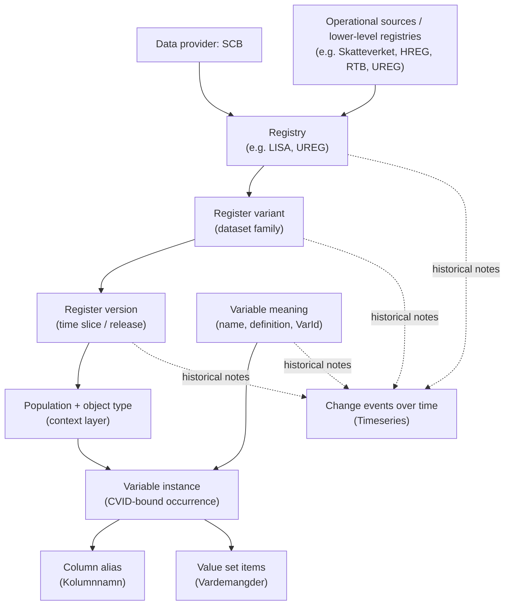

# Design: reg_meta_build

Design rationale and constraints for the build pipeline. For usage, see
`reg-meta-build --help`. For query-layer rationale (the data model end
users see), see [../reg_meta/DESIGN.md](../reg_meta/DESIGN.md).

## Scope

`reg_meta_build` owns the build pipeline that produces the SQLite databases
`reg_meta` queries against. Specifically:

- `reg_meta.db` — main metadata DB (~320 MB uncompressed). Built from SCB
  source CSVs under `reg_meta_build/input_data/`, classifications seed at
  `reg_meta_build/classifications.toml`, and curated slug TOMLs under
  `reg_meta_build/fqid_slugs/`. Validated by `reg_meta_build/validate.py`
  before shipping.
- `reg_meta_docs.db` — FTS5 search index over the curated markdown under
  `reg_meta_build/docs/`.

Both DBs ship as `.zst`-compressed GitHub Release assets parallel to the
`reg_meta` PyPI package (release-skill orchestrates this).

## Why split from `reg_meta`

The query side (`reg_meta`) needs only the sqlite3 stdlib. The build side
pulls openpyxl, owns large maintainer-edited input data, and runs on a
different cadence (most users never run a build). Separating the two:

- Keeps the `reg_meta` wheel small and dep-light for end users.
- Lets the two release on independent tags (`reg_meta/v*`,
  `reg_meta_build/v*`).
- Mirrors the build/runtime separation needed for a future Go/Rust
  port of the query layer.

The cross-package dependency graph and the build/runtime boundary that
governs it live in ARCHITECTURE.md.

## Dependency direction

`reg_meta_build → reg_meta` only. The builder imports query helpers
(`open_db`, `default_db_dir`, `DB_FILENAME`, `SCHEMA_VERSION`,
`derive_variable_slug`, etc.) but `reg_meta` never imports
`reg_meta_build`. The schema contract — the set of constants and
helpers both packages agree on — lives in `reg_meta`.

## What lives where

| Module                              | Package         |
| ----------------------------------- | --------------- |
| `db.py` (DDL, build_db, materializer, provenance DB) | `reg_meta_build` |
| `db.py` (open_db, schema constants) | `reg_meta`       |
| `ir/` (provider-neutral IR contract) | `reg_meta_build` |
| `id.py` (deterministic ID minting)  | `reg_meta_build` |
| `doc_db.py` (build_doc_db)          | `reg_meta_build` |
| `doc_db.py` (open_doc_db, ensure)   | `reg_meta`       |
| `cli.py` (build / docs-build / slug commands) | `reg_meta_build` |
| `cli.py` (query, update, info, docs) | `reg_meta`       |
| `fqid_slugs.py`                     | `reg_meta_build` |
| `classifications.py`                | `reg_meta_build` |
| `validate.py`                       | `reg_meta_build` |
| `dbdiff.py` (content diff harness)  | `reg_meta_build` |
| `sources/` (per-provider IR adapters: scb, sos) | `reg_meta_build` |
| `fqid.py`, `catalog.py`, `queries.py`, `doc_queries.py`, `errors.py`, `update.py`, `download.py` | `reg_meta` |

## CLI shape

Top-level commands (no `maintain` subgroup; that group is dissolved):

```text
reg-meta-build build-db [--no-validate] [--skip-slugs] ...
reg-meta-build build-docs ...
reg-meta-build seed-slugs [--scb] ...
reg-meta-build precheck-slugs ...
reg-meta-build parse-sos ...
```

The matching `reg-meta maintain *` forms are removed. `reg-meta maintain
update` / `info` are promoted to top-level `reg-meta update` / `reg_meta
info` (query-side concerns — fetching/inspecting prebuilt DBs).

## Content diff harness (`dbdiff`)

`dbdiff.py` compares two `reg_meta.db` files by **content**, not bytes.
It is the acceptance gate for the IR/adapter refactor (and any future
"the rebuild should be identical" change): rebuild the DB, then diff the
new file against a preserved baseline. Raw byte comparison is useless
here — two SQLite files with identical rows differ byte-wise (page
layout, freelist, vacuum generation, FTS index segment order), so the
check has to be order-independent and storage-aware.

- **Schema compare**: same tables, and per table the same columns
  (name/type/order/NOT NULL/default/PK) and indexes (named + auto).
- **Content compare**: per user table, row count plus an
  order-independent *multiset* fingerprint — each row canonicalized to a
  type-tagged, length-prefixed byte string (NULL-aware, BLOB-as-bytes),
  hashed with BLAKE2b-128, the per-row hashes **summed** mod 2¹²⁸.
  Summation (not XOR) so duplicate/missing rows can't cancel. The pass is
  O(n) streaming / O(1) memory, so the 5.7M-row `value_set_member` table
  costs seconds, not a 330 MB load.
- **Ignore set** — deliberately minimal. Only `import_manifest.import_date`
  (wall-clock) is dropped by default; `schema_version`, `source_checksums`,
  `row_counts`, and every content/ID column are compared. `input_dir` (a
  path) is *not* ignored — it is stable for a same-machine rebuild; a
  cross-machine diff can add it explicitly.
- **FTS5**: the `*_fts` virtual tables are external-content (a projection
  of base tables, which *are* compared) and their shadow tables hold an
  insert-order-dependent serialized index. Both are schema-compared but
  content-excluded, so an emit-order change that leaves content identical
  does not false-positive.
- **Mismatch output**: names the table + count delta and dumps the first
  N differing rows per direction, found via an ATTACH-based
  multiset-difference query (`SUM(+1/-1) GROUP BY all-columns`) that
  offloads its working set to SQLite's temp store.

Standalone and read-only (`mode=ro` URIs); does not import the build
pipeline. Importable as `reg_meta_build.dbdiff.diff_db_content(...)` and
runnable as `python -m reg_meta_build.dbdiff <db_a> <db_b>` (exit 0
identical / 1 differs / 2 error). The full rationale lives in the module
docstring.

## Source delivery shapes

Each provider ships metadata in its own native structure; the adapters
(next section) normalize these into the provider-neutral IR. This section
documents the **source** shapes an adapter reads — not the shipped
catalog. For the universal two-level `variable` / `variable_state` model
the catalog collapses these into, see
[../reg_meta/DESIGN.md](../reg_meta/DESIGN.md) § "Two-level variable
model".

### SCB

SCB delivers pipe-delimited cp1252 CSVs plus a SQL DDL and an Excel
join-key sheet. One backbone row is roughly a *variable occurrence*
inside a registry / variant / version / context, identified by `CVID` —
not a stable column key (see *Build-time triage*). The build coalesces
the CVID grain into `variable` + `variable_state`; `CVID` does not
survive to the shipped DB.

| File | Role | Practical reading |
| --- | --- | --- |
| `Registerinformation.csv` | Backbone metadata fact table | The main source of truth: one row ≈ a variable occurrence inside a registry/variant/version/context. Carries most IDs and drives normalization (~1M rows). |
| `UnikaRegisterOchVariabler.csv` | Deduplicated registry/variable summary | Lifecycle and flags (`VersionForsta`, `VersionSista`, sensitive/identity markers). Enriches, never overrides `Registerinformation.csv`. |
| `Identifierare.csv` | Identifier semantics | A small dictionary of identifier-like variables keyed by `VarID` (not globally unique to one registry); also feeds the panel-key bootstrap. |
| `Timeseries.csv` | Change log | Breaks, redefinitions, and other events over time. Annotates the model, does not define it; the source for `*_replaced_by` edges. |
| `Vardemangder.csv` | Value-set members | Code/label rows keyed by `CVID` — where categorical values live (~102M rows). |
| `VardemangderValidDates.csv` | Value-item validity windows | Applied at build time for the value-set year projection (see *Year projection*); not stored. |
| `Tabelldefinitioner.sql` | SQL Server table shells | Authoritative SQL types/constraints per export column; used for type validation and the panel-key bootstrap. |
| `ID-kolumner.xlsx` | Join-key documentation | Which columns are ID/join columns between export files and what they reference (12 rows). |

The CVID-grained source hierarchy the SCB adapter reads — a registry
splits into variants, each into time-sliced versions, each into a
population/object-type context, under which a variable occurs once per
`CVID` with its column alias and value set; change events annotate every
level:



**A registry is not a table.** One SCB registry exposes several
table-like units (`Registervariant`), each recurring across years,
months, or event streams, and the same variable meaning recurs across
many versions and contexts. The shipped model captures this as the
variant *coordinate* on `variable_state`, not as an identity level — see
[../reg_meta/DESIGN.md](../reg_meta/DESIGN.md) § "Why two levels, not
three".

**LISA as a worked example.** `LISA` (RegisterId 34) is a high-level
longitudinal integrated registry, not a single flat table: it combines
population, education, employment, income, unemployment, and
sickness/parental-insurance information so transitions over time can be
studied, and is itself built from lower-level registries and
administrative sources (e.g. UREG and RTB; UREG in turn draws on HREG).
It exposes several table-like variants, including `Individer, 16 år och
äldre`, `Företag`, `Arbetsställen`, and `Individer födelseland`.

### SOS

Socialstyrelsen delivers one `.xlsx` workbook per register, parsed by
`SOSAdapter` (`sources/sos.py`) into `SosRegister` trees (see *IR +
adapter architecture* for the merge/split and `_default`-variant rules).
A full structural catalog of the SOS delivery — sheet layout, kodlista
shape, the deldatamängd ↔ variant mapping, and the classification/value
path — lands with the SOS data path; see #210 and #212.

## IR + adapter architecture

The build is structured around a provider-neutral **intermediate
representation** (IR) and per-provider **adapters** that emit it, fed to
one **provider-blind materializer**. Three layers:

```text
   per-provider adapter (sources/<provider>.py)
       ↓ emits a stream of IR objects (reg_meta_build.ir.*)
   universal materializer (db.py::materialize)
       ↓ writes
   universal SQLite catalog (English columns, provider-agnostic)
       + sibling provenance DB (maintainer-only debug data)
```

The point of the split: adding a provider is *write an adapter + a slug
TOML*, nothing else. The materializer never branches on `provider`, the
universal schema carries no provider-specific tables or columns, and
`reg_meta`'s read side is untouched. The IR is the contract.

**IR** (`reg_meta_build/ir/__init__.py`). Pydantic v2 models — the one
build-side exception to the no-Pydantic-on-library-surfaces rule (see
ARCHITECTURE.md), because model-level validators catch *builder* bugs at
construction (a state validity range that crosses zero, a variable
referencing a non-existent variant) rather than surfacing them as corrupt
catalog rows. `_IRBase` sets `extra="forbid"`: Pydantic's default silently
drops unknown keys, so a misspelled `is_sensitive=True` would vanish and
the field would quietly stay `False` — adapters speak a strict contract,
unknown keys must raise. Build-time only: never imported by `reg_meta`
runtime, `reg_monabundle.runtime`, the MONA bundle, or the webapp (those
stick to stdlib dataclasses). Treat `ir/__init__.py` as the source of
truth for field shapes; a few that bite:

- `IRVariable` is **register-scoped** (the "define once" addressable
  variable); the variant coordinate lives down on
  `IRVariableState.register_variant_id`. `provider_key` (SCB `str(var_id)`,
  SOS the merged name) is a **required, non-unique** join hint — a triage
  split (below) shares one key across siblings — so `(register_id, slug)`
  is the unique natural key, not `provider_key`.
- `IRVariableState.delivery_column_name` carries only the state's
  *latest-era* column; the **full** historical column set rides on separate
  `IRVariableAlias` rows. That split is the carrier behind the structural
  `variable_alias ⊇ state delivery columns` invariant (validate.py).
- `IRVariableState.data_type` is nullable to mirror the nullable
  `variable_state.data_type` column — SCB never writes NULL, but a provider
  that does must be *representable*, not raise at emit.
- `IRValueSet.member_hash` is raw 32 bytes (not hex) — wire and storage
  encodings stay identical, no encode/decode at the boundary. The
  materializer writes it verbatim into `value_set.member_hash` (a BLOB with
  `CHECK length = 32`).

**Adapter** (`sources/<provider>.py`, implementing the `IRAdapter`
protocol in `sources/__init__.py`). Reads the provider's native format and
emits IR. Provider quirks are normalized *here*, never leaked downstream:

- `SCBAdapter` (`sources/scb.py`) — pipe-delimited cp1252 CSV exports.
  Runs build-time triage for same-year collisions (fold vs split; see
  *Build-time triage* below), the value-set year-projection, and the state
  coalescer.
- `SOSAdapter` (`sources/sos.py`) — Socialstyrelsen `.xlsx` workbooks (one
  per register), parsed via `sources/sos.py`'s `SosRegister` trees. Isolates
  that format's quirks (sheet-name variance, "metadatat"-typo headings,
  phantom row counts, non-standard kodlistor). **Merges same-named
  variables across deldatamängder into one variable by default** (the
  structured kodlistor are register-level and shared), splitting only on a
  genuine meaning conflict — incompatible normalized `data_type` or disjoint
  code-list shapes for one name (BU `FOD_DATUMN` date-vs-int, PAR `ATC`
  text-vs-int, both in `KNOWN_SPLIT_ALLOWLIST`). Any *other* same-name
  conflict warn-merges (fail-soft). Synthesizes a `_default` variant for
  variant-less registers (LSS/BU/SOL).

`emit()` yields IR in FK-topological order (register → classification →
variant → value_set → variable → state/alias → edges → warning/provenance
sinks) so the materializer can insert in stream order with FK targets
always present. The order constrains only the types an adapter actually
emits — an adapter MAY emit a subset (`SCBAdapter` leaves classifications
and lineage materializer-derived). Every `*_id` is an explicit int the
adapter bakes in; emit order is independent of ID assignment.

Remaining: future-provider adapters (FK, Skatteverket) — see REFACTOR_SPEC.md.

## Materializer

`db.py::materialize` consumes each adapter's IR stream, runs the shared
provider-blind derivation passes once over the combined graph, and writes
the universal catalog. It is the **sole writer** of the shipped
provider-shaped core graph — `register`, `register_variant`, `variable`,
`variable_state`, `variable_alias`. `_reinsert_core_graph_from_ir` DELETEs
the rows each adapter wrote to scratch during `emit()` and re-INSERTs them
from the collected IR with explicit PKs, so there is exactly one final
writer per table and no parallel old/new path. (The adapter writes those
rows during emit purely to *derive* SCB's exact legacy IDs — strategy
reuse, not a second source of truth — and the IR mirror reads the IDs
back; the re-insert makes byte-identity with the pre-refactor baseline
hold.) Slugs insert NULL; `populate_slugs` / `populate_variable_slugs`
UPDATE them in place afterwards.

**Provider-blindness is complete for the core graph but not the value
tables.** `value_set` / `value_code` / `value_set_member` stay
adapter-written and are *not* re-inserted, deliberately: they are
content-addressed by `member_hash` and **shared across providers by
content** (an identical SOS code list collapses onto the same row as
SCB's), and the year-projection can leave orphan `value_code` rows
belonging to no `value_set_member`, which a member-derived IR stream
cannot reproduce. They carry no provider-specific shape, so the adapter
staying their writer costs no provider-blindness.
Remaining: making the materializer own the value tables too — see
REFACTOR_SPEC.md / #212.

The shared post-passes (run once over both providers' rows):
classifications, slugs, `same_as` / `replaced_by` / lineage edges,
`code_variable_map`, the `variable_state.classification_id` backfill, FTS.
The materializer enforces the build-time invariants the universal schema
encodes — chiefly that `(variable_id, register_variant_id, valid_from)` is
unique across `variable_state` unless explicitly marked multi-vintage via
`value_set_version_label` (the variant coordinate is part of the
uniqueness scope), and that `variable.slug` is register-unique. The
non-overlap invariant is what *requires* the build-time triage below.

## Provenance DB sibling

A second SQLite file, `reg_meta.provenance.db`, sits next to the universal
DB. It is a **maintainer-only debug artifact — never shipped to
consumers** and structurally outside the dbdiff gate (dbdiff only ever
opens `reg_meta.db`, so populating this sibling is dbdiff-neutral by
construction). The provenance tables live *only* here and touch no
universal-schema DDL, so writing them does **not** bump `SCHEMA_VERSION`
(that constant gates the universal DB alone). It holds the data that must
not pollute the published catalog:

- `build_manifest(schema_version, universal_db_path, universal_db_sha256,
  build_date)` — ties the provenance file to the exact universal DB it was
  built against.
- `delivery_approval` — per-`register_variant` Registerversion
  delivery/approval dates (the `IRDeliveryProvenance` sink). Keyed per
  variant, not per register: two variants delivering an edition under the
  same `registerversionnamn` token would otherwise collapse into one slot.
  `period_token` is the Registerversionnamn; `first_approved_date` /
  `last_approved_date` are SCB's första/senast godkännandedatum.
- Per-provider source-ID linkage (`scb_register_id_map`) and adapter
  parse warnings (`adapter_warning`, the `IRWarning` sink). (Source-file
  checksums and row counts are not duplicated here — they live in the
  shipped `import_manifest`.)

Both the universal and provenance DBs rotate one generation on rebuild
(`rotate_db_to_prev`): `reg_meta.db` → `reg_meta.db.prev`, evicting any
prior `.prev`. No auto-cleanup of older generations — a maintainer who
wants to keep more than one `mv`s the `.prev` aside. The provenance write
is wrapped non-fatally: a provenance failure must not flip the build exit
code. Confinement is enforced cross-package — `reg_monabundle`'s bundle
amalgamator carries an import allow-list that rejects any module opening
this DB, so it can never reach MONA (see ARCHITECTURE.md).

## Deterministic ID minting

SCB universal IDs **reuse the source integers verbatim** (`RegisterId`,
`RegVarID`, `VarId`, `CVID`), so an SCB rebuild produces byte-identical IDs
from identical CSV inputs. Providers without native int keys (SOS today)
mint deterministically via `id.py::mint`:

- **BLAKE2b**, 8-byte digest, personalized `regmeta-id`. Each input part is
  **length-prefixed** (4-byte big-endian length + UTF-8) before hashing, so
  the encoding is unambiguous — a plain `/` separator would collapse
  distinct key tuples whose parts contain the separator (`mint("a/b","c")`
  vs `mint("a","b/c")`).
- The low 62 bits become the ID body and **bit 62 is set**, landing every
  minted ID in `[2^62, 2^63)`. SCB's source-derived IDs are small integers
  far below `2^62`, so the two bands are **structurally disjoint** —
  arithmetic, not a runtime collision check. Query-time cross-provider
  disambiguation therefore needs no provider check. **Bit 63 stays clear**
  so every value fits a signed 64-bit SQLite INTEGER. The `< 2^62`
  structural bound (not a loose 32-bit window) is what the §16 namespace
  property test pins. Future providers get their own band bit.

## CSV import and encoding

SCB exports are pipe-delimited, cp1252 encoded. Several bytes in the
exports are actually DOS cp850 remnants undefined in cp1252:

| Byte | cp850 | Mapped to |
|------|-------|-----------|
| 0x81 | ü     | ü         |
| 0x8D | ì     | ì         |
| 0x8F | Å     | Å         |
| 0x90 | É     | É         |
| 0x9D | Ø     | Ø         |

These are mapped during import. The build reads ~1M backbone rows
from `Registerinformation.csv` and ~102M value-item rows from
`Vardemangder.csv`.

## Source-register resolution

The `VariabelRegister_Källa` field is resolved using deterministic
matching only — no fuzzy logic:

1. Extract parenthesized abbreviation (e.g. "Befolkningsregistret (RTB)" → RTB)
2. Match text before ` : ` separator against register names
3. Match entire text against register names

Unresolved sources are stored as raw text in `source_label` for human
review. The resulting `source_register_id` / `source_label` pair on
`variable` is what query commands surface (see
[../reg_meta/DESIGN.md](../reg_meta/DESIGN.md) § "Composite registers and
source tracking").

## Consumer-side lineage (`variable_state_lineage`)

Composite registers (LISA, RAMS, …) re-deliver variables sourced from base
registers (RTB, FTB, …). `link_variable_state_lineage` materializes that
consumer→source link as **state-pair interval-overlap edges**: for each
consumer `variable_state` whose `variable.source_register_id` points at a
different register, it finds the matching source state(s) and emits one edge
per pair whose validity ranges intersect, with `(valid_from, valid_to)` set to
the intersection. A few non-obvious choices:

- **Interval-overlap, not slug equality.** v0.11 keyed lineage on slug-folded
  period and picked the source variant non-deterministically (`MIN(cvid)`).
  The interval join produces the same answer for the trivial year-equal case
  but also expresses real cross-state lineage (a consumer era sourcing from a
  pre-rename source state, then a post-rename one) at no runtime cost.
- **Source-side matching is a multi-seed `same_as` BFS.** The consumer's slug
  identifies the source variable by identity (LISA `kon` → RTB `kon`, no curated
  edge needed). `_variable_set_via_same_as` then BFS-expands from *two* seeds:
  the source-register identity node (picking up within-source renames like RTB
  `kon` ↔ `kon-v2`) and the consumer node (picking up any curated cross-register
  / cross-provider `variable_same_as` edge whose endpoints have *different*
  slugs, LISA `foo` ↔ RTB `bar`, §5.5). The common no-rename case yields just
  the identity slug, so an edge is always additive. (An earlier single-seed form
  expanded only the source node and silently missed mismatched-slug
  cross-register edges — latent while `variable_same_as` is empty; since fixed.)
- **Variant pinning is TOML-only — no SQL table.** A `[lineage_defaults]`
  block picks one source variant per source register; a
  `[lineage."<consumer_register>.<variable_slug>"]` block overrides it per
  consumer variable. Uncurated consumers fall back to *all* source variants
  carrying a matching state plus an `ambiguous_source_variant` warning; a
  consumer with no source state at all gets `no_source_state`. A found-but-
  non-overlapping source state is neither — it is a legitimate empty result
  (zero edges, zero warnings). Warnings land in `variable_state_lineage_warning`
  and the build log for curator attention. `load_lineage_config` does shape
  validation only; existence of the named registers/variants is validated by
  the linker against the DB (fail-fast on a pin to a non-existent variant or a
  `source_register` that contradicts the variable's resolved source register).

`link_variable_state_lineage` is the sole lineage linker.

## Vardemängder sentinel filtering

`Vardemangder.csv` ships a row for every variable, including those with no
enumerated code list. SCB encodes "no codes" by stuffing a placeholder string
into `Värdekod` so that `Värdekod == Värdemängdsversion` (and typically
`Värdemängdsnivå`). Two disjoint cases occur with this shape, classified by
two allowlists in `reg_meta_build/db.py`:

`_VARDEMANGDER_SENTINELS` — placeholder strings that mean "no enumerated
code list." Not real value codes; dropped silently.

| Värdekod | Meaning |
|---|---|
| `Tal` | Numeric variable |
| `Beskrivande text` | Free-form text variable |

Importing sentinels would pollute `value_code` with
rows that are never valid lookups, and write the placeholder into
`variable_instance.{value_set_version_label,vardemangdsniva}` where
downstream consumers would mistake it for a real classification label.
The authoritative type signal is `variable_instance.data_type` — the
placeholder adds nothing and is sometimes misleading (e.g. cvid 207
`DatInv` is `data_type='int'` but tagged `Beskrivande text`).

`_VARDEMANGDER_REAL_SHAPED` — kods that *happen* to equal their version
label but are real single-code value sets. Kept silently.

| Värdekod | Label |
|---|---|
| `1` | Hade ingen anställning före YH-utbildningen |
| `2` | Övriga civilstånd |

Both classifications are required because the shape alone is ambiguous. An
unguarded skip on `kod == version` would silently drop the real codes; an
unguarded keep would let new SCB placeholders pollute the DB.

The skip rule is tight: `kod == version == niva` AND `kod` ∈ `_VARDEMANGDER_SENTINELS`. Looser variants (e.g. `kod == version` but `niva` diverging)
fall through to the drift detector below and fail the build for human
review, even when the kod is already a known sentinel string. This guards
against a future SCB change to the sentinel shape.

A cvid whose only Vardemängder rows were sentinels gets `NULL` for
`value_set_version_label` / `vardemangdsniva` on `variable_instance`. Fully-empty
rows (kod, label, item all empty) are dropped silently.

### Drift detection

A `kod == version` row where kod is in neither allowlist is treated as drift
and fails the build with `RegMetaError(code="vardemangder_drift", exit 10)`.
The importer can't tell whether such a row is a new sentinel or a new real
single-code value set, so the build refuses to ship and prompts the
maintainer to add the kod to one of the two allowlists.

The drift trigger only requires `kod == version`, not `kod == version ==
niva`, so a placeholder where SCB drops the niva equality still surfaces.
Currently observed sentinels have all three fields equal, but no upstream
guarantee.

This makes the maintainer's release workflow self-checking: any new SCB
sentinel string causes the rebuild to fail loudly with an actionable
remediation, rather than silently shipping pollution. There is no
interactive escape hatch — drift always fails — because the only correct
response is to update the allowlists, which is a one-line code change.

## Year projection

`build-db` projects every `(cvid, code_id)` pair through validity at build
time so each cvid carries the codes that were actually valid in its
regver year. The projection rule:

- For each pair, collect validity windows of all *tracked* ItemIds (those
  with at least one row in `VardemangderValidDates.csv`).
- If no tracked windows → include the code (always-valid fallback).
- Otherwise → include iff at least one window covers the cvid year.
- Yearless cvids (regver name has no plausible 4-digit year, e.g.
  `Person-År`) include all union pairs as a fallback.
- An untracked ItemId next to a tracked one does NOT relax the constraint:
  the tracked window is authoritative.

The result is the year-projected, content-addressed `value_set` /
`value_set_member` structure query users see (documented in
[../reg_meta/DESIGN.md](../reg_meta/DESIGN.md) § "Value sets are
year-projected").

## Classification seed

The `classification_id` FK is populated at build time from a
maintainer-curated TOML seed at `reg_meta_build/classifications.toml`.
Each entry declares a normalized classification and lists the raw
`value_set_version_label` strings (the SCB-published "Vardemangdsversion"
labels) that map to it — exact match, no fuzzy inference. Match strings are
deterministic and auditable: any maintainer can enumerate them via
`SELECT DISTINCT value_set_version_label FROM variable_instance`. The build
tags `variable_instance.classification_id` first; the
`_backfill_state_classifications` pass then projects it onto the **shipped**
`variable_state.classification_id` (per-era, attributed to the owning split
sibling) before `variable_instance` is dropped.

Build-time invariants (violations fail `reg-meta-build build-db` loudly,
exit 10):

- Every seed `value_set_version_label` string must match at least one instance.
- Every classification must resolve to at least one tagged instance and
  at least one value code.
- A given `value_set_version_label` string may belong to at most one
  classification.
- Every `supersedes` reference must resolve to a declared `short_name`.
- Every `valid_codes_file`, when present, must resolve to a CSV under the
  classifications directory with header `vardekod,vardebenamning`.

### Canonical code CSVs

A seed entry's optional `valid_codes_file` points at a CSV under
`reg_meta_build/input_data/classifications/` (header
`vardekod,vardebenamning`). At build time:

- Every CSV code is ensured to exist in `value_code` (canonical-but-
  unobserved codes get a fresh row with no `value_set_member` linkage).
- Every `classification_code` row in that classification is marked
  `is_valid=1` (canonical) or `is_valid=0` (observed-only).
- `classification.valid_code_count` caches the canonical count; it is
  `NULL` for classifications without a CSV.

The CLI surface (`get classification --codes --only-valid`,
`is_valid` in JSON output) is documented in
[../reg_meta/DESIGN.md](../reg_meta/DESIGN.md) § "Canonical vs observed
codes". See also [CLASSIFICATIONS.md](CLASSIFICATIONS.md) for the
per-classification extraction recipes that produced the shipped CSVs.

The seed lives in the repo (alongside `DESIGN.md`) and is **not** bundled
in any wheel — same status as `reg_meta_build/docs/`. End users receive
the already-populated classification tables via the prebuilt DB asset.

## Build-time triage (SCB)

SCB lumps several distinct delivery columns under one `var_id`, so the
coalescer can produce multiple `variable_state` candidates for one
`(variable, year)` within a variant — empirically ~2.7% of buckets. That
violates the materializer's state-uniqueness invariant, so the SCB adapter
triages every such collision (`sources/scb.py`, `_triage_groups`) three
ways:

- **Fold** — same concept in different *representations* (a classification
  vintage, a SUN/SSYK grain, a coding variant), even when shipped as
  parallel columns. Keep **one** variable; give each colliding state a
  distinct `value_set_version_label` token; the variable slug derives from
  the shared column stem. No edge — it's one variable.
- **Split** — genuinely different concepts under a generic `var_id`
  (disjoint column stems). Mint distinct sibling `variable` rows sharing the
  source `provider_key`, reassign each column's states to its sibling, and
  link the siblings with `variable_related_to` edges.
- **Collapse** — residual same-column metadata drift (`data_type` /
  `value_set_id` re-delivery churn). Keep the latest-era state, drop the
  rest (`_collapse_residual`).

`Variabelnamn` is **never** the fold/split signal: SCB ships generic family
labels (one `var_id` named `Imputerat` covering rooms, area, …; the name is
identical across the columns in 100% of split buckets), so the concept
boundary rides on the classification family, then the column stem. The
fold/split mix is roughly **56% fold / 44% split** on the columns that
collide in a single edition — which is why triage needs *both* outcomes: a
fold-everything rule merges rooms with area, and a split-everything rule
over-shards SNI vintages that happen to arrive as parallel columns.

Two shipped-reality footguns where the code diverges from the original
design sketch:

- **The classification-family fold signal is inert.** `_classification_roots`
  is written and wired, but triage runs *inside the coalescer, before*
  `populate_classifications`, so the `classification` table is empty when it
  reads — it returns `{}` and `_decide_fold_or_split` always falls through to
  the **column-stem** signal. Stem-folding covers every fold example
  (`FtgSni69`/`FtgSni92`, `Ssyk3`/`Ssyk5`, `BCIV`/`BCIVRED` all share a
  stem), so the primary signal only matters for same-family columns with
  *disjoint* stems. Activating it means moving triage to a
  post-classifications pass.
- **Every split emits `relation_kind = same_definition_different_column`.**
  The finer kinds (`code_vs_label_pair`, `import_bug_suspect`) need
  code/label-pair + datatype heuristics that aren't built; the generic kind
  is correct (in the allowed set, never the fold-only
  `same_concept_different_grain`). Edges carry `note = "auto:triage"`. There
  is **no** `triage_unresolved_split` warning — an unmatched column just
  routes to a fresh auto-slugged sibling (additive under grow-only).

Slug collisions during triage (and in the *Slug curation* auto-derive
below) are resolved with a deterministic **numeric `-N` suffix**
(`_uniquify` / `_collapse_residual`), not `-a`/`-b` or a hash suffix.

Remaining: interim residual-collapse precision (year-scoped, not
edition-scoped) — see REFACTOR_SPEC.md / #223. Relation-kind refinement —
see REFACTOR_SPEC.md / #218.

## Slug curation

Slugs are **anchored to the provider's source IDs, never derived from
human-readable Swedish names** (those drift). They live in per-provider
TOMLs under `reg_meta_build/fqid_slugs/` (`scb.toml`, `sos.toml`,
`classifications.toml`), are read at build time, compiled into `slug`
columns on `register` / `register_variant` / `variable` / `classification`,
and reach `reg_meta` only through the DB asset. TOML keys are **always
quoted strings** for one canonical form regardless of whether the ID looks
integer-shaped (SCB's dotted `<reg>.<var>` keys *must* be quoted anyway).
The grammar lives in `reg_schema` / `reg_meta.fqid`; this module
(`fqid_slugs.py`) is the loader, validator, populator, and snapshot
machine. (There is no `register_version` slug surface — version left the
FQID grammar.)

**Registers, variants, and classifications are curated; variables
auto-slug.** A first-sight variable's slug comes from a fallback chain
(`populate_variable_slugs`), every candidate run through a per-register
`_uniquify`, so the build **always** yields a register-unique slug with no
"curate every collision" gate — real SCB data has generic delivery columns
(`Kolumn1`×148, `RadNr`×137, `OBS_VALUE`×121) and ~2k variables with a
numeric/absent kolumnnamn, so neither the kolumnnamn alone nor strict
manual curation scales. The chain, first match wins:

1. **Curated** `[variable."<reg>.<var>"]` slug in `<provider>.toml` — the
   curator's hook to prettify any auto pick.
2. **Existing auto** slug in `<provider>.auto.toml` — kept verbatim, so a
   kolumnnamn/name change can't rot a published slug.
3. **Drift-stable basis** — when `delivery_column_name` is *not* constant
   across the variable's states (the column was renamed across editions),
   the latest column is a misleading version-coupled basis
   (`sun2020inr1` for a var that was SUN96→SUN2000→SUN2020). Slug from the
   **name** when register-unique among drifters, else the **earliest**
   delivery column (also the split-sibling discriminator basis — siblings
   share a name, so the name collides and routes here).
4. **kolumnnamn-derived** — register-unique latest column (the short, common
   case: `kon`). "Latest" = highest `valid_to`, lexically smallest on ties.
5. **name-derived**, length-capped to 60 chars on a hyphen boundary
   (`_name_slug`) — when the kolumnnamn slug collides, is generic, or is
   absent.
6. **`v<provider_key>`** last resort (`v881`), prefixed to satisfy the
   leading-letter grammar.

Each auto slug records *which* arm produced it as a `# source:` comment in
the auto file (a TOML comment, never a field — `tomllib` ignores it, so it
never reaches `SlugEntry` or the snapshot and never perturbs slug values).
The name-derived / last-resort classes form the curation worklist the
precheck surfaces.

**Split-sibling cache key.** A triage split puts several siblings under one
`provider_key`, so `(register_id, provider_key)` is *not* a unique auto-slug
cache key. The auto-file source-ID for a split sibling takes a third
segment — its earliest-column discriminator slug — so the build replays the
right slug onto each sibling across rebuilds instead of the last one
overwriting the shared entry. Unsplit keys (~96%) stay 2-part.

**Edge fields (slug-anchored inline tables on `[variable]` rows).** The
curatable edge field is `same_as` — symmetric cross-register / cross-provider
variable equivalence, keyed `{ provider, register, variable_slug }` (note:
`variable_slug`, not `variable`), materialized into `variable_same_as`
edges that `Catalog.resolve` follows transitively (build rejects cycles).
`replaced_by` is a **single in-file key string** (a typo-correction pointer
to another row's TOML key in the same file), validated for shape and
cycle-freedom — *not* a cross-provider tuple. `related_to` is **not a
curatable TOML field at all**: it is auto-emitted by triage splits only
(the generic `same_definition_different_column` kind, above).

**Panel-shape bootstrap.** `register_variant` rows also carry
`panel_entity_key` / `panel_time_key` / `panel_time_grain` (a variable-slug
reference or the `"period"` sentinel). `seed-slugs` proposes defaults from
SCB `Tabelldefinitioner.sql` PK declarations and `Identifierare.csv`
(SOS: `is_join_variable` annotations); a curator confirms. These are
grammar-checked at load so a typo fails loudly at build, not as a runtime
JSON-decode crash when the webapp serves the variant. The structural
validator (`validate.py::_check_panel_refs_resolve`) additionally fails
the build if a panel key does not resolve to a real `variable.slug` in
the variant's own register.

## Slug immutability

Both TOML files — hand-curated `<provider>.toml` and build-generated
`<provider>.auto.toml` — are **grow-only**: a published slug can never
change (a committed `project_data.json` references slugs; a rename rots
every project that pins one). Removed source IDs are flagged
`deprecated = true` but retain their slug forever; a typo is fixed by
adding a new entry and a `replaced_by` pointer, never by editing in place.
CI enforces this with a snapshot test: `snapshot_payload` distills the
curated `{key: slug}` set into `.snapshot.json`, and `diff_snapshot`
allows adds but flags removes and renames.

**Pre-v1 escape hatch — the `UNFROZEN` sentinel.** While
`reg_meta_build/fqid_slugs/UNFROZEN` exists, `is_unfrozen` lifts the
grow-only *refusal* (not the *visibility* — renames are still reported):
`precheck-slugs --update-snapshot` writes rename/removal diffs through to
the snapshot, and the immutability CI test skips its rename guard. This is
deliberate friction-removal — pre-v1, the right move is to let curators fix
typos, normalize conventions, and reshape sibling groups freely before any
external artifact pins these FQIDs. Consequently, pre-v1 reality: no
committed `<provider>.auto.toml` exists on disk (auto slugs regenerate from
scratch each build while UNFROZEN holds), and `.snapshot.json` carries **0
variable entries** — auto-derived variables aren't part of the hand-frozen
curated set. The committed snapshot covers only register / variant /
classification.

Remaining: arming immutability at v1 (delete UNFROZEN in the release
commit; that snapshot becomes the immutable baseline) — see
REFACTOR_SPEC.md / #209.

## Doc-DB build

`reg-meta-build build-docs` is the maintainer-only command that rebuilds
the doc DB from a repo checkout of `reg_meta_build/docs/` before upload.
The build:

1. Walks the curated markdown tree.
2. Parses Obsidian frontmatter (`parse_frontmatter`).
3. Cleans inline markdown noise for FTS indexing
   (`_clean_body_for_search`).
4. Writes rows into the `DOC_DDL` schema with `DOC_SCHEMA_VERSION` in
   `doc_meta`.
5. Builds the FTS5 indexes and seals the file.

The doc-DB schema constants (`DOC_*`, `open_doc_db`, `ensure_doc_db`)
stay in `reg_meta` so the wheel can read the doc DB at runtime without
pulling the builder. `repo_docs_dir()` is part of `reg_meta_build.doc_db`
and is only reachable from the builder package.
