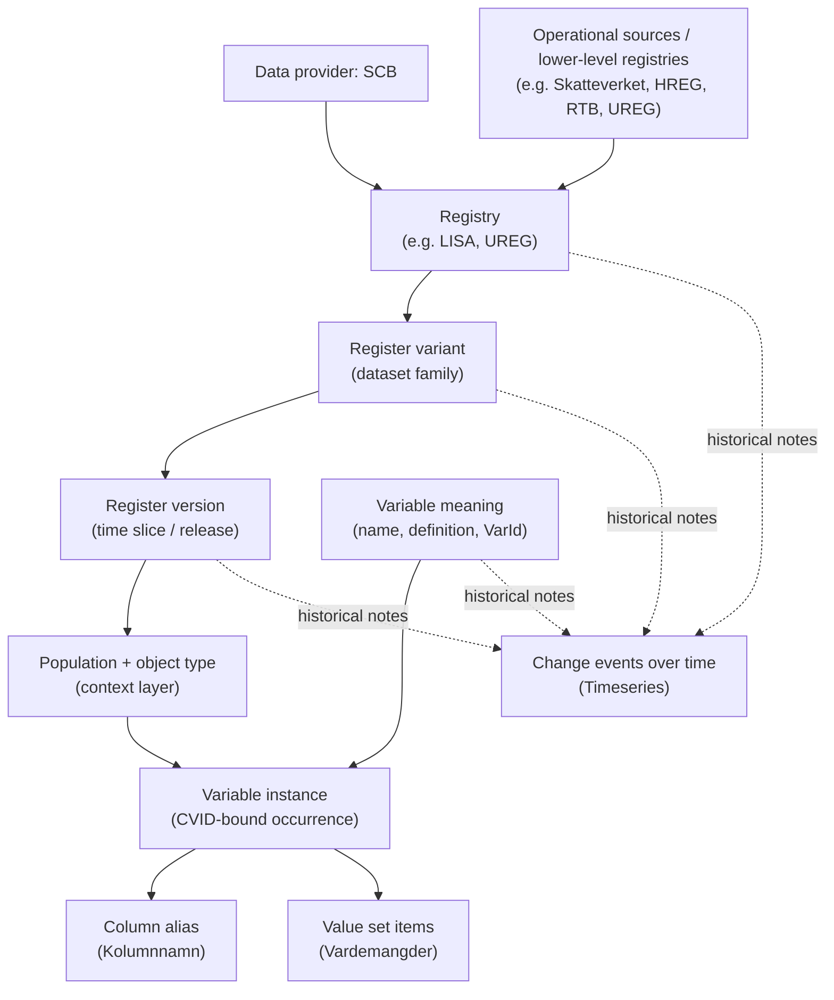

# SCB Metadata Structure

## Core Hierarchy

- `Data provider`: the organization that publishes the metadata. For now this is only `SCB`.
- `Data source / collector`: upstream operational systems or lower-level registries that feed a registry. These are real domain concepts, but they are only partially explicit in the delivery. They mostly appear in descriptive text such as `VariabelHämtadFrån` and `VariabelRegister_Källa`.
- `Registry`: a conceptual collection of data organized for a use case or domain. Examples: `Utbildningsregistret (UREG)` and `LISA`.
- `Table-like slice`: what users usually think of as a table or snapshot. In the SCB files this is not a first-class object with its own stable ID. It is usually derived from `Registry -> Registervariant -> Registerversion`, and sometimes further split by `Population` and `Objekttyp`.
- `Variable`: a column concept. A variable can persist over time, be renamed, be redefined without renaming, or split into old/new variants.
- `Variable instance`: a concrete occurrence of a variable in a specific registry/variant/version/context. `CVID` is the closest thing to an instance identifier, but it is not a perfect canonical column key.
- `Value set`: coded values attached to a variable instance, such as municipality codes or category labels.
- `Change event`: a note about structural or semantic change over time. This is what `Timeseries` contributes.

## What The Input Files Represent

| File | Role | Practical reading |
| --- | --- | --- |
| `Registerinformation.csv` | Backbone metadata fact table | The main source of truth. One row is roughly a variable occurrence inside a registry/variant/version/context. This file carries most IDs and is the basis for normalization. |
| `UnikaRegisterOchVariabler.csv` | Deduplicated registry/variable summary | Useful for lifecycle and flags (`VersionForsta`, `VersionSista`, sensitive/identity markers). Good summary layer, not the canonical source of record. |
| `Identifierare.csv` | Identifier semantics | A small dictionary of identifier-like variables keyed by `VarID`. Useful for linkage semantics, but `VarID` is not globally unique to one registry. |
| `Timeseries.csv` | Change log | Describes breaks, redefinitions, and other events over time for selected entities. Useful for historical interpretation, not enough on its own to define the schema. |
| `Vardemangder.csv` | Value-set members | Code/label rows keyed by `CVID`. This is where categorical values live. |
| `Tabelldefinitioner.sql` | SQL Server table shells | Authoritative SQL types and constraints for the export columns. Used during import for type validation. |
| `ID-kolumner.xlsx` | Join-key documentation | Documents which columns are ID/join columns between export files and what they reference (12 rows). |

## Working Interpretation For `regmeta`

- `Registerinformation.csv` drives the core normalized model.
- A client-facing "table" is a derived concept, not something copied directly from one SCB ID.
- The domain is a hierarchy/graph, not a flat relational schema. The storage backend (SQLite) is an implementation detail — the entities and relationships are what matter.
- Core entities (normalized from `Registerinformation.csv`):
  - `register` — a conceptual registry
  - `register_variant` — a dataset family within a registry
  - `register_version` — a time-slice or release of a variant
  - `population` and `object_type` — context layers scoped at version level
  - `variable` — a named measurement concept, scoped to a registry via `(register_id, var_id)`
  - `variable_instance` — a concrete occurrence of a variable in a specific version (CVID-bound; does NOT carry column names)
  - `variable_alias` — all known column names per instance (one instance can have multiple aliases)
  - `variable_context` — population/object-type scope per instance
- Enrichment entities (from other CSVs):
  - `value_code` — deduplicated (vardekod, vardebenamning) pairs (from `Vardemangder.csv`)
  - `cvid_value_code` — junction mapping CVIDs to value codes, deduplicated to PK(cvid, code_id)
  - `value_item` — item-level (cvid, code_id, item_id) triples, only for items with temporal validity records
  - `value_item_validity` — date ranges per ItemId (from `VardemangderValidDates.csv`)
  - `code_variable_map` — pre-aggregated code→(register, variable) mapping for efficient value search
  - `unika_summary` (from `UnikaRegisterOchVariabler.csv`) — lifecycle and sensitivity flags
  - `identifier_semantics` (from `Identifierare.csv`) — identifier variable definitions
  - `timeseries_event` (from `Timeseries.csv`) — structural/semantic change annotations
- Classification entities (from `classifications.toml` seed at build time — see DESIGN.md § Classifications):
  - `classification` — normalized code systems (SUN2000, SSYK2012, SNI2007, LKF, …) with publisher, version, supersedes link
  - `classification_code` — junction from classification to its value codes, with optional hierarchical `level`
  - `variable_instance.classification_id` — FK populated when an instance's `vardemangdsversion` matches the seed
- `Timeseries.csv` annotates the model, does not define it.
- `UnikaRegisterOchVariabler.csv` and `Identifierare.csv` enrich the model, do not override `Registerinformation.csv`.
- Reference data (from non-CSV sources):
  - `source_column_type` (from `Tabelldefinitioner.sql` — SQL types and constraints per export column)
  - `source_join_key` (from `ID-kolumner.xlsx` — join-key semantics between export files, 12 rows)

## Why `Table` Needs Care

- A registry is not the same thing as a table.
- One registry can expose several table-like units.
- One table-like unit can recur across years, months, or event streams.
- The same variable meaning can appear in many versions and contexts.
- The same `CVID` can show alias and context anomalies, so it should not be treated as a guaranteed one-column-per-table key without verification.

## LISA As Example

- `LISA` is a high-level longitudinal integrated registry rather than a single flat table.
- Conceptually, it combines information about population, education, employment, income, unemployment, and sickness/parental insurance so transitions over time can be studied.
- It also shows that registries can be built from lower-level registries and administrative sources. In your examples, `LISA` can depend on registries such as `UREG` and `RTB`, and `UREG` can in turn use sources such as `HREG`.
- In the current delivery, `LISA` appears as `RegisterId = 34` and includes several table-like variants, including:
  - `Individer, 15 år och äldre`
  - `Individer, 16 år och äldre`
  - `Företag`
  - `Arbetsställen`
  - `Individer födelseland`
  - `Individer avlidna`

